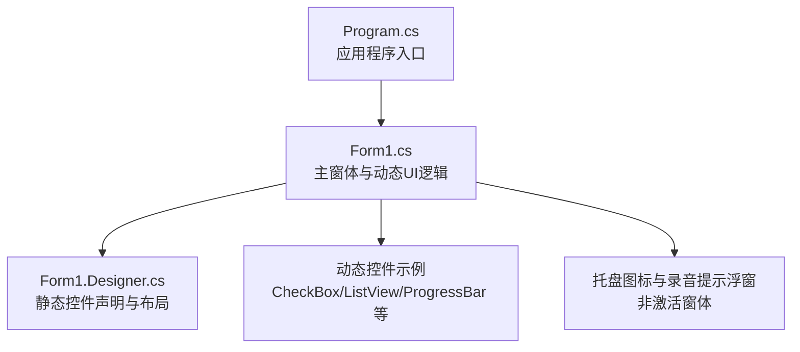
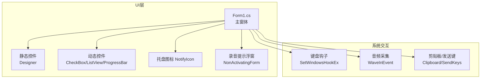
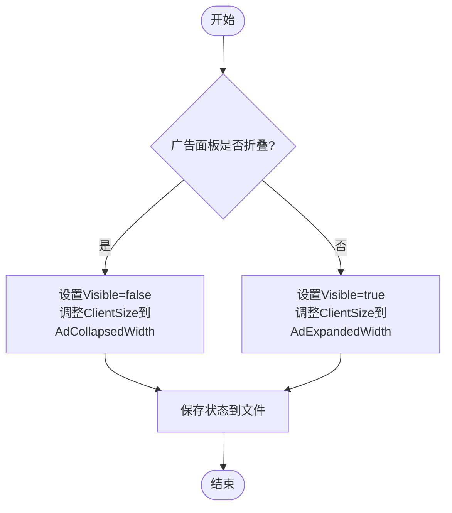
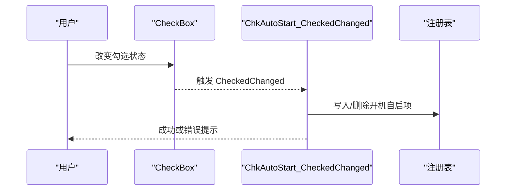
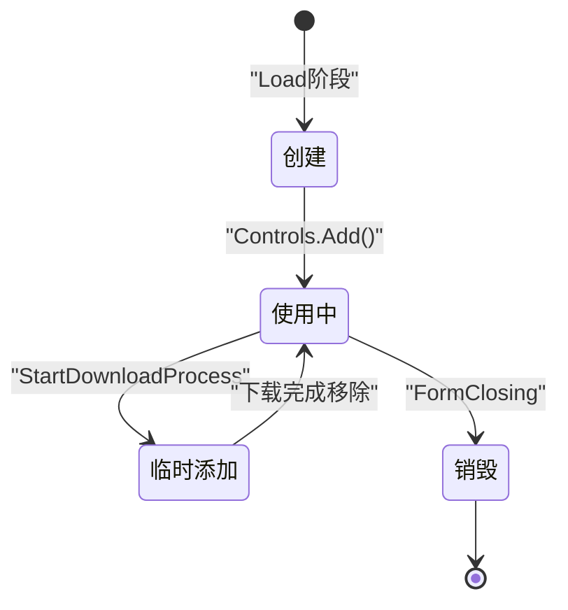
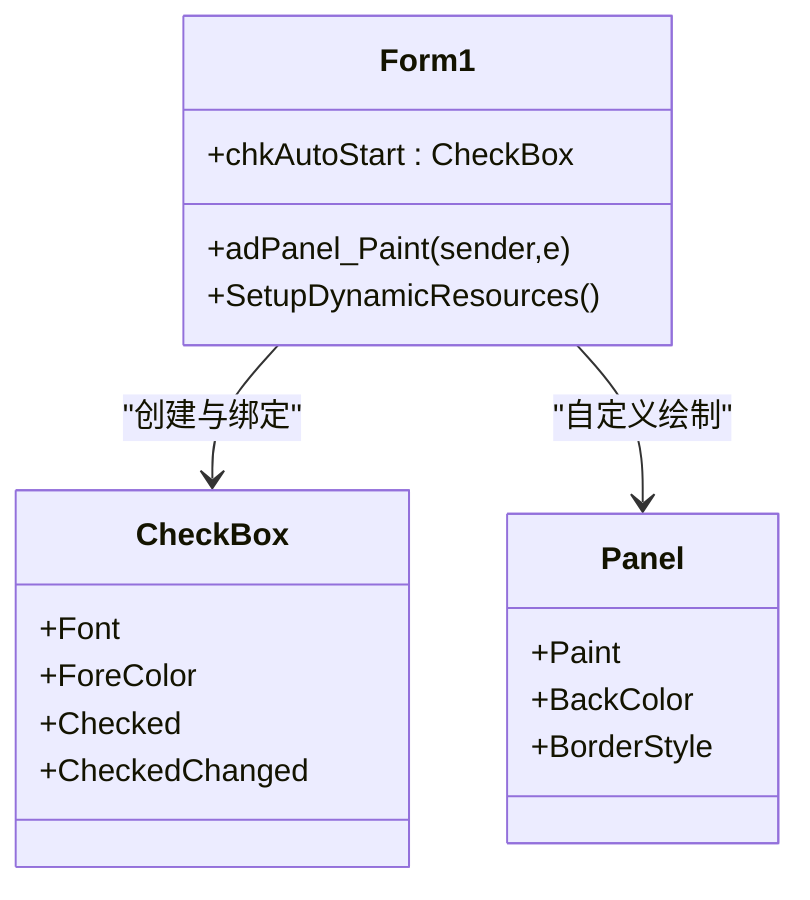
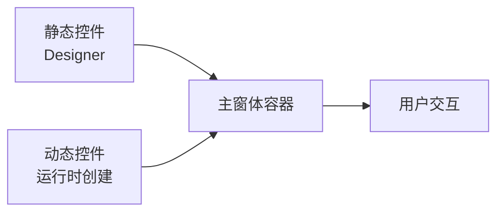
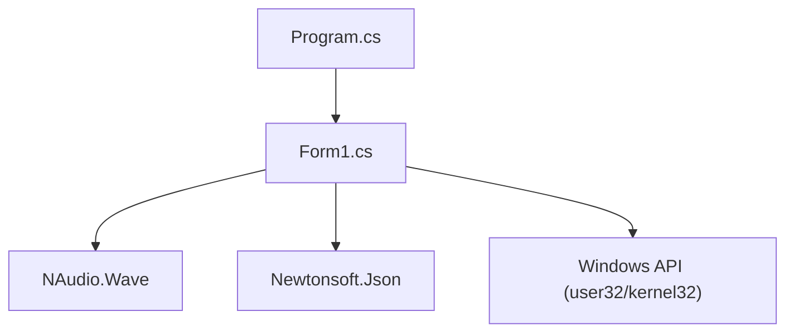

# 动态UI控件管理

<cite>
**本文引用的文件**   
- [Form1.cs](file://t9s2t/Form1.cs)
- [Form1.Designer.cs](file://t9s2t/Form1.Designer.cs)
- [Program.cs](file://t9s2t/Program.cs)
</cite>

## 目录
1. [简介](#简介)
2. [项目结构](#项目结构)
3. [核心组件](#核心组件)
4. [架构总览](#架构总览)
5. [详细组件分析](#详细组件分析)
6. [依赖关系分析](#依赖关系分析)
7. [性能考虑](#性能考虑)
8. [故障排查指南](#故障排查指南)
9. [结论](#结论)
10. [附录：最佳实践与常见问题](#附录最佳实践与常见问题)

## 简介
本技术文档围绕“动态UI控件管理”展开，聚焦于在 Windows Forms 应用中运行时创建、布局、事件绑定、生命周期管理与样式定制等关键能力。结合仓库中的实际实现，文档深入分析了以下方面：
- 运行时控件的编程式创建（如 CheckBox）与属性设置
- 控件布局管理（位置计算、尺寸调整、响应式行为）
- 控件事件处理机制（事件委托绑定与回调）
- 控件生命周期管理（创建、销毁与资源释放）
- 控件样式定制（字体、颜色、边框、主题支持）
- 动态控件与静态控件的混合管理模式
- 动态界面开发的最佳实践与性能优化建议

## 项目结构
本项目为基于 .NET Framework 的 Windows Forms 应用，主窗体 Form1 负责 UI 初始化、动态控件创建、事件处理与业务逻辑；Designer 文件维护静态控件声明与布局；Program.cs 提供应用程序入口点并统一配置运行环境。



图表来源
- [Program.cs:15-24](file://t9s2t/Program.cs#L15-L24)
- [Form1.cs:144-149](file://t9s2t/Form1.cs#L144-L149)
- [Form1.Designer.cs:29-215](file://t9s2t/Form1.Designer.cs#L29-L215)

章节来源
- [Program.cs:15-24](file://t9s2t/Program.cs#L15-L24)
- [Form1.cs:144-149](file://t9s2t/Form1.cs#L144-L149)
- [Form1.Designer.cs:29-215](file://t9s2t/Form1.Designer.cs#L29-L215)

## 核心组件
- 主窗体 Form1：承载所有 UI 逻辑，包括动态控件创建、事件绑定、布局控制、状态更新与资源释放。
- Designer 生成的静态控件：按钮、标签、面板、图片框等，用于基础界面展示与交互。
- 动态控件：在运行时创建的 CheckBox、ListView、ProgressBar、Label 等，用于增强用户交互与反馈。
- 托盘图标与录音提示浮窗：提升用户体验，避免干扰前台输入。

章节来源
- [Form1.cs:144-149](file://t9s2t/Form1.cs#L144-L149)
- [Form1.Designer.cs:29-215](file://t9s2t/Form1.Designer.cs#L29-L215)

## 架构总览
下图展示了主窗体与动态控件、静态控件以及外部系统（托盘、键盘钩子、音频设备）之间的交互关系。



图表来源
- [Form1.cs:164-182](file://t9s2t/Form1.cs#L164-L182)
- [Form1.cs:415-460](file://t9s2t/Form1.cs#L415-L460)
- [Form1.cs:1057-1111](file://t9s2t/Form1.cs#L1057-L1111)
- [Form1.cs:1177-1223](file://t9s2t/Form1.cs#L1177-L1223)

## 详细组件分析

### 运行时控件创建与属性设置（以 CheckBox 为例）
- 创建时机：在主窗体加载流程中完成，确保在 UI 渲染前完成控件实例化与属性设置。
- 属性设置：文本、位置、尺寸、字体、前景色、初始勾选状态等均在构造时集中设置。
- 事件绑定：通过 CheckedChanged 事件委托将用户操作与业务逻辑关联。
- 添加到容器：使用 Controls.Add 将控件加入主窗体，并通过 BringToFront 确保层级顺序。

```mermaid
sequenceDiagram
participant App as "程序启动"
participant Form as "Form1_Load"
participant UI as "动态控件(CheckBox)"
participant User as "用户交互"
App->>Form : 调用 InitializeComponent()
Form->>UI : new CheckBox{Text, Location, Size, Font, ForeColor, Checked}
Form->>UI : CheckedChanged += ChkAutoStart_CheckedChanged
Form->>UI : Controls.Add(UI); BringToFront()
User->>UI : 勾选/取消勾选
UI-->>Form : 触发 CheckedChanged 回调
```

图表来源
- [Form1.cs:171-182](file://t9s2t/Form1.cs#L171-L182)
- [Form1.cs:260-271](file://t9s2t/Form1.cs#L260-L271)

章节来源
- [Form1.cs:171-182](file://t9s2t/Form1.cs#L171-L182)
- [Form1.cs:260-271](file://t9s2t/Form1.cs#L260-L271)

### 控件布局管理（位置计算、尺寸调整、响应式布局）
- 绝对定位：动态控件通过 Point 和 Size 指定精确位置与尺寸，适合固定布局场景。
- 容器折叠：广告面板通过切换 Visible 与 ClientSize 实现响应式宽度变化，配合持久化状态恢复。
- 窗口显示与焦点：ForceShowMainWindow 确保窗口尺寸正确、置顶与激活，避免最小化或隐藏后尺寸异常。



图表来源
- [Form1.cs:360-411](file://t9s2t/Form1.cs#L360-L411)
- [Form1.Designer.cs:162-176](file://t9s2t/Form1.Designer.cs#L162-L176)

章节来源
- [Form1.cs:360-411](file://t9s2t/Form1.cs#L360-L411)
- [Form1.Designer.cs:162-176](file://t9s2t/Form1.Designer.cs#L162-L176)

### 控件事件处理机制（事件委托绑定与回调）
- 事件绑定模式：在控件创建后立即绑定事件处理器，采用匿名方法或命名方法均可。
- 跨线程 UI 更新：使用 BeginInvoke/Invoke 将后台线程的 UI 更新调度到 UI 线程，避免跨线程访问异常。
- 典型回调：CheckedChanged 修改注册表项；DownloadProgressChanged 更新进度条与状态文本。



图表来源
- [Form1.cs:179-182](file://t9s2t/Form1.cs#L179-L182)
- [Form1.cs:260-271](file://t9s2t/Form1.cs#L260-L271)

章节来源
- [Form1.cs:179-182](file://t9s2t/Form1.cs#L179-L182)
- [Form1.cs:260-271](file://t9s2t/Form1.cs#L260-L271)

### 控件生命周期管理（创建、销毁与内存释放策略）
- 创建：在 Load 阶段完成动态控件实例化与添加。
- 使用：根据业务需要动态添加临时控件（如 ProgressBar），并在完成后移除。
- 销毁：在 FormClosing 中释放全局资源（钩子、音频设备、引擎、托盘图标），避免内存泄漏。
- 临时控件清理：下载完成后从 Controls 集合移除 ProgressBar，防止残留。



图表来源
- [Form1.cs:144-149](file://t9s2t/Form1.cs#L144-L149)
- [Form1.cs:853-874](file://t9s2t/Form1.cs#L853-L874)
- [Form1.cs:279-288](file://t9s2t/Form1.cs#L279-L288)

章节来源
- [Form1.cs:144-149](file://t9s2t/Form1.cs#L144-L149)
- [Form1.cs:853-874](file://t9s2t/Form1.cs#L853-L874)
- [Form1.cs:279-288](file://t9s2t/Form1.cs#L279-L288)

### 控件样式定制（字体、颜色、边框与主题支持）
- 字体与颜色：动态控件在构造时设置 Font 与 ForeColor，保证可读性与一致性。
- 边框与背景：静态控件通过 Designer 设置 FlatStyle、BackColor、ForeColor 等，形成统一视觉风格。
- 自定义绘制：广告面板通过 Paint 事件进行自定义绘制，实现标题、分割线与多区域标签。



图表来源
- [Form1.cs:171-182](file://t9s2t/Form1.cs#L171-L182)
- [Form1.cs:305-351](file://t9s2t/Form1.cs#L305-L351)
- [Form1.Designer.cs:76-118](file://t9s2t/Form1.Designer.cs#L76-L118)

章节来源
- [Form1.cs:171-182](file://t9s2t/Form1.cs#L171-L182)
- [Form1.cs:305-351](file://t9s2t/Form1.cs#L305-L351)
- [Form1.Designer.cs:76-118](file://t9s2t/Form1.Designer.cs#L76-L118)

### 动态控件与静态控件的混合管理模式
- 静态控件：由 Designer 生成，负责基础布局与常用交互（按钮、标签、面板）。
- 动态控件：按需创建，用于复杂交互与临时反馈（模型选择 ListView、下载进度 ProgressBar）。
- 混合策略：静态控件提供稳定骨架，动态控件增强灵活性；通过 Controls.AddRange 批量添加，便于统一管理。



图表来源
- [Form1.Designer.cs:29-215](file://t9s2t/Form1.Designer.cs#L29-L215)
- [Form1.cs:751-816](file://t9s2t/Form1.cs#L751-L816)

章节来源
- [Form1.Designer.cs:29-215](file://t9s2t/Form1.Designer.cs#L29-L215)
- [Form1.cs:751-816](file://t9s2t/Form1.cs#L751-L816)

## 依赖关系分析
- Program.cs 统一设置 TLS 安全协议，确保网络请求可用。
- Form1.cs 依赖 Windows API（键盘钩子、窗口控制）、NAudio（音频采集）、Newtonsoft.Json（JSON 解析）。
- 动态控件与静态控件共同组成 UI 层，通过事件与状态驱动业务逻辑。



图表来源
- [Program.cs:18-23](file://t9s2t/Program.cs#L18-L23)
- [Form1.cs:12-16](file://t9s2t/Form1.cs#L12-L16)
- [Form1.cs:82-127](file://t9s2t/Form1.cs#L82-L127)

章节来源
- [Program.cs:18-23](file://t9s2t/Program.cs#L18-L23)
- [Form1.cs:12-16](file://t9s2t/Form1.cs#L12-L16)
- [Form1.cs:82-127](file://t9s2t/Form1.cs#L82-L127)

## 性能考虑
- 减少频繁重绘：在下载进度更新时使用 Refresh 控制刷新频率，避免过度重绘导致卡顿。
- 节流与去重：对 partial 识别结果进行时间间隔与内容去重，降低 UI 更新压力。
- 异步与并行：网络请求与解压过程使用异步任务，避免阻塞 UI 线程。
- 资源释放：在关闭时释放钩子、音频设备、引擎与托盘图标，防止内存泄漏。

[本节为通用指导，不直接分析具体文件]

## 故障排查指南
- 动态控件未显示：检查是否在 Load 阶段完成 Controls.Add 与 BringToFront；确认父容器可见性。
- 事件未触发：确认事件绑定是否正确；跨线程更新需使用 BeginInvoke/Invoke。
- 布局异常：检查 ClientSize 与控件 Location/Size 是否冲突；折叠/展开状态是否持久化。
- 资源泄漏：确保在 FormClosing 中释放全局资源；临时控件使用后及时移除。

章节来源
- [Form1.cs:279-288](file://t9s2t/Form1.cs#L279-L288)
- [Form1.cs:853-874](file://t9s2t/Form1.cs#L853-L874)
- [Form1.cs:360-411](file://t9s2t/Form1.cs#L360-L411)

## 结论
本项目在 Windows Forms 中实现了较为完善的动态 UI 控件管理机制，涵盖运行时创建、布局管理、事件处理、生命周期与样式定制等方面。通过静态与动态控件的混合管理，既保证了界面的稳定性，又提升了交互的灵活性。结合异步与节流策略，整体性能表现良好，具备较好的可维护性与扩展性。

[本节为总结，不直接分析具体文件]

## 附录：最佳实践与常见问题

### 最佳实践
- 集中初始化：在 Load 阶段集中完成动态控件的创建与属性设置，保持代码清晰。
- 明确生命周期：为每个动态控件定义明确的创建与销毁路径，避免悬挂引用。
- 统一样式规范：通过常量或配置集中管理字体、颜色与尺寸，确保视觉一致性。
- 谨慎跨线程：所有 UI 更新必须回到 UI 线程，使用 BeginInvoke/Invoke 包装。
- 持久化状态：对重要 UI 状态（如面板折叠）进行持久化，提升用户体验。

### 常见问题与解决方案
- 问题：动态控件被其他控件遮挡
  - 解决：在添加控件后调用 BringToFront，确保层级顺序正确。
- 问题：下载进度条未更新
  - 解决：确保 DownloadProgressChanged 事件中调用 Refresh；检查 UI 线程调度。
- 问题：窗口显示尺寸异常
  - 解决：在 ForceShowMainWindow 中校验并修正 ClientSize，避免最小化后高度为 0。
- 问题：部分识别结果闪烁
  - 解决：对 partial 结果进行节流与去重，仅最终结果粘贴到目标窗口。

章节来源
- [Form1.cs:171-182](file://t9s2t/Form1.cs#L171-L182)
- [Form1.cs:887-901](file://t9s2t/Form1.cs#L887-L901)
- [Form1.cs:243-258](file://t9s2t/Form1.cs#L243-L258)
- [Form1.cs:993-1051](file://t9s2t/Form1.cs#L993-L1051)