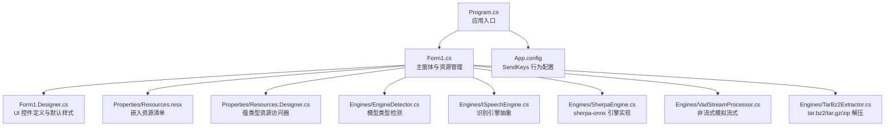
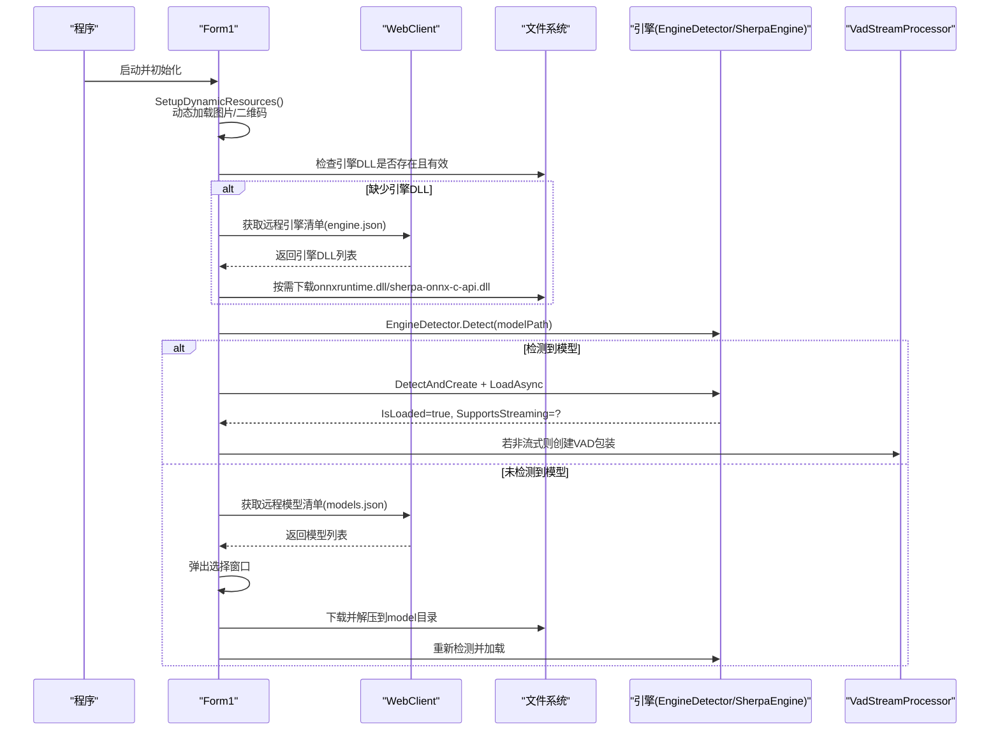
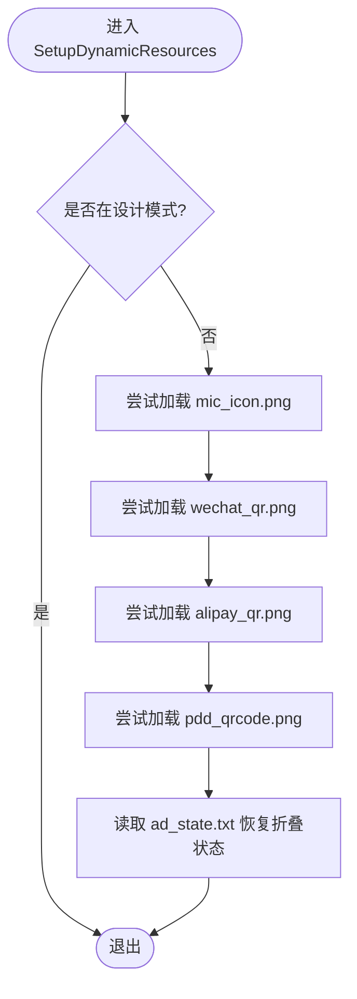
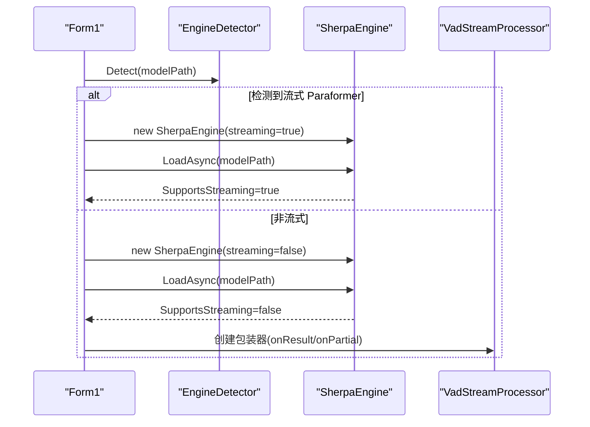
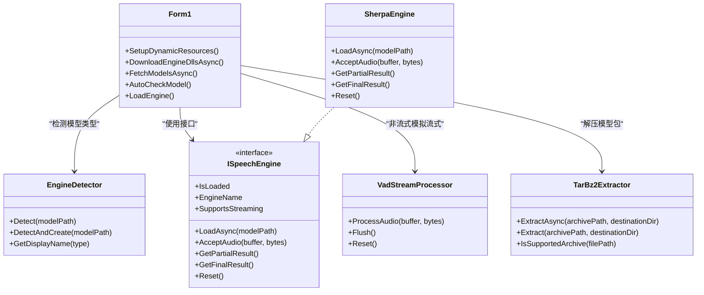

# 动态资源管理系统

<cite>
**本文引用的文件**
- [Program.cs](file://t9s2t/Program.cs)
- [Form1.cs](file://t9s2t/Form1.cs)
- [Form1.Designer.cs](file://t9s2t/Form1.Designer.cs)
- [App.config](file://t9s2t/App.config)
- [Resources.resx](file://t9s2t/Properties/Resources.resx)
- [Resources.Designer.cs](file://t9s2t/Properties/Resources.Designer.cs)
- [EngineDetector.cs](file://t9s2t/Engines/EngineDetector.cs)
- [ISpeechEngine.cs](file://t9s2t/Engines/ISpeechEngine.cs)
- [SherpaEngine.cs](file://t9s2t/Engines/SherpaEngine.cs)
- [VadStreamProcessor.cs](file://t9s2t/Engines/VadStreamProcessor.cs)
- [TarBz2Extractor.cs](file://t9s2t/Engines/TarBz2Extractor.cs)
</cite>

## 目录
1. [简介](#简介)
2. [项目结构](#项目结构)
3. [核心组件](#核心组件)
4. [架构总览](#架构总览)
5. [详细组件分析](#详细组件分析)
6. [依赖关系分析](#依赖关系分析)
7. [性能考量](#性能考量)
8. [故障排查指南](#故障排查指南)
9. [结论](#结论)
10. [附录：扩展开发指南](#附录扩展开发指南)

## 简介
本技术文档围绕“动态资源管理系统”展开，聚焦以下能力与实现：
- 资源加载机制：图片等静态资源的动态加载、路径解析与异常处理
- 多语言支持：基于 .NET ResX 的资源组织与运行时文化切换
- 主题系统：颜色方案与样式配置（以 UI 控件属性为中心）及切换逻辑
- 资源缓存策略：内存缓存、磁盘缓存与失效机制
- 资源验证与错误恢复：完整性校验、备用资源与降级处理
- 版本管理与更新：远程清单、增量更新与回滚策略
- 扩展开发：自定义资源类型与加载器的实现示例

## 项目结构
本项目为 Windows Forms 应用，采用分层组织方式：
- 入口与启动：Program.cs
- 主界面与资源管理：Form1.cs、Form1.Designer.cs
- 本地化资源：Properties/Resources.resx 与 Resources.Designer.cs
- 引擎与模型：Engines 下的检测器、接口、sherpa-onnx 封装、VAD 流式处理器、压缩解压工具
- 运行期配置：App.config

图表来源
- [Program.cs:1-27](file://t9s2t/Program.cs#L1-L27)
- [Form1.cs:1-120](file://t9s2t/Form1.cs#L1-L120)
- [Form1.Designer.cs:1-60](file://t9s2t/Form1.Designer.cs#L1-L60)
- [Resources.resx:1-133](file://t9s2t/Properties/Resources.resx#L1-L133)
- [Resources.Designer.cs:1-104](file://t9s2t/Properties/Resources.Designer.cs#L1-L104)
- [EngineDetector.cs:1-122](file://t9s2t/Engines/EngineDetector.cs#L1-L122)
- [ISpeechEngine.cs:1-35](file://t9s2t/Engines/ISpeechEngine.cs#L1-L35)
- [SherpaEngine.cs:1-120](file://t9s2t/Engines/SherpaEngine.cs#L1-L120)
- [VadStreamProcessor.cs:1-60](file://t9s2t/Engines/VadStreamProcessor.cs#L1-L60)
- [TarBz2Extractor.cs:1-60](file://t9s2t/Engines/TarBz2Extractor.cs#L1-L60)
- [App.config:1-10](file://t9s2t/App.config#L1-L10)

章节来源
- [Program.cs:1-27](file://t9s2t/Program.cs#L1-L27)
- [Form1.cs:1-120](file://t9s2t/Form1.cs#L1-L120)
- [Form1.Designer.cs:1-60](file://t9s2t/Form1.Designer.cs#L1-L60)
- [App.config:1-10](file://t9s2t/App.config#L1-L10)

## 核心组件
- 动态资源加载器：在 Form1 中集中负责从应用程序目录动态加载图片资源，并容错处理缺失或损坏文件。
- 本地化资源管理器：通过 Properties.Resources 提供强类型访问，支持按 Culture 切换。
- 引擎与模型：EngineDetector 自动识别模型类型；SherpaEngine 统一封装离线/流式推理；VadStreamProcessor 为非流式模型提供分段识别。
- 压缩解压：TarBz2Extractor 支持 tar.bz2/tar.gz/zip 的纯托管解压，无需外部工具。
- 网络与清单：Form1 维护远程模型与引擎 DLL 清单地址，具备内置 fallback 配置，用于网络不可用时的降级。

章节来源
- [Form1.cs:290-303](file://t9s2t/Form1.cs#L290-L303)
- [Resources.Designer.cs:25-61](file://t9s2t/Properties/Resources.Designer.cs#L25-L61)
- [EngineDetector.cs:22-122](file://t9s2t/Engines/EngineDetector.cs#L22-L122)
- [SherpaEngine.cs:14-120](file://t9s2t/Engines/SherpaEngine.cs#L14-L120)
- [VadStreamProcessor.cs:12-60](file://t9s2t/Engines/VadStreamProcessor.cs#L12-L60)
- [TarBz2Extractor.cs:17-96](file://t9s2t/Engines/TarBz2Extractor.cs#L17-L96)

## 架构总览
下图展示了资源加载、模型下载与引擎初始化的整体流程，以及关键的外部依赖与本地持久化点。

图表来源
- [Form1.cs:151-235](file://t9s2t/Form1.cs#L151-L235)
- [Form1.cs:462-600](file://t9s2t/Form1.cs#L462-L600)
- [Form1.cs:818-834](file://t9s2t/Form1.cs#L818-L834)
- [EngineDetector.cs:22-104](file://t9s2t/Engines/EngineDetector.cs#L22-L104)
- [SherpaEngine.cs:57-120](file://t9s2t/Engines/SherpaEngine.cs#L57-L120)
- [VadStreamProcessor.cs:28-60](file://t9s2t/Engines/VadStreamProcessor.cs#L28-L60)

## 详细组件分析

### 动态图片与图标加载（路径解析与异常处理）
- 动态加载位置：Form1.SetupDynamicResources()
- 加载策略：
  - 优先从应用程序根目录读取 mic_icon.png、wechat_qr.png、alipay_qr.png、pdd_qrcode.png
  - 若文件不存在或加载失败，静默忽略，保持控件无图状态
  - 同时恢复广告面板折叠状态（ad_state.txt）
- 设计要点：
  - 使用 Path.Combine 拼接 BaseDirectory，避免相对路径歧义
  - 每个加载操作独立 try/catch，确保单个资源失败不影响其他资源
  - 与 Designer 中的嵌入资源形成互补：Designer 提供默认二维码，运行时可被同目录同名图片覆盖

图表来源
- [Form1.cs:290-303](file://t9s2t/Form1.cs#L290-L303)
- [Form1.cs:385-411](file://t9s2t/Form1.cs#L385-L411)

章节来源
- [Form1.cs:290-303](file://t9s2t/Form1.cs#L290-L303)
- [Form1.cs:385-411](file://t9s2t/Form1.cs#L385-L411)

### 多语言支持与资源组织
- 资源组织：
  - Properties/Resources.resx 定义资源键与类型映射（包含若干 Bitmap 引用）
  - Properties/Resources.Designer.cs 生成强类型访问器，内部使用 ResourceManager 和 CultureInfo.Culture
- 运行时切换：
  - 通过设置 Resources.Culture 可影响所有通过强类型访问器获取的资源
  - 也可设置当前线程 CurrentUICulture 以影响全局资源查找
- 建议实践：
  - 将用户可见文本放入 resx，避免硬编码字符串
  - 对图片等资源，可按语言子目录组织并通过文件名约定进行动态加载

章节来源
- [Resources.resx:1-133](file://t9s2t/Properties/Resources.resx#L1-L133)
- [Resources.Designer.cs:25-61](file://t9s2t/Properties/Resources.Designer.cs#L25-L61)

### 主题系统与样式配置
- 现状：
  - 界面样式由 Designer 与代码共同控制（颜色、字体、边框等）
  - 未实现集中式主题对象，但可通过修改控件 ForeColor/BackColor/Font 等属性实现主题切换
- 推荐方案：
  - 引入主题配置类，集中管理颜色、字体、间距等
  - 提供 ApplyTheme(Form) 方法遍历控件树应用主题
  - 将主题切换事件与 UI 刷新解耦，避免频繁重绘

章节来源
- [Form1.Designer.cs:76-118](file://t9s2t/Form1.Designer.cs#L76-L118)
- [Form1.Designer.cs:119-176](file://t9s2t/Form1.Designer.cs#L119-L176)

### 资源缓存策略（内存、磁盘与失效）
- 内存缓存：
  - Image.FromFile 会由 GDI+ 内部缓存图像句柄，重复加载同一文件通常复用
  - 建议在应用内维护一个字典，按路径缓存 Image 实例，减少重复 IO
- 磁盘缓存：
  - 模型与引擎 DLL 均落盘至应用程序目录，作为长期缓存
  - 压缩模型包解压后保留于 model 目录，供后续直接加载
- 失效机制：
  - 引擎 DLL：AreEngineDllsReady 检查大小 > 0，否则删除并重新下载
  - 模型：EngineDetector 根据目录结构判断有效性，无效时提示重新下载
  - 运行时状态：ad_state.txt 记录 UI 状态，便于恢复

章节来源
- [Form1.cs:468-481](file://t9s2t/Form1.cs#L468-L481)
- [Form1.cs:510-567](file://t9s2t/Form1.cs#L510-L567)
- [Form1.cs:608-642](file://t9s2t/Form1.cs#L608-L642)
- [Form1.cs:385-411](file://t9s2t/Form1.cs#L385-L411)

### 资源验证与错误恢复（完整性、备用资源与降级）
- 完整性校验：
  - 引擎 DLL：存在且长度 > 0
  - 模型：依据特定文件组合（如 encoder/decoder、tokens.txt、punc.onnx、vad.onnx）判定
- 备用资源：
  - 远程清单不可用时，使用内置 fallback JSON 继续工作
  - 图片资源缺失时，控件保持空白，不阻断主流程
- 降级处理：
  - 非流式模型通过 VadStreamProcessor 模拟流式体验
  - 标点与 VAD 模型可选加载，缺失时跳过相应功能

章节来源
- [Form1.cs:569-599](file://t9s2t/Form1.cs#L569-L599)
- [Form1.cs:290-303](file://t9s2t/Form1.cs#L290-L303)
- [VadStreamProcessor.cs:12-60](file://t9s2t/Engines/VadStreamProcessor.cs#L12-L60)
- [SherpaEngine.cs:259-347](file://t9s2t/Engines/SherpaEngine.cs#L259-L347)

### 资源版本管理与更新机制（清单、增量与回滚）
- 清单驱动：
  - 模型清单 models.json 与引擎清单 engine.json 提供名称、描述、URL、大小提示、版本号等信息
  - 客户端解析 JSON 后展示给用户选择，再执行下载与解压
- 增量更新：
  - 当前实现为全量下载与解压；可在清单中增加 checksum 字段，结合断点续传与差异比对实现增量
- 回滚策略：
  - 下载失败时清理不完整文件（长度为 0 的 DLL），保证下次重试可用
  - 模型目录可保留历史版本快照，切换失败时快速回滚

章节来源
- [Form1.cs:39-80](file://t9s2t/Form1.cs#L39-L80)
- [Form1.cs:510-567](file://t9s2t/Form1.cs#L510-L567)
- [Form1.cs:818-834](file://t9s2t/Form1.cs#L818-L834)

### 引擎与模型加载流程（序列图）

图表来源
- [EngineDetector.cs:22-104](file://t9s2t/Engines/EngineDetector.cs#L22-L104)
- [SherpaEngine.cs:57-120](file://t9s2t/Engines/SherpaEngine.cs#L57-L120)
- [VadStreamProcessor.cs:28-60](file://t9s2t/Engines/VadStreamProcessor.cs#L28-L60)

### 压缩与解压（tar.bz2/tar.gz/zip）
- TarBz2Extractor 提供异步与同步解压，支持：
  - tar.bz2：先 bzip2 解压得到 .tar，再解 tar
  - tar.gz / tgz：直接解压
  - zip：直接解压
- 优势：纯托管实现，无需外部工具，跨平台友好

章节来源
- [TarBz2Extractor.cs:17-96](file://t9s2t/Engines/TarBz2Extractor.cs#L17-L96)

## 依赖关系分析
- 组件耦合：
  - Form1 依赖 EngineDetector 与 ISpeechEngine 抽象，降低与具体实现的耦合
  - SherpaEngine 依赖 sherpa-onnx 原生库（通过 NuGet 引入）
  - VadStreamProcessor 仅依赖 ISpeechEngine 接口，松耦合
- 外部依赖：
  - Newtonsoft.Json：解析远程清单
  - SharpCompress：解压多种归档格式
  - NAudio.Wave：音频采集（在 Form1 中使用）
- 潜在循环依赖：
  - 未见明显循环引用，模块边界清晰

图表来源
- [Form1.cs:151-235](file://t9s2t/Form1.cs#L151-L235)
- [EngineDetector.cs:22-122](file://t9s2t/Engines/EngineDetector.cs#L22-L122)
- [ISpeechEngine.cs:1-35](file://t9s2t/Engines/ISpeechEngine.cs#L1-L35)
- [SherpaEngine.cs:14-120](file://t9s2t/Engines/SherpaEngine.cs#L14-L120)
- [VadStreamProcessor.cs:12-60](file://t9s2t/Engines/VadStreamProcessor.cs#L12-L60)
- [TarBz2Extractor.cs:17-96](file://t9s2t/Engines/TarBz2Extractor.cs#L17-L96)

章节来源
- [Form1.cs:151-235](file://t9s2t/Form1.cs#L151-L235)
- [EngineDetector.cs:22-122](file://t9s2t/Engines/EngineDetector.cs#L22-L122)
- [ISpeechEngine.cs:1-35](file://t9s2t/Engines/ISpeechEngine.cs#L1-L35)
- [SherpaEngine.cs:14-120](file://t9s2t/Engines/SherpaEngine.cs#L14-L120)
- [VadStreamProcessor.cs:12-60](file://t9s2t/Engines/VadStreamProcessor.cs#L12-L60)
- [TarBz2Extractor.cs:17-96](file://t9s2t/Engines/TarBz2Extractor.cs#L17-L96)

## 性能考量
- 网络请求：
  - 使用 WebClient 异步下载，避免阻塞 UI 线程
  - 设置 TLS 协议版本，兼容现代服务端
- 磁盘 IO：
  - 大文件（模型包）解压耗时较长，应在后台线程执行并反馈进度
- 内存占用：
  - 避免一次性加载过多图片；按需加载并释放
  - 音频缓冲在非流式模式下累积，需及时提交识别并清空缓冲区

[本节为通用指导，不涉及具体文件分析]

## 故障排查指南
- 无法获取远程清单：
  - 检查网络连接与 TLS 设置
  - 确认 fallback JSON 是否生效
- 引擎 DLL 下载失败：
  - 查看日志输出，确认 URL 可达
  - 清理长度为 0 的残留文件后重试
- 模型未识别：
  - 检查 model 目录下必要文件是否存在（encoder/decoder、tokens.txt、punc.onnx、vad.onnx）
  - 确认压缩包解压完整
- 图片资源未显示：
  - 确认同目录同名图片存在且可读
  - 检查 Designer 中嵌入资源是否正确

章节来源
- [Form1.cs:569-599](file://t9s2t/Form1.cs#L569-L599)
- [Form1.cs:510-567](file://t9s2t/Form1.cs#L510-L567)
- [Form1.cs:290-303](file://t9s2t/Form1.cs#L290-L303)
- [SherpaEngine.cs:259-347](file://t9s2t/Engines/SherpaEngine.cs#L259-L347)

## 结论
该动态资源管理系统以“清单驱动 + 本地缓存 + 容错降级”为核心思路，实现了：
- 资源按需加载与动态替换
- 多语言与主题的可扩展基础
- 引擎与模型的自动化发现、下载与加载
- 完善的错误恢复与用户体验保障

未来可在清单中加入校验与增量更新、完善主题系统与国际化文本覆盖，进一步提升可维护性与用户体验。

[本节为总结性内容，不涉及具体文件分析]

## 附录：扩展开发指南

### 自定义资源类型与加载器
- 目标：新增一种资源类型（例如字体、配置文件）及其加载器
- 步骤：
  - 定义资源元数据模型（名称、URL、版本、校验值等）
  - 实现加载器：
    - 检查本地缓存是否有效（存在且校验通过）
    - 若无效，从远程下载并写入磁盘
    - 加载到内存并注册到资源管理器
  - 在 Form1 的资源初始化流程中集成新加载器
- 参考现有模式：
  - 图片动态加载：Form1.SetupDynamicResources
  - 清单解析与下载：FetchEngineDllsAsync/FetchModelsAsync
  - 解压与落盘：TarBz2Extractor.ExtractAsync

章节来源
- [Form1.cs:290-303](file://t9s2t/Form1.cs#L290-L303)
- [Form1.cs:569-599](file://t9s2t/Form1.cs#L569-L599)
- [Form1.cs:818-834](file://t9s2t/Form1.cs#L818-L834)
- [TarBz2Extractor.cs:17-96](file://t9s2t/Engines/TarBz2Extractor.cs#L17-L96)

### 自定义引擎实现
- 目标：接入新的语音识别引擎
- 步骤：
  - 实现 ISpeechEngine 接口
  - 在 EngineDetector 中添加类型检测规则
  - 在 Form1.LoadEngine 中适配新引擎特性（流式/非流式）
- 参考现有实现：
  - ISpeechEngine 接口定义
  - SherpaEngine 的离线/流式加载与结果获取
  - VadStreamProcessor 的非流式模拟流式

章节来源
- [ISpeechEngine.cs:1-35](file://t9s2t/Engines/ISpeechEngine.cs#L1-L35)
- [EngineDetector.cs:22-122](file://t9s2t/Engines/EngineDetector.cs#L22-L122)
- [SherpaEngine.cs:57-120](file://t9s2t/Engines/SherpaEngine.cs#L57-L120)
- [VadStreamProcessor.cs:12-60](file://t9s2t/Engines/VadStreamProcessor.cs#L12-L60)