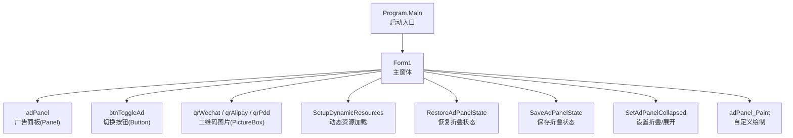
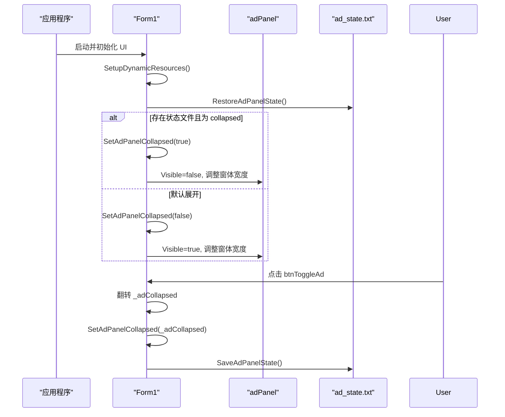
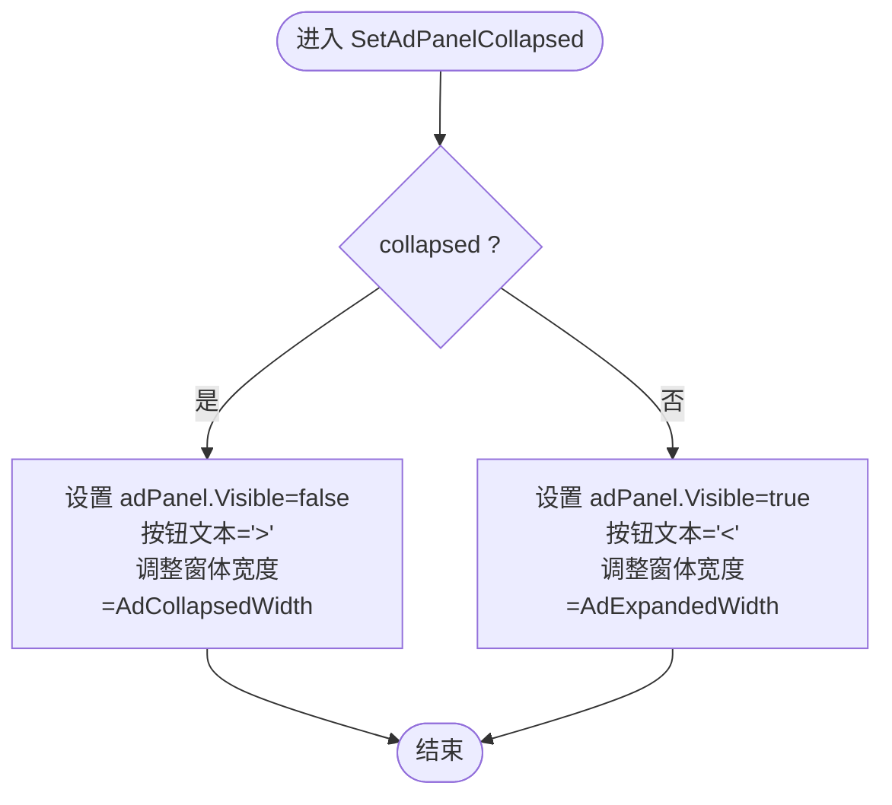
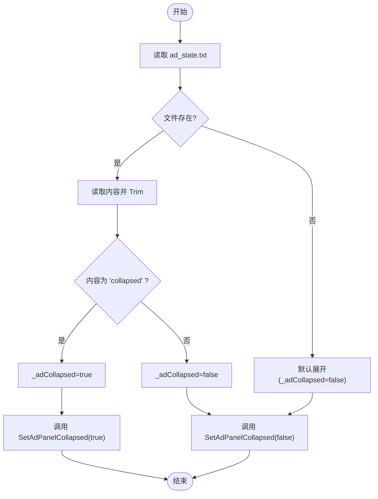
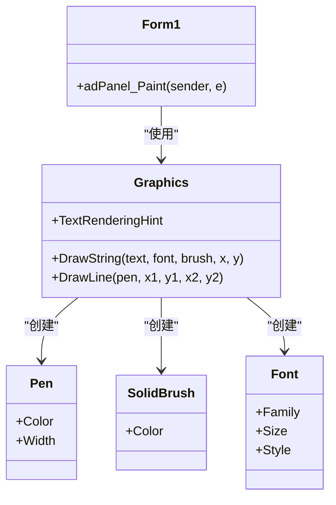
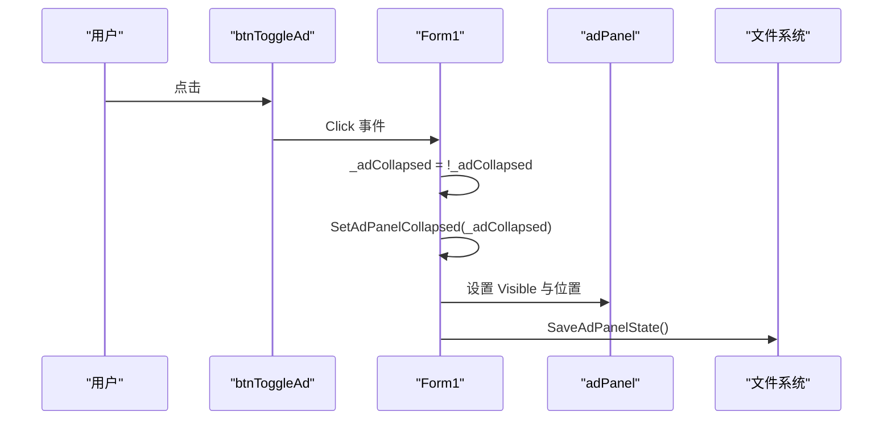
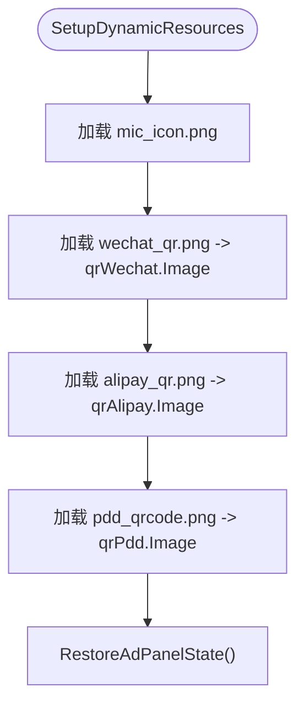
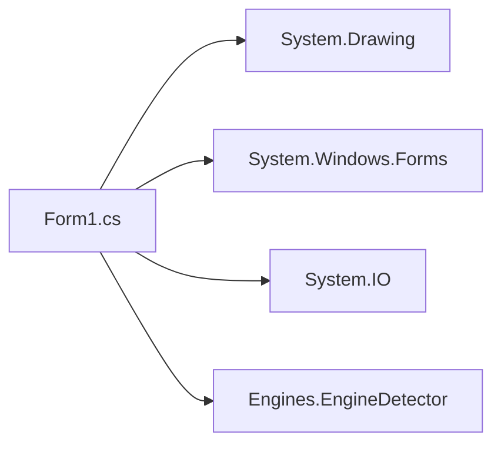

# 广告面板折叠功能

<cite>
**本文引用的文件**   
- [Form1.cs](file://t9s2t/Form1.cs)
- [Form1.Designer.cs](file://t9s2t/Form1.Designer.cs)
- [Program.cs](file://t9s2t/Program.cs)
- [App.config](file://t9s2t/App.config)
- [EngineDetector.cs](file://t9s2t/Engines/EngineDetector.cs)
</cite>

## 目录
1. [简介](#简介)
2. [项目结构](#项目结构)
3. [核心组件](#核心组件)
4. [架构总览](#架构总览)
5. [详细组件分析](#详细组件分析)
6. [依赖关系分析](#依赖关系分析)
7. [性能与体验优化建议](#性能与体验优化建议)
8. [故障排查指南](#故障排查指南)
9. [结论](#结论)
10. [附录：定制与扩展指南](#附录定制与扩展指南)

## 简介
本技术文档聚焦于“广告面板折叠功能”的实现机制，涵盖以下方面：
- 面板可见性控制与尺寸切换逻辑
- 折叠状态管理（持久化、配置文件读写、状态恢复）
- 面板绘制自定义（GDI+ 绘图、文本渲染、图形元素布局）
- 用户交互处理（按钮点击、展开/折叠切换、视觉反馈）
- 面板内容动态加载（图片资源管理与二维码显示）
- 面板状态保存机制（文件存储格式与兼容性处理）
- 面板定制与扩展开发指南（自定义绘制与交互效果示例）

## 项目结构
本项目为 Windows Forms 应用，主界面由 Form1 承载，UI 控件定义在 Designer 文件中，业务逻辑集中在 Form1.cs。广告面板位于主窗体右侧，通过一个切换按钮实现展开/折叠。

图表来源
- [Form1.cs:144-235](file://t9s2t/Form1.cs#L144-L235)
- [Form1.Designer.cs:118-176](file://t9s2t/Form1.Designer.cs#L118-L176)

章节来源
- [Program.cs:10-24](file://t9s2t/Program.cs#L10-L24)
- [Form1.Designer.cs:118-176](file://t9s2t/Form1.Designer.cs#L118-L176)

## 核心组件
- 广告面板 adPanel：承载二维码图片与自定义绘制区域
- 切换按钮 btnToggleAd：触发展开/折叠并更新 UI 状态
- 状态变量 _adCollapsed：记录当前折叠状态
- 常量 AdExpandedWidth/AdCollapsedWidth/FormHeight：控制窗体宽度与高度
- 持久化文件 ad_state.txt：保存折叠状态

关键职责划分：
- 可见性与尺寸控制：SetAdPanelCollapsed
- 状态持久化：SaveAdPanelState、RestoreAdPanelState
- 自定义绘制：adPanel_Paint
- 动态资源加载：SetupDynamicResources（含二维码图片）

章节来源
- [Form1.cs:353-413](file://t9s2t/Form1.cs#L353-L413)
- [Form1.Designer.cs:118-176](file://t9s2t/Form1.Designer.cs#L118-L176)

## 架构总览
广告面板折叠功能的整体流程如下：
- 程序启动后，初始化 UI 并加载动态资源
- 尝试从本地文件恢复折叠状态
- 根据状态设置面板可见性与窗体尺寸
- 用户点击切换按钮时，更新状态、持久化并刷新 UI

图表来源
- [Form1.cs:151-235](file://t9s2t/Form1.cs#L151-L235)
- [Form1.cs:353-413](file://t9s2t/Form1.cs#L353-L413)

## 详细组件分析

### 折叠状态与可见性控制
- 状态变量与常量
  - _adCollapsed：布尔值表示是否折叠
  - AdExpandedWidth/AdCollapsedWidth/FormHeight：展开/折叠时的窗体尺寸
- 切换逻辑
  - btnToggleAd_Click：翻转 _adCollapsed，调用 SetAdPanelCollapsed，并持久化状态
  - SetAdPanelCollapsed：根据 collapsed 参数设置 adPanel.Visible、按钮文本与位置、窗体 ClientSize
- 强制显示主窗口
  - ForceShowMainWindow：确保尺寸正确（考虑最小化/隐藏导致的 ClientSize 异常），并激活窗口

图表来源
- [Form1.cs:360-383](file://t9s2t/Form1.cs#L360-L383)

章节来源
- [Form1.cs:353-383](file://t9s2t/Form1.cs#L353-L383)
- [Form1.cs:243-258](file://t9s2t/Form1.cs#L243-L258)

### 状态持久化与恢复
- 保存状态
  - SaveAdPanelState：将 _adCollapsed 写入 ad_state.txt，值为 "collapsed" 或 "expanded"
- 恢复状态
  - RestoreAdPanelState：读取 ad_state.txt，若为 "collapsed" 则进入折叠；否则保持展开
- 兼容性与容错
  - 使用 try/catch 包裹文件操作，避免异常影响主流程
  - 默认行为为展开，确保无状态文件时 UI 正常展示

图表来源
- [Form1.cs:385-413](file://t9s2t/Form1.cs#L385-L413)

章节来源
- [Form1.cs:385-413](file://t9s2t/Form1.cs#L385-L413)

### 自定义绘制（GDI+）
- 绘制入口
  - adPanel_Paint：在 adPanel 的 Paint 事件中执行自定义绘制
- 文本渲染
  - 使用 TextRenderingHint.AntiAlias 提升文本清晰度
  - 标题“支持小白”居中显示
- 图形元素布局
  - 分割线：两条垂直线分隔三个区域
  - 标签与说明文字：微信打赏、支付宝打赏、拼多多店铺等
  - 颜色与字体：使用不同 Font 与 Brush 区分层级与强调信息

图表来源
- [Form1.cs:305-351](file://t9s2t/Form1.cs#L305-L351)

章节来源
- [Form1.cs:305-351](file://t9s2t/Form1.cs#L305-L351)

### 用户交互处理
- 按钮点击事件
  - btnToggleAd_Click：切换 _adCollapsed，调用 SetAdPanelCollapsed，并保存状态
- 视觉反馈
  - 按钮文本在 "<" 和 ">" 之间切换
  - 面板可见性变化与窗体宽度调整提供直观反馈

图表来源
- [Form1.cs:360-365](file://t9s2t/Form1.cs#L360-L365)
- [Form1.Designer.cs:161-176](file://t9s2t/Form1.Designer.cs#L161-L176)

章节来源
- [Form1.cs:360-365](file://t9s2t/Form1.cs#L360-L365)
- [Form1.Designer.cs:161-176](file://t9s2t/Form1.Designer.cs#L161-L176)

### 面板内容动态加载（图片资源与二维码）
- 动态资源加载
  - SetupDynamicResources：从应用目录加载 mic_icon.png 与二维码图片（wechat_qr.png、alipay_qr.png、pdd_qrcode.png）
  - 若文件不存在则忽略，保证健壮性
- 二维码显示
  - qrWechat、qrAlipay、qrPdd 为 PictureBox 控件，Image 属性指向对应图片
  - 同时保留 Designer 中的内置资源作为后备

图表来源
- [Form1.cs:290-303](file://t9s2t/Form1.cs#L290-L303)
- [Form1.Designer.cs:132-160](file://t9s2t/Form1.Designer.cs#L132-L160)

章节来源
- [Form1.cs:290-303](file://t9s2t/Form1.cs#L290-L303)
- [Form1.Designer.cs:132-160](file://t9s2t/Form1.Designer.cs#L132-L160)

### 面板状态保存机制（文件格式与兼容性）
- 文件路径
  - 保存在应用根目录下的 ad_state.txt
- 文件格式
  - 纯文本，值为 "collapsed" 或 "expanded"
- 兼容性处理
  - 读取失败或文件不存在时，默认展开
  - 写入失败时静默忽略，不影响主流程

章节来源
- [Form1.cs:385-413](file://t9s2t/Form1.cs#L385-L413)

## 依赖关系分析
- 外部依赖
  - System.Drawing：用于 GDI+ 绘图与字体/画笔对象
  - System.Windows.Forms：UI 控件与事件模型
  - System.IO：文件读写
- 内部依赖
  - EngineDetector：用于语音引擎检测（与广告面板无关，但属于主窗体上下文）

图表来源
- [Form1.cs:1-17](file://t9s2t/Form1.cs#L1-L17)
- [EngineDetector.cs:1-22](file://t9s2t/Engines/EngineDetector.cs#L1-L22)

章节来源
- [Form1.cs:1-17](file://t9s2t/Form1.cs#L1-L17)
- [EngineDetector.cs:1-22](file://t9s2t/Engines/EngineDetector.cs#L1-L22)

## 性能与体验优化建议
- 动画过渡
  - 当前实现为即时切换尺寸与可见性，未包含平滑动画。可引入定时器逐步调整 ClientSize.Width，实现展开/折叠动画效果
- 绘制优化
  - 在 adPanel_Paint 中频繁创建 Font/Pen/Brush 可能带来开销。可在类级别缓存常用对象并在 Dispose 中释放
- 资源加载
  - 图片加载已做存在性检查与异常捕获，建议在异步线程中加载大图片以避免阻塞 UI 线程
- 状态持久化
  - 文件写入采用同步方式，若未来需要更高可靠性，可考虑写入临时文件再原子替换

[本节为通用建议，不直接分析具体文件]

## 故障排查指南
- 常见问题
  - 面板未恢复折叠状态：检查 ad_state.txt 是否存在且内容是否为 "collapsed"
  - 二维码图片未显示：确认应用目录下是否存在对应的 png 文件
  - 切换按钮无效：检查 btnToggleAd_Click 事件是否正确绑定
- 定位方法
  - 查看 Form1_Load 与 SetupDynamicResources 的执行顺序
  - 检查 adPanel_Paint 是否被触发（可通过断点或日志）
  - 验证 SaveAdPanelState 与 RestoreAdPanelState 的文件路径权限

章节来源
- [Form1.cs:151-235](file://t9s2t/Form1.cs#L151-L235)
- [Form1.cs:290-303](file://t9s2t/Form1.cs#L290-L303)
- [Form1.cs:385-413](file://t9s2t/Form1.cs#L385-L413)

## 结论
广告面板折叠功能通过简单的状态变量与文件持久化实现了稳定的展开/折叠体验。自定义绘制提供了清晰的视觉层次与信息布局。尽管当前未实现平滑动画，但整体逻辑清晰、健壮性强，便于后续扩展与定制。

[本节为总结性内容，不直接分析具体文件]

## 附录：定制与扩展指南
- 自定义绘制扩展
  - 在 adPanel_Paint 中添加新的文本或图形元素，注意合理布局与颜色对比度
  - 使用缓存的 Font/Pen/Brush 对象减少重复创建开销
- 交互效果增强
  - 在 btnToggleAd_Click 中加入动画逻辑，例如使用 Timer 逐步调整窗体宽度
  - 增加鼠标悬停提示或按钮样式变化以提升用户体验
- 状态管理升级
  - 将 ad_state.txt 升级为 JSON 配置，支持更多选项（如面板透明度、位置等）
  - 增加版本字段以支持未来配置迁移与兼容性处理
- 资源管理优化
  - 将二维码图片改为按需加载，并提供占位图与错误提示
  - 支持热重载图片资源，无需重启应用

[本节为概念性指导，不直接分析具体文件]