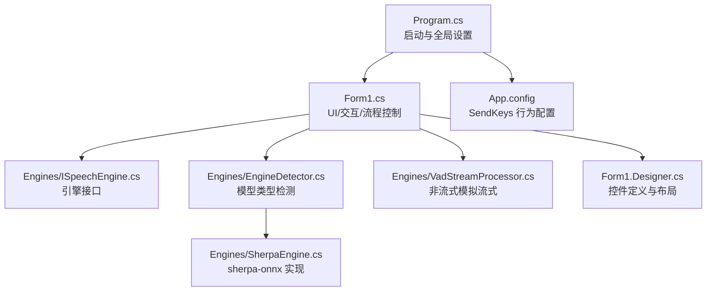
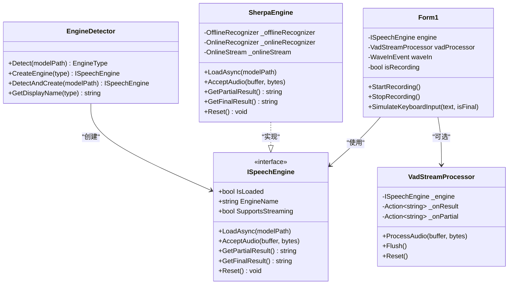
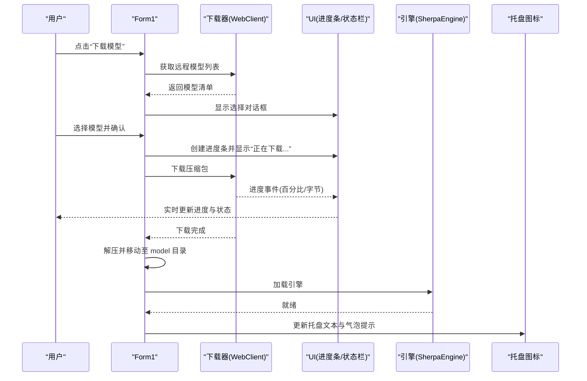
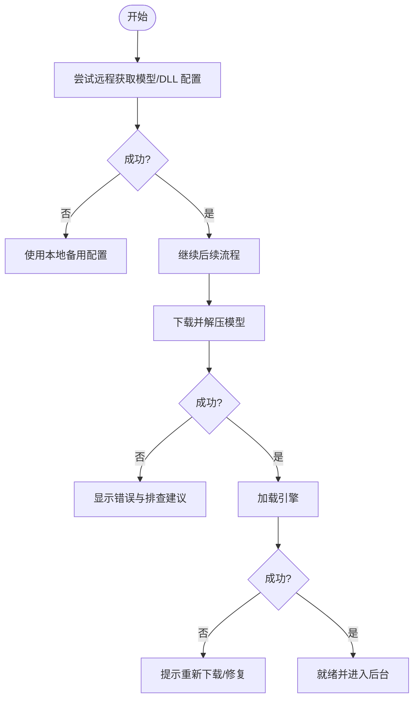
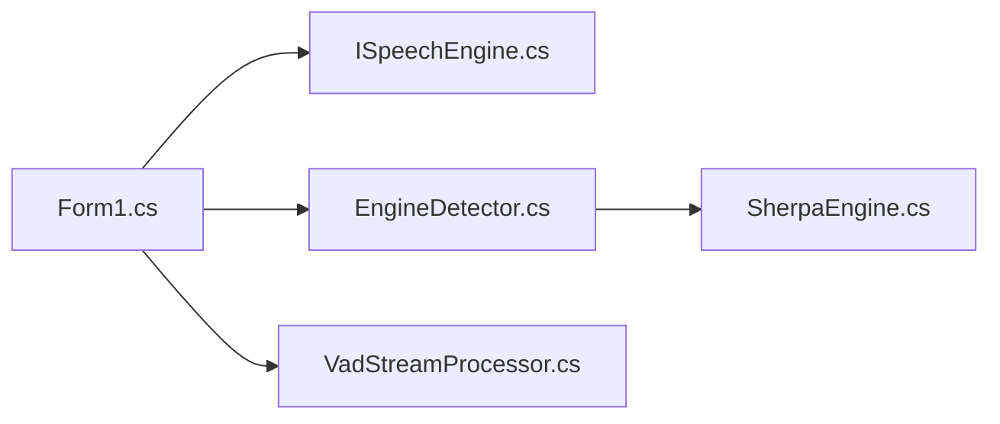

# 用户体验优化策略

<cite>
**本文引用的文件列表**
- [Program.cs](file://t9s2t/Program.cs)
- [Form1.cs](file://t9s2t/Form1.cs)
- [Form1.Designer.cs](file://t9s2t/Form1.Designer.cs)
- [App.config](file://t9s2t/App.config)
- [ISpeechEngine.cs](file://t9s2t/Engines/ISpeechEngine.cs)
- [SherpaEngine.cs](file://t9s2t/Engines/SherpaEngine.cs)
- [EngineDetector.cs](file://t9s2t/Engines/EngineDetector.cs)
- [VadStreamProcessor.cs](file://t9s2t/Engines/VadStreamProcessor.cs)
</cite>

## 目录
1. [引言](#引言)
2. [项目结构](#项目结构)
3. [核心组件](#核心组件)
4. [架构总览](#架构总览)
5. [详细组件分析](#详细组件分析)
6. [依赖关系分析](#依赖关系分析)
7. [性能与内存优化](#性能与内存优化)
8. [错误处理与用户提示](#错误处理与用户提示)
9. [响应式与自适应界面](#响应式与自适应界面)
10. [用户操作引导与帮助](#用户操作引导与帮助)
11. [无障碍访问支持](#无障碍访问支持)
12. [用户体验测试与评估](#用户体验测试与评估)
13. [结论](#结论)

## 引言
本技术文档围绕“用户体验优化策略”，结合仓库中的语音识别桌面应用，系统梳理异步反馈、错误处理、响应式布局、性能优化、用户引导与无障碍等关键维度。文档以代码级事实为依据，提供可视化图示与可操作的改进建议，帮助读者快速理解并落地优化方案。

## 项目结构
该应用为 Windows Forms 桌面程序，主入口在 Program.cs，主窗体 Form1 负责 UI、键盘钩子、录音、模型下载与引擎加载；引擎抽象层 ISpeechEngine 及 SherpaEngine 封装 sherpa-onnx 推理能力；EngineDetector 自动检测模型类型；VadStreamProcessor 为非流式模型提供“类流式”体验。

图表来源
- [Program.cs:1-27](file://t9s2t/Program.cs#L1-L27)
- [Form1.cs:1-200](file://t9s2t/Form1.cs#L1-L200)
- [ISpeechEngine.cs:1-35](file://t9s2t/Engines/ISpeechEngine.cs#L1-L35)
- [EngineDetector.cs:1-122](file://t9s2t/Engines/EngineDetector.cs#L1-L122)
- [SherpaEngine.cs:1-120](file://t9s2t/Engines/SherpaEngine.cs#L1-L120)
- [VadStreamProcessor.cs:1-60](file://t9s2t/Engines/VadStreamProcessor.cs#L1-L60)
- [Form1.Designer.cs:1-120](file://t9s2t/Form1.Designer.cs#L1-L120)
- [App.config:1-10](file://t9s2t/App.config#L1-L10)

章节来源
- [Program.cs:1-27](file://t9s2t/Program.cs#L1-L27)
- [Form1.Designer.cs:1-120](file://t9s2t/Form1.Designer.cs#L1-L120)

## 核心组件
- 启动与单实例：Program.cs 设置 TLS 协议族并运行主窗体；Form1 使用全局 Mutex 防止多开，并通过自定义消息将已有实例窗口置顶。
- 引擎抽象与实现：ISpeechEngine 定义加载、音频输入、部分/最终结果、重置等能力；SherpaEngine 基于 sherpa-onnx 实现离线/流式识别、标点恢复与 VAD。
- 模型检测：EngineDetector 根据目录结构与 tokens.txt 行数区分 SenseVoice、Paraformer、Paraformer-large 与流式 Paraformer。
- 非流式模拟流式：VadStreamProcessor 通过能量阈值与静音帧计数切分语音段落，触发识别并回调结果。
- UI 与交互：Form1 集成托盘图标、动态资源加载、广告面板折叠、进度条下载、键盘钩子（Ctrl+Alt+D）录音、剪贴板粘贴输出。

章节来源
- [Program.cs:1-27](file://t9s2t/Program.cs#L1-L27)
- [Form1.cs:151-235](file://t9s2t/Form1.cs#L151-L235)
- [ISpeechEngine.cs:1-35](file://t9s2t/Engines/ISpeechEngine.cs#L1-L35)
- [EngineDetector.cs:22-122](file://t9s2t/Engines/EngineDetector.cs#L22-L122)
- [SherpaEngine.cs:57-115](file://t9s2t/Engines/SherpaEngine.cs#L57-L115)
- [VadStreamProcessor.cs:12-86](file://t9s2t/Engines/VadStreamProcessor.cs#L12-L86)

## 架构总览
整体采用“UI 控制器 + 引擎抽象 + 具体引擎实现 + 辅助处理器”的分层设计。UI 层负责用户交互与状态展示；引擎层屏蔽不同模型差异；VAD 处理器为非流式模型提供近似流式的体验。

图表来源
- [Form1.cs:20-35](file://t9s2t/Form1.cs#L20-L35)
- [ISpeechEngine.cs:1-35](file://t9s2t/Engines/ISpeechEngine.cs#L1-L35)
- [SherpaEngine.cs:14-72](file://t9s2t/Engines/SherpaEngine.cs#L14-L72)
- [VadStreamProcessor.cs:12-33](file://t9s2t/Engines/VadStreamProcessor.cs#L12-L33)
- [EngineDetector.cs:22-122](file://t9s2t/Engines/EngineDetector.cs#L22-L122)

## 详细组件分析

### 异步操作反馈机制（进度条、状态更新、等待提示）
- 模型下载进度：动态创建 ProgressBar，订阅 DownloadProgressChanged，按百分比或未知大小模式切换样式，并在状态栏显示已下载字节数与百分比。
- 引擎 DLL 下载：在下载前禁用按钮并刷新状态文本，完成后恢复按钮状态。
- 录音中提示：托盘图标 tooltip 实时显示 partial 文本；底部悬浮“正在识别”提示窗不抢夺焦点；状态栏显示当前引擎与模式。
- 节流与去重：partial 更新最小间隔 200ms，且仅当文本变化才触发，避免频繁 UI 刷新。

图表来源
- [Form1.cs:853-966](file://t9s2t/Form1.cs#L853-L966)
- [Form1.cs:510-567](file://t9s2t/Form1.cs#L510-L567)
- [Form1.cs:1162-1173](file://t9s2t/Form1.cs#L1162-L1173)
- [Form1.cs:1086-1098](file://t9s2t/Form1.cs#L1086-L1098)

章节来源
- [Form1.cs:853-966](file://t9s2t/Form1.cs#L853-L966)
- [Form1.cs:510-567](file://t9s2t/Form1.cs#L510-L567)
- [Form1.cs:1086-1098](file://t9s2t/Form1.cs#L1086-L1098)

### 错误处理与用户提示（异常捕获、友好消息、操作指导）
- 网络与 JSON 解析：远程模型列表失败时回退到内置备用 JSON；引擎 DLL 配置读取失败时同样回退。
- 下载与解压：捕获异常后弹出包含排查建议的 MessageBox，并恢复按钮状态。
- 引擎加载：加载失败时提示“无法识别模型类型/加载失败”，并提供重新下载选项。
- 输入粘贴：优先使用剪贴板+快捷键组合，失败时回退为逐字符发送，确保可用性。

图表来源
- [Form1.cs:818-851](file://t9s2t/Form1.cs#L818-L851)
- [Form1.cs:569-599](file://t9s2t/Form1.cs#L569-L599)
- [Form1.cs:958-966](file://t9s2t/Form1.cs#L958-L966)
- [Form1.cs:645-721](file://t9s2t/Form1.cs#L645-L721)
- [Form1.cs:1035-1040](file://t9s2t/Form1.cs#L1035-L1040)

章节来源
- [Form1.cs:818-851](file://t9s2t/Form1.cs#L818-L851)
- [Form1.cs:569-599](file://t9s2t/Form1.cs#L569-L599)
- [Form1.cs:958-966](file://t9s2t/Form1.cs#L958-L966)
- [Form1.cs:645-721](file://t9s2t/Form1.cs#L645-L721)
- [Form1.cs:1035-1040](file://t9s2t/Form1.cs#L1035-L1040)

### 响应式设计实现（界面自适应、控件重排、布局优化）
- 广告面板折叠：通过保存/恢复状态文件，动态调整主窗体宽度与控件可见性，提升信息密度与空间利用率。
- 动态资源加载：运行时从应用目录加载图标与二维码图片，缺失时静默降级。
- 尺寸一致性：强制显示主窗口时校验 ClientSize，避免最小化/隐藏导致的尺寸异常。

章节来源
- [Form1.cs:353-413](file://t9s2t/Form1.cs#L353-L413)
- [Form1.cs:290-303](file://t9s2t/Form1.cs#L290-L303)
- [Form1.cs:243-258](file://t9s2t/Form1.cs#L243-L258)

### 性能优化策略（UI 线程优化、异步操作、内存管理）
- UI 线程安全：所有 UI 更新均通过 BeginInvoke/Invoke 调度，避免跨线程直接操作控件。
- 节流与去重：partial 文本更新限制最小间隔与内容变化条件，降低 UI 刷新频率。
- 锁保护：对录音、引擎调用与输入粘贴使用互斥锁，保证线程安全与原子性。
- 资源释放：引擎、VAD、录音设备与托盘图标在关闭时统一释放，避免资源泄漏。
- SendKeys 行为：通过配置文件强制使用 SendInput API，避免 JournalHook 模式在 UI 阻塞时的死锁风险。

章节来源
- [Form1.cs:1042-1051](file://t9s2t/Form1.cs#L1042-L1051)
- [Form1.cs:988-991](file://t9s2t/Form1.cs#L988-L991)
- [Form1.cs:1146-1173](file://t9s2t/Form1.cs#L1146-L1173)
- [Form1.cs:1279-1290](file://t9s2t/Form1.cs#L1279-L1290)
- [Form1.cs:279-288](file://t9s2t/Form1.cs#L279-L288)
- [App.config:1-10](file://t9s2t/App.config#L1-L10)

### 用户操作引导（首次使用向导、功能提示、帮助系统）
- 首次使用：若缺少引擎组件或模型，保持主窗口可见并给出明确指引；就绪后最小化到托盘并弹出气泡提示。
- 功能提示：状态栏与托盘文本实时反映当前模式（流式/离线）、识别进度与结果摘要。
- 帮助系统：当前未内建帮助文档，可在 UI 增加“使用说明”按钮，链接到在线帮助或本地 README。

章节来源
- [Form1.cs:196-214](file://t9s2t/Form1.cs#L196-L214)
- [Form1.cs:1162-1173](file://t9s2t/Form1.cs#L1162-L1173)
- [Form1.cs:1265-1273](file://t9s2t/Form1.cs#L1265-L1273)

### 无障碍访问支持（键盘导航、屏幕阅读器兼容、高对比度模式）
- 键盘导航：当前未显式设置 TabIndex 与 AccessibleName，建议为主窗体控件补充 Tab 顺序与描述，便于键盘遍历与读屏。
- 屏幕阅读器：为关键控件（如状态标签、按钮）添加 AccessibilityName/Description，增强语义化。
- 高对比度：遵循系统主题，避免硬编码颜色覆盖导致对比度不足；必要时监听系统主题变更并适配。

章节来源
- [Form1.Designer.cs:29-120](file://t9s2t/Form1.Designer.cs#L29-L120)

## 依赖关系分析
- 组件耦合：Form1 依赖 ISpeechEngine 抽象与 EngineDetector 工厂；SherpaEngine 实现具体推理逻辑；VadStreamProcessor 作为可选适配器。
- 外部依赖：NAudio 用于录音；Newtonsoft.Json 用于 JSON 解析；sherpa-onnx 原生库通过 P/Invoke 或托管包装调用。
- 潜在循环依赖：未发现直接循环引用；EngineDetector 仅创建 ISpeechEngine 实例，无反向依赖。

图表来源
- [Form1.cs:20-35](file://t9s2t/Form1.cs#L20-L35)
- [ISpeechEngine.cs:1-35](file://t9s2t/Engines/ISpeechEngine.cs#L1-L35)
- [EngineDetector.cs:22-122](file://t9s2t/Engines/EngineDetector.cs#L22-L122)
- [SherpaEngine.cs:14-72](file://t9s2t/Engines/SherpaEngine.cs#L14-L72)
- [VadStreamProcessor.cs:12-33](file://t9s2t/Engines/VadStreamProcessor.cs#L12-L33)

章节来源
- [Form1.cs:20-35](file://t9s2t/Form1.cs#L20-L35)
- [EngineDetector.cs:22-122](file://t9s2t/Engines/EngineDetector.cs#L22-L122)

## 性能与内存优化
- UI 线程优化：大量使用 BeginInvoke 进行轻量 UI 更新，避免阻塞；节流 partial 更新减少绘制压力。
- 异步 IO：下载与解压使用异步任务，避免 UI 卡顿。
- 内存管理：引擎对象与录音设备在关闭时释放；临时文件下载后删除；VAD 缓冲区在分段后清空。
- 输入稳定性：剪贴板写入后延时再发送快捷键，降低竞争条件；失败时回退为逐字符输入。

章节来源
- [Form1.cs:1086-1098](file://t9s2t/Form1.cs#L1086-L1098)
- [Form1.cs:908-926](file://t9s2t/Form1.cs#L908-L926)
- [Form1.cs:1279-1290](file://t9s2t/Form1.cs#L1279-L1290)
- [Form1.cs:279-288](file://t9s2t/Form1.cs#L279-L288)

## 错误处理与用户提示
- 网络异常：远程请求失败时使用内置备用配置，保障基本可用。
- 下载/解压异常：弹窗提示错误原因与排查步骤，并恢复按钮状态以便重试。
- 引擎加载异常：提示“无法识别模型类型/加载失败”，引导用户重新下载或检查模型目录。
- 输入异常：剪贴板/快捷键失败时回退为逐字符输入，确保最终可用。

章节来源
- [Form1.cs:818-851](file://t9s2t/Form1.cs#L818-L851)
- [Form1.cs:958-966](file://t9s2t/Form1.cs#L958-L966)
- [Form1.cs:645-721](file://t9s2t/Form1.cs#L645-L721)
- [Form1.cs:1035-1040](file://t9s2t/Form1.cs#L1035-L1040)

## 响应式与自适应界面
- 广告面板折叠：通过保存/恢复状态文件，动态调整主窗体宽度与控件可见性，提升信息密度与空间利用率。
- 动态资源加载：运行时从应用目录加载图标与二维码图片，缺失时静默降级。
- 尺寸一致性：强制显示主窗口时校验 ClientSize，避免最小化/隐藏导致的尺寸异常。

章节来源
- [Form1.cs:353-413](file://t9s2t/Form1.cs#L353-L413)
- [Form1.cs:290-303](file://t9s2t/Form1.cs#L290-L303)
- [Form1.cs:243-258](file://t9s2t/Form1.cs#L243-L258)

## 用户操作引导与帮助
- 首次使用：若缺少引擎组件或模型，保持主窗口可见并给出明确指引；就绪后最小化到托盘并弹出气泡提示。
- 功能提示：状态栏与托盘文本实时反映当前模式（流式/离线）、识别进度与结果摘要。
- 帮助系统：当前未内建帮助文档，可在 UI 增加“使用说明”按钮，链接到在线帮助或本地 README。

章节来源
- [Form1.cs:196-214](file://t9s2t/Form1.cs#L196-L214)
- [Form1.cs:1162-1173](file://t9s2t/Form1.cs#L1162-L1173)
- [Form1.cs:1265-1273](file://t9s2t/Form1.cs#L1265-L1273)

## 无障碍访问支持
- 键盘导航：当前未显式设置 TabIndex 与 AccessibleName，建议为主窗体控件补充 Tab 顺序与描述，便于键盘遍历与读屏。
- 屏幕阅读器：为关键控件（如状态标签、按钮）添加 AccessibilityName/Description，增强语义化。
- 高对比度：遵循系统主题，避免硬编码颜色覆盖导致对比度不足；必要时监听系统主题变更并适配。

章节来源
- [Form1.Designer.cs:29-120](file://t9s2t/Form1.Designer.cs#L29-L120)

## 用户体验测试与评估
- 用户反馈收集：在 UI 增加“反馈/问题报告”入口，收集错误日志、模型版本、操作系统信息等上下文。
- 行为分析：记录关键路径耗时（下载、解压、引擎加载、识别延迟），用于定位瓶颈。
- 改进建议：针对常见失败场景（网络超时、权限不足、麦克风不可用）提供更明确的自检与修复步骤。

[本节为通用方法论，不直接分析具体文件]

## 结论
本项目在用户体验方面已具备较好的基础：异步下载与解压、状态栏与托盘提示、节流与去重、线程安全与资源释放等。建议在以下方向持续优化：完善无障碍支持（TabIndex、AccessibleName）、增强错误诊断与自助修复、引入更丰富的用户引导与帮助系统，并通过行为埋点与反馈渠道驱动迭代。