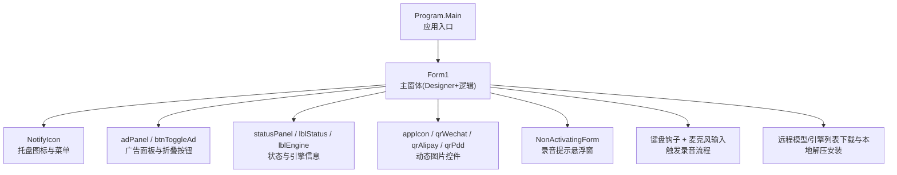
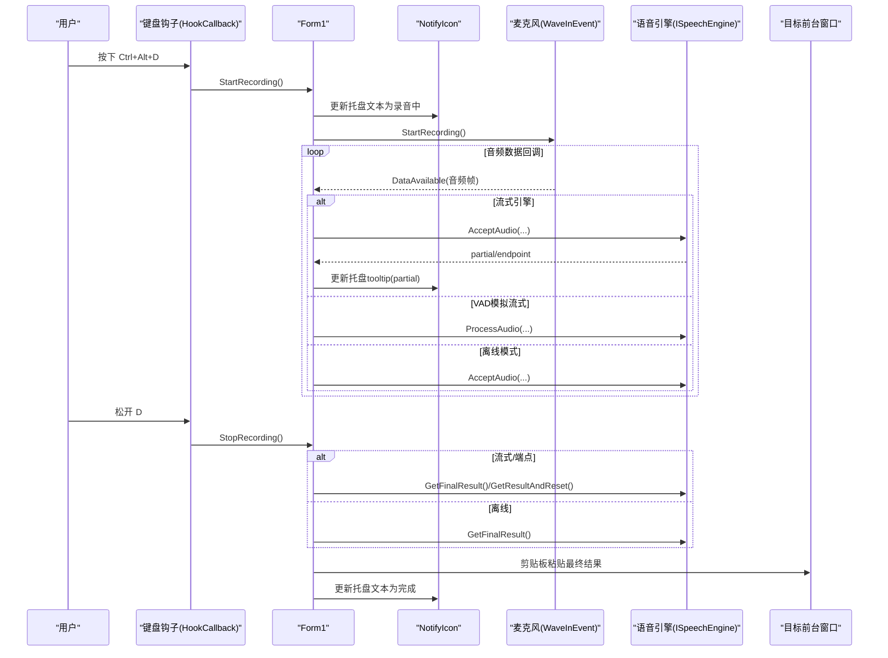
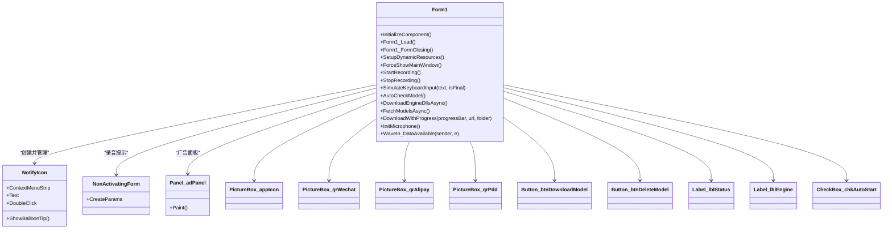
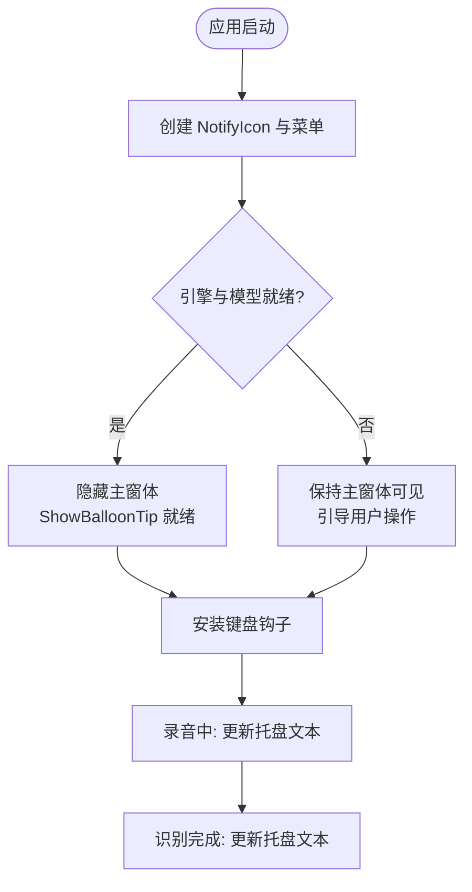
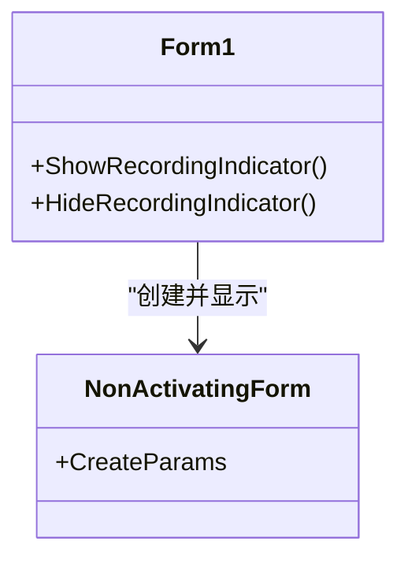
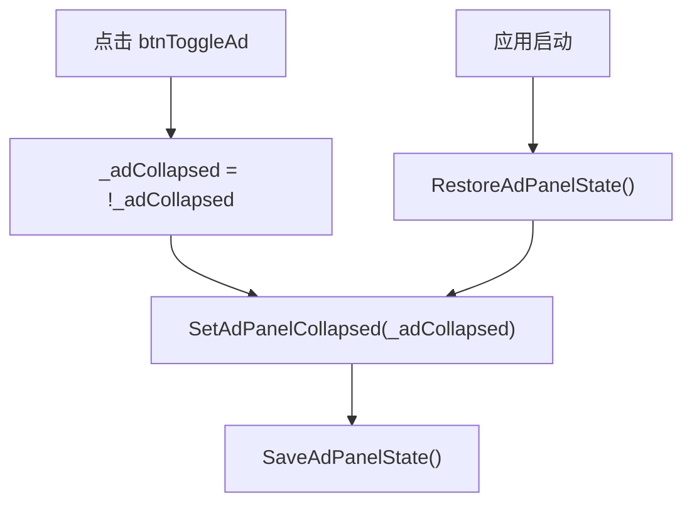
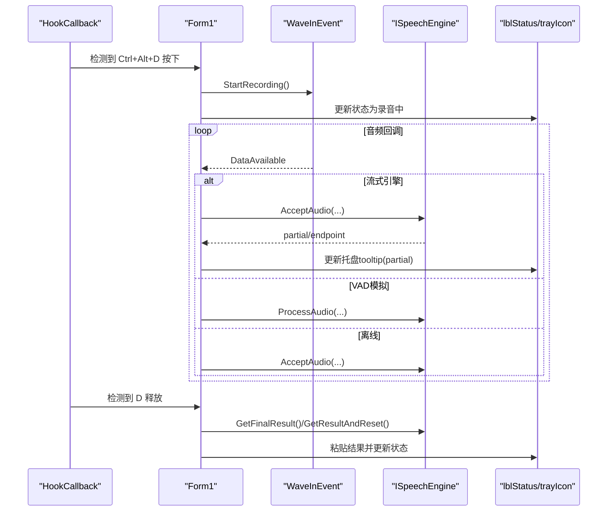
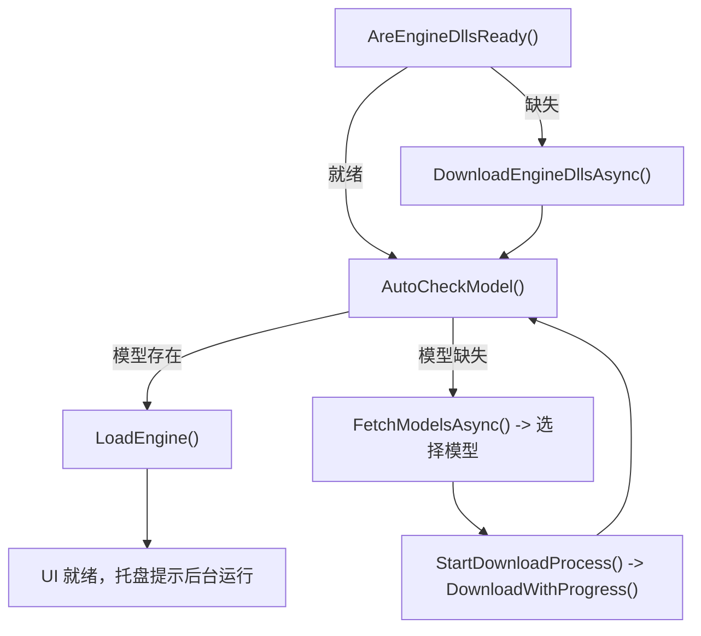
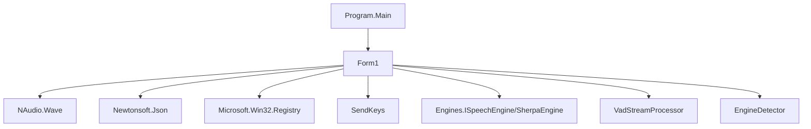

# 用户界面设计

<cite>
**本文引用的文件**   
- [Program.cs](file://t9s2t/Program.cs)
- [Form1.Designer.cs](file://t9s2t/Form1.Designer.cs)
- [Form1.cs](file://t9s2t/Form1.cs)
- [Resources.Designer.cs](file://t9s2t/Properties/Resources.Designer.cs)
- [Settings.Designer.cs](file://t9s2t/Properties/Settings.Designer.cs)
- [App.config](file://t9s2t/App.config)
</cite>

## 目录
1. [简介](#简介)
2. [项目结构](#项目结构)
3. [核心组件](#核心组件)
4. [架构总览](#架构总览)
5. [详细组件分析](#详细组件分析)
6. [依赖关系分析](#依赖关系分析)
7. [性能与体验优化](#性能与体验优化)
8. [故障排查指南](#故障排查指南)
9. [结论](#结论)
10. [附录：UI定制与扩展指南](#附录ui定制与扩展指南)

## 简介
本技术文档聚焦于 WinForms 界面的架构设计与实现细节，覆盖主窗体结构、控件布局与事件处理机制；系统托盘图标（显示、右键菜单、状态管理）；非激活提示窗体（置顶、透明度、圆角）；动态资源加载（图片与二维码）、广告面板折叠与持久化；以及用户体验优化策略（响应式、异步反馈、错误提示）。同时提供界面自定义与扩展的开发指南和具体 UI 组件使用示例。

## 项目结构
- 程序入口位于 Program.Main，负责启用视觉样式、设置文本渲染默认值并启动主窗体。
- 主窗体 Form1 由 Designer 生成部分类与逻辑代码组成，包含静态布局与动态行为。
- 资源与配置通过 Properties.Resources 与 App.config 进行访问。

图表来源
- [Program.cs:15-24](file://t9s2t/Program.cs#L15-L24)
- [Form1.Designer.cs:29-214](file://t9s2t/Form1.Designer.cs#L29-L214)
- [Form1.cs:151-235](file://t9s2t/Form1.cs#L151-L235)

章节来源
- [Program.cs:15-24](file://t9s2t/Program.cs#L15-L24)
- [Form1.Designer.cs:29-214](file://t9s2t/Form1.Designer.cs#L29-L214)

## 核心组件
- 主窗体 Form1
  - 初始化：单实例互斥、托盘图标、全局键盘钩子、麦克风初始化、动态资源加载、广告面板状态恢复。
  - 生命周期：关闭时最小化到托盘；再次打开通过窗口消息唤醒。
  - 交互：下载引擎组件、检测/下载/安装语音模型、删除模型、开始/停止录音、实时识别结果粘贴。
- 托盘图标 NotifyIcon
  - 右键菜单：显示主界面、退出。
  - 双击：显示主界面。
  - 气泡提示：启动就绪、最小化提示、识别中状态更新。
- 非激活提示窗体 NonActivatingForm
  - 不抢夺焦点的悬浮提示，用于录音中状态展示。
  - 置顶、半透明、圆角区域裁剪。
- 动态资源与广告面板
  - 运行时从应用目录加载 mic_icon.png 与三个二维码图片。
  - 广告面板可折叠，状态持久化到 ad_state.txt。
- 配置与资源
  - App.config 强制 SendKeys 使用 SendInput API，避免阻塞死锁。
  - Resources.Designer 提供强类型资源访问（二维码等）。
  - Settings.Designer 提供 ApplicationSettingsBase 基类（当前未定义属性）。

章节来源
- [Form1.cs:151-235](file://t9s2t/Form1.cs#L151-L235)
- [Form1.cs:279-288](file://t9s2t/Form1.cs#L279-L288)
- [Form1.cs:290-303](file://t9s2t/Form1.cs#L290-L303)
- [Form1.cs:353-413](file://t9s2t/Form1.cs#L353-L413)
- [Form1.cs:1292-1309](file://t9s2t/Form1.cs#L1292-L1309)
- [App.config:1-10](file://t9s2t/App.config#L1-L10)
- [Resources.Designer.cs:25-61](file://t9s2t/Properties/Resources.Designer.cs#L25-L61)
- [Settings.Designer.cs:16-28](file://t9s2t/Properties/Settings.Designer.cs#L16-L28)

## 架构总览
整体采用“主窗体 + 托盘常驻 + 键盘钩子 + 音频采集 + 引擎识别 + 剪贴板输出”的架构。关键流程如下：

图表来源
- [Form1.cs:422-460](file://t9s2t/Form1.cs#L422-L460)
- [Form1.cs:1146-1173](file://t9s2t/Form1.cs#L1146-L1173)
- [Form1.cs:1057-1111](file://t9s2t/Form1.cs#L1057-L1111)
- [Form1.cs:1228-1273](file://t9s2t/Form1.cs#L1228-L1273)
- [Form1.cs:993-1051](file://t9s2t/Form1.cs#L993-L1051)

## 详细组件分析

### 主窗体结构与布局
- 静态控件（Designer 生成）
  - statusPanel 包裹 lblStatus，用于显示状态信息。
  - lblEngine 显示当前引擎名称与特性。
  - btnDownloadModel、btnDeleteModel 控制模型下载与删除。
  - adPanel 承载二维码图片与自定义绘制文案。
  - btnToggleAd 切换广告面板展开/折叠。
  - appIcon、qrWechat、qrAlipay、qrPdd 为图片控件，运行时动态加载图片。
- 动态控件（运行时创建）
  - chkAutoStart：开机自启复选框，写入注册表 Run 项。
  - 模型选择对话框：ListView 展示远程模型列表，支持进度条下载与解压安装。
- 布局与尺寸
  - 固定高度 FormHeight=232，宽度在展开/折叠间切换。
  - 广告面板右侧放置，左侧为主操作区。

图表来源
- [Form1.Designer.cs:29-214](file://t9s2t/Form1.Designer.cs#L29-L214)
- [Form1.cs:151-235](file://t9s2t/Form1.cs#L151-L235)
- [Form1.cs:290-303](file://t9s2t/Form1.cs#L290-L303)
- [Form1.cs:353-413](file://t9s2t/Form1.cs#L353-L413)
- [Form1.cs:1292-1309](file://t9s2t/Form1.cs#L1292-L1309)

章节来源
- [Form1.Designer.cs:29-214](file://t9s2t/Form1.Designer.cs#L29-L214)
- [Form1.cs:151-235](file://t9s2t/Form1.cs#L151-L235)

### 托盘图标实现（显示、右键菜单、状态管理）
- 创建与可见性
  - 在 Form1_Load 中创建 NotifyIcon，设置 Icon、Visible、Text。
- 右键菜单
  - ContextMenuStrip 添加“显示主界面”、“退出”。
  - DoubleClick 绑定显示主界面。
- 状态管理
  - 启动就绪：ShowBalloonTip 提示后台运行。
  - 录音中：trayIcon.Text 更新为录音状态。
  - 识别完成：trayIcon.Text 更新为完成提示。
  - 最小化：FormClosing 拦截关闭，隐藏窗口并弹出气泡提示。

图表来源
- [Form1.cs:151-235](file://t9s2t/Form1.cs#L151-L235)
- [Form1.cs:279-288](file://t9s2t/Form1.cs#L279-L288)
- [Form1.cs:1146-1173](file://t9s2t/Form1.cs#L1146-L1173)
- [Form1.cs:1228-1273](file://t9s2t/Form1.cs#L1228-L1273)

章节来源
- [Form1.cs:151-235](file://t9s2t/Form1.cs#L151-L235)
- [Form1.cs:279-288](file://t9s2t/Form1.cs#L279-L288)

### 非激活提示窗体（置顶、透明度、动画效果）
- 非激活窗体 NonActivatingForm
  - 重写 CreateParams，设置 WS_EX_NOACTIVATE 阻止激活。
  - 录音时显示，置顶 TopMost=true，半透明 Opacity=0.92，圆角 Region 裁剪。
  - 定位到屏幕底部居中，避免遮挡输入焦点。
- 动画效果
  - 当前未实现显式动画（如淡入淡出），可通过 BeginInvoke 与定时器逐步调整 Opacity 或 Location 实现。

图表来源
- [Form1.cs:1177-1223](file://t9s2t/Form1.cs#L1177-L1223)
- [Form1.cs:1292-1309](file://t9s2t/Form1.cs#L1292-L1309)

章节来源
- [Form1.cs:1177-1223](file://t9s2t/Form1.cs#L1177-L1223)
- [Form1.cs:1292-1309](file://t9s2t/Form1.cs#L1292-L1309)

### 动态资源管理机制（语言切换、主题支持、资源加载优化）
- 动态图片加载
  - SetupDynamicResources 检查应用目录是否存在 mic_icon.png 与三个二维码图片，存在则赋值给对应 PictureBox。
  - 若文件不存在，控件保留默认资源（来自 Resources.Designer）。
- 语言切换与主题支持
  - 当前未实现多语言与主题切换。可在 Form1_Load 后根据配置切换 CurrentUICulture，并通过 Resources.Designer.Culture 设置。
  - 主题可通过统一的颜色常量与样式方法集中管理，结合 CheckBox 或下拉框切换。
- 资源加载优化
  - 仅在 DesignMode=false 时执行文件 IO。
  - 对每个图片加载使用 try/catch 防止异常中断 UI 初始化。
  - 建议后续引入缓存（内存字典）避免重复加载。

章节来源
- [Form1.cs:290-303](file://t9s2t/Form1.cs#L290-L303)
- [Resources.Designer.cs:25-61](file://t9s2t/Properties/Resources.Designer.cs#L25-L61)

### 广告面板折叠与状态持久化
- 折叠/展开
  - btnToggleAd_Click 切换 _adCollapsed，调用 SetAdPanelCollapsed 改变 adPanel.Visible、按钮位置与主窗体 ClientSize。
- 持久化
  - SaveAdPanelState 将状态写入 ad_state.txt。
  - RestoreAdPanelState 读取文件并恢复状态。
- 自定义绘制
  - adPanel_Paint 绘制标题、分割线与说明文字，提升可读性与品牌感。

图表来源
- [Form1.cs:353-413](file://t9s2t/Form1.cs#L353-L413)
- [Form1.Designer.cs:119-176](file://t9s2t/Form1.Designer.cs#L119-L176)

章节来源
- [Form1.cs:353-413](file://t9s2t/Form1.cs#L353-L413)
- [Form1.Designer.cs:119-176](file://t9s2t/Form1.Designer.cs#L119-L176)

### 键盘钩子与录音流程（事件处理机制）
- 全局键盘钩子
  - 监听 VK_D 键，结合 Ctrl+Alt 修饰键判断是否进入录音。
  - 录音中拦截 D 键，防止字符输入干扰。
- 录音控制
  - StartRecording：重置引擎/VAD，启动 WaveInEvent，保存前台窗口句柄，显示提示窗体。
  - StopRecording：停止录音，获取最终结果，粘贴到前台窗口，更新 UI。
- 音频数据处理
  - WaveIn_DataAvailable：根据引擎能力分流（流式、VAD模拟、离线）。
  - SimulateKeyboardInput：final 结果原子化粘贴，partial 仅更新托盘 tooltip。

图表来源
- [Form1.cs:422-460](file://t9s2t/Form1.cs#L422-L460)
- [Form1.cs:1057-1111](file://t9s2t/Form1.cs#L1057-L1111)
- [Form1.cs:1146-1173](file://t9s2t/Form1.cs#L1146-L1173)
- [Form1.cs:1228-1273](file://t9s2t/Form1.cs#L1228-L1273)
- [Form1.cs:993-1051](file://t9s2t/Form1.cs#L993-L1051)

章节来源
- [Form1.cs:422-460](file://t9s2t/Form1.cs#L422-L460)
- [Form1.cs:1057-1111](file://t9s2t/Form1.cs#L1057-L1111)
- [Form1.cs:1146-1173](file://t9s2t/Form1.cs#L1146-L1173)
- [Form1.cs:1228-1273](file://t9s2t/Form1.cs#L1228-L1273)
- [Form1.cs:993-1051](file://t9s2t/Form1.cs#L993-L1051)

### 模型与引擎组件的动态管理
- 引擎 DLL 按需下载
  - AreEngineDllsReady 检查 onnxruntime.dll 与 sherpa-onnx-c-api.dll 是否存在且大小 > 0。
  - DownloadEngineDllsAsync 从远程 JSON 获取下载地址，循环下载并更新 UI 状态。
- 模型列表与下载
  - FetchModelsAsync 拉取远程 models.json，失败回退到内置 fallbackJson。
  - StartDownloadProcess 创建 ProgressBar，调用 DownloadWithProgress 下载与解压。
  - DownloadWithProgress 清理旧目录、下载压缩包、智能识别 tar.bz2 或 zip、解压并移动到 model 目录。
- 自动检测与加载
  - AutoCheckModel 检测引擎与模型，设置按钮状态与引擎标签。
  - LoadEngine 创建引擎实例，配置流式处理与 VAD 模拟，更新 UI 与托盘文本。

图表来源
- [Form1.cs:468-505](file://t9s2t/Form1.cs#L468-L505)
- [Form1.cs:510-567](file://t9s2t/Form1.cs#L510-L567)
- [Form1.cs:569-606](file://t9s2t/Form1.cs#L569-L606)
- [Form1.cs:608-642](file://t9s2t/Form1.cs#L608-L642)
- [Form1.cs:645-721](file://t9s2t/Form1.cs#L645-L721)
- [Form1.cs:724-817](file://t9s2t/Form1.cs#L724-L817)
- [Form1.cs:818-851](file://t9s2t/Form1.cs#L818-L851)
- [Form1.cs:853-966](file://t9s2t/Form1.cs#L853-L966)

章节来源
- [Form1.cs:468-505](file://t9s2t/Form1.cs#L468-L505)
- [Form1.cs:510-567](file://t9s2t/Form1.cs#L510-L567)
- [Form1.cs:569-606](file://t9s2t/Form1.cs#L569-L606)
- [Form1.cs:608-642](file://t9s2t/Form1.cs#L608-L642)
- [Form1.cs:645-721](file://t9s2t/Form1.cs#L645-L721)
- [Form1.cs:724-817](file://t9s2t/Form1.cs#L724-L817)
- [Form1.cs:818-851](file://t9s2t/Form1.cs#L818-L851)
- [Form1.cs:853-966](file://t9s2t/Form1.cs#L853-L966)

## 依赖关系分析
- 外部依赖
  - NAudio.Wave：麦克风数据采集。
  - Newtonsoft.Json：解析远程 JSON 配置与模型列表。
  - Microsoft.Win32.Registry：读写开机自启注册表项。
  - System.Windows.Forms.SendKeys：粘贴文本到前台窗口。
- 内部依赖
  - Engines.ISpeechEngine 及 SherpaEngine：语音识别引擎抽象与实现。
  - VadStreamProcessor：VAD 模拟流式处理。
  - EngineDetector：引擎与模型检测。

图表来源
- [Program.cs:15-24](file://t9s2t/Program.cs#L15-L24)
- [Form1.cs:151-235](file://t9s2t/Form1.cs#L151-L235)

章节来源
- [Program.cs:15-24](file://t9s2t/Program.cs#L15-L24)
- [Form1.cs:151-235](file://t9s2t/Form1.cs#L151-L235)

## 性能与体验优化
- 异步与线程安全
  - 所有网络请求与文件 IO 使用 async/await，避免阻塞 UI 线程。
  - 使用 lock(_inputLock) 保护键盘/剪贴板/引擎操作的并发访问。
- 节流与去重
  - partial 结果更新设置 PartialThrottleMs=200ms 与 _lastDisplayedPartial 去重，减少频繁 UI 刷新。
- 剪贴板粘贴稳定性
  - 先 ForceForegroundWindow，必要时临时释放 Alt 键，再 Clipboard.SetText 与 SendKeys.SendWait("^v")，最后追加空格。
  - 失败回退到逐字符输入 FallbackTypeText。
- 用户体验反馈
  - 状态栏 lblStatus 实时更新下载、识别、完成状态。
  - 托盘图标 Text 与气泡提示提供后台运行与录音状态反馈。
- 配置优化
  - App.config 强制 SendKeys 使用 SendInput API，避免 JournalHook 模式导致的 UI 线程阻塞死锁。

章节来源
- [Form1.cs:988-1051](file://t9s2t/Form1.cs#L988-L1051)
- [Form1.cs:1114-1144](file://t9s2t/Form1.cs#L1114-L1144)
- [Form1.cs:1279-1290](file://t9s2t/Form1.cs#L1279-L1290)
- [App.config:1-10](file://t9s2t/App.config#L1-L10)

## 故障排查指南
- 无法获取远程模型/引擎列表
  - 检查网络连接与 TLS 设置（已在 Program.Main 与多处设置 SecurityProtocol）。
  - 查看日志输出（Debug.WriteLine）确认 JSON 解析是否成功。
- 引擎 DLL 下载不完整
  - 检查文件大小是否为 0，若为 0 则删除并重新下载。
  - 确认服务端 URL 可用与 User-Agent 不被拒绝。
- 模型解压失败
  - 确认压缩包格式（tar.bz2 需要 Windows 10+ 自带 tar.exe 或安装 7-Zip）。
  - 检查解压后目录是否包含已知模型文件（model.int8.onnx、encoder.int8.onnx、tokens.txt）。
- 粘贴失败或卡顿
  - 检查前台窗口句柄是否正确，必要时回退到 FallbackTypeText。
  - 确保 SendKeys 使用 SendInput（App.config）。

章节来源
- [Form1.cs:510-567](file://t9s2t/Form1.cs#L510-L567)
- [Form1.cs:853-966](file://t9s2t/Form1.cs#L853-L966)
- [Form1.cs:1279-1290](file://t9s2t/Form1.cs#L1279-L1290)
- [App.config:1-10](file://t9s2t/App.config#L1-L10)

## 结论
该 WinForms 界面以主窗体为核心，结合托盘图标与全局键盘钩子实现了便捷的语音输入体验。通过动态资源加载与广告面板折叠提升了可维护性与用户体验。异步操作、节流去重与剪贴板粘贴优化确保了流畅与稳定。未来可扩展多语言与主题支持，进一步增强界面自定义能力。

## 附录：UI定制与扩展指南
- 新增 UI 控件
  - 在 Form1.Designer.cs 中添加控件声明与 InitializeComponent 中的布局设置。
  - 在 Form1.cs 中编写事件处理与业务逻辑。
- 样式定制
  - 统一颜色与字体常量，集中管理主题色与字号。
  - 使用自定义绘制（adPanel_Paint）实现复杂布局与文案。
- 语言切换
  - 在 Form1_Load 后设置 Thread.CurrentThread.CurrentUICulture。
  - 通过 Resources.Designer.Culture 指定资源文化。
- 主题支持
  - 基于配置项切换 ForeColor、BackColor、Font。
  - 将样式应用到各控件（Button、Label、PictureBox）。
- 资源加载优化
  - 引入内存缓存字典，避免重复 IO。
  - 使用 Image.FromFile 前检查文件存在与大小。
- 示例路径参考
  - 动态图片加载：[Form1.cs:290-303](file://t9s2t/Form1.cs#L290-L303)
  - 广告面板绘制：[Form1.cs:305-351](file://t9s2t/Form1.cs#L305-L351)
  - 托盘状态更新：[Form1.cs:1146-1173](file://t9s2t/Form1.cs#L1146-L1173)
  - 非激活提示窗体：[Form1.cs:1177-1223](file://t9s2t/Form1.cs#L1177-L1223)

章节来源
- [Form1.Designer.cs:29-214](file://t9s2t/Form1.Designer.cs#L29-L214)
- [Form1.cs:290-303](file://t9s2t/Form1.cs#L290-L303)
- [Form1.cs:305-351](file://t9s2t/Form1.cs#L305-L351)
- [Form1.cs:1146-1173](file://t9s2t/Form1.cs#L1146-L1173)
- [Form1.cs:1177-1223](file://t9s2t/Form1.cs#L1177-L1223)