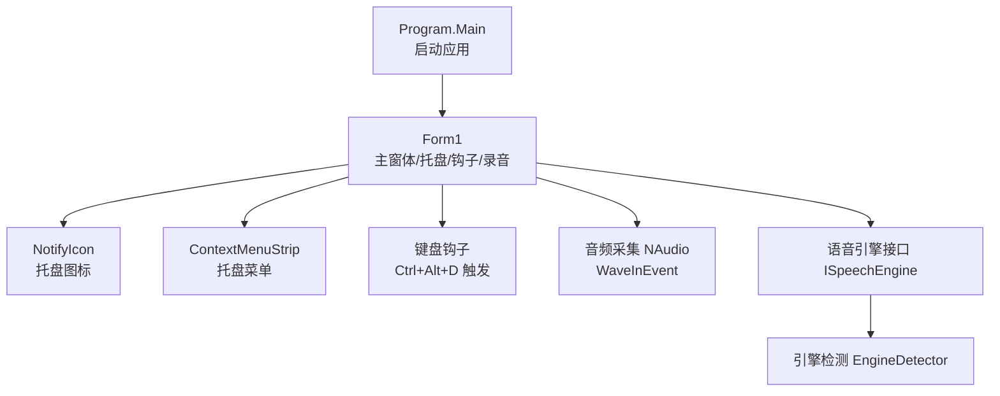
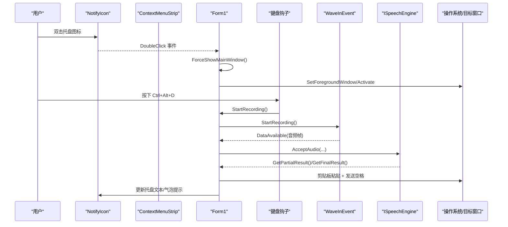
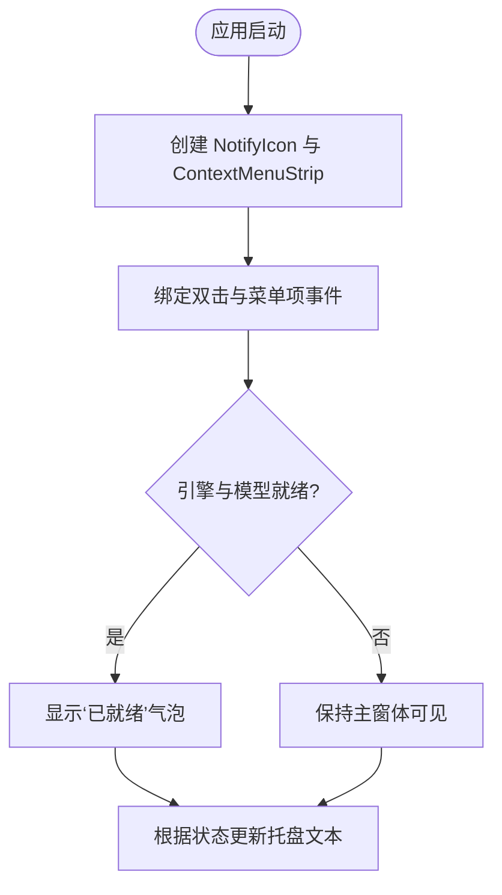
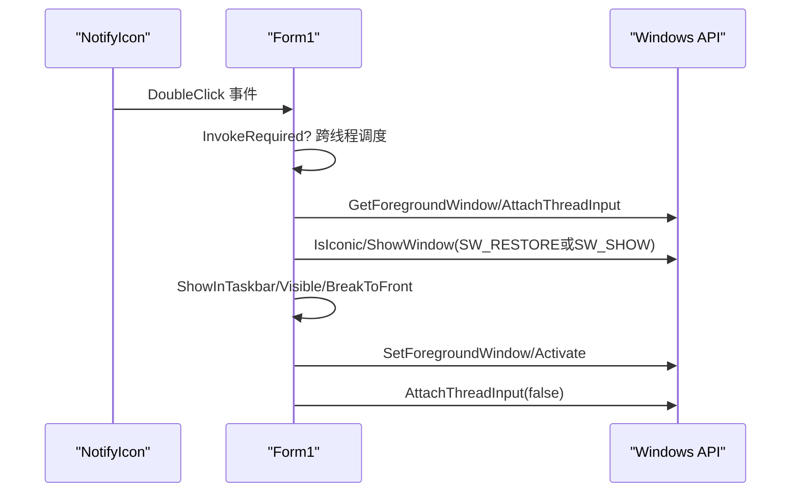
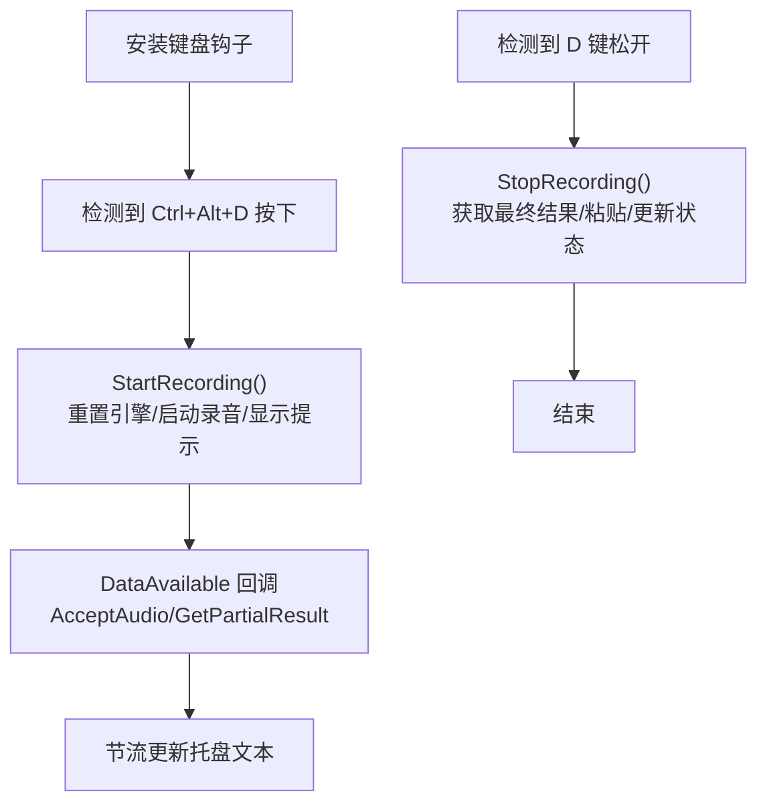
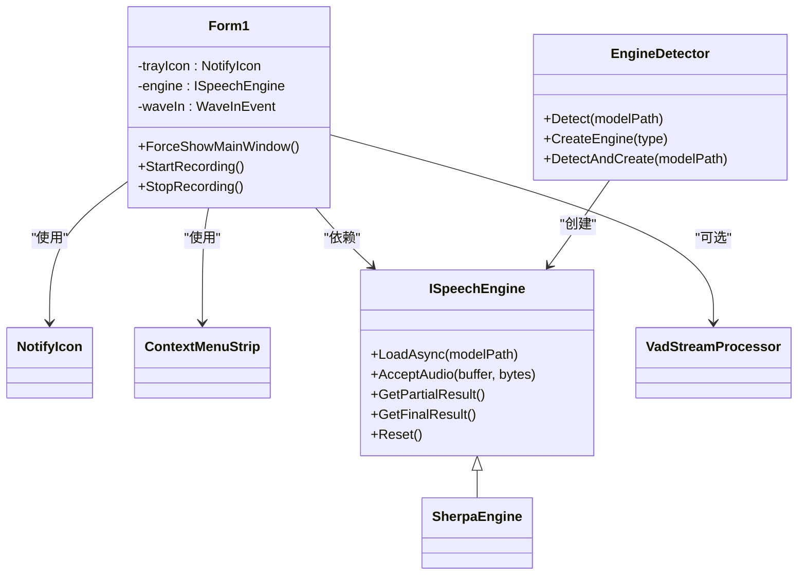

# 系统托盘图标系统

<cite>
**本文引用的文件**   
- [Program.cs](file://t9s2t/Program.cs)
- [Form1.cs](file://t9s2t/Form1.cs)
- [Form1.Designer.cs](file://t9s2t/Form1.Designer.cs)
- [EngineDetector.cs](file://t9s2t/Engines/EngineDetector.cs)
- [ISpeechEngine.cs](file://t9s2t/Engines/ISpeechEngine.cs)
</cite>

## 目录
1. [简介](#简介)
2. [项目结构](#项目结构)
3. [核心组件](#核心组件)
4. [架构总览](#架构总览)
5. [详细组件分析](#详细组件分析)
6. [依赖关系分析](#依赖关系分析)
7. [性能与资源优化](#性能与资源优化)
8. [故障排查指南](#故障排查指南)
9. [结论](#结论)
10. [附录：扩展开发指南](#附录扩展开发指南)

## 简介
本技术文档聚焦于该项目的系统托盘图标系统，围绕 NotifyIcon 组件的实现进行深入剖析，涵盖以下方面：
- 图标显示、上下文菜单创建与用户交互处理
- 托盘图标的状态管理（文本更新、气泡提示、图标切换）
- 双击事件处理与主窗体显示逻辑（窗口激活与焦点恢复机制）
- 托盘菜单的动态构建（菜单项添加、事件绑定与状态同步）
- 托盘图标的资源管理与内存优化策略
- 托盘功能扩展的开发指南（自定义菜单项与通知功能的实现示例）

## 项目结构
本项目为 Windows Forms 应用，入口在 Program.Main，主界面 Form1 负责托盘图标、键盘钩子、录音识别与输入模拟等核心逻辑。引擎检测与抽象接口位于 Engines 目录。

图表来源
- [Program.cs:15-24](file://t9s2t/Program.cs#L15-L24)
- [Form1.cs:151-235](file://t9s2t/Form1.cs#L151-L235)
- [ISpeechEngine.cs:1-35](file://t9s2t/Engines/ISpeechEngine.cs#L1-L35)
- [EngineDetector.cs:22-122](file://t9s2t/Engines/EngineDetector.cs#L22-L122)

章节来源
- [Program.cs:15-24](file://t9s2t/Program.cs#L15-L24)
- [Form1.Designer.cs:29-218](file://t9s2t/Form1.Designer.cs#L29-L218)

## 核心组件
- 托盘图标与菜单
  - 使用 System.Windows.Forms.NotifyIcon 创建托盘图标，并关联 ContextMenuStrip 作为右键菜单。
  - 提供“显示主界面”和“退出”两个菜单项；支持双击图标显示主界面。
- 状态管理
  - 通过 trayIcon.Text 动态更新托盘提示文本，反映当前运行状态（启动中、就绪、录音中、已输入）。
  - 使用 ShowBalloonTip 展示气泡提示，用于“已就绪”、“最小化到托盘”等关键状态。
- 主窗体显示与焦点恢复
  - ForceShowMainWindow 确保窗口尺寸正确、可见性、任务栏显示、前台激活与线程输入附加，避免被其他窗口抢占焦点。
- 键盘钩子与录音流程
  - 低级别键盘钩子监听 Ctrl+Alt+D 组合键，开始/停止录音；录音期间拦截 D 键防止字符输入。
- 语音识别与输入模拟
  - 基于 ISpeechEngine 抽象与 EngineDetector 自动选择引擎；流式与非流式模式分别处理。
  - 最终结果通过剪贴板粘贴 + 发送空格的方式写入目标窗口，partial 仅更新托盘文本避免闪烁。

章节来源
- [Form1.cs:163-169](file://t9s2t/Form1.cs#L163-L169)
- [Form1.cs:201-204](file://t9s2t/Form1.cs#L201-L204)
- [Form1.cs:243-258](file://t9s2t/Form1.cs#L243-L258)
- [Form1.cs:422-460](file://t9s2t/Form1.cs#L422-L460)
- [Form1.cs:993-1051](file://t9s2t/Form1.cs#L993-L1051)
- [Form1.cs:1146-1273](file://t9s2t/Form1.cs#L1146-L1273)
- [ISpeechEngine.cs:1-35](file://t9s2t/Engines/ISpeechEngine.cs#L1-L35)
- [EngineDetector.cs:22-122](file://t9s2t/Engines/EngineDetector.cs#L22-L122)

## 架构总览
下图展示了从托盘图标到主窗体、键盘钩子、音频采集、语音引擎以及输入模拟的完整调用链。

图表来源
- [Form1.cs:163-169](file://t9s2t/Form1.cs#L163-L169)
- [Form1.cs:243-258](file://t9s2t/Form1.cs#L243-L258)
- [Form1.cs:422-460](file://t9s2t/Form1.cs#L422-L460)
- [Form1.cs:1057-1111](file://t9s2t/Form1.cs#L1057-L1111)
- [Form1.cs:993-1051](file://t9s2t/Form1.cs#L993-L1051)

## 详细组件分析

### 托盘图标与上下文菜单
- 初始化
  - 在 Form1_Load 中创建 NotifyIcon，设置 Icon、Visible 与初始 Text。
  - 创建 ContextMenuStrip，添加“显示主界面”和“退出”菜单项，并绑定点击事件。
  - 将 ContextMenuStrip 赋值给 trayIcon.ContextMenuStrip。
  - 订阅 trayIcon.DoubleClick 事件，双击时调用 ForceShowMainWindow。
- 状态更新
  - 引擎加载成功后，更新 trayIcon.Text 为包含引擎名称的状态文本。
  - 录音开始时更新为“录音中...”，结束时恢复为“就绪”。
  - partial 识别结果仅更新托盘文本，避免频繁 UI 操作导致闪烁。
- 气泡提示
  - 当引擎与模型就绪后，显示“已就绪”气泡提示。
  - 用户关闭主窗体时，显示“最小化到托盘”的气泡提示。

图表来源
- [Form1.cs:163-169](file://t9s2t/Form1.cs#L163-L169)
- [Form1.cs:201-204](file://t9s2t/Form1.cs#L201-L204)
- [Form1.cs:706-708](file://t9s2t/Form1.cs#L706-L708)
- [Form1.cs:1003-1008](file://t9s2t/Form1.cs#L1003-L1008)
- [Form1.cs:1167-1170](file://t9s2t/Form1.cs#L1167-L1170)
- [Form1.cs:1267-1270](file://t9s2t/Form1.cs#L1267-L1270)
- [Form1.cs:283-285](file://t9s2t/Form1.cs#L283-L285)

章节来源
- [Form1.cs:163-169](file://t9s2t/Form1.cs#L163-L169)
- [Form1.cs:201-204](file://t9s2t/Form1.cs#L201-L204)
- [Form1.cs:706-708](file://t9s2t/Form1.cs#L706-L708)
- [Form1.cs:1003-1008](file://t9s2t/Form1.cs#L1003-L1008)
- [Form1.cs:1167-1170](file://t9s2t/Form1.cs#L1167-L1170)
- [Form1.cs:1267-1270](file://t9s2t/Form1.cs#L1267-L1270)
- [Form1.cs:283-285](file://t9s2t/Form1.cs#L283-L285)

### 双击事件与主窗体显示逻辑
- 双击托盘图标触发 ForceShowMainWindow。
- 该方法确保：
  - 修正 ClientSize（避免最小化/隐藏后尺寸异常）
  - 获取前台窗口线程并附加输入线程
  - 若窗口最小化则恢复，否则显示
  - 设置 ShowInTaskbar=true、Visible=true、BringToFront
  - 调用 SetForegroundWindow 与 Activate 激活窗口
  - 最后分离输入线程，避免影响前台窗口

图表来源
- [Form1.cs:243-258](file://t9s2t/Form1.cs#L243-L258)

章节来源
- [Form1.cs:243-258](file://t9s2t/Form1.cs#L243-L258)

### 托盘菜单的动态构建与状态同步
- 动态构建
  - 在 Form1_Load 中创建 ContextMenuStrip，并通过 Items.Add 添加菜单项。
  - 每个菜单项绑定匿名委托事件处理器，直接调用业务方法（如 ForceShowMainWindow、Application.Exit）。
- 状态同步
  - 托盘文本随引擎状态变化而更新，体现“就绪”、“录音中”、“已输入”等状态。
  - 部分识别结果节流更新托盘文本，避免频繁刷新。

章节来源
- [Form1.cs:163-169](file://t9s2t/Form1.cs#L163-L169)
- [Form1.cs:1003-1008](file://t9s2t/Form1.cs#L1003-L1008)
- [Form1.cs:1167-1170](file://t9s2t/Form1.cs#L1167-L1170)
- [Form1.cs:1267-1270](file://t9s2t/Form1.cs#L1267-L1270)

### 键盘钩子与录音流程
- 键盘钩子
  - 使用 SetWindowsHookEx 安装 WH_KEYBOARD_LL 钩子。
  - 监听 VK_D 键，结合 GetAsyncKeyState 判断 Ctrl 与 Alt 是否同时按下。
  - 按下时开始录音并拦截按键；松开时停止录音并拦截按键。
- 录音流程
  - StartRecording：重置引擎与 VAD，启动 WaveInEvent 录音，保存前台窗口句柄，显示录音提示浮窗，更新托盘文本。
  - StopRecording：停止录音设备，等待最后数据帧，根据引擎类型获取最终结果并粘贴到目标窗口，更新托盘文本与状态。

图表来源
- [Form1.cs:415-460](file://t9s2t/Form1.cs#L415-L460)
- [Form1.cs:1146-1273](file://t9s2t/Form1.cs#L1146-L1273)
- [Form1.cs:1057-1111](file://t9s2t/Form1.cs#L1057-L1111)

章节来源
- [Form1.cs:415-460](file://t9s2t/Form1.cs#L415-L460)
- [Form1.cs:1146-1273](file://t9s2t/Form1.cs#L1146-L1273)
- [Form1.cs:1057-1111](file://t9s2t/Form1.cs#L1057-L1111)

### 输入模拟与焦点恢复
- 输入模拟
  - 优先使用剪贴板 + SendKeys 粘贴最终结果，并在末尾追加空格。
  - 为避免 Alt 仍按着导致系统菜单弹出，临时释放 Alt 键后再粘贴。
  - 失败时回退到逐字符模拟输入。
- 焦点恢复
  - ForceForegroundWindow 尝试将前台窗口设置为录音前的目标窗口，避免提示窗抢焦点。
  - 使用 AttachThreadInput 提升 SetForegroundWindow 的成功率。

章节来源
- [Form1.cs:993-1051](file://t9s2t/Form1.cs#L993-L1051)
- [Form1.cs:1114-1144](file://t9s2t/Form1.cs#L1114-L1144)

### 资源管理与内存优化
- 对象生命周期
  - 在 FormClosing 中释放键盘钩子、互斥锁、音频设备、语音引擎与托盘图标。
- 图像资源
  - 动态加载外部图片（麦克风图标、二维码），仅在文件存在时加载，避免异常。
- 文本更新节流
  - partial 结果更新托盘文本采用时间间隔与去重策略，减少 UI 刷新频率。

章节来源
- [Form1.cs:279-288](file://t9s2t/Form1.cs#L279-L288)
- [Form1.cs:290-303](file://t9s2t/Form1.cs#L290-L303)
- [Form1.cs:989-991](file://t9s2t/Form1.cs#L989-L991)
- [Form1.cs:1088-1096](file://t9s2t/Form1.cs#L1088-L1096)

## 依赖关系分析
- 组件耦合
  - Form1 强依赖 NotifyIcon、ContextMenuStrip、NAudio.Wave、Windows API（user32.dll、kernel32.dll）。
  - 语音引擎通过 ISpeechEngine 抽象解耦，EngineDetector 负责实例化具体引擎。
- 外部依赖
  - NAudio.Wave 用于音频采集。
  - Newtonsoft.Json 用于解析远程配置与模型列表。
  - Microsoft.Win32.Registry 用于开机自启注册表读写。
- 潜在循环依赖
  - 未发现循环引用；引擎检测与创建单向依赖。

图表来源
- [Form1.cs:22-27](file://t9s2t/Form1.cs#L22-L27)
- [ISpeechEngine.cs:1-35](file://t9s2t/Engines/ISpeechEngine.cs#L1-L35)
- [EngineDetector.cs:22-122](file://t9s2t/Engines/EngineDetector.cs#L22-L122)

章节来源
- [Form1.cs:22-27](file://t9s2t/Form1.cs#L22-L27)
- [ISpeechEngine.cs:1-35](file://t9s2t/Engines/ISpeechEngine.cs#L1-L35)
- [EngineDetector.cs:22-122](file://t9s2t/Engines/EngineDetector.cs#L22-L122)

## 性能与资源优化
- 托盘文本更新节流
  - 对 partial 结果进行时间与内容去重，降低 UI 刷新频率，避免卡顿。
- 输入模拟优化
  - 优先剪贴板粘贴 + 发送空格，减少逐字符输入的性能开销。
  - 临时释放 Alt 键避免系统菜单干扰，提高粘贴成功率。
- 资源释放
  - 在关闭时释放所有非托管资源（钩子、音频设备、引擎、托盘图标），避免内存泄漏。
- 图像加载
  - 动态加载外部图片，仅在文件存在时加载，避免不必要的异常与资源占用。

[本节为通用指导，不直接分析具体文件]

## 故障排查指南
- 托盘图标不可见
  - 检查 Form1_Load 中 trayIcon.Visible 是否设为 true，并确保未在主窗体隐藏后再次设置 Visible=false。
- 双击无效
  - 确认 trayIcon.DoubleClick 事件已绑定，且 ForceShowMainWindow 未被跨线程阻塞。
- 气泡提示不显示
  - 检查 ShowBalloonTip 调用时机与参数，确保在 UI 线程执行。
- 无法显示主窗体
  - 检查 ForceShowMainWindow 中的窗口尺寸修复与线程输入附加逻辑。
- 托盘文本不更新
  - 检查 partial 节流条件与 BeginInvoke 调用是否正确。
- 输入粘贴失败
  - 检查 ForceForegroundWindow 与剪贴板可用性，必要时启用回退方案。

章节来源
- [Form1.cs:163-169](file://t9s2t/Form1.cs#L163-L169)
- [Form1.cs:243-258](file://t9s2t/Form1.cs#L243-L258)
- [Form1.cs:201-204](file://t9s2t/Form1.cs#L201-L204)
- [Form1.cs:1003-1008](file://t9s2t/Form1.cs#L1003-L1008)
- [Form1.cs:993-1051](file://t9s2t/Form1.cs#L993-L1051)

## 结论
该项目通过 NotifyIcon 实现了完善的系统托盘图标系统，具备上下文菜单、气泡提示、双击显示主窗体、状态文本更新等功能。结合键盘钩子与音频采集，实现了高效的语音输入体验。整体架构清晰，资源管理合理，具备良好的可扩展性与稳定性。

[本节为总结，不直接分析具体文件]

## 附录：扩展开发指南
- 自定义托盘菜单项
  - 在 Form1_Load 中通过 menu.Items.Add 添加新菜单项，并绑定事件处理器以调用业务方法。
  - 示例路径参考：[Form1.cs:163-169](file://t9s2t/Form1.cs#L163-L169)
- 自定义通知功能
  - 使用 trayIcon.ShowBalloonTip 显示自定义气泡提示，注意在 UI 线程调用。
  - 示例路径参考：[Form1.cs:201-204](file://t9s2t/Form1.cs#L201-L204)、[Form1.cs:283-285](file://t9s2t/Form1.cs#L283-L285)
- 动态状态同步
  - 在引擎状态变化时更新 trayIcon.Text，反映当前运行状态。
  - 示例路径参考：[Form1.cs:706-708](file://t9s2t/Form1.cs#L706-L708)、[Form1.cs:1167-1170](file://t9s2t/Form1.cs#L1167-L1170)、[Form1.cs:1267-1270](file://t9s2t/Form1.cs#L1267-L1270)
- 资源与内存优化
  - 在 FormClosing 中释放所有非托管资源，避免内存泄漏。
  - 示例路径参考：[Form1.cs:279-288](file://t9s2t/Form1.cs#L279-L288)

章节来源
- [Form1.cs:163-169](file://t9s2t/Form1.cs#L163-L169)
- [Form1.cs:201-204](file://t9s2t/Form1.cs#L201-L204)
- [Form1.cs:283-285](file://t9s2t/Form1.cs#L283-L285)
- [Form1.cs:706-708](file://t9s2t/Form1.cs#L706-L708)
- [Form1.cs:1167-1170](file://t9s2t/Form1.cs#L1167-L1170)
- [Form1.cs:1267-1270](file://t9s2t/Form1.cs#L1267-L1270)
- [Form1.cs:279-288](file://t9s2t/Form1.cs#L279-L288)