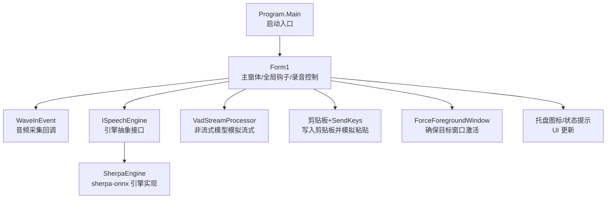
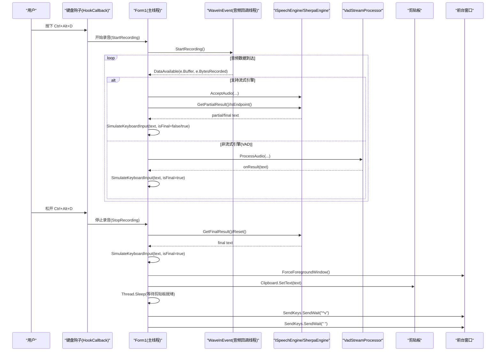
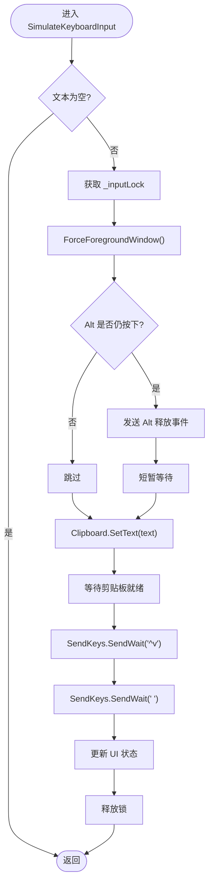
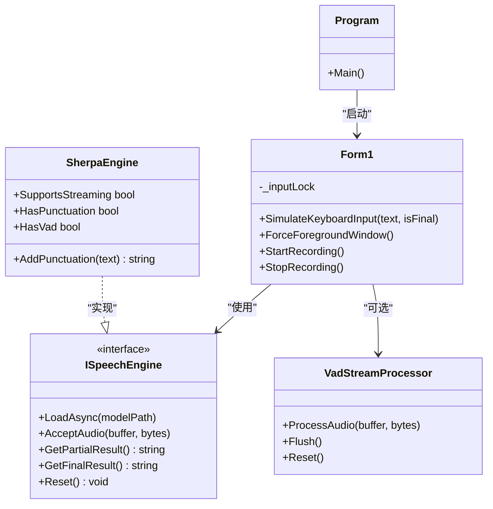

# 剪贴板操作

<cite>
**本文引用的文件**   
- [Program.cs](file://t9s2t/Program.cs)
- [Form1.cs](file://t9s2t/Form1.cs)
- [App.config](file://t9s2t/App.config)
- [ISpeechEngine.cs](file://t9s2t/Engines/ISpeechEngine.cs)
- [SherpaEngine.cs](file://t9s2t/Engines/SherpaEngine.cs)
- [VadStreamProcessor.cs](file://t9s2t/Engines/VadStreamProcessor.cs)
- [EngineDetector.cs](file://t9s2t/Engines/EngineDetector.cs)
</cite>

## 目录
1. [简介](#简介)
2. [项目结构](#项目结构)
3. [核心组件](#核心组件)
4. [架构总览](#架构总览)
5. [详细组件分析](#详细组件分析)
6. [依赖关系分析](#依赖关系分析)
7. [性能考虑](#性能考虑)
8. [故障排查指南](#故障排查指南)
9. [结论](#结论)
10. [附录：使用示例与常见问题](#附录使用示例与常见问题)

## 简介
本技术文档聚焦于“剪贴板操作系统”的文本复制粘贴实现机制，围绕以下目标展开：
- 解释 Clipboard.SetText 的使用方式与流程（本项目中用于将识别结果写入系统剪贴板）
- 说明格式处理逻辑：纯文本保持、特殊字符处理、编码转换策略
- 阐述线程安全考虑：跨线程访问剪贴板的异常处理与重试机制
- 说明与语音识别结果集成的方式：实时文本输出、光标位置定位、输入法兼容性处理
- 提供错误处理策略与性能优化技巧
- 给出实际使用场景的代码示例路径与常见问题解决方案

## 项目结构
该项目为 Windows 桌面应用，采用 WinForms 作为 UI 层，通过键盘钩子监听快捷键触发录音，结合 sherpa-onnx 引擎进行语音识别，最终将识别结果以“剪贴板 + 模拟粘贴”的方式输入到前台窗口。

图表来源
- [Program.cs:15-24](file://t9s2t/Program.cs#L15-L24)
- [Form1.cs:144-235](file://t9s2t/Form1.cs#L144-L235)
- [Form1.cs:1060-1111](file://t9s2t/Form1.cs#L1060-L1111)
- [Form1.cs:992-1051](file://t9s2t/Form1.cs#L992-L1051)
- [Form1.cs:1114-1144](file://t9s2t/Form1.cs#L1114-L1144)
- [ISpeechEngine.cs:8-33](file://t9s2t/Engines/ISpeechEngine.cs#L8-L33)
- [SherpaEngine.cs:57-72](file://t9s2t/Engines/SherpaEngine.cs#L57-L72)
- [VadStreamProcessor.cs:28-33](file://t9s2t/Engines/VadStreamProcessor.cs#L28-L33)

章节来源
- [Program.cs:15-24](file://t9s2t/Program.cs#L15-L24)
- [Form1.cs:144-235](file://t9s2t/Form1.cs#L144-L235)

## 核心组件
- 剪贴板写入与粘贴模拟
  - 使用 Clipboard.SetText 将识别文本写入系统剪贴板
  - 随后通过 SendKeys.SendWait("^v") 模拟 Ctrl+V 完成粘贴
  - 在粘贴后追加一个空格，提升输入体验
- 线程安全锁
  - 使用 _inputLock 保护剪贴板与键盘模拟的关键段，避免并发导致的竞态
- 前台窗口管理
  - ForceForegroundWindow 确保目标窗口处于前台，必要时跨线程 AttachThreadInput
- 输入法兼容性与按键冲突处理
  - 临时释放 Alt 键以避免 Alt+Space 弹出系统菜单
  - 配置 SendKeys 使用 SendInput API，避免 JournalHook 模式死锁
- 降级方案
  - 当剪贴板或粘贴失败时，回退为逐字符模拟输入

章节来源
- [Form1.cs:992-1051](file://t9s2t/Form1.cs#L992-L1051)
- [Form1.cs:1114-1144](file://t9s2t/Form1.cs#L1114-L1144)
- [Form1.cs:1279-1290](file://t9s2t/Form1.cs#L1279-L1290)
- [App.config:4-6](file://t9s2t/App.config#L4-L6)

## 架构总览
下图展示了从音频采集到剪贴板粘贴的完整调用链，以及关键线程交互点。

图表来源
- [Form1.cs:422-460](file://t9s2t/Form1.cs#L422-L460)
- [Form1.cs:1146-1173](file://t9s2t/Form1.cs#L1146-L1173)
- [Form1.cs:1060-1111](file://t9s2t/Form1.cs#L1060-L1111)
- [Form1.cs:992-1051](file://t9s2t/Form1.cs#L992-L1051)
- [Form1.cs:1114-1144](file://t9s2t/Form1.cs#L1114-L1144)
- [ISpeechEngine.cs:22-29](file://t9s2t/Engines/ISpeechEngine.cs#L22-L29)
- [VadStreamProcessor.cs:38-86](file://t9s2t/Engines/VadStreamProcessor.cs#L38-L86)

## 详细组件分析

### 剪贴板写入与粘贴流程
- 前置条件
  - 确保前台窗口可用：ForceForegroundWindow 会尝试将当前前台窗口设为目标窗口，必要时跨线程 AttachThreadInput
  - 处理修饰键冲突：若检测到 Alt 仍按下，先发送一次 Alt 释放，避免后续 Space 被识别为 Alt+Space
- 写入剪贴板
  - 使用 Clipboard.SetText 将文本写入系统剪贴板
  - 增加短暂等待，确保剪贴板内部状态就绪
- 模拟粘贴
  - 使用 SendKeys.SendWait("^v") 执行 Ctrl+V
  - 追加一个空格，改善输入连贯性
- 异常与降级
  - 捕获异常后，回退为逐字符模拟输入（FallbackTypeText），保证最坏情况下的可用性

图表来源
- [Form1.cs:992-1051](file://t9s2t/Form1.cs#L992-L1051)
- [Form1.cs:1114-1144](file://t9s2t/Form1.cs#L1114-L1144)

章节来源
- [Form1.cs:992-1051](file://t9s2t/Form1.cs#L992-L1051)
- [Form1.cs:1114-1144](file://t9s2t/Form1.cs#L1114-L1144)

### 线程安全与跨线程访问
- 锁范围
  - _inputLock 保护录音回调、剪贴板写入与键盘模拟等关键段，避免多线程并发导致的状态不一致
- 跨线程 UI 更新
  - 使用 BeginInvoke 在主线程更新 UI（如托盘图标文本、状态栏）
- 前台窗口切换
  - 跨线程 AttachThreadInput 确保 SetForegroundWindow 成功，避免权限限制导致的前台窗口无法切换

章节来源
- [Form1.cs:1060-1111](file://t9s2t/Form1.cs#L1060-L1111)
- [Form1.cs:1114-1144](file://t9s2t/Form1.cs#L1114-L1144)

### 格式处理与编码策略
- 纯文本保持
  - 使用 Clipboard.SetText 默认写入纯文本格式，避免富文本格式污染目标应用
- 特殊字符处理
  - 直接传递字符串，由 .NET 与系统剪贴板负责编码；对常见中文、标点、数字均能正确传输
- 编码转换
  - 未显式指定编码，依赖系统默认编码；如需严格 UTF-8 行为，可在上层统一预处理（例如规范化换行符、去除不可见字符）

章节来源
- [Form1.cs:1028-1031](file://t9s2t/Form1.cs#L1028-L1031)

### 与语音识别结果集成
- 流式识别（Paraformer 在线）
  - 通过 SherpaEngine.AcceptAudio 持续送入音频
  - 周期性检查 IsEndpoint 与 GetPartialResult，分句出字与实时预览
- 非流式识别（SenseVoice、离线 Paraformer-large）
  - 使用 VadStreamProcessor 基于能量阈值检测静音段落，自动提交识别
  - 录音结束时统一调用 GetFinalResult 得到最终文本
- 实时文本输出
  - partial 结果仅更新托盘图标文本，不模拟到目标窗口，避免闪烁
  - final 结果一次性粘贴，减少视觉抖动

章节来源
- [Form1.cs:1060-1111](file://t9s2t/Form1.cs#L1060-L1111)
- [VadStreamProcessor.cs:38-86](file://t9s2t/Engines/VadStreamProcessor.cs#L38-L86)
- [SherpaEngine.cs:388-415](file://t9s2t/Engines/SherpaEngine.cs#L388-L415)
- [SherpaEngine.cs:417-479](file://t9s2t/Engines/SherpaEngine.cs#L417-L479)

### 光标位置定位与输入法兼容性
- 光标位置
  - 通过 ForceForegroundWindow 将目标窗口置于前台，确保粘贴发生在当前光标位置
- 输入法兼容性
  - 使用 SendKeys 模拟粘贴，兼容大多数应用的 IME 环境
  - 若遇到 IME 拦截或兼容性问题，可考虑改用更底层的输入注入（如 SendInput），但需自行处理组合键与 IME 状态

章节来源
- [Form1.cs:1114-1144](file://t9s2t/Form1.cs#L1114-L1144)
- [App.config:4-6](file://t9s2t/App.config#L4-L6)

### 错误处理与重试机制
- 剪贴板异常
  - 捕获异常后，立即回退为逐字符模拟输入（FallbackTypeText）
- 重试建议
  - 可在外层封装重试循环（有限次数、指数退避），针对剪贴板忙或权限问题提高成功率
- 日志与诊断
  - 记录异常信息，便于定位具体失败环节（剪贴板写入、粘贴、前台窗口切换）

章节来源
- [Form1.cs:1035-1039](file://t9s2t/Form1.cs#L1035-L1039)
- [Form1.cs:1279-1290](file://t9s2t/Form1.cs#L1279-L1290)

## 依赖关系分析
- 组件耦合
  - Form1 依赖 ISpeechEngine 抽象，具体实现为 SherpaEngine
  - VadStreamProcessor 依赖 ISpeechEngine，用于非流式模型的流式化
  - 剪贴板与 SendKeys 属于系统级依赖，受前台窗口与输入法影响
- 外部依赖
  - NAudio.Wave 用于音频采集
  - Newtonsoft.Json 用于远程配置解析
  - Microsoft.Win32 用于注册表自启设置

图表来源
- [Form1.cs:992-1051](file://t9s2t/Form1.cs#L992-L1051)
- [ISpeechEngine.cs:8-33](file://t9s2t/Engines/ISpeechEngine.cs#L8-L33)
- [SherpaEngine.cs:14-46](file://t9s2t/Engines/SherpaEngine.cs#L14-L46)
- [VadStreamProcessor.cs:12-33](file://t9s2t/Engines/VadStreamProcessor.cs#L12-L33)
- [Program.cs:15-24](file://t9s2t/Program.cs#L15-L24)

章节来源
- [ISpeechEngine.cs:8-33](file://t9s2t/Engines/ISpeechEngine.cs#L8-L33)
- [SherpaEngine.cs:14-46](file://t9s2t/Engines/SherpaEngine.cs#L14-L46)
- [VadStreamProcessor.cs:12-33](file://t9s2t/Engines/VadStreamProcessor.cs#L12-L33)
- [Program.cs:15-24](file://t9s2t/Program.cs#L15-L24)

## 性能考虑
- 节流与去重
  - partial 结果更新频率受限，避免频繁 UI 刷新与剪贴板竞争
- 等待时间调优
  - 剪贴板写入后短暂等待，降低因系统剪贴板未就绪导致的粘贴失败
- 资源释放
  - 引擎与音频设备在使用结束后及时 Dispose，避免内存泄漏
- 前台窗口切换开销
  - 仅在需要时跨线程 AttachThreadInput，减少不必要的系统调用

[本节为通用指导，无需特定文件引用]

## 故障排查指南
- 剪贴板写入失败
  - 现象：粘贴无响应或目标窗口未收到内容
  - 排查：确认前台窗口是否正确切换；检查是否有其他进程占用剪贴板；查看异常日志
  - 解决：启用重试机制；必要时回退为逐字符输入
- 输入法兼容问题
  - 现象：部分应用粘贴后出现乱码或丢失字符
  - 排查：确认应用是否拦截了剪贴板或 SendKeys；尝试切换到英文输入法测试
  - 解决：调整等待时间；在极端情况下改用底层输入注入
- 线程阻塞与死锁
  - 现象：界面卡顿或无法响应
  - 排查：检查是否在 UI 线程执行耗时操作；确认 BeginInvoke 使用正确
  - 解决：将耗时任务移至后台线程；避免在锁内执行长时间操作

章节来源
- [Form1.cs:1035-1039](file://t9s2t/Form1.cs#L1035-L1039)
- [Form1.cs:1279-1290](file://t9s2t/Form1.cs#L1279-L1290)
- [App.config:4-6](file://t9s2t/App.config#L4-L6)

## 结论
本项目通过“剪贴板 + 模拟粘贴”的方式实现了高效的语音转文字输入。其优势在于：
- 纯文本写入，兼容性强
- 线程安全锁与前台窗口管理，确保稳定性
- 流式与非流式识别的统一接入，兼顾实时性与准确性
- 完善的降级策略与错误处理，提升鲁棒性

建议在后续迭代中：
- 引入更健壮的重试与超时机制
- 提供更细粒度的编码与格式控制选项
- 扩展输入法兼容性的适配策略

[本节为总结，无需特定文件引用]

## 附录：使用示例与常见问题

### 使用示例（代码片段路径）
- 启动应用与初始化
  - [Program.Main:15-24](file://t9s2t/Program.cs#L15-L24)
- 录音与识别流程
  - [StartRecording:1146-1173](file://t9s2t/Form1.cs#L1146-L1173)
  - [StopRecording:1228-1259](file://t9s2t/Form1.cs#L1228-L1259)
  - [DataAvailable 回调:1060-1111](file://t9s2t/Form1.cs#L1060-L1111)
- 剪贴板写入与粘贴
  - [SimulateKeyboardInput:992-1051](file://t9s2t/Form1.cs#L992-L1051)
- 前台窗口管理
  - [ForceForegroundWindow:1114-1144](file://t9s2t/Form1.cs#L1114-L1144)
- 引擎加载与能力检测
  - [LoadEngine:645-721](file://t9s2t/Form1.cs#L645-L721)
  - [EngineDetector.DetectAndCreate:100-104](file://t9s2t/Engines/EngineDetector.cs#L100-L104)
  - [SherpaEngine.LoadAsync:57-72](file://t9s2t/Engines/SherpaEngine.cs#L57-L72)

### 常见问题与解决方案
- 为什么有时粘贴会失败？
  - 可能原因：剪贴板未就绪、前台窗口切换失败、输入法拦截
  - 解决方案：增加等待时间、启用重试、回退为逐字符输入
- 如何避免 Alt+Space 弹出系统菜单？
  - 已在粘贴前检测并临时释放 Alt 键，避免误触发
- 如何在不同应用中保持一致的粘贴效果？
  - 尽量使用纯文本格式；必要时在应用层做文本规范化（去除多余空白、统一换行）

[本节为概念性指导，无需特定文件引用]