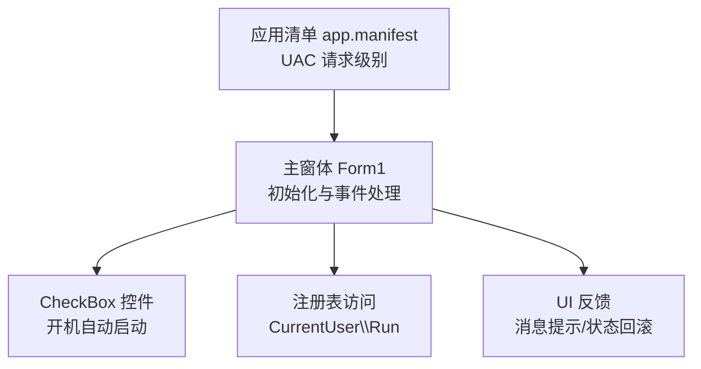
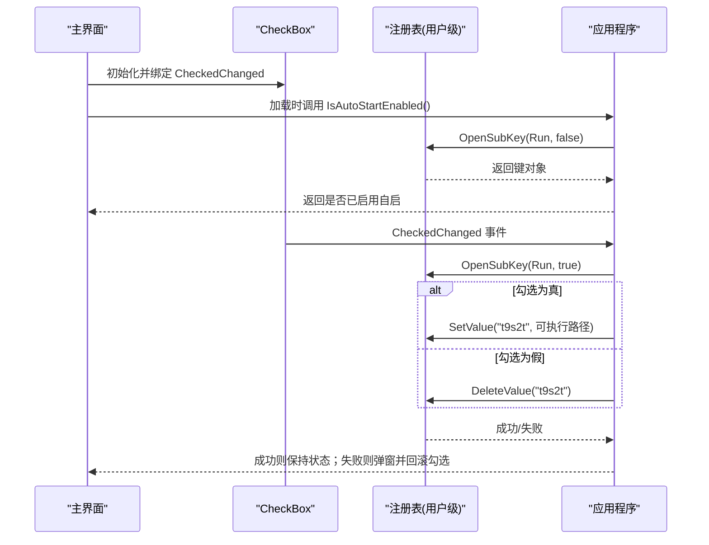
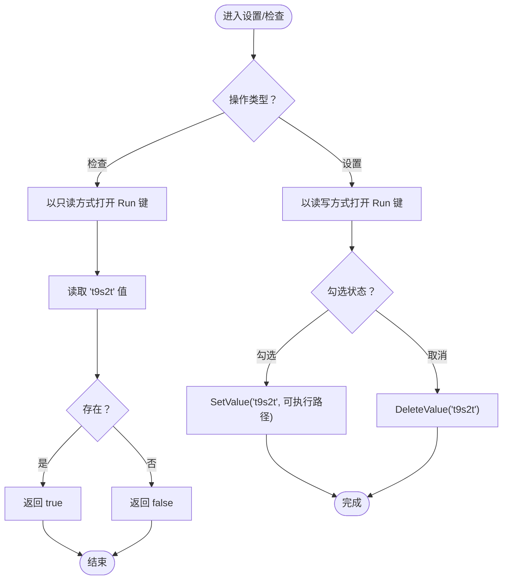
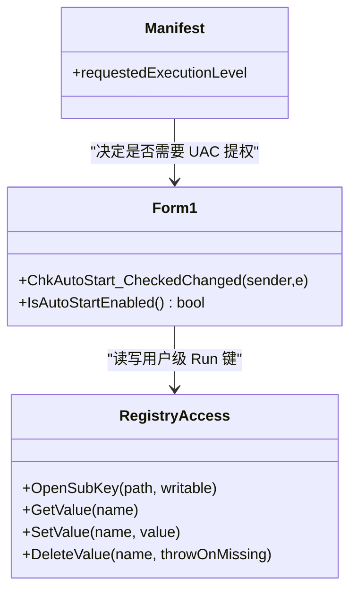
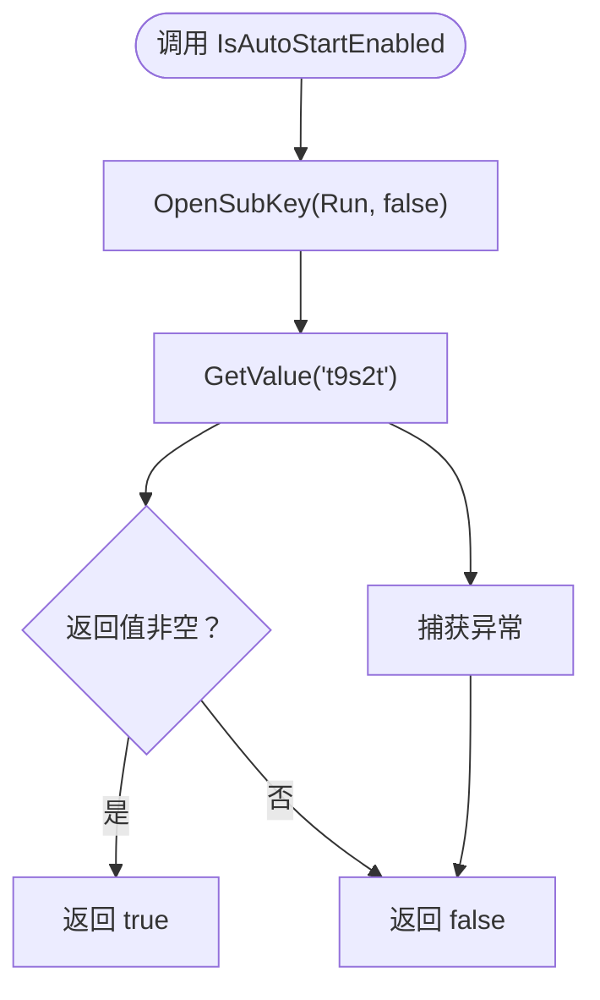
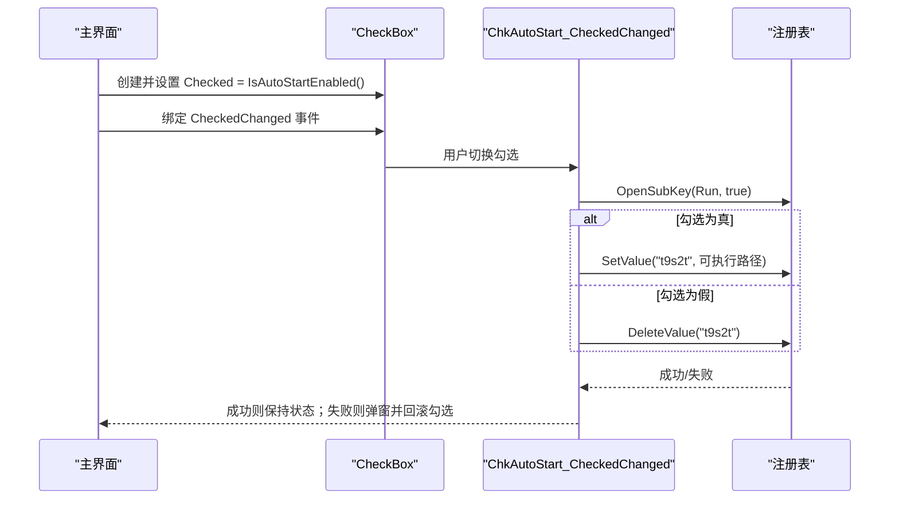
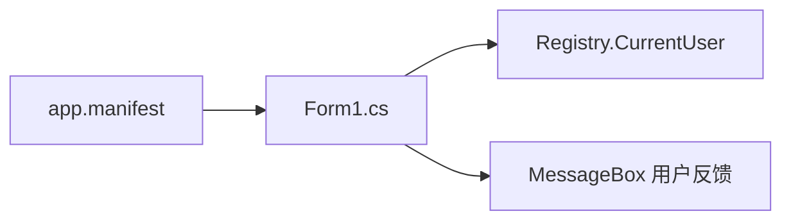

# 开机自启动

<cite>
**本文引用的文件**
- [Form1.cs](file://t9s2t/Form1.cs)
- [app.manifest](file://t9s2t/app.manifest)
</cite>

## 目录
1. [简介](#简介)
2. [项目结构](#项目结构)
3. [核心组件](#核心组件)
4. [架构总览](#架构总览)
5. [详细组件分析](#详细组件分析)
6. [依赖关系分析](#依赖关系分析)
7. [性能与兼容性考虑](#性能与兼容性考虑)
8. [故障排除指南](#故障排除指南)
9. [结论](#结论)

## 简介
本技术文档聚焦于“开机自启动”功能，围绕注册表操作、权限管理、检查逻辑、用户界面集成以及不同 Windows 版本的兼容性与最佳实践展开。该功能通过修改当前用户的 Run 键值实现用户级自启动，并在 UI 中提供复选框进行开关控制。同时，结合应用清单文件中的 UAC 配置，对提权场景与权限不足时的错误处理进行了说明。

## 项目结构
与开机自启动相关的代码集中在主窗体类中，包含：
- 动态创建并绑定 CheckBox 控件
- 注册表读取/写入（Run 键）
- 开机自启状态检测
- 异常捕获与用户反馈

图表来源
- [Form1.cs:171-182](file://t9s2t/Form1.cs#L171-L182)
- [Form1.cs:260-277](file://t9s2t/Form1.cs#L260-L277)
- [app.manifest:6-9](file://t9s2t/app.manifest#L6-L9)

章节来源
- [Form1.cs:171-182](file://t9s2t/Form1.cs#L171-L182)
- [Form1.cs:260-277](file://t9s2t/Form1.cs#L260-L277)
- [app.manifest:6-9](file://t9s2t/app.manifest#L6-L9)

## 核心组件
- 开机自启状态检测：IsAutoStartEnabled
- 开机自启设置/删除：ChkAutoStart_CheckedChanged
- 用户界面集成：动态 CheckBox 的 CheckedChanged 事件与状态回写
- 权限与 UAC：应用清单中请求的执行级别

章节来源
- [Form1.cs:273-277](file://t9s2t/Form1.cs#L273-L277)
- [Form1.cs:260-271](file://t9s2t/Form1.cs#L260-L271)
- [Form1.cs:171-182](file://t9s2t/Form1.cs#L171-L182)
- [app.manifest:6-9](file://t9s2t/app.manifest#L6-L9)

## 架构总览
开机自启动的整体流程如下：
- 程序启动时，动态创建“开机自动启动”复选框，并根据 IsAutoStartEnabled 的结果设置初始勾选状态
- 用户切换复选框时，触发 ChkAutoStart_CheckedChanged，调用 Registry.CurrentUser.OpenSubKey 打开 Run 键，执行 SetValue 或 DeleteValue
- 若发生异常（如权限不足），弹出错误提示并将复选框状态回滚到之前的值

图表来源
- [Form1.cs:171-182](file://t9s2t/Form1.cs#L171-L182)
- [Form1.cs:260-277](file://t9s2t/Form1.cs#L260-L277)

## 详细组件分析

### 注册表操作机制
- 使用 Microsoft.Win32.Registry.CurrentUser 打开用户级 Run 键
- 读取：OpenSubKey(path, false)，判断是否存在名为“t9s2t”的值
- 写入：OpenSubKey(path, true)，根据勾选状态执行 SetValue 或 DeleteValue
- 键路径：Software\Microsoft\Windows\CurrentVersion\Run
- 值名称：t9s2t
- 值数据：Application.ExecutablePath（当前进程可执行文件完整路径）

图表来源
- [Form1.cs:260-277](file://t9s2t/Form1.cs#L260-L277)

章节来源
- [Form1.cs:260-277](file://t9s2t/Form1.cs#L260-L277)

### 权限管理与 UAC 提权
- 用户级自启动：通过 CurrentUser 下的 Run 键，普通用户即可读写，无需管理员权限
- 系统级自启动：需要修改 HKLM 下对应 Run 键，通常需要管理员权限；当前实现未涉及此路径
- 应用清单配置：app.manifest 中请求了 requireAdministrator，这会导致程序启动时触发 UAC 提权提示
- 潜在冲突：如果程序强制要求管理员权限，将影响用户体验且可能不必要；对于仅用户级自启动的场景，建议移除 requireAdministrator 或使用 asInvoker

图表来源
- [Form1.cs:260-277](file://t9s2t/Form1.cs#L260-L277)
- [app.manifest:6-9](file://t9s2t/app.manifest#L6-L9)

章节来源
- [app.manifest:6-9](file://t9s2t/app.manifest#L6-L9)

### 开机自启动的检查逻辑（IsAutoStartEnabled）
- 打开用户级 Run 键（只读）
- 尝试读取名为“t9s2t”的值
- 若值存在则返回 true，否则返回 false
- 任何异常均返回 false，确保健壮性

图表来源
- [Form1.cs:273-277](file://t9s2t/Form1.cs#L273-L277)

章节来源
- [Form1.cs:273-277](file://t9s2t/Form1.cs#L273-L277)

### 用户界面集成（CheckBox 与事件处理）
- 动态创建 CheckBox，文本为“开机自动启动”，位置与字体等样式在初始化时设定
- 初始勾选状态由 IsAutoStartEnabled 决定
- 绑定 CheckedChanged 事件，在事件中执行注册表写入或删除
- 异常处理：弹出错误提示，并将复选框状态回滚到之前值，避免 UI 与实际状态不一致

图表来源
- [Form1.cs:171-182](file://t9s2t/Form1.cs#L171-L182)
- [Form1.cs:260-271](file://t9s2t/Form1.cs#L260-L271)

章节来源
- [Form1.cs:171-182](file://t9s2t/Form1.cs#L171-L182)
- [Form1.cs:260-271](file://t9s2t/Form1.cs#L260-L271)

### 不同 Windows 版本的兼容性
- Windows 10/11：应用清单声明了对这些版本的支持
- 用户级 Run 键在所有现代 Windows 版本上均可用，无需管理员权限
- 若未来需要支持系统级自启动，需考虑在不同版本上的权限模型差异与策略限制

章节来源
- [app.manifest:11-16](file://t9s2t/app.manifest#L11-L16)

## 依赖关系分析
- 主窗体 Form1 负责 UI 与业务逻辑（注册表操作、事件处理）
- 注册表访问通过 Microsoft.Win32.Registry 命名空间完成
- 应用清单 app.manifest 控制运行时权限级别，影响 UAC 行为

图表来源
- [Form1.cs:260-277](file://t9s2t/Form1.cs#L260-L277)
- [app.manifest:6-9](file://t9s2t/app.manifest#L6-L9)

章节来源
- [Form1.cs:260-277](file://t9s2t/Form1.cs#L260-L277)
- [app.manifest:6-9](file://t9s2t/app.manifest#L6-L9)

## 性能与兼容性考虑
- 注册表操作开销较小，但应避免频繁读写；当前实现仅在用户交互时触发，符合预期
- 用户级自启动无需管理员权限，适合大多数桌面应用
- 若应用清单强制 requireAdministrator，会引发不必要的 UAC 提示，影响用户体验；建议改为 asInvoker 或在必要时按需提权

[本节为通用指导，不直接分析具体文件]

## 故障排除指南
- 现象：切换复选框后提示“设置开机自启失败”，且勾选状态被回滚
  - 原因：注册表写入失败（常见为权限不足或键被锁定）
  - 排查步骤：
    - 确认当前用户是否有写入 HKEY_CURRENT_USER\Software\Microsoft\Windows\CurrentVersion\Run 的权限
    - 检查是否有安全软件拦截注册表变更
    - 验证 Application.ExecutablePath 指向的可执行文件路径有效
  - 解决建议：
    - 若仅需用户级自启动，移除 requireAdministrator，避免 UAC 提权
    - 增加更详细的异常信息输出，便于定位问题
    - 在写入前校验目标路径与文件名合法性

章节来源
- [Form1.cs:260-271](file://t9s2t/Form1.cs#L260-L271)
- [app.manifest:6-9](file://t9s2t/app.manifest#L6-L9)

## 结论
该项目的开机自启动功能采用用户级 Run 键方案，具备实现简洁、权限友好、跨版本兼容的优点。UI 层通过动态 CheckBox 与 CheckedChanged 事件实现了直观的用户交互，并在异常情况下提供了回滚与提示，提升了鲁棒性。建议根据实际部署需求调整应用清单中的权限级别，以避免不必要的 UAC 提权，提升用户体验。