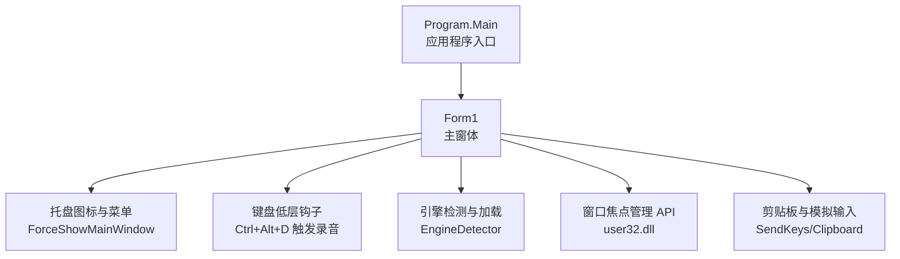
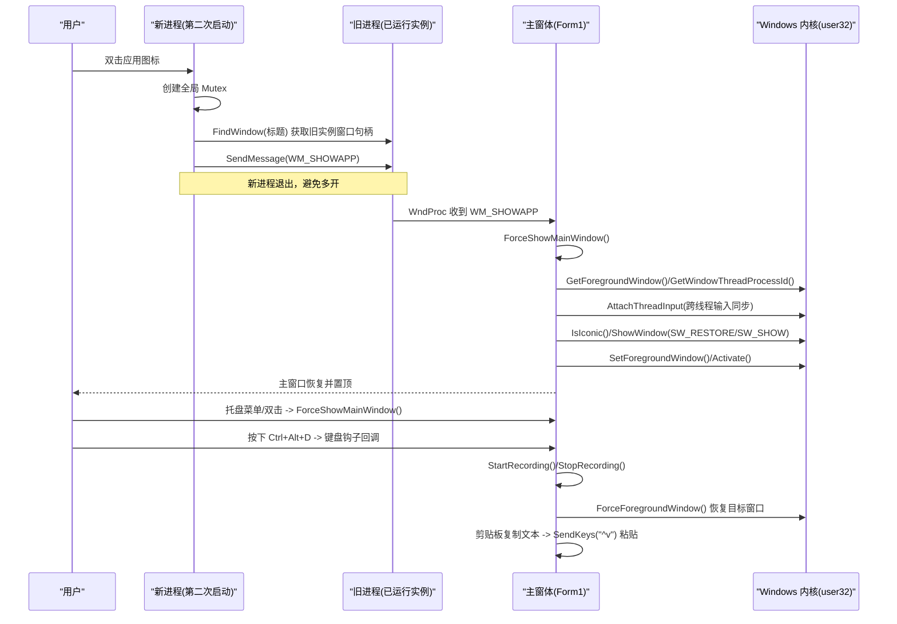
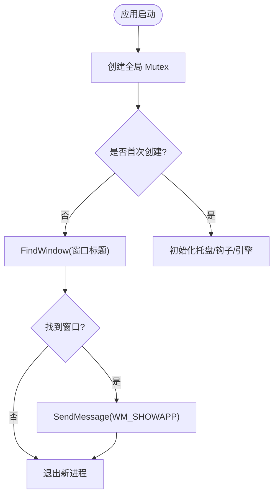
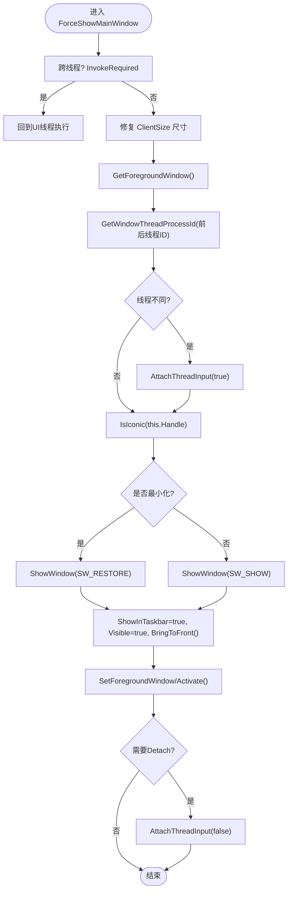
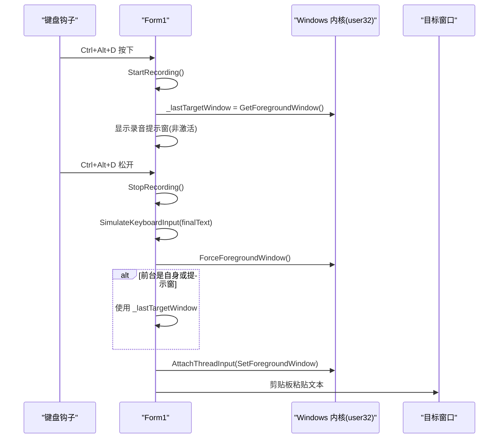
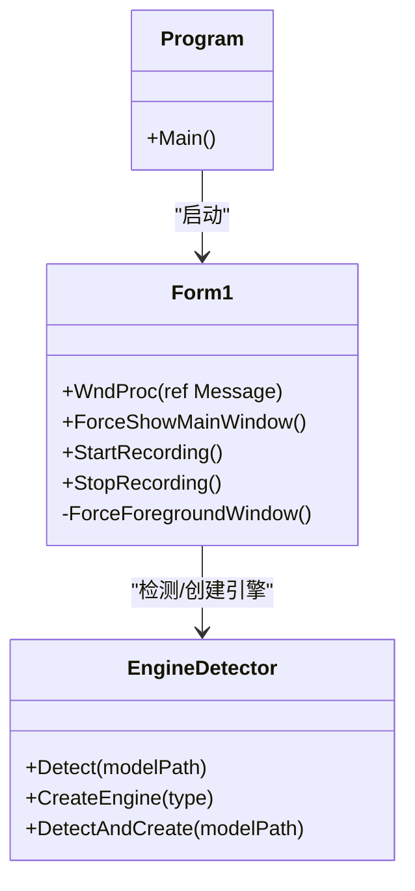

# 窗口焦点管理

<cite>
**本文引用的文件**   
- [Program.cs](file://t9s2t/Program.cs)
- [Form1.cs](file://t9s2t/Form1.cs)
- [Form1.Designer.cs](file://t9s2t/Form1.Designer.cs)
- [EngineDetector.cs](file://t9s2t/Engines/EngineDetector.cs)
</cite>

## 目录
1. [简介](#简介)
2. [项目结构](#项目结构)
3. [核心组件](#核心组件)
4. [架构总览](#架构总览)
5. [详细组件分析](#详细组件分析)
6. [依赖关系分析](#依赖关系分析)
7. [性能与稳定性建议](#性能与稳定性建议)
8. [故障排查指南](#故障排查指南)
9. [结论](#结论)

## 简介
本技术文档聚焦于“窗口焦点管理系统”，围绕以下目标展开：
- 窗口状态监控机制：GetForegroundWindow、IsIconic、SetForegroundWindow 的使用场景与注意事项。
- 焦点变化处理逻辑：AttachThreadInput 的跨线程输入同步，窗口显示状态切换（最小化/隐藏/恢复）。
- ForceShowMainWindow 方法实现细节：窗口尺寸恢复、任务栏显示控制、窗口激活流程。
- 单实例运行检查机制：Mutex 全局互斥量、FindWindow 窗口查找、自定义消息 WM_SHOWAPP 的进程间通信。
- 最佳实践与性能优化建议：在 WinForms + P/Invoke 环境下提升用户体验与系统稳定性。

## 项目结构
本项目为 Windows 桌面应用（WinForms），入口程序初始化 UI 并启动主窗体；主窗体负责：
- 单实例检测与进程间唤醒
- 托盘图标与菜单交互
- 键盘钩子监听快捷键
- 录音与语音识别引擎加载
- 窗口焦点管理与前台/后台切换

图表来源
- [Program.cs:15-24](file://t9s2t/Program.cs#L15-L24)
- [Form1.cs:151-235](file://t9s2t/Form1.cs#L151-L235)
- [EngineDetector.cs:22-104](file://t9s2t/Engines/EngineDetector.cs#L22-L104)

章节来源
- [Program.cs:15-24](file://t9s2t/Program.cs#L15-L24)
- [Form1.Designer.cs:187-216](file://t9s2t/Form1.Designer.cs#L187-L216)

## 核心组件
- 单实例与进程间通信
  - 使用全局 Mutex 确保仅一个实例运行；若检测到已有实例，则通过 FindWindow 定位其窗口句柄，并使用 RegisterWindowMessage 注册的自定义消息 WM_SHOWAPP 通知旧实例显示主界面。
- 窗口焦点与显示状态管理
  - 使用 GetForegroundWindow、IsIconic、ShowWindow、SetForegroundWindow、AttachThreadInput 等 API 完成窗口恢复、显示、激活以及跨线程输入同步。
- 键盘钩子与录音流程
  - 低层键盘钩子拦截 Ctrl+Alt+D，开始/停止录音；录音结束后将结果粘贴到当前前台目标窗口。
- 引擎检测与加载
  - 根据模型目录结构自动识别引擎类型并创建对应实例，支持流式与非流式模式。

章节来源
- [Form1.cs:151-162](file://t9s2t/Form1.cs#L151-L162)
- [Form1.cs:237-241](file://t9s2t/Form1.cs#L237-L241)
- [Form1.cs:243-258](file://t9s2t/Form1.cs#L243-L258)
- [Form1.cs:1114-1144](file://t9s2t/Form1.cs#L1114-L1144)
- [EngineDetector.cs:22-104](file://t9s2t/Engines/EngineDetector.cs#L22-L104)

## 架构总览
下图展示了从用户操作到窗口焦点管理的完整调用链，包括单实例唤醒、托盘菜单、键盘钩子与最终的前台窗口恢复。

图表来源
- [Form1.cs:151-162](file://t9s2t/Form1.cs#L151-L162)
- [Form1.cs:237-241](file://t9s2t/Form1.cs#L237-L241)
- [Form1.cs:243-258](file://t9s2t/Form1.cs#L243-L258)
- [Form1.cs:1114-1144](file://t9s2t/Form1.cs#L1114-L1144)

## 详细组件分析

### 单实例运行检查与进程间通信
- 全局 Mutex
  - 使用命名空间 Global\ 下的唯一名称创建互斥量，确保全系统范围单实例。
- 窗口查找与消息唤醒
  - 当 Mutex 创建失败（表示已有实例）时，通过 FindWindow 按窗口标题查找旧实例的主窗口句柄，然后使用 RegisterWindowMessage 注册的消息 WM_SHOWAPP 发送唤醒信号。
- 消息处理
  - 主窗体重写 WndProc，捕获 WM_SHOWAPP 后调用 ForceShowMainWindow 完成显示与激活。

图表来源
- [Form1.cs:151-162](file://t9s2t/Form1.cs#L151-L162)
- [Form1.cs:237-241](file://t9s2t/Form1.cs#L237-L241)

章节来源
- [Form1.cs:151-162](file://t9s2t/Form1.cs#L151-L162)
- [Form1.cs:237-241](file://t9s2t/Form1.cs#L237-L241)

### 窗口焦点与显示状态管理
- 关键 API 职责
  - GetForegroundWindow：获取当前前台窗口句柄。
  - GetWindowThreadProcessId：获取窗口所属线程 ID，用于判断是否需要跨线程输入同步。
  - AttachThreadInput：临时将前台窗口线程与当前线程输入队列关联，允许强制设置前台窗口。
  - IsIconic：判断窗口是否处于最小化状态。
  - ShowWindow：根据状态选择 SW_RESTORE（恢复）或 SW_SHOW（显示）。
  - SetForegroundWindow/Activate：将窗口设置为前台并激活。
- 典型流程
  - 先保存前台窗口句柄，再执行显示/激活操作，最后恢复前台窗口焦点，避免打断用户工作流。

图表来源
- [Form1.cs:243-258](file://t9s2t/Form1.cs#L243-L258)

章节来源
- [Form1.cs:243-258](file://t9s2t/Form1.cs#L243-L258)

### ForceShowMainWindow 实现细节
- 尺寸恢复
  - 根据广告面板折叠状态计算正确宽度，并在最小化/隐藏后可能出现的 ClientSize 异常情况下进行修正。
- 任务栏显示控制
  - 显式设置 ShowInTaskbar=true、Visible=true，并 BringToFront。
- 窗口激活流程
  - 使用 AttachThreadInput 绕过前台窗口限制，随后调用 SetForegroundWindow 和 Activate 确保窗口真正获得焦点。
- 线程安全
  - 若不在 UI 线程，则通过 Invoke 回退到 UI 线程执行，避免跨线程访问控件引发异常。

章节来源
- [Form1.cs:243-258](file://t9s2t/Form1.cs#L243-L258)

### 焦点变化处理与目标窗口恢复
- 录音前保存目标窗口
  - 在开始录音前记录 GetForegroundWindow 的结果，防止提示窗或自身窗口抢占焦点导致后续无法恢复。
- 录音结束后的恢复策略
  - 若当前前台窗口是自身窗口或录音提示窗，则回退到之前保存的目标窗口句柄，再通过 AttachThreadInput 与 SetForegroundWindow 恢复焦点。
- 防干扰处理
  - 在粘贴文本前检测 Alt 键状态，必要时临时释放以避免 Alt+Space 弹出系统菜单。

图表来源
- [Form1.cs:1146-1173](file://t9s2t/Form1.cs#L1146-L1173)
- [Form1.cs:1114-1144](file://t9s2t/Form1.cs#L1114-L1144)
- [Form1.cs:993-1051](file://t9s2t/Form1.cs#L993-L1051)

章节来源
- [Form1.cs:1146-1173](file://t9s2t/Form1.cs#L1146-L1173)
- [Form1.cs:1114-1144](file://t9s2t/Form1.cs#L1114-L1144)
- [Form1.cs:993-1051](file://t9s2t/Form1.cs#L993-L1051)

### 键盘钩子与录音流程
- 低层键盘钩子
  - 使用 SetWindowsHookEx 安装 WH_KEYBOARD_LL，监听 VK_D 键事件，并结合 GetAsyncKeyState 判断 Ctrl 与 Alt 修饰键组合。
- 录音生命周期
  - StartRecording：重置引擎、启动 WaveInEvent 录音、保存前台窗口句柄、显示非激活提示窗。
  - DataAvailable：根据引擎是否支持流式处理，分别走 SherpaEngine 原生流式或 VAD 模拟流式路径。
  - StopRecording：停止录音设备，获取最终结果并通过剪贴板+SendKeys 粘贴到目标窗口。

章节来源
- [Form1.cs:415-460](file://t9s2t/Form1.cs#L415-L460)
- [Form1.cs:1057-1111](file://t9s2t/Form1.cs#L1057-L1111)
- [Form1.cs:1146-1173](file://t9s2t/Form1.cs#L1146-L1173)
- [Form1.cs:1228-1273](file://t9s2t/Form1.cs#L1228-L1273)

### 引擎检测与加载
- 引擎类型枚举
  - SenseVoice、Paraformer、ParaformerLarge、ParaformerStreaming。
- 检测策略
  - 依据 modelPath 下是否存在特定文件（如 encoder.int8.onnx、decoder.int8.onnx、model.onnx、tokens.txt）及 tokens.txt 行数区分模型类型。
- 创建引擎实例
  - DetectAndCreate 一步到位返回 ISpeechEngine 实例，供后续音频流处理使用。

章节来源
- [EngineDetector.cs:10-17](file://t9s2t/Engines/EngineDetector.cs#L10-L17)
- [EngineDetector.cs:22-104](file://t9s2t/Engines/EngineDetector.cs#L22-L104)

## 依赖关系分析
- 外部库与系统 API
  - user32.dll：窗口与输入相关 API（SetForegroundWindow、ShowWindow、IsIconic、FindWindow、GetForegroundWindow、AttachThreadInput、RegisterWindowMessage、SendMessage）。
  - gdi32.dll：圆角区域绘制（录音提示窗）。
  - NAudio.Wave：WaveInEvent 音频采集。
  - Newtonsoft.Json：JSON 解析（远程模型列表与引擎配置）。
  - System.Windows.Forms：WinForms 框架。
- 内部模块耦合
  - Form1 依赖 EngineDetector 进行引擎类型识别与实例创建。
  - Program 仅负责初始化与启动，不直接参与焦点管理。

图表来源
- [Program.cs:15-24](file://t9s2t/Program.cs#L15-L24)
- [Form1.cs:237-241](file://t9s2t/Form1.cs#L237-L241)
- [EngineDetector.cs:22-104](file://t9s2t/Engines/EngineDetector.cs#L22-L104)

章节来源
- [Program.cs:15-24](file://t9s2t/Program.cs#L15-L24)
- [Form1.cs:237-241](file://t9s2t/Form1.cs#L237-L241)
- [EngineDetector.cs:22-104](file://t9s2t/Engines/EngineDetector.cs#L22-L104)

## 性能与稳定性建议
- 减少不必要的 UI 更新
  - partial 结果仅在托盘 tooltip 展示，避免频繁粘贴导致的闪烁与性能损耗。
- 节流与去重
  - 对 partial 更新增加时间间隔与内容去重，降低 UI 刷新频率。
- 谨慎使用 AttachThreadInput
  - 仅在必要时短暂附加线程输入，完成后立即分离，避免长时间影响系统输入调度。
- 前台窗口恢复策略
  - 优先恢复到用户正在使用的目标窗口，避免误激活自身窗口造成体验中断。
- 错误处理与降级
  - 剪贴板粘贴失败时回退到逐字符输入方案，保证基本可用性。

[本节为通用指导，无需具体文件引用]

## 故障排查指南
- 无法恢复前台窗口
  - 检查 AttachThreadInput 是否正确配对（true/false），确认 GetWindowThreadProcessId 返回值有效。
- 单实例未生效
  - 确认 Mutex 名称唯一且未被占用；检查 FindWindow 是否能匹配到旧实例窗口标题。
- 自定义消息未触发
  - 确认 RegisterWindowMessage 返回值一致，WM_SHOWAPP 常量定义相同；确保旧实例的 WndProc 能接收该消息。
- 录音无输出
  - 检查麦克风设备数量与采样率设置；确认引擎是否成功加载；查看 DataAvailable 回调是否被触发。

章节来源
- [Form1.cs:243-258](file://t9s2t/Form1.cs#L243-L258)
- [Form1.cs:1114-1144](file://t9s2t/Form1.cs#L1114-L1144)
- [Form1.cs:151-162](file://t9s2t/Form1.cs#L151-L162)
- [Form1.cs:1057-1111](file://t9s2t/Form1.cs#L1057-L1111)

## 结论
本系统在 WinForms 环境下实现了稳健的窗口焦点管理与单实例运行机制。通过合理运用 user32.dll 的窗口与输入 API，结合键盘钩子与剪贴板粘贴，提供了流畅的语音输入体验。同时，采用节流、去重与降级策略提升了整体性能与稳定性。建议在后续迭代中继续优化跨线程输入同步的边界条件，并完善错误日志与诊断信息，以进一步提升用户体验与可维护性。