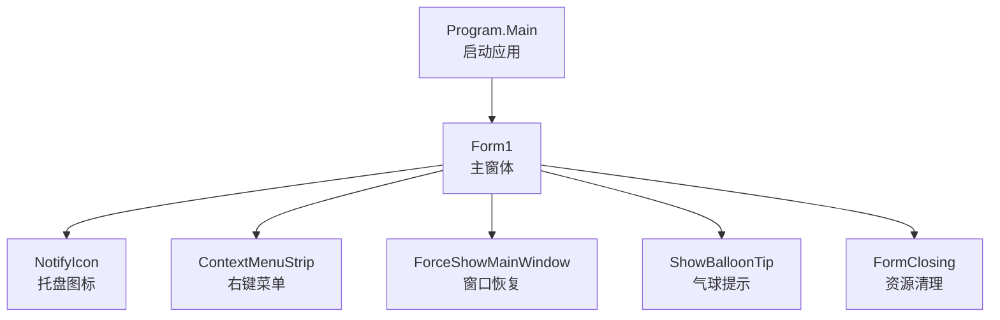
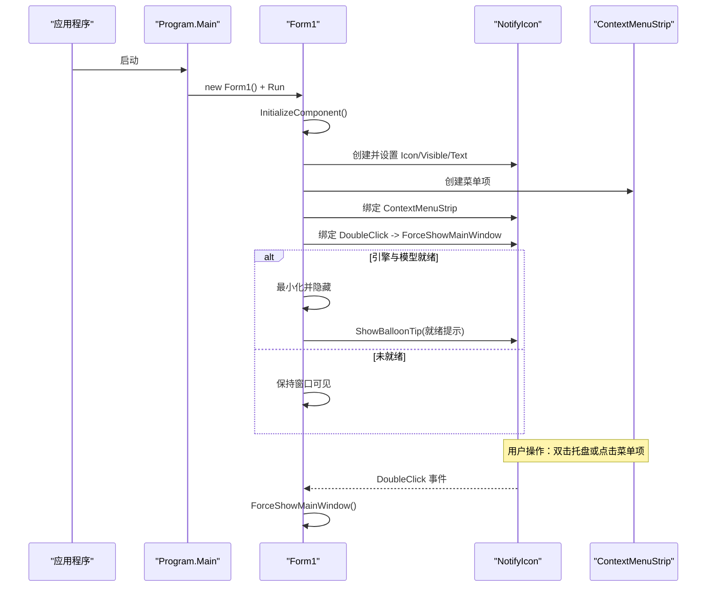
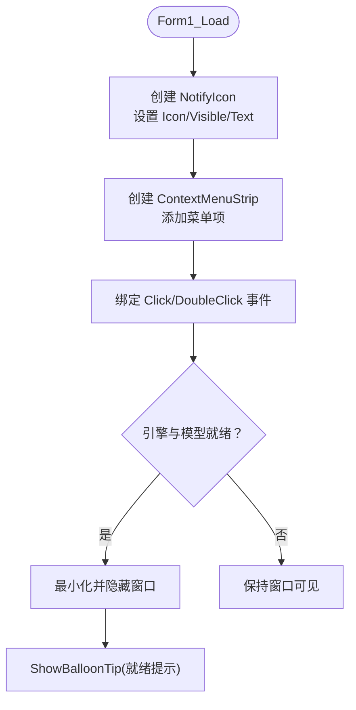
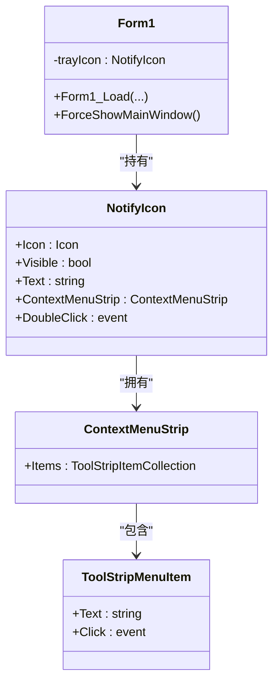
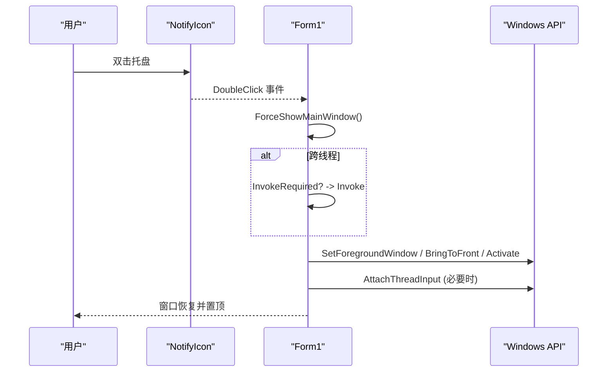
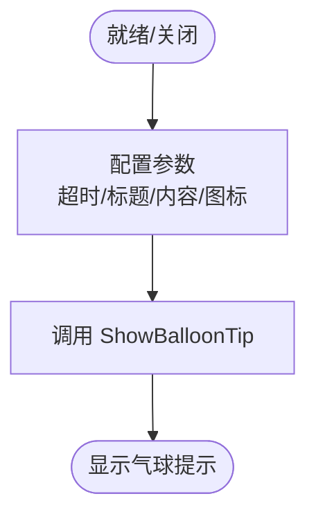
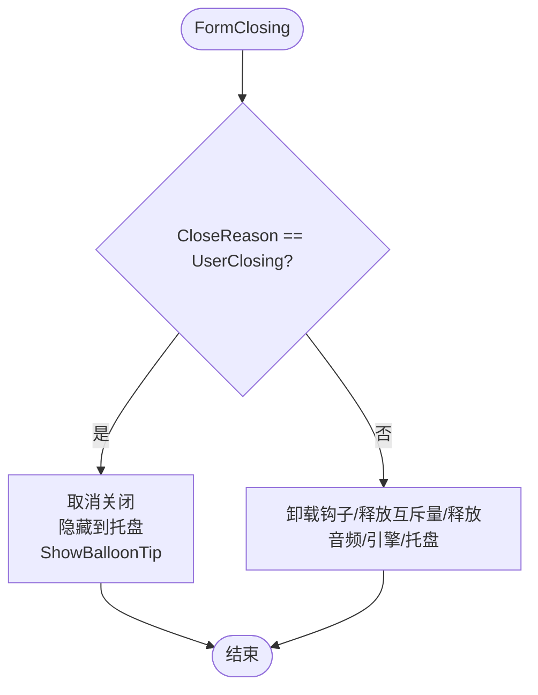
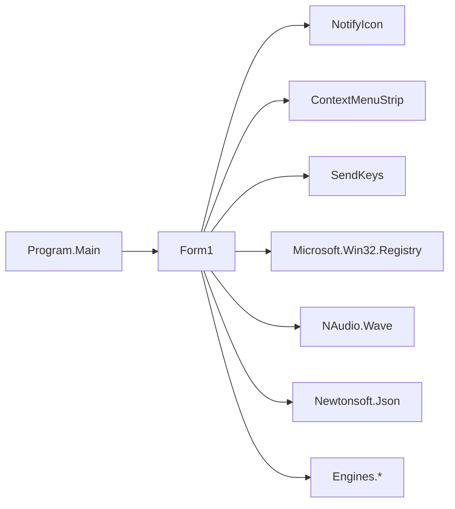

# 系统托盘集成

<cite>
**本文引用的文件**   
- [Program.cs](file://t9s2t/Program.cs)
- [Form1.cs](file://t9s2t/Form1.cs)
- [Form1.Designer.cs](file://t9s2t/Form1.Designer.cs)
- [App.config](file://t9s2t/App.config)
</cite>

## 目录
1. [简介](#简介)
2. [项目结构](#项目结构)
3. [核心组件](#核心组件)
4. [架构总览](#架构总览)
5. [详细组件分析](#详细组件分析)
6. [依赖关系分析](#依赖关系分析)
7. [性能与资源管理](#性能与资源管理)
8. [故障排查指南](#故障排查指南)
9. [结论](#结论)
10. [附录：最佳实践与常见问题](#附录最佳实践与常见问题)

## 简介
本技术文档聚焦于该 Windows Forms 应用的“系统托盘集成”能力，围绕以下主题展开：
- NotifyIcon 组件的使用：图标设置、可见性控制、文本提示显示
- 上下文菜单 ContextMenuStrip 的创建、菜单项添加、事件处理绑定
- 双击事件处理与 ForceShowMainWindow 触发机制、窗口状态恢复逻辑
- 气球提示 ShowBalloonTip 的参数配置、图标类型选择、超时设置
- 程序关闭时的资源清理：托盘图标释放、内存泄漏防护
- 用户体验设计建议与最佳实践
- 完整代码示例路径与常见问题解决方案

## 项目结构
本项目为 C# WinForms 应用，主入口在 Program.Main，主窗体为 Form1。托盘功能由 Form1 在加载时初始化，并在生命周期内维护托盘图标、上下文菜单、双击行为以及气球提示等。

图表来源
- [Program.cs:15-24](file://t9s2t/Program.cs#L15-L24)
- [Form1.cs:144-235](file://t9s2t/Form1.cs#L144-L235)
- [Form1.cs:279-288](file://t9s2t/Form1.cs#L279-L288)

章节来源
- [Program.cs:15-24](file://t9s2t/Program.cs#L15-L24)
- [Form1.Designer.cs:187-216](file://t9s2t/Form1.Designer.cs#L187-L216)

## 核心组件
- 托盘图标（NotifyIcon）
  - 初始化：在 Form1_Load 中创建并设置 Icon、Visible、Text
  - 可见性控制：通过 Visible 属性控制是否显示
  - 文本提示：通过 Text 属性显示当前状态（如引擎名称、录音状态）
- 上下文菜单（ContextMenuStrip）
  - 创建：在 Form1_Load 中实例化
  - 菜单项：包含“显示主界面”和“退出”
  - 事件绑定：点击“显示主界面”调用 ForceShowMainWindow；点击“退出”调用 Application.Exit
  - 双击行为：trayIcon.DoubleClick 同样调用 ForceShowMainWindow
- 窗口恢复（ForceShowMainWindow）
  - 跨线程安全：InvokeRequired 检查并通过 Invoke 执行
  - 尺寸修复：根据广告面板折叠状态修正 ClientSize
  - 前台激活：使用 SetForegroundWindow、BringToFront、Activate 等 API 确保窗口置顶
- 气球提示（ShowBalloonTip）
  - 参数：超时时间（毫秒）、标题、内容、图标类型（Info/Warning/Error/None）
  - 使用场景：就绪提示、最小化到托盘提示
- 资源清理（FormClosing）
  - 取消用户关闭：默认隐藏到托盘而非退出
  - 真正退出：卸载键盘钩子、释放互斥量、释放音频设备、释放引擎、释放托盘图标

章节来源
- [Form1.cs:164-169](file://t9s2t/Form1.cs#L164-L169)
- [Form1.cs:243-258](file://t9s2t/Form1.cs#L243-L258)
- [Form1.cs:202](file://t9s2t/Form1.cs#L202)
- [Form1.cs:279-288](file://t9s2t/Form1.cs#L279-L288)

## 架构总览
下图展示了托盘集成的关键交互流程：应用启动后，主窗体加载时创建托盘图标与菜单，并根据引擎与模型就绪情况决定是否最小化到托盘并弹出气球提示。用户可通过双击托盘或菜单项恢复主窗口。

图表来源
- [Program.cs:15-24](file://t9s2t/Program.cs#L15-L24)
- [Form1.cs:144-235](file://t9s2t/Form1.cs#L144-L235)
- [Form1.cs:243-258](file://t9s2t/Form1.cs#L243-L258)

## 详细组件分析

### 托盘图标（NotifyIcon）
- 初始化位置：Form1_Load
- 图标设置：从窗体 Icon 赋值
- 可见性控制：Visible = true
- 文本提示：Text 初始为“启动中...”，后续随引擎状态更新
- 双击事件：DoubleClick 绑定到 ForceShowMainWindow

图表来源
- [Form1.cs:164-169](file://t9s2t/Form1.cs#L164-L169)
- [Form1.cs:196-214](file://t9s2t/Form1.cs#L196-L214)

章节来源
- [Form1.cs:164-169](file://t9s2t/Form1.cs#L164-L169)
- [Form1.cs:196-214](file://t9s2t/Form1.cs#L196-L214)

### 上下文菜单（ContextMenuStrip）
- 创建与绑定：在 Form1_Load 中创建并赋给 trayIcon.ContextMenuStrip
- 菜单项：
  - “显示主界面”：调用 ForceShowMainWindow
  - “退出”：调用 Application.Exit
- 双击行为：trayIcon.DoubleClick 同样调用 ForceShowMainWindow

图表来源
- [Form1.cs:164-169](file://t9s2t/Form1.cs#L164-L169)

章节来源
- [Form1.cs:164-169](file://t9s2t/Form1.cs#L164-L169)

### 双击事件与窗口恢复（ForceShowMainWindow）
- 触发机制：
  - 托盘图标双击事件
  - 多实例唤醒：WM_SHOWAPP 消息处理
- 窗口恢复逻辑：
  - 跨线程安全：InvokeRequired 检查并使用 Invoke
  - 尺寸修复：根据广告面板折叠状态修正 ClientSize
  - 前台激活：SetForegroundWindow、BringToFront、Activate
  - 线程输入附加：AttachThreadInput 提升激活成功率

图表来源
- [Form1.cs:237-241](file://t9s2t/Form1.cs#L237-L241)
- [Form1.cs:243-258](file://t9s2t/Form1.cs#L243-L258)

章节来源
- [Form1.cs:237-241](file://t9s2t/Form1.cs#L237-L241)
- [Form1.cs:243-258](file://t9s2t/Form1.cs#L243-L258)

### 气球提示（ShowBalloonTip）
- 参数说明：
  - 超时（毫秒）：例如 3000 表示 3 秒
  - 标题：字符串
  - 内容：字符串
  - 图标类型：ToolTipIcon.Info/Warning/Error/None
- 使用场景：
  - 引擎与模型就绪后弹出“已就绪”提示
  - 用户关闭按钮时弹出“已最小化到托盘”提示

图表来源
- [Form1.cs:202](file://t9s2t/Form1.cs#L202)
- [Form1.cs:279-288](file://t9s2t/Form1.cs#L279-L288)

章节来源
- [Form1.cs:202](file://t9s2t/Form1.cs#L202)
- [Form1.cs:279-288](file://t9s2t/Form1.cs#L279-L288)

### 程序关闭与资源清理（FormClosing）
- 用户关闭行为：
  - 默认取消关闭，改为隐藏到托盘并显示气球提示
- 真正退出路径：
  - 卸载键盘钩子：UnhookWindowsHookEx
  - 释放互斥量：_mutex.ReleaseMutex()
  - 释放音频设备：waveIn.Dispose()
  - 释放引擎：engine.Dispose()
  - 释放托盘图标：trayIcon.Dispose()

图表来源
- [Form1.cs:279-288](file://t9s2t/Form1.cs#L279-L288)

章节来源
- [Form1.cs:279-288](file://t9s2t/Form1.cs#L279-L288)

## 依赖关系分析
- 外部依赖：
  - System.Windows.Forms：NotifyIcon、ContextMenuStrip、Form、SendKeys 等
  - System.Drawing：Icon、Image 等资源
  - Microsoft.Win32：注册表访问（开机自启）
  - NAudio.Wave：音频采集
  - Newtonsoft.Json：JSON 解析
- 内部依赖：
  - Engines 命名空间：语音引擎接口与实现
  - 自定义类：ModelInfo、EngineDllInfo、NonActivatingForm

图表来源
- [Program.cs:15-24](file://t9s2t/Program.cs#L15-L24)
- [Form1.cs:1-20](file://t9s2t/Form1.cs#L1-20)

章节来源
- [Program.cs:15-24](file://t9s2t/Program.cs#L15-L24)
- [Form1.cs:1-20](file://t9s2t/Form1.cs#L1-20)

## 性能与资源管理
- 托盘图标文本更新：
  - 使用 BeginInvoke 异步更新 UI，避免阻塞识别线程
- 资源释放：
  - 在 FormClosing 中统一释放所有非托管资源，防止内存泄漏
- 前台激活：
  - 使用 AttachThreadInput 提高 SetForegroundWindow 的成功率，减少卡顿
- 节流与去重：
  - partial 结果更新采用节流与去重策略，降低 UI 刷新频率

章节来源
- [Form1.cs:1001-1008](file://t9s2t/Form1.cs#L1001-L1008)
- [Form1.cs:1043-1050](file://t9s2t/Form1.cs#L1043-L1050)
- [Form1.cs:279-288](file://t9s2t/Form1.cs#L279-L288)

## 故障排查指南
- 托盘图标不显示：
  - 检查 Visible 是否为 true
  - 确认 Icon 是否正确赋值
- 双击托盘无响应：
  - 确认 DoubleClick 事件是否绑定
  - 检查 ForceShowMainWindow 是否被正确调用
- 窗口无法置顶：
  - 检查 AttachThreadInput 是否成功
  - 确认目标窗口句柄有效
- 气球提示不出现：
  - 检查超时时间是否合理
  - 确认 ShowBalloonTip 调用时机是否在 UI 线程
- 资源泄漏：
  - 确认 FormClosing 中是否释放了 waveIn、engine、trayIcon 等

章节来源
- [Form1.cs:164-169](file://t9s2t/Form1.cs#L164-L169)
- [Form1.cs:243-258](file://t9s2t/Form1.cs#L243-L258)
- [Form1.cs:279-288](file://t9s2t/Form1.cs#L279-L288)

## 结论
该项目实现了完整的系统托盘集成方案，涵盖托盘图标、上下文菜单、双击恢复窗口、气球提示以及资源清理等关键环节。整体设计清晰、职责明确，具备良好的可维护性与扩展性。

## 附录：最佳实践与常见问题

### 最佳实践
- 托盘图标文本应简洁明了，反映当前状态（如引擎名、录音中）
- 上下文菜单项应直观且符合用户习惯（“显示主界面”、“退出”）
- 双击托盘应能可靠地恢复窗口，必要时进行跨线程安全处理
- 气球提示用于轻量反馈，避免频繁弹出造成干扰
- 程序关闭时应默认隐藏到托盘，提供真正的退出入口

### 常见问题与解决
- 问题：托盘图标文本长时间不更新
  - 解决：确保在 UI 线程更新 Text，使用 BeginInvoke
- 问题：双击托盘无效
  - 解决：确认 DoubleClick 事件绑定与 ForceShowMainWindow 实现
- 问题：关闭窗口直接退出
  - 解决：在 FormClosing 中判断 CloseReason，用户关闭时隐藏到托盘
- 问题：内存泄漏
  - 解决：在 FormClosing 中释放所有非托管资源（waveIn、engine、trayIcon）

章节来源
- [Form1.cs:164-169](file://t9s2t/Form1.cs#L164-L169)
- [Form1.cs:243-258](file://t9s2t/Form1.cs#L243-L258)
- [Form1.cs:279-288](file://t9s2t/Form1.cs#L279-L288)