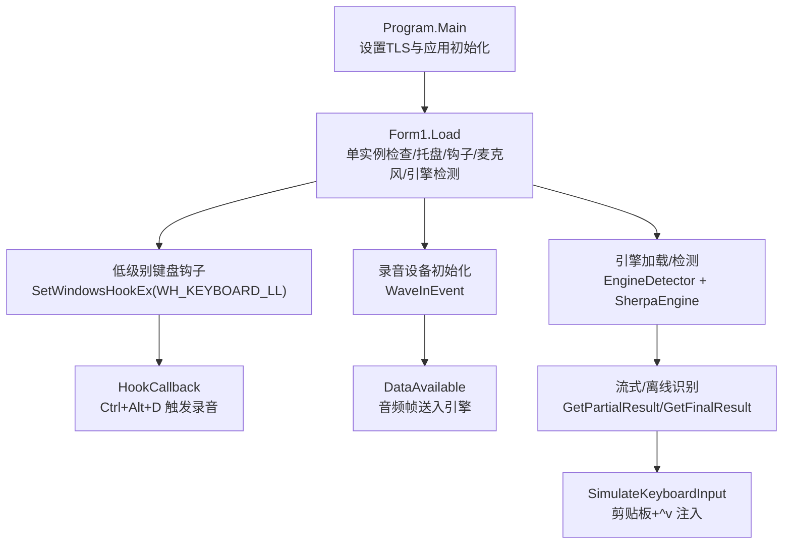
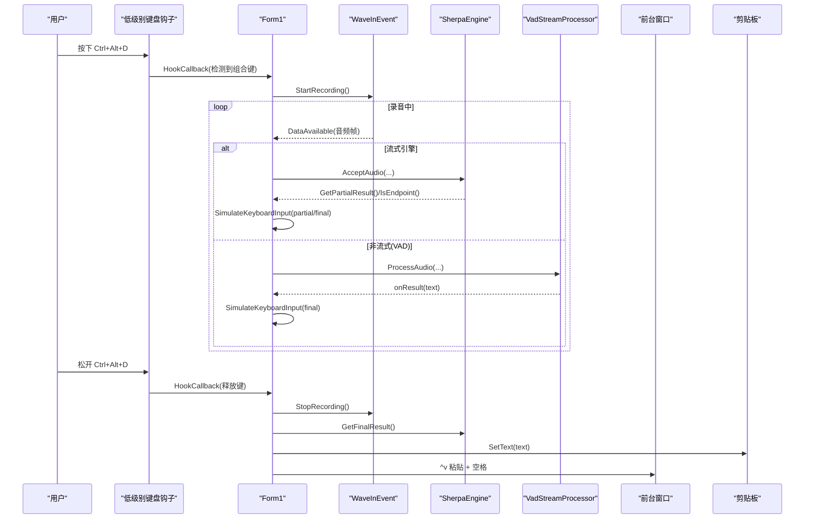
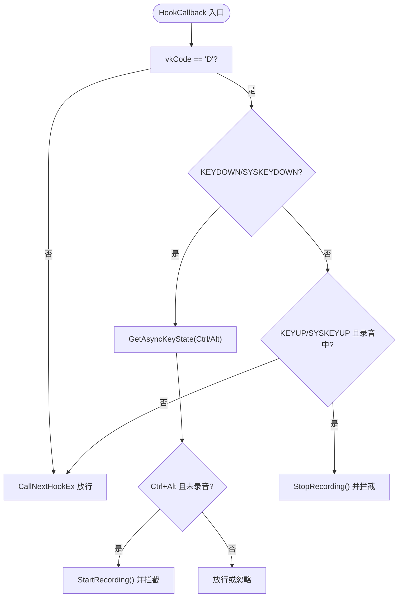
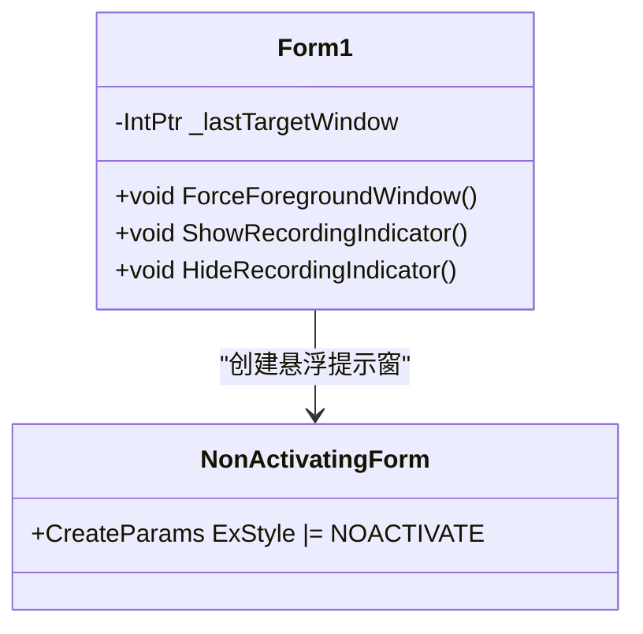
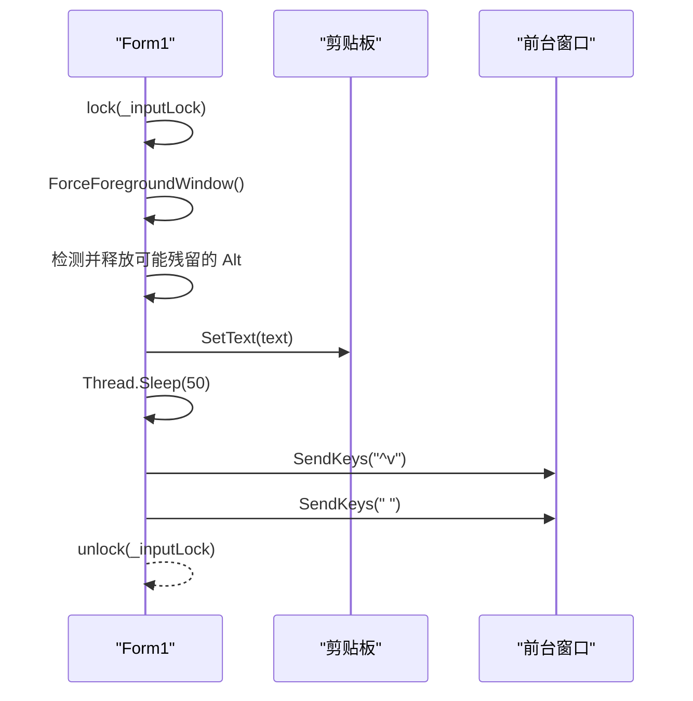
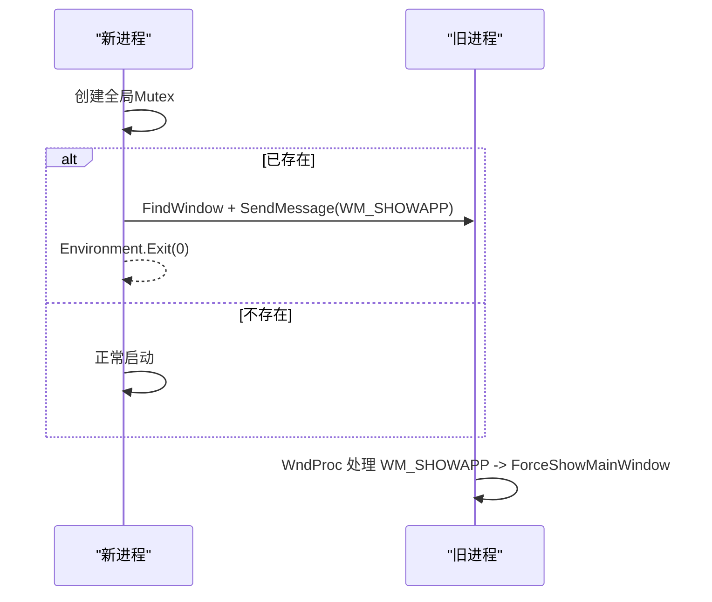
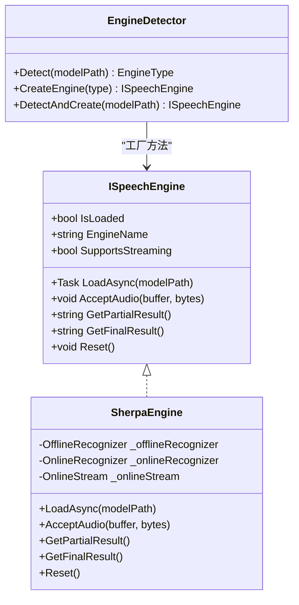
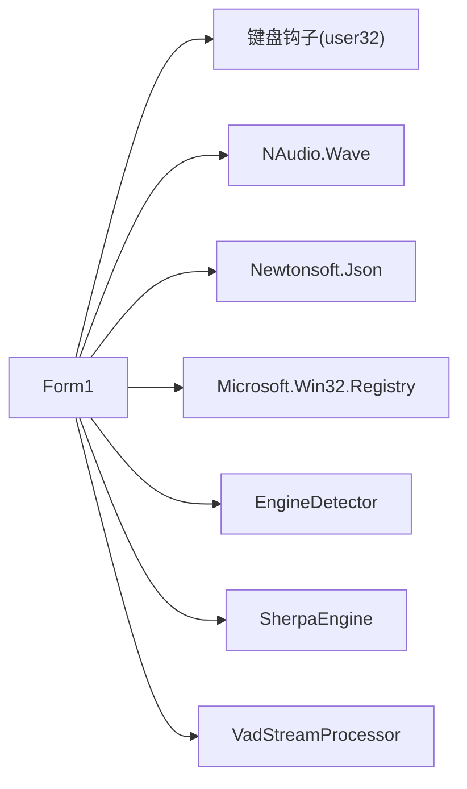

# 系统集成特性

<cite>
**本文引用的文件**   
- [Program.cs](file://t9s2t/Program.cs)
- [Form1.cs](file://t9s2t/Form1.cs)
- [Form1.Designer.cs](file://t9s2t/Form1.Designer.cs)
- [App.config](file://t9s2t/App.config)
- [app.manifest](file://t9s2t/app.manifest)
- [EngineDetector.cs](file://t9s2t/Engines/EngineDetector.cs)
- [ISpeechEngine.cs](file://t9s2t/Engines/ISpeechEngine.cs)
- [SherpaEngine.cs](file://t9s2t/Engines/SherpaEngine.cs)
- [VadStreamProcessor.cs](file://t9s2t/Engines/VadStreamProcessor.cs)
</cite>

## 目录
1. [简介](#简介)
2. [项目结构](#项目结构)
3. [核心组件](#核心组件)
4. [架构总览](#架构总览)
5. [详细组件分析](#详细组件分析)
6. [依赖关系分析](#依赖关系分析)
7. [性能与稳定性](#性能与稳定性)
8. [故障排查指南](#故障排查指南)
9. [结论](#结论)
10. [附录：API 使用示例与最佳实践](#附录api-使用示例与最佳实践)

## 简介
本技术文档聚焦于该语音转文本项目的系统集成特性，围绕以下主题展开：
- 全局键盘钩子实现原理（低级别键盘事件拦截、快捷键注册、事件分发）
- 窗口焦点管理系统（窗口状态监控、焦点变化处理、优先级控制）
- 剪贴板操作与输入模拟（文本复制粘贴、格式处理、线程安全）
- 开机自启动功能（注册表操作、权限管理）
- 进程间通信机制（单实例运行检查、进程同步）
- 系统权限管理与 UAC 提权处理
- 系统集成扩展开发指南与最佳实践
- API 使用示例与常见问题解决方案

## 项目结构
该项目为 Windows Forms 应用，主入口在 Program.cs，UI 逻辑集中在 Form1.cs，引擎抽象与实现位于 Engines 目录。关键集成点包括：
- 低级别键盘钩子与快捷键组合 Ctrl+Alt+D
- 托盘图标与后台运行
- 模型与运行时 DLL 的远程下载与本地缓存
- 录音与流式/离线识别
- 结果通过剪贴板 + 模拟按键注入到前台应用

图表来源
- [Program.cs:15-24](file://t9s2t/Program.cs#L15-L24)
- [Form1.cs:151-235](file://t9s2t/Form1.cs#L151-L235)
- [Form1.cs:415-460](file://t9s2t/Form1.cs#L415-L460)
- [Form1.cs:1057-1111](file://t9s2t/Form1.cs#L1057-L1111)
- [Form1.cs:993-1051](file://t9s2t/Form1.cs#L993-L1051)
- [EngineDetector.cs:27-75](file://t9s2t/Engines/EngineDetector.cs#L27-L75)
- [SherpaEngine.cs:57-72](file://t9s2t/Engines/SherpaEngine.cs#L57-L72)

章节来源
- [Program.cs:15-24](file://t9s2t/Program.cs#L15-L24)
- [Form1.cs:151-235](file://t9s2t/Form1.cs#L151-L235)
- [Form1.Designer.cs:29-218](file://t9s2t/Form1.Designer.cs#L29-L218)

## 核心组件
- 全局键盘钩子系统：基于 user32.dll 的低级别键盘钩子，拦截 Ctrl+Alt+D 组合键，控制录音生命周期。
- 窗口焦点管理：通过 FindWindow/SetForegroundWindow/AttachThreadInput 等 API 确保结果注入目标窗口不被干扰。
- 剪贴板与输入模拟：Clipboard.SetText + SendKeys.SendWait("^v") 将识别结果粘贴至前台应用，辅以 fallback 逐字输入。
- 开机自启动：写入 HKCU\Software\Microsoft\Windows\CurrentVersion\Run 注册表项。
- 进程间通信与单实例：全局 Mutex + 自定义窗口消息 WM_SHOWAPP 唤醒已有实例并退出新实例。
- 引擎抽象与实现：ISpeechEngine 接口统一不同引擎；SherpaEngine 封装 sherpa-onnx 的在线/离线模式；EngineDetector 自动识别模型类型。

章节来源
- [Form1.cs:82-127](file://t9s2t/Form1.cs#L82-L127)
- [Form1.cs:415-460](file://t9s2t/Form1.cs#L415-L460)
- [Form1.cs:993-1051](file://t9s2t/Form1.cs#L993-L1051)
- [Form1.cs:260-277](file://t9s2t/Form1.cs#L260-L277)
- [Form1.cs:151-162](file://t9s2t/Form1.cs#L151-L162)
- [ISpeechEngine.cs:8-33](file://t9s2t/Engines/ISpeechEngine.cs#L8-L33)
- [SherpaEngine.cs:14-72](file://t9s2t/Engines/SherpaEngine.cs#L14-L72)
- [EngineDetector.cs:22-104](file://t9s2t/Engines/EngineDetector.cs#L22-L104)

## 架构总览
下图展示从键盘事件到最终文本注入的整体流程，以及各子系统之间的交互关系。

图表来源
- [Form1.cs:415-460](file://t9s2t/Form1.cs#L415-L460)
- [Form1.cs:1057-1111](file://t9s2t/Form1.cs#L1057-L1111)
- [Form1.cs:1228-1273](file://t9s2t/Form1.cs#L1228-L1273)
- [Form1.cs:993-1051](file://t9s2t/Form1.cs#L993-L1051)
- [VadStreamProcessor.cs:38-136](file://t9s2t/Engines/VadStreamProcessor.cs#L38-L136)
- [SherpaEngine.cs:351-479](file://t9s2t/Engines/SherpaEngine.cs#L351-L479)

## 详细组件分析

### 全局键盘钩子与快捷键分发
- 低级别键盘钩子通过 SetWindowsHookEx(WH_KEYBOARD_LL, ...) 安装回调 HookCallback。
- 在回调中判断 vkCode == 'D'，并结合 GetAsyncKeyState 检测 Ctrl 和 Alt 是否同时按下。
- 按下时进入录音流程并拦截按键（返回 1），防止字符输入；松开时停止录音并继续传递事件。
- 支持 Alt 按住时的 WM_SYSKEYDOWN/WM_SYSKEYUP 分支，保证组合键行为一致。

图表来源
- [Form1.cs:415-460](file://t9s2t/Form1.cs#L415-L460)

章节来源
- [Form1.cs:82-127](file://t9s2t/Form1.cs#L82-L127)
- [Form1.cs:415-460](file://t9s2t/Form1.cs#L415-L460)

### 窗口焦点管理与优先级控制
- 强制前台窗口：ForceForegroundWindow 使用 AttachThreadInput 提升跨线程设置前台窗口的成功率，避免被系统限制。
- 录音提示浮窗：NonActivatingForm 使用 WS_EX_NOACTIVATE 阻止抢夺焦点，确保输入目标不受影响。
- 焦点恢复策略：记录 _lastTargetWindow，当当前前台窗口是自身或提示窗时回退到上次目标窗口。

图表来源
- [Form1.cs:1114-1144](file://t9s2t/Form1.cs#L1114-L1144)
- [Form1.cs:1177-1223](file://t9s2t/Form1.cs#L1177-L1223)
- [Form1.cs:1298-1309](file://t9s2t/Form1.cs#L1298-L1309)

章节来源
- [Form1.cs:1114-1144](file://t9s2t/Form1.cs#L1114-L1144)
- [Form1.cs:1177-1223](file://t9s2t/Form1.cs#L1177-L1223)
- [Form1.cs:1298-1309](file://t9s2t/Form1.cs#L1298-L1309)

### 剪贴板操作与输入模拟
- 最终结果粘贴：Clipboard.SetText(text)，短暂等待后发送 ^v 粘贴，并在末尾追加空格。
- 防冲突处理：若检测到 Alt 仍按下，先发送一次 Alt 释放，避免弹出系统菜单。
- 线程安全：使用 lock(_inputLock) 保护剪贴板与输入序列，避免并发导致乱序。
- 降级方案：FallbackTypeText 逐字符 SendKeys 输入，作为兜底。

图表来源
- [Form1.cs:993-1051](file://t9s2t/Form1.cs#L993-L1051)
- [Form1.cs:1279-1290](file://t9s2t/Form1.cs#L1279-L1290)

章节来源
- [Form1.cs:993-1051](file://t9s2t/Form1.cs#L993-L1051)
- [Form1.cs:1279-1290](file://t9s2t/Form1.cs#L1279-L1290)

### 开机自启动功能
- 通过 Registry.CurrentUser 下的 Run 键值写入/删除程序路径，实现用户级开机自启。
- UI 提供复选框动态切换，异常时回滚勾选状态并提示错误。

章节来源
- [Form1.cs:260-277](file://t9s2t/Form1.cs#L260-L277)

### 进程间通信与单实例运行
- 使用全局 Mutex("Global\\t9s2t_single_instance_mutex_v3") 检测是否已有实例。
- 若存在旧实例，FindWindow 查找其主窗口句柄并通过 RegisterWindowMessage 自定义消息 WM_SHOWAPP 通知旧实例显示主界面，随后退出新实例。
- 旧实例 WndProc 接收消息后调用 ForceShowMainWindow 激活窗口。

图表来源
- [Form1.cs:151-162](file://t9s2t/Form1.cs#L151-L162)
- [Form1.cs:237-241](file://t9s2t/Form1.cs#L237-L241)
- [Form1.cs:243-258](file://t9s2t/Form1.cs#L243-L258)

章节来源
- [Form1.cs:151-162](file://t9s2t/Form1.cs#L151-L162)
- [Form1.cs:237-241](file://t9s2t/Form1.cs#L237-L241)
- [Form1.cs:243-258](file://t9s2t/Form1.cs#L243-L258)

### 系统权限管理与 UAC 提权
- app.manifest 声明 requireAdministrator，使程序默认以管理员权限运行。
- 注意：管理员权限会影响某些桌面交互（如剪贴板访问、前台窗口设置），需结合具体场景评估。

章节来源
- [app.manifest:6-9](file://t9s2t/app.manifest#L6-L9)

### 引擎抽象与实现（集成视角）
- ISpeechEngine 定义统一的加载、音频输入、部分/最终结果获取与重置接口。
- SherpaEngine 根据模型类型选择 Online/Offline 识别路径，支持标点恢复与 VAD 模型加载。
- EngineDetector 通过模型目录结构与 tokens.txt 行数区分 SenseVoice、Paraformer-large、流式 Paraformer 等。

图表来源
- [ISpeechEngine.cs:8-33](file://t9s2t/Engines/ISpeechEngine.cs#L8-L33)
- [SherpaEngine.cs:14-72](file://t9s2t/Engines/SherpaEngine.cs#L14-L72)
- [EngineDetector.cs:22-104](file://t9s2t/Engines/EngineDetector.cs#L22-L104)

章节来源
- [ISpeechEngine.cs:8-33](file://t9s2t/Engines/ISpeechEngine.cs#L8-L33)
- [SherpaEngine.cs:57-72](file://t9s2t/Engines/SherpaEngine.cs#L57-L72)
- [EngineDetector.cs:27-75](file://t9s2t/Engines/EngineDetector.cs#L27-L75)

### VAD 流式处理器（非流式模型的“伪流式”）
- VadStreamProcessor 对非流式引擎进行分段：累积音频段，静音达到阈值后提交识别，并回调结果。
- 适合 SenseVoice 等非流式模型，提供近似实时体验。

章节来源
- [VadStreamProcessor.cs:12-136](file://t9s2t/Engines/VadStreamProcessor.cs#L12-L136)

## 依赖关系分析
- 外部库与平台 API：
  - NAudio.Wave：录音数据捕获
  - Newtonsoft.Json：解析远程配置与模型列表
  - Microsoft.Win32.Registry：开机自启动注册表操作
  - user32/kernel32：键盘钩子、窗口与进程 API
- 内部模块耦合：
  - Form1 依赖 EngineDetector 与 SherpaEngine 完成模型检测与识别
  - VadStreamProcessor 依赖 ISpeechEngine 接口，解耦具体引擎实现

图表来源
- [Form1.cs:1-17](file://t9s2t/Form1.cs#L1-L17)
- [Form1.cs:151-235](file://t9s2t/Form1.cs#L151-L235)
- [EngineDetector.cs:22-104](file://t9s2t/Engines/EngineDetector.cs#L22-L104)
- [SherpaEngine.cs:14-72](file://t9s2t/Engines/SherpaEngine.cs#L14-L72)
- [VadStreamProcessor.cs:12-33](file://t9s2t/Engines/VadStreamProcessor.cs#L12-L33)

章节来源
- [Form1.cs:1-17](file://t9s2t/Form1.cs#L1-L17)
- [EngineDetector.cs:22-104](file://t9s2t/Engines/EngineDetector.cs#L22-L104)
- [SherpaEngine.cs:14-72](file://t9s2t/Engines/SherpaEngine.cs#L14-L72)
- [VadStreamProcessor.cs:12-33](file://t9s2t/Engines/VadStreamProcessor.cs#L12-L33)

## 性能与稳定性
- TLS 协议设置：在 Main 中启用 TLS1.2/1.1/TLS，确保网络请求兼容。
- 节流与去重：partial 更新最小间隔 200ms，避免频繁 UI 刷新与输入抖动。
- 锁粒度：_inputLock 覆盖录音、引擎与输入模拟，避免竞态条件。
- 前台窗口设置：AttachThreadInput 提升跨线程设置前台窗口的成功率，减少失败重试。
- 剪贴板延迟：SetText 后 Sleep(50) 降低因剪贴板未就绪导致的粘贴失败概率。

章节来源
- [Program.cs:18-19](file://t9s2t/Program.cs#L18-L19)
- [Form1.cs:988-991](file://t9s2t/Form1.cs#L988-L991)
- [Form1.cs:1012-1040](file://t9s2t/Form1.cs#L1012-L1040)
- [Form1.cs:1129-1138](file://t9s2t/Form1.cs#L1129-L1138)

## 故障排查指南
- 无法设置前台窗口：
  - 检查是否跨线程调用，必要时使用 AttachThreadInput 绑定线程。
  - 确认目标窗口句柄有效，避免自身窗口或提示窗抢占。
- 粘贴失败或乱码：
  - 确认剪贴板可用，适当增加等待时间。
  - 检查 App.config 中 SendKeys 设置为 SendInput，避免 JournalHook 死锁。
- 键盘钩子不生效：
  - 确认 WH_KEYBOARD_LL 安装成功，回调返回值正确拦截。
  - 检查修饰键状态读取是否正确（GetAsyncKeyState）。
- 单实例无效：
  - 检查全局 Mutex 名称是否唯一，WM_SHOWAPP 消息是否被旧实例处理。
- 开机自启失败：
  - 检查 HKCU 下 Run 键值写入权限与异常捕获。
- UAC 提权问题：
  - manifest 要求管理员权限可能导致剪贴板/前台窗口受限，建议按需求调整权限策略。

章节来源
- [App.config:4-6](file://t9s2t/App.config#L4-L6)
- [Form1.cs:1114-1144](file://t9s2t/Form1.cs#L1114-L1144)
- [Form1.cs:993-1051](file://t9s2t/Form1.cs#L993-L1051)
- [Form1.cs:415-460](file://t9s2t/Form1.cs#L415-L460)
- [Form1.cs:151-162](file://t9s2t/Form1.cs#L151-L162)
- [Form1.cs:260-277](file://t9s2t/Form1.cs#L260-L277)
- [app.manifest:6-9](file://t9s2t/app.manifest#L6-L9)

## 结论
本项目在系统集成方面实现了较为完整的键盘钩子、窗口焦点管理、剪贴板输入模拟、开机自启动、单实例运行与 UAC 提权能力。通过引擎抽象与 VAD 流式处理器，兼顾了流式与非流式识别的体验。整体设计注重线程安全与用户体验，提供了良好的扩展性与可维护性。

## 附录：API 使用示例与最佳实践

- 全局键盘钩子
  - 安装钩子：参考 SetHook 与 SetWindowsHookEx 的使用位置。
  - 回调处理：参考 HookCallback 中的组合键判定与事件拦截。
  - 卸载钩子：在关闭时调用 UnhookWindowsHookEx。

- 窗口焦点管理
  - 强制前台窗口：参考 ForceForegroundWindow 的线程绑定与窗口激活。
  - 非激活提示窗：参考 NonActivatingForm 的 CreateParams 扩展。

- 剪贴板与输入模拟
  - 原子化粘贴：参考 SimulateKeyboardInput 的锁与顺序。
  - 降级输入：参考 FallbackTypeText 的逐字符输入。

- 开机自启动
  - 写入/删除 Run 键值：参考 ChkAutoStart_CheckedChanged 与 IsAutoStartEnabled。

- 单实例运行
  - 全局 Mutex 与自定义消息：参考 Form1_Load 与 WndProc 处理。

- 引擎加载与识别
  - 引擎检测与创建：参考 EngineDetector.Detect/DetectAndCreate。
  - 流式/离线识别：参考 SherpaEngine.AcceptAudio/GetPartialResult/GetFinalResult。

章节来源
- [Form1.cs:415-460](file://t9s2t/Form1.cs#L415-L460)
- [Form1.cs:1114-1144](file://t9s2t/Form1.cs#L1114-L1144)
- [Form1.cs:1298-1309](file://t9s2t/Form1.cs#L1298-L1309)
- [Form1.cs:993-1051](file://t9s2t/Form1.cs#L993-L1051)
- [Form1.cs:1279-1290](file://t9s2t/Form1.cs#L1279-L1290)
- [Form1.cs:260-277](file://t9s2t/Form1.cs#L260-L277)
- [Form1.cs:151-162](file://t9s2t/Form1.cs#L151-L162)
- [EngineDetector.cs:27-104](file://t9s2t/Engines/EngineDetector.cs#L27-L104)
- [SherpaEngine.cs:351-479](file://t9s2t/Engines/SherpaEngine.cs#L351-L479)