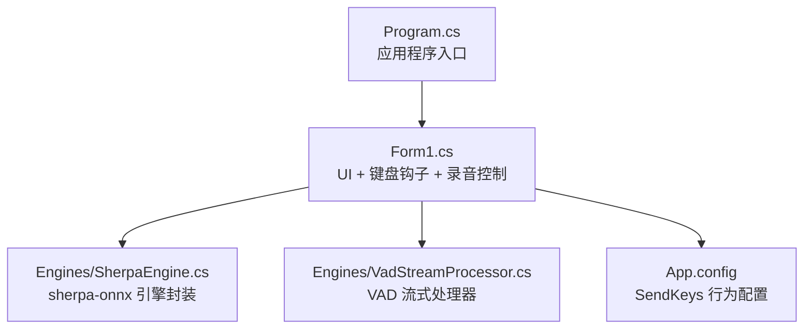
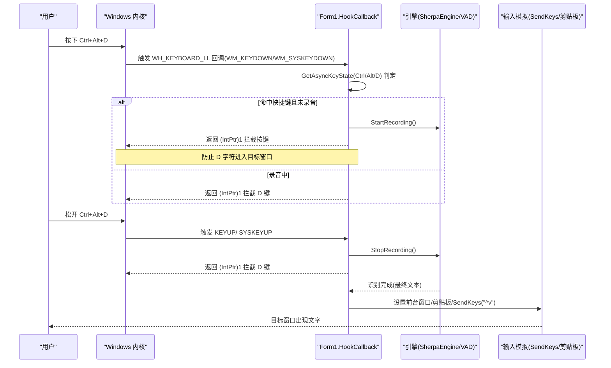
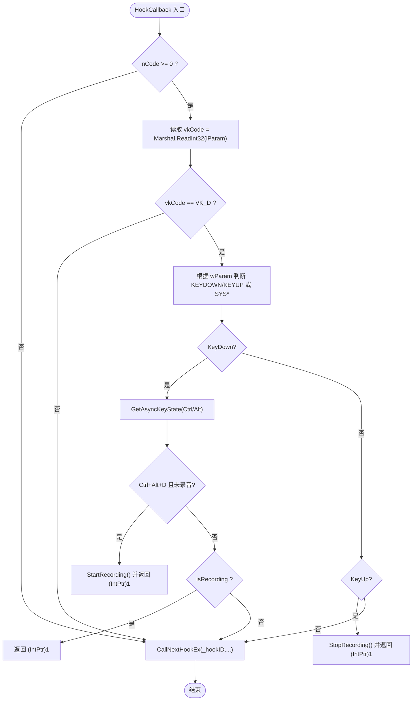
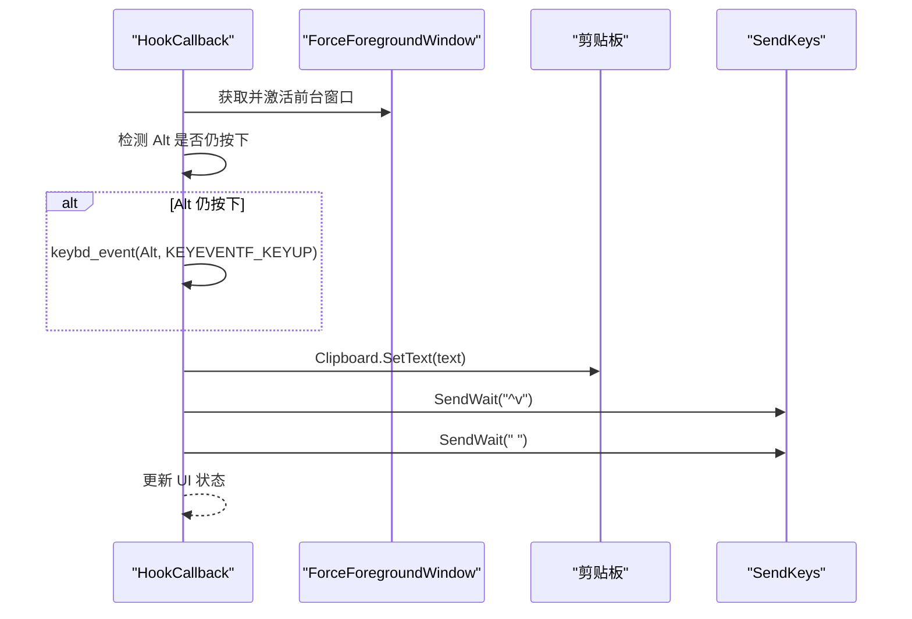
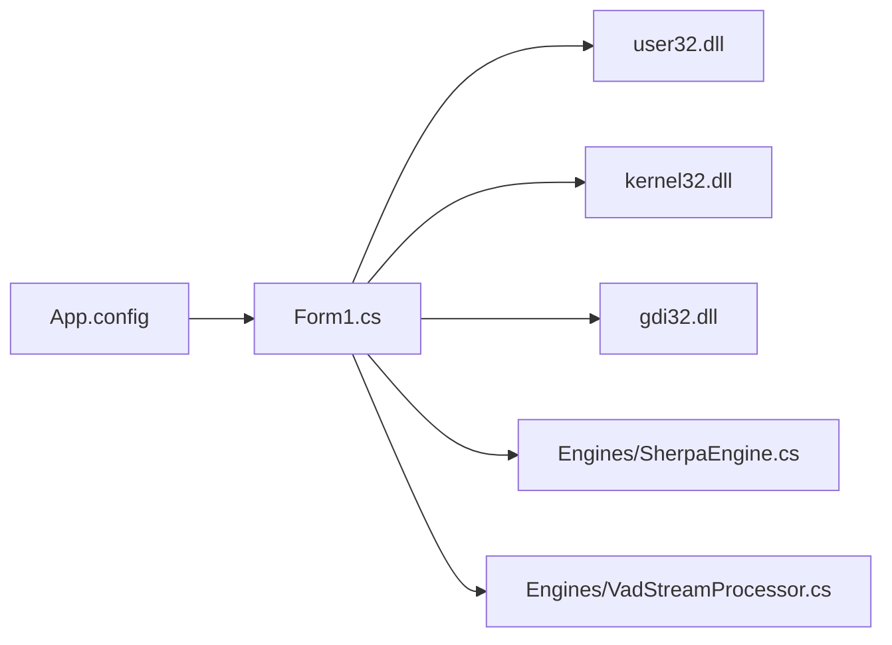

# 键盘钩子系统

<cite>
**本文引用的文件**   
- [Program.cs](file://t9s2t/Program.cs)
- [Form1.cs](file://t9s2t/Form1.cs)
- [App.config](file://t9s2t/App.config)
- [SherpaEngine.cs](file://t9s2t/Engines/SherpaEngine.cs)
- [VadStreamProcessor.cs](file://t9s2t/Engines/VadStreamProcessor.cs)
</cite>

## 目录
1. [简介](#简介)
2. [项目结构](#项目结构)
3. [核心组件](#核心组件)
4. [架构总览](#架构总览)
5. [详细组件分析](#详细组件分析)
6. [依赖关系分析](#依赖关系分析)
7. [性能与线程安全](#性能与线程安全)
8. [故障排查指南](#故障排查指南)
9. [结论](#结论)

## 简介
本技术文档聚焦于该项目的低级别键盘钩子系统，系统性阐述以下要点：
- 低级别键盘钩子的实现原理：SetWindowsHookEx 的调用、WH_KEYBOARD_LL 常量、HookCallback 回调处理逻辑。
- 全局快捷键 Ctrl+Alt+D 的检测机制：GetAsyncKeyState 的使用、WM_KEYDOWN/WM_KEYUP 与 WM_SYSKEYDOWN/WM_SYSKEYUP 的差异。
- 按键拦截机制：返回值为 (IntPtr)1 的作用、CallNextHookEx 的调用时机。
- 线程安全考虑与性能优化策略。
- 结合代码路径的具体示例与调试技巧，以及常见问题解决方案。

## 项目结构
该项目为 Windows Forms 应用，主入口在 Program.cs，核心 UI 与钩子逻辑集中在 Form1.cs；语音识别引擎封装在 Engines 目录下（SherpaEngine.cs、VadStreamProcessor.cs）。

图表来源
- [Program.cs:10-24](file://t9s2t/Program.cs#L10-L24)
- [Form1.cs:82-127](file://t9s2t/Form1.cs#L82-L127)
- [SherpaEngine.cs:14-55](file://t9s2t/Engines/SherpaEngine.cs#L14-L55)
- [VadStreamProcessor.cs:12-33](file://t9s2t/Engines/VadStreamProcessor.cs#L12-L33)
- [App.config:1-10](file://t9s2t/App.config#L1-L10)

章节来源
- [Program.cs:10-24](file://t9s2t/Program.cs#L10-L24)
- [Form1.cs:82-127](file://t9s2t/Form1.cs#L82-L127)

## 核心组件
- 低级别键盘钩子：通过 SetWindowsHookEx 安装 WH_KEYBOARD_LL 钩子，使用 HookCallback 回调处理键盘事件。
- 全局快捷键检测：在回调中判断 VK_D 键按下时，使用 GetAsyncKeyState 检查 Ctrl 和 Alt 是否同时按下，组合成 Ctrl+Alt+D。
- 消息类型差异：当 Alt 按住时，系统发送 WM_SYSKEYDOWN/WM_SYSKEYUP；否则发送 WM_KEYDOWN/WM_KEYUP。代码对两者做了统一处理。
- 按键拦截：当满足条件或处于录音状态时，直接返回 (IntPtr)1 以阻止后续窗口接收该按键；否则调用 CallNextHookEx 放行。
- 输入模拟与粘贴：最终文本通过剪贴板 + SendKeys 原子化粘贴到前台目标窗口，避免闪烁。

章节来源
- [Form1.cs:82-127](file://t9s2t/Form1.cs#L82-L127)
- [Form1.cs:415-460](file://t9s2t/Form1.cs#L415-L460)
- [Form1.cs:993-1051](file://t9s2t/Form1.cs#L993-L1051)

## 架构总览
下图展示了从键盘事件到语音识别再到结果粘贴的整体流程。

图表来源
- [Form1.cs:415-460](file://t9s2t/Form1.cs#L415-L460)
- [Form1.cs:1146-1273](file://t9s2t/Form1.cs#L1146-L1273)
- [Form1.cs:993-1051](file://t9s2t/Form1.cs#L993-L1051)
- [SherpaEngine.cs:351-479](file://t9s2t/Engines/SherpaEngine.cs#L351-L479)
- [VadStreamProcessor.cs:38-136](file://t9s2t/Engines/VadStreamProcessor.cs#L38-L136)

## 详细组件分析

### 低级别键盘钩子安装与回调
- 安装钩子：
  - 使用 SetWindowsHookEx 安装 WH_KEYBOARD_LL 钩子，参数包括钩子类型、回调委托、当前模块句柄和目标线程 ID（0 表示全局）。
  - 通过 GetModuleHandle 获取当前进程主模块句柄。
- 回调处理：
  - nCode >= 0 时解析 lParam 中的虚拟键码。
  - 仅处理 VK_D 键，区分按下与释放，并兼容 Alt 导致的 WM_SYS* 消息。
  - 按下时检查修饰键状态（Ctrl、Alt），若满足 Ctrl+Alt+D 且未录音则开始录音并拦截按键。
  - 录音中拦截 D 键，防止字符输入。
  - 释放时停止录音并拦截按键。
  - 其他情况调用 CallNextHookEx 放行。

图表来源
- [Form1.cs:415-460](file://t9s2t/Form1.cs#L415-L460)

章节来源
- [Form1.cs:82-127](file://t9s2t/Form1.cs#L82-L127)
- [Form1.cs:415-460](file://t9s2t/Form1.cs#L415-L460)

### 全局快捷键 Ctrl+Alt+D 检测机制
- 关键 API：
  - GetAsyncKeyState(VK_CONTROL)、GetAsyncKeyState(VK_MENU) 用于查询修饰键状态。
  - 常量定义：VK_CONTROL=0x11、VK_MENU=0x12、VK_D=0x44。
- 消息差异：
  - 当 Alt 按住时，Windows 发送 WM_SYSKEYDOWN/WM_SYSKEYUP；否则发送 WM_KEYDOWN/WM_KEYUP。
  - 代码将两类消息统一归类为“按下”或“释放”，确保无论 Alt 是否按住都能正确响应。
- 判定流程：
  - 仅在 D 键按下时检查 Ctrl 和 Alt 是否同时按下。
  - 若满足且未录音，则启动录音并拦截按键。
  - 若在录音中，则继续拦截 D 键，直到释放。

章节来源
- [Form1.cs:108-117](file://t9s2t/Form1.cs#L108-L117)
- [Form1.cs:422-460](file://t9s2t/Form1.cs#L422-L460)

### 按键拦截机制与返回值含义
- 返回值 (IntPtr)1：
  - 在低级别键盘钩子中，返回非零值（如 (IntPtr)1）表示已处理该消息，不再传递给下一个钩子或目标窗口，从而“拦截”按键。
- CallNextHookEx 调用时机：
  - 当不满足快捷键条件且不在录音状态时，调用 CallNextHookEx 放行，使正常打字生效。
- 典型场景：
  - 按下 Ctrl+Alt+D：拦截 D 键，避免产生字符。
  - 录音中按 D：拦截 D 键，避免干扰输入。
  - 松开 D：拦截 D 键，确保不会输出多余字符。

章节来源
- [Form1.cs:422-460](file://t9s2t/Form1.cs#L422-L460)

### 输入模拟与粘贴流程
- 目标窗口定位：
  - ForceForegroundWindow 尝试将前台窗口设为上次记录的目标窗口，必要时 AttachThreadInput 提升权限。
- 剪贴板与 SendKeys：
  - 先临时释放可能仍按住的 Alt，避免 Alt+Space 弹出系统菜单。
  - 将识别文本写入剪贴板，等待短暂时间后发送 ^v 进行粘贴，并在末尾追加空格。
- 防闪烁策略：
  - partial 结果仅更新托盘提示，不模拟输入，避免“删除-粘贴”闪烁。
  - final 结果一次性粘贴，减少视觉抖动。

图表来源
- [Form1.cs:1114-1144](file://t9s2t/Form1.cs#L1114-L1144)
- [Form1.cs:993-1051](file://t9s2t/Form1.cs#L993-L1051)

章节来源
- [Form1.cs:993-1051](file://t9s2t/Form1.cs#L993-L1051)
- [Form1.cs:1114-1144](file://t9s2t/Form1.cs#L1114-L1144)

### 录音控制与引擎集成
- 开始录音：
  - StartRecording 重置引擎与 VAD，启动 WaveInEvent 录音，保存前台窗口句柄，显示录音提示窗。
- 数据回调：
  - WaveIn_DataAvailable 在锁内处理音频帧，支持 SherpaEngine 流式与 VAD 流式两种模式。
- 停止录音：
  - StopRecording 先停止设备，再在锁内设置 isRecording=false，并根据引擎模式获取最终结果并粘贴。

章节来源
- [Form1.cs:1146-1273](file://t9s2t/Form1.cs#L1146-L1273)
- [Form1.cs:1057-1111](file://t9s2t/Form1.cs#L1057-L1111)
- [SherpaEngine.cs:351-479](file://t9s2t/Engines/SherpaEngine.cs#L351-L479)
- [VadStreamProcessor.cs:38-136](file://t9s2t/Engines/VadStreamProcessor.cs#L38-L136)

## 依赖关系分析
- 外部 API 依赖：
  - user32.dll：SetWindowsHookEx、UnhookWindowsHookEx、CallNextHookEx、GetAsyncKeyState、keybd_event、SetForegroundWindow、ShowWindow、IsIconic、FindWindow、GetForegroundWindow、GetWindowThreadProcessId、AttachThreadInput、RegisterWindowMessage、SendMessage。
  - kernel32.dll：GetModuleHandle。
  - gdi32.dll：CreateRoundRectRgn（用于圆角提示窗）。
- 内部模块依赖：
  - Form1 依赖 Engines 下的 SherpaEngine 与 VadStreamProcessor。
  - App.config 配置 SendKeys 行为以避免 JournalHook 死锁。

图表来源
- [Form1.cs:82-127](file://t9s2t/Form1.cs#L82-L127)
- [App.config:1-10](file://t9s2t/App.config#L1-L10)

章节来源
- [Form1.cs:82-127](file://t9s2t/Form1.cs#L82-L127)
- [App.config:1-10](file://t9s2t/App.config#L1-L10)

## 性能与线程安全
- 线程安全：
  - 使用 Mutex 实现单实例。
  - 使用 _inputLock 保护录音、引擎操作与输入模拟的并发访问，避免竞态条件。
  - UI 更新通过 BeginInvoke 异步调度，避免阻塞 UI 线程。
- 性能优化：
  - partial 结果节流与去重：最小间隔 200ms，避免频繁 UI 更新与输入模拟。
  - 流式识别优先：SherpaEngine 流式模式减少延迟，VAD 流式处理器在非流式模型上模拟分段识别。
  - 剪贴板与 SendKeys 原子化粘贴，降低闪烁与误触概率。
- 注意事项：
  - 钩子回调应尽量轻量，避免长时间阻塞；复杂逻辑应异步或后台处理。
  - 注意 Alt 状态对系统菜单的影响，必要时临时释放修饰键。

章节来源
- [Form1.cs:151-162](file://t9s2t/Form1.cs#L151-L162)
- [Form1.cs:988-1051](file://t9s2t/Form1.cs#L988-L1051)
- [Form1.cs:1057-1111](file://t9s2t/Form1.cs#L1057-L1111)
- [SherpaEngine.cs:351-479](file://t9s2t/Engines/SherpaEngine.cs#L351-L479)
- [VadStreamProcessor.cs:38-136](file://t9s2t/Engines/VadStreamProcessor.cs#L38-L136)
- [App.config:1-10](file://t9s2t/App.config#L1-L10)

## 故障排查指南
- 快捷键无效：
  - 确认 WH_KEYBOARD_LL 钩子已安装成功（_hookID 非零）。
  - 检查 WM_KEYDOWN/WM_SYSKEYDOWN 分支是否命中，GetAsyncKeyState 返回值是否正确。
  - 验证是否在录音中导致按键被拦截。
- 按键未被拦截：
  - 确认 HookCallback 返回 (IntPtr)1 的路径是否执行。
  - 检查 CallNextHookEx 是否在不该放行的情况下被调用。
- 粘贴失败或闪烁：
  - 检查 ForceForegroundWindow 是否能正确定位前台窗口。
  - 确认 Alt 状态是否被临时释放，避免 Alt+Space 弹出菜单。
  - 查看 SendKeys 配置是否为 SendInput（App.config）。
- 麦克风无输入：
  - 确认 WaveInEvent.DeviceCount > 0。
  - 检查录音状态 isRecording 与引擎初始化是否完成。
- 多实例冲突：
  - 检查全局 Mutex 是否创建成功，避免重复运行。

章节来源
- [Form1.cs:415-460](file://t9s2t/Form1.cs#L415-L460)
- [Form1.cs:993-1051](file://t9s2t/Form1.cs#L993-L1051)
- [Form1.cs:1057-1111](file://t9s2t/Form1.cs#L1057-L1111)
- [App.config:1-10](file://t9s2t/App.config#L1-L10)

## 结论
本项目通过低级别键盘钩子实现了全局快捷键 Ctrl+Alt+D 的可靠监听与按键拦截，并结合 sherpa-onnx 引擎与 VAD 流式处理器提供高效的语音识别与实时出字体验。整体设计在性能与线程安全方面采取了多项优化措施，并通过剪贴板与 SendKeys 的原子化粘贴提升了用户体验。对于常见问题的排查，建议重点关注钩子安装与回调路径、修饰键状态、前台窗口定位以及 SendKeys 配置等关键环节。