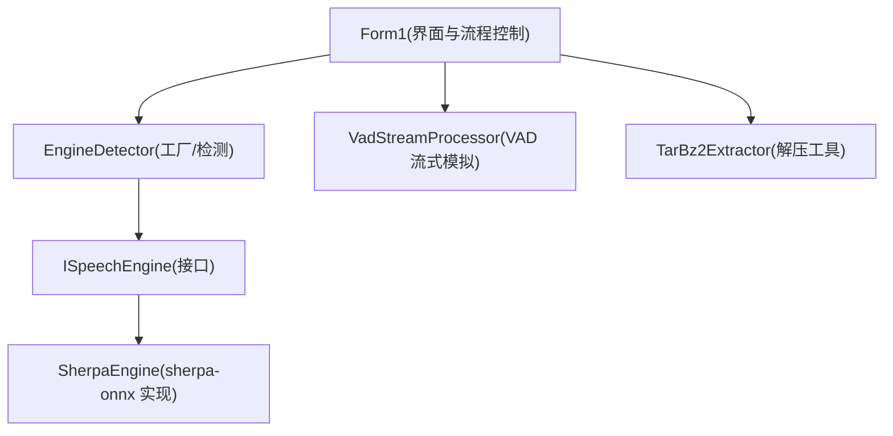
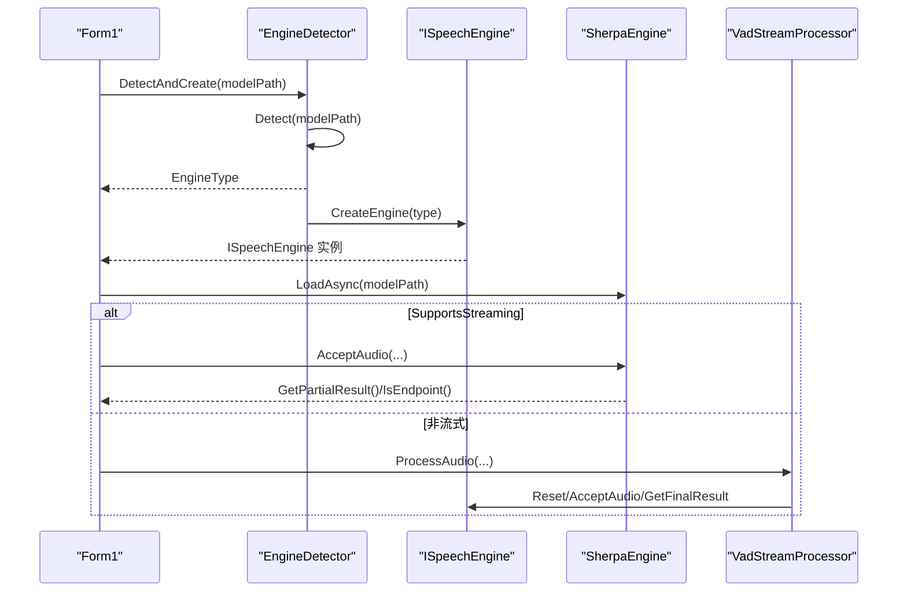
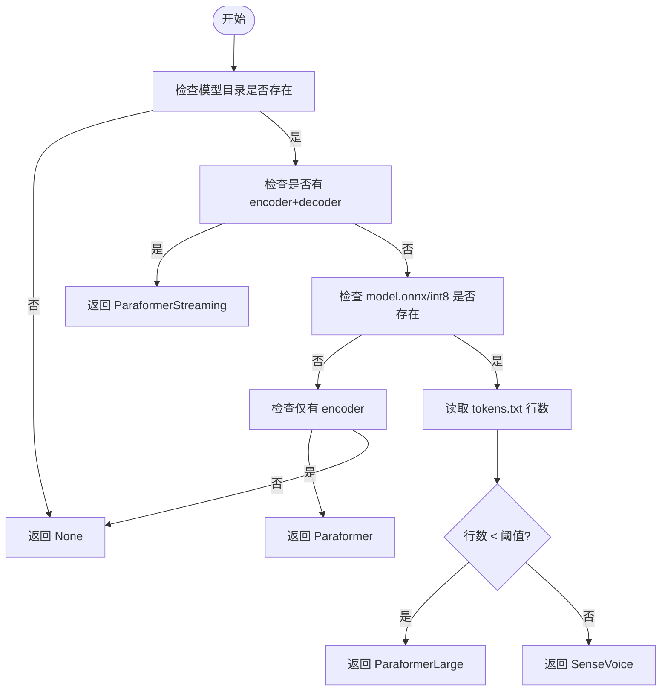
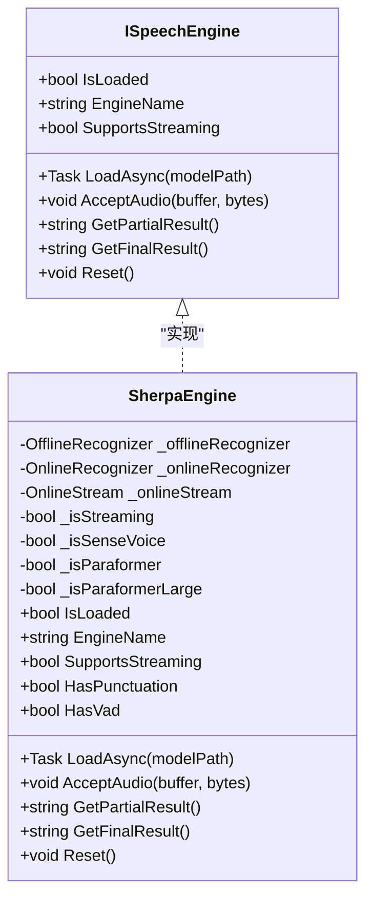
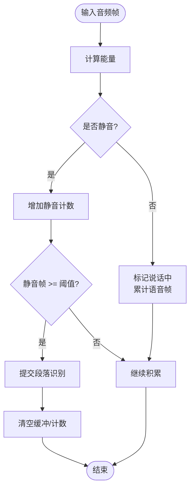
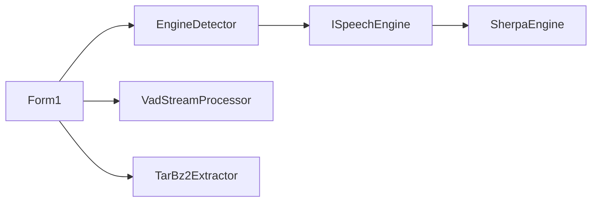

# EngineDetector 工厂模式

<cite>
**本文引用的文件**   
- [EngineDetector.cs](file://t9s2t/Engines/EngineDetector.cs)
- [ISpeechEngine.cs](file://t9s2t/Engines/ISpeechEngine.cs)
- [SherpaEngine.cs](file://t9s2t/Engines/SherpaEngine.cs)
- [VadStreamProcessor.cs](file://t9s2t/Engines/VadStreamProcessor.cs)
- [TarBz2Extractor.cs](file://t9s2t/Engines/TarBz2Extractor.cs)
- [Form1.cs](file://t9s2t/Form1.cs)
</cite>

## 目录
1. [简介](#简介)
2. [项目结构](#项目结构)
3. [核心组件](#核心组件)
4. [架构总览](#架构总览)
5. [详细组件分析](#详细组件分析)
6. [依赖关系分析](#依赖关系分析)
7. [性能与切换策略](#性能与切换策略)
8. [错误处理与降级](#错误处理与降级)
9. [使用示例与扩展指南](#使用示例与扩展指南)
10. [结论](#结论)

## 简介
本技术文档围绕语音识别引擎选择中的“工厂模式”展开，重点解析 EngineDetector 的模型类型检测、动态实例创建、引擎注册与管理机制、错误处理与降级策略，以及引擎切换的实现原理与性能考量。通过该设计，系统能够根据模型目录结构自动判断并加载合适的引擎实现（如 SenseVoice、Paraformer 离线/大模型、Paraformer 流式），并提供统一的 ISpeechEngine 接口供上层调用。

## 项目结构
- 引擎抽象与实现
  - ISpeechEngine：定义统一引擎接口（加载、输入音频、获取结果、重置等）
  - SherpaEngine：基于 sherpa-onnx 的具体实现，支持多种模型类型与流式/非流式模式
  - VadStreamProcessor：将非流式模型模拟为“类流式”体验（静音分段触发识别）
  - TarBz2Extractor：压缩文件解压工具（tar.bz2/tar.gz/zip 等）
- 工厂与检测
  - EngineDetector：静态工厂，负责检测模型类型并创建对应引擎实例
- 应用集成
  - Form1：UI 层，负责模型下载、引擎 DLL 检查、引擎加载、录音与输出

图表来源
- [EngineDetector.cs:22-120](file://t9s2t/Engines/EngineDetector.cs#L22-L120)
- [ISpeechEngine.cs:8-33](file://t9s2t/Engines/ISpeechEngine.cs#L8-L33)
- [SherpaEngine.cs:14-72](file://t9s2t/Engines/SherpaEngine.cs#L14-L72)
- [VadStreamProcessor.cs:12-33](file://t9s2t/Engines/VadStreamProcessor.cs#L12-L33)
- [TarBz2Extractor.cs:17-96](file://t9s2t/Engines/TarBz2Extractor.cs#L17-L96)
- [Form1.cs:645-721](file://t9s2t/Form1.cs#L645-L721)

章节来源
- [EngineDetector.cs:1-122](file://t9s2t/Engines/EngineDetector.cs#L1-L122)
- [ISpeechEngine.cs:1-35](file://t9s2t/Engines/ISpeechEngine.cs#L1-L35)
- [SherpaEngine.cs:1-608](file://t9s2t/Engines/SherpaEngine.cs#L1-L608)
- [VadStreamProcessor.cs:1-162](file://t9s2t/Engines/VadStreamProcessor.cs#L1-L162)
- [TarBz2Extractor.cs:1-143](file://t9s2t/Engines/TarBz2Extractor.cs#L1-L143)
- [Form1.cs:1-1318](file://t9s2t/Form1.cs#L1-L1318)

## 核心组件
- 引擎类型枚举 EngineType
  - None：未检测到或不可用
  - SenseVoice：sherpa-onnx 非流式，多语言大词汇量
  - Paraformer：sherpa-onnx 非流式（仅 encoder）
  - ParaformerLarge：sherpa-onnx 非流式（model.onnx/int8 + tokens.txt，中文大模型）
  - ParaformerStreaming：sherpa-onnx 流式（encoder + decoder）
- 工厂方法
  - Detect(modelPath)：基于模型目录文件特征推断 EngineType
  - CreateEngine(type)：根据类型返回具体 ISpeechEngine 实例
  - DetectAndCreate(modelPath)：一步完成检测与创建
  - GetDisplayName(type)：返回用户可见名称
- 引擎接口 ISpeechEngine
  - IsLoaded、EngineName、SupportsStreaming
  - LoadAsync(modelPath)、AcceptAudio(buffer, bytes)
  - GetPartialResult()、GetFinalResult()、Reset()
- 引擎实现 SherpaEngine
  - 内部区分 SenseVoice / Paraformer / Paraformer-large / 流式
  - 支持标点恢复（punc.onnx）、VAD（vad.onnx）
  - 提供流式端点检测、分句重置、最终结果获取
- 流式模拟 VadStreamProcessor
  - 对非流式模型进行静音分段，达到阈值后提交识别，模拟“边说边出字”
- 解压工具 TarBz2Extractor
  - 智能识别 tar.bz2 魔数，先解 bzip2 再解 tar；其他格式直接解压

章节来源
- [EngineDetector.cs:10-17](file://t9s2t/Engines/EngineDetector.cs#L10-L17)
- [EngineDetector.cs:27-104](file://t9s2t/Engines/EngineDetector.cs#L27-L104)
- [ISpeechEngine.cs:8-33](file://t9s2t/Engines/ISpeechEngine.cs#L8-L33)
- [SherpaEngine.cs:14-72](file://t9s2t/Engines/SherpaEngine.cs#L14-L72)
- [VadStreamProcessor.cs:12-33](file://t9s2t/Engines/VadStreamProcessor.cs#L12-L33)
- [TarBz2Extractor.cs:17-96](file://t9s2t/Engines/TarBz2Extractor.cs#L17-L96)

## 架构总览
下图展示从 UI 到引擎选择的完整流程：UI 层调用工厂检测并创建引擎，随后根据是否支持流式选择不同的数据处理路径（原生流式或 VAD 模拟）。

图表来源
- [Form1.cs:645-721](file://t9s2t/Form1.cs#L645-L721)
- [EngineDetector.cs:100-104](file://t9s2t/Engines/EngineDetector.cs#L100-L104)
- [SherpaEngine.cs:57-72](file://t9s2t/Engines/SherpaEngine.cs#L57-L72)
- [VadStreamProcessor.cs:38-86](file://t9s2t/Engines/VadStreamProcessor.cs#L38-L86)

## 详细组件分析

### 工厂与检测机制（EngineDetector）
- 检测逻辑要点
  - 流式 Paraformer：存在 encoder(.int8).onnx 且同时存在 decoder(.int8).onnx
  - model.onnx/int8 + tokens.txt：按 tokens.txt 行数区分 SenseVoice 与 Paraformer-large（小于阈值判定为大模型）
  - 仅 encoder(.int8).onnx：非流式 Paraformer
  - 以上均不满足则返回 None
- 工厂创建
  - 根据 EngineType 返回 SherpaEngine 实例，传入 streaming 标志以启用 OnlineRecognizer
- 显示名称
  - 提供人类可读的名称映射，便于 UI 展示

图表来源
- [EngineDetector.cs:27-75](file://t9s2t/Engines/EngineDetector.cs#L27-L75)

章节来源
- [EngineDetector.cs:27-104](file://t9s2t/Engines/EngineDetector.cs#L27-L104)

### 引擎接口与实现（ISpeechEngine 与 SherpaEngine）
- 接口职责
  - 生命周期：LoadAsync、Dispose
  - 数据输入：AcceptAudio
  - 结果获取：GetPartialResult、GetFinalResult
  - 状态管理：Reset、IsLoaded、SupportsStreaming、EngineName
- SherpaEngine 关键点
  - 模型类型识别：在 LoadAsync 中再次校验模型类型，设置内部标志位
  - 非流式加载：SenseVoice、Paraformer-large、Paraformer（仅 encoder）
  - 流式加载：OnlineRecognizer + OnlineStream，配置端点检测参数
  - 可选增强：标点恢复（punc.onnx）、VAD（vad.onnx）
  - 音频处理：RMS 静音过滤、流式端点检测、分句重置
  - 结果输出：partial 实时文本、final 最终文本（可附加标点）

图表来源
- [ISpeechEngine.cs:8-33](file://t9s2t/Engines/ISpeechEngine.cs#L8-L33)
- [SherpaEngine.cs:14-72](file://t9s2t/Engines/SherpaEngine.cs#L14-L72)

章节来源
- [ISpeechEngine.cs:1-35](file://t9s2t/Engines/ISpeechEngine.cs#L1-L35)
- [SherpaEngine.cs:57-115](file://t9s2t/Engines/SherpaEngine.cs#L57-L115)
- [SherpaEngine.cs:119-216](file://t9s2t/Engines/SherpaEngine.cs#L119-L216)
- [SherpaEngine.cs:220-255](file://t9s2t/Engines/SherpaEngine.cs#L220-L255)
- [SherpaEngine.cs:259-347](file://t9s2t/Engines/SherpaEngine.cs#L259-L347)
- [SherpaEngine.cs:351-479](file://t9s2t/Engines/SherpaEngine.cs#L351-L479)

### 流式模拟处理器（VadStreamProcessor）
- 作用：为非流式模型（如 SenseVoice）提供“类流式”体验
- 工作原理
  - 计算音频帧能量，低于阈值视为静音
  - 连续静音超过阈值时，提交已积累的语音段进行识别
  - 支持 Flush 强制提交（停止录音时）
  - 可选 partial 回调用于 UI 提示
- 适用场景：当引擎不支持原生流式但希望获得近似实时反馈时使用

图表来源
- [VadStreamProcessor.cs:38-101](file://t9s2t/Engines/VadStreamProcessor.cs#L38-L101)

章节来源
- [VadStreamProcessor.cs:12-162](file://t9s2t/Engines/VadStreamProcessor.cs#L12-L162)

### 压缩与安装（TarBz2Extractor）
- 功能：跨平台解压 tar.bz2/tar.gz/zip 等格式
- 关键特性
  - 通过魔数判断是否为 bzip2，避免误判
  - 两步解压：bzip2 -> tar，或直接解压其他格式
  - 支持覆盖写入与临时文件清理

章节来源
- [TarBz2Extractor.cs:17-96](file://t9s2t/Engines/TarBz2Extractor.cs#L17-L96)
- [TarBz2Extractor.cs:112-127](file://t9s2t/Engines/TarBz2Extractor.cs#L112-L127)

## 依赖关系分析
- 耦合与内聚
  - EngineDetector 与 ISpeechEngine 松耦合，通过工厂方法创建具体实现
  - SherpaEngine 作为唯一实现，内部封装 sherpa-onnx 细节
  - VadStreamProcessor 依赖 ISpeechEngine，但不侵入其实现
  - Form1 作为编排者，协调下载、检测、加载、录音与输出
- 外部依赖
  - sherpa-onnx C API（通过 onnxruntime.dll 与 sherpa-onnx-c-api.dll）
  - SharpCompress（解压）
  - NAudio.Wave（录音）
  - Newtonsoft.Json（远程配置解析）

图表来源
- [Form1.cs:645-721](file://t9s2t/Form1.cs#L645-L721)
- [EngineDetector.cs:80-104](file://t9s2t/Engines/EngineDetector.cs#L80-L104)
- [SherpaEngine.cs:14-72](file://t9s2t/Engines/SherpaEngine.cs#L14-L72)
- [VadStreamProcessor.cs:12-33](file://t9s2t/Engines/VadStreamProcessor.cs#L12-L33)
- [TarBz2Extractor.cs:17-96](file://t9s2t/Engines/TarBz2Extractor.cs#L17-L96)

章节来源
- [Form1.cs:462-567](file://t9s2t/Form1.cs#L462-L567)
- [Form1.cs:818-966](file://t9s2t/Form1.cs#L818-L966)

## 性能与切换策略
- 流式 vs 非流式
  - 流式（Paraformer Streaming）：低延迟，适合实时出字；需要 encoder+decoder 模型
  - 非流式（SenseVoice/Paraformer-large）：一次性识别整段，质量高，延迟取决于音频长度
- 静音与端点检测
  - SherpaEngine 内置 RMS 静音过滤与端点检测，减少无效推理与误触发
  - VadStreamProcessor 通过能量阈值与连续静音帧数控制分段时机
- 资源占用
  - 线程与内存：流式模式维护 OnlineStream，非流式累积缓冲区；注意 Dispose 释放
  - 标点与 VAD 模型按需加载，缺失时优雅跳过
- 切换策略
  - 运行时根据 SupportsStreaming 决定采用原生流式还是 VAD 模拟
  - 卸载旧引擎并重新加载新引擎时，确保正确释放资源并重置状态

章节来源
- [SherpaEngine.cs:351-479](file://t9s2t/Engines/SherpaEngine.cs#L351-L479)
- [VadStreamProcessor.cs:38-101](file://t9s2t/Engines/VadStreamProcessor.cs#L38-L101)
- [Form1.cs:664-721](file://t9s2t/Form1.cs#L664-L721)

## 错误处理与降级
- 模型不可用或未识别
  - EngineDetector.Detect 返回 None，UI 提示用户下载模型
  - LoadAsync 抛出异常时，UI 捕获并提示“加载失败”，允许重试
- 组件缺失
  - 启动时检查 onnxruntime.dll 与 sherpa-onnx-c-api.dll，缺失则引导下载
- 网络与下载
  - 远程模型列表与引擎 DLL 配置失败时回退到本地备用 JSON
  - 下载失败清理空文件并提示用户排查
- 标点与 VAD 加载失败
  - 静默记录日志并跳过相应功能，不影响主识别流程

章节来源
- [Form1.cs:462-567](file://t9s2t/Form1.cs#L462-L567)
- [Form1.cs:818-966](file://t9s2t/Form1.cs#L818-L966)
- [SherpaEngine.cs:259-347](file://t9s2t/Engines/SherpaEngine.cs#L259-L347)

## 使用示例与扩展指南

### 基本用法（在 UI 中）
- 检测并创建引擎
  - 调用 EngineDetector.DetectAndCreate(modelPath) 获取 ISpeechEngine
  - 若返回 null，提示用户下载模型
- 加载模型
  - 调用 engine.LoadAsync(modelPath)，等待异步完成
- 录音与识别
  - 流式：engine.SupportsStreaming 为真时，循环调用 AcceptAudio 与 GetPartialResult，并在端点处获取最终结果
  - 非流式：使用 VadStreamProcessor.ProcessAudio 进行静音分段，结束时 Flush 并提交识别

章节来源
- [Form1.cs:645-721](file://t9s2t/Form1.cs#L645-L721)
- [Form1.cs:1057-1111](file://t9s2t/Form1.cs#L1057-L1111)

### 自定义引擎集成
- 新增引擎步骤
  - 实现 ISpeechEngine 接口，提供 LoadAsync、AcceptAudio、GetPartialResult、GetFinalResult、Reset 等方法
  - 在 EngineDetector.CreateEngine 中添加新的 EngineType 分支，返回新实现实例
  - 如需新的模型文件特征，更新 EngineDetector.Detect 的判断逻辑
- 配置管理
  - 可在 UI 层添加新的模型条目（JSON），包含 name、url、folder 等字段
  - 引擎 DLL 配置可通过远程 JSON 或本地 fallback 管理
- 兼容性检查
  - 在 LoadAsync 中进行模型文件完整性校验（如 tokens.txt 是否存在）
  - 对可选增强（标点、VAD）进行存在性检查与异常捕获

章节来源
- [EngineDetector.cs:80-104](file://t9s2t/Engines/EngineDetector.cs#L80-L104)
- [EngineDetector.cs:27-75](file://t9s2t/Engines/EngineDetector.cs#L27-L75)
- [Form1.cs:818-966](file://t9s2t/Form1.cs#L818-L966)

## 结论
EngineDetector 工厂模式在本项目中实现了“按模型目录结构自动选择引擎”的目标，结合 ISpeechEngine 的统一接口与 SherpaEngine 的多模型支持，提供了良好的可扩展性与用户体验。通过流式与 VAD 模拟两种路径，系统在不同模型能力下都能给出合理的实时反馈。完善的错误处理与降级策略确保了在组件缺失、网络异常等情况下的稳健运行。未来可通过扩展 EngineType 与 CreateEngine 分支，快速接入更多引擎实现，并通过配置管理持续优化模型分发与安装体验。