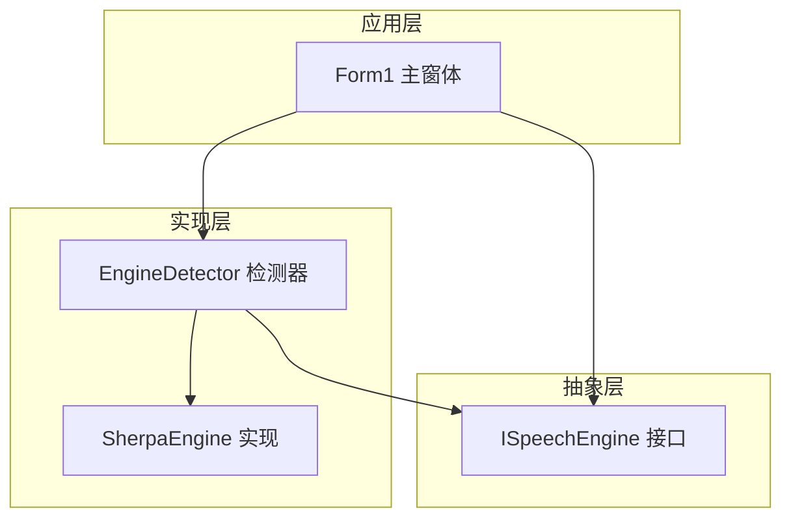
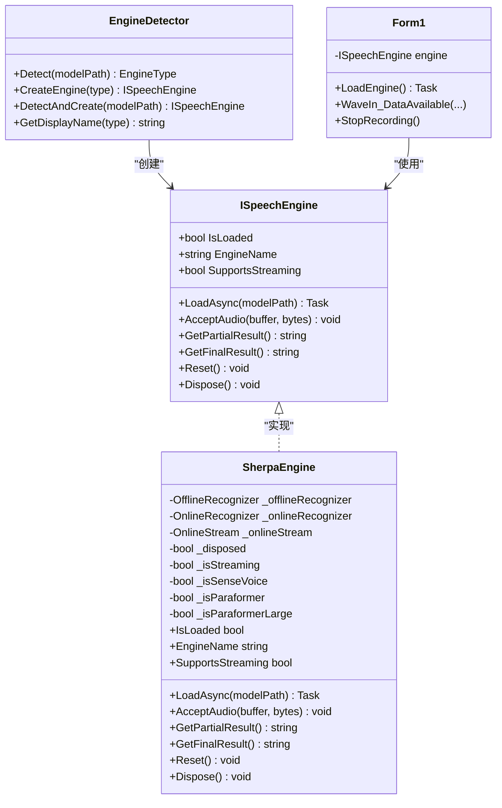
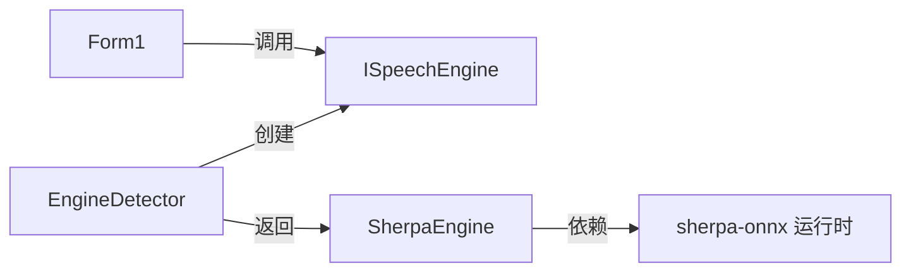
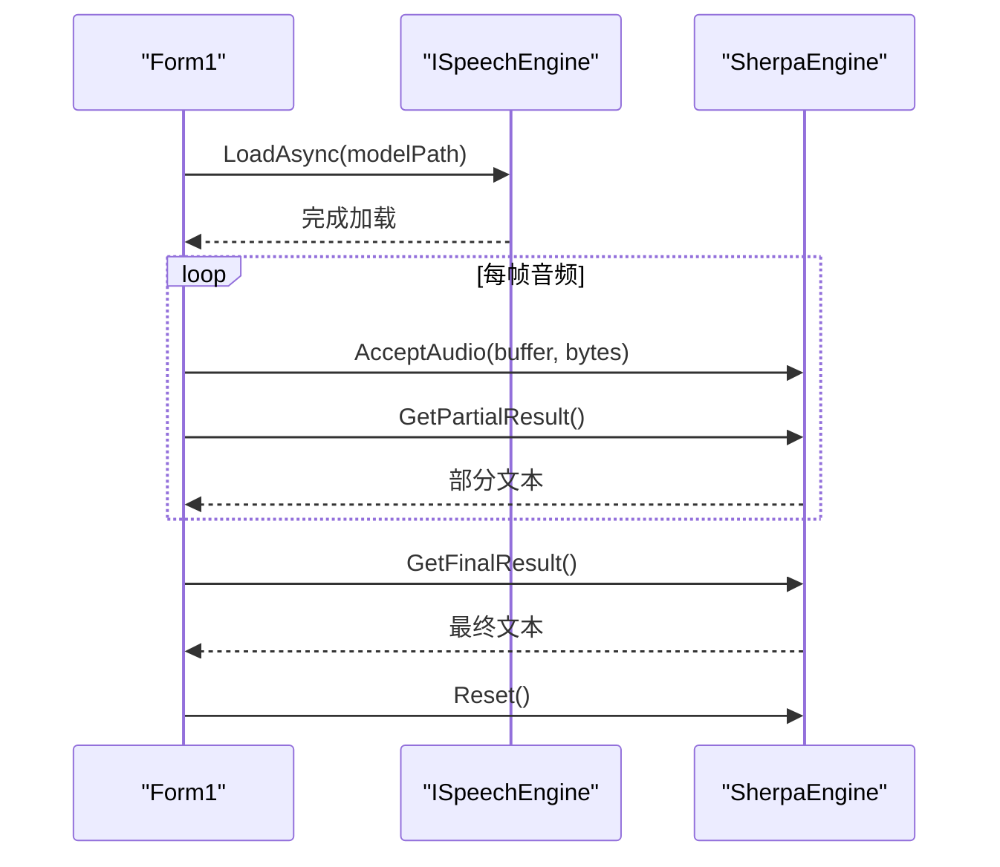
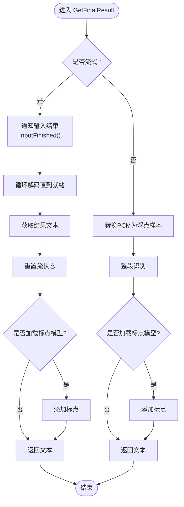

# ISpeechEngine 接口设计

<cite>
**本文引用的文件**   
- [ISpeechEngine.cs](file://t9s2t/Engines/ISpeechEngine.cs)
- [SherpaEngine.cs](file://t9s2t/Engines/SherpaEngine.cs)
- [EngineDetector.cs](file://t9s2t/Engines/EngineDetector.cs)
- [Form1.cs](file://t9s2t/Form1.cs)
</cite>

## 目录
1. [简介](#简介)
2. [项目结构](#项目结构)
3. [核心组件](#核心组件)
4. [架构总览](#架构总览)
5. [详细组件分析](#详细组件分析)
6. [依赖关系分析](#依赖关系分析)
7. [性能考量](#性能考量)
8. [故障排查指南](#故障排查指南)
9. [结论](#结论)
10. [附录：使用示例与最佳实践](#附录使用示例与最佳实践)

## 简介
本文件围绕 ISpeechEngine 接口进行系统化技术文档编写，重点阐述其设计理念、统一抽象的优势、属性与方法的设计意图与使用场景，并结合 SherpaEngine 的具体实现说明资源管理与 IDisposable 的要求。同时给出在 UI 层（Form1）中的典型调用流程、错误处理模式与最佳实践建议。

## 项目结构
该仓库采用“引擎抽象 + 具体实现 + 检测器 + UI 集成”的分层组织方式：
- 抽象层：ISpeechEngine 定义统一的语音识别能力契约
- 实现层：SherpaEngine 基于 sherpa-onnx 提供流式与非流式识别能力
- 检测器：EngineDetector 根据模型目录结构自动选择并创建对应引擎实例
- 应用层：Form1 负责麦克风采集、UI 交互与引擎生命周期管理

图表来源
- [ISpeechEngine.cs:1-34](file://t9s2t/Engines/ISpeechEngine.cs#L1-L34)
- [SherpaEngine.cs:14-55](file://t9s2t/Engines/SherpaEngine.cs#L14-L55)
- [EngineDetector.cs:22-104](file://t9s2t/Engines/EngineDetector.cs#L22-L104)
- [Form1.cs:645-721](file://t9s2t/Form1.cs#L645-L721)

章节来源
- [ISpeechEngine.cs:1-34](file://t9s2t/Engines/ISpeechEngine.cs#L1-L34)
- [EngineDetector.cs:22-104](file://t9s2t/Engines/EngineDetector.cs#L22-L104)
- [Form1.cs:645-721](file://t9s2t/Form1.cs#L645-L721)

## 核心组件
- ISpeechEngine：统一抽象，屏蔽不同引擎差异，暴露加载、音频输入、结果获取与重置等关键能力
- SherpaEngine：基于 sherpa-onnx 的完整实现，支持 SenseVoice、Paraformer（离线与大模型）、Paraformer（流式），并提供标点恢复与 VAD 辅助能力
- EngineDetector：通过模型目录结构判断引擎类型并返回对应的 ISpeechEngine 实例
- Form1：作为客户端，负责初始化、加载引擎、录音数据送入、结果回调与资源释放

章节来源
- [ISpeechEngine.cs:1-34](file://t9s2t/Engines/ISpeechEngine.cs#L1-L34)
- [SherpaEngine.cs:14-608](file://t9s2t/Engines/SherpaEngine.cs#L14-L608)
- [EngineDetector.cs:22-104](file://t9s2t/Engines/EngineDetector.cs#L22-L104)
- [Form1.cs:645-721](file://t9s2t/Form1.cs#L645-L721)

## 架构总览
ISpeechEngine 将“模型加载、音频输入、结果获取、状态重置、资源释放”等职责抽象为统一契约，上层无需关心底层是 SenseVoice 还是 Paraformer，也无需区分流式与非流式细节。EngineDetector 根据模型目录结构自动选择合适实现，Form1 仅面向接口编程，从而获得良好的扩展性与可维护性。

图表来源
- [ISpeechEngine.cs:1-34](file://t9s2t/Engines/ISpeechEngine.cs#L1-L34)
- [SherpaEngine.cs:14-608](file://t9s2t/Engines/SherpaEngine.cs#L14-L608)
- [EngineDetector.cs:22-104](file://t9s2t/Engines/EngineDetector.cs#L22-L104)
- [Form1.cs:645-721](file://t9s2t/Form1.cs#L645-L721)

## 详细组件分析

### ISpeechEngine 接口设计与语义
- IsLoaded：表示引擎是否已完成模型加载并可接受音频输入。用于 UI 显示与调用前校验，避免在未就绪时调用 AcceptAudio 等方法导致异常或空结果。
- EngineName：引擎标识名称，便于用户界面展示与日志记录。
- SupportsStreaming：指示是否支持流式识别（边说边出字）。上层据此决定使用 GetPartialResult 实时出字还是仅在结束时调用 GetFinalResult。
- LoadAsync(modelPath)：异步加载模型。参数 modelPath 指向包含模型文件的目录；该方法内部可能执行 IO 与模型解析，因此应异步调用以避免阻塞 UI。
- AcceptAudio(buffer, bytes)：向引擎推送音频片段。buffer 通常为 PCM 字节数组，bytes 为有效长度。上层需保证采样率与位深符合引擎要求（例如 16kHz、16bit）。
- GetPartialResult()：在流式模式下返回当前部分识别文本；非流式模式通常返回空或 null。
- GetFinalResult()：结束一次识别会话后获取最终结果。对于流式模式，内部会通知输入结束并解码剩余数据；对于非流式模式，内部会将累积的音频段一次性识别。
- Reset()：重置识别器状态，清空内部缓冲与状态标志，准备下一轮录音。

章节来源
- [ISpeechEngine.cs:1-34](file://t9s2t/Engines/ISpeechEngine.cs#L1-L34)

### SherpaEngine 实现要点
- 模型类型检测：根据目录中是否存在 encoder/decoder 或 model.onnx/int8 以及 tokens.txt 行数推断 SenseVoice、Paraformer-large、Paraformer（流式/非流式）。
- 流式与非流式路径：
  - 流式：使用 OnlineRecognizer 与 OnlineStream，周期性 Decode 并 GetResult，结合端点检测与静音阈值控制输出时机。
  - 非流式：累积音频到内存列表，最后一次性识别，再可选进行标点恢复。
- 标点恢复与 VAD：若检测到 punc.onnx 或 vad.onnx，则加载相应模型以增强可读性与静音过滤。
- 资源释放：Dispose 中按顺序释放 OnlineStream、OnlineRecognizer、OfflineRecognizer、标点与 VAD 对象，并将引用置空，防止重复释放。

章节来源
- [SherpaEngine.cs:57-115](file://t9s2t/Engines/SherpaEngine.cs#L57-L115)
- [SherpaEngine.cs:119-255](file://t9s2t/Engines/SherpaEngine.cs#L119-L255)
- [SherpaEngine.cs:259-347](file://t9s2t/Engines/SherpaEngine.cs#L259-L347)
- [SherpaEngine.cs:351-479](file://t9s2t/Engines/SherpaEngine.cs#L351-L479)
- [SherpaEngine.cs:591-605](file://t9s2t/Engines/SherpaEngine.cs#L591-L605)

### EngineDetector 自动发现与工厂
- Detect：依据目录结构判断引擎类型（SenseVoice、Paraformer、Paraformer-large、ParaformerStreaming）。
- CreateEngine/DetectAndCreate：根据类型返回对应的 ISpeechEngine 实例（SherpaEngine 的不同构造参数）。
- GetDisplayName：为 UI 提供友好名称。

章节来源
- [EngineDetector.cs:27-75](file://t9s2t/Engines/EngineDetector.cs#L27-L75)
- [EngineDetector.cs:80-104](file://t9s2t/Engines/EngineDetector.cs#L80-L104)
- [EngineDetector.cs:109-119](file://t9s2t/Engines/EngineDetector.cs#L109-L119)

### 与 UI 层的集成（Form1）
- 启动流程：检查引擎 DLL -> 检测模型 -> 创建引擎 -> 异步加载模型 -> 根据 SupportsStreaming 配置流式处理策略。
- 录音流程：
  - 流式（原生）：每帧调用 AcceptAudio，周期查询 GetPartialResult 或端点触发 GetResultAndReset 输出中间结果。
  - 非流式：录音结束后调用 GetFinalResult 一次性识别。
- 资源释放：在关闭时 Dispose 引擎、麦克风与托盘图标。

章节来源
- [Form1.cs:645-721](file://t9s2t/Form1.cs#L645-L721)
- [Form1.cs:1054-1071](file://t9s2t/Form1.cs#L1054-L1071)
- [Form1.cs:1072-1086](file://t9s2t/Form1.cs#L1072-L1086)
- [Form1.cs:1242-1257](file://t9s2t/Form1.cs#L1242-L1257)
- [Form1.cs:279-288](file://t9s2t/Form1.cs#L279-L288)

## 依赖关系分析
- 耦合与内聚：
  - ISpeechEngine 与上层解耦，SherpaEngine 高内聚地封装了 sherpa-onnx 的复杂逻辑。
  - EngineDetector 作为轻量工厂，降低上层对具体实现的感知。
- 外部依赖：
  - sherpa-onnx 运行时库（onnxruntime.dll、sherpa-onnx-c-api.dll）由 Form1 按需下载与校验。
- 潜在循环依赖：无直接循环依赖，分层清晰。

图表来源
- [Form1.cs:645-721](file://t9s2t/Form1.cs#L645-L721)
- [EngineDetector.cs:80-104](file://t9s2t/Engines/EngineDetector.cs#L80-L104)
- [SherpaEngine.cs:14-55](file://t9s2t/Engines/SherpaEngine.cs#L14-L55)

章节来源
- [Form1.cs:645-721](file://t9s2t/Form1.cs#L645-L721)
- [EngineDetector.cs:80-104](file://t9s2t/Engines/EngineDetector.cs#L80-L104)
- [SherpaEngine.cs:14-55](file://t9s2t/Engines/SherpaEngine.cs#L14-L55)

## 性能考量
- 流式识别：
  - 合理设置端点检测参数与静音阈值，避免频繁分句或吞字。
  - 在高频回调中避免阻塞操作（如 UI 更新应异步调度）。
- 非流式识别：
  - 注意内存占用，长音频累积可能导致内存增长；必要时在应用层做分段切分。
- 资源释放：
  - 确保 Dispose 被正确调用，避免托管与非托管资源泄漏。

[本节为通用指导，不直接分析具体文件]

## 故障排查指南
- 模型未找到或类型无法识别：
  - 检查模型目录结构与必要文件（model.onnx/int8、encoder/decoder、tokens.txt）。
  - 参考 EngineDetector 的检测逻辑定位缺失项。
- 流式无结果或频繁中断：
  - 调整静音阈值与端点规则，确认 AcceptAudio 的采样率与格式是否符合预期。
- 标点恢复失败：
  - 确认 punc.onnx 存在且可加载，关注异常日志提示。
- 资源泄漏：
  - 确保在应用退出或切换引擎时调用 Dispose，并在 finally 块中释放。

章节来源
- [EngineDetector.cs:27-75](file://t9s2t/Engines/EngineDetector.cs#L27-L75)
- [SherpaEngine.cs:259-347](file://t9s2t/Engines/SherpaEngine.cs#L259-L347)
- [SherpaEngine.cs:591-605](file://t9s2t/Engines/SherpaEngine.cs#L591-L605)

## 结论
ISpeechEngine 通过简洁而完备的抽象，屏蔽了多引擎差异与流式/非流式复杂性，配合 EngineDetector 的自动发现与工厂模式，显著提升了系统的可扩展性与可维护性。SherpaEngine 的实现展示了如何在统一接口下整合多种模型与增强功能（标点、VAD），并在 UI 层形成清晰的调用序列与错误处理策略。遵循本文的最佳实践与排障建议，可在实际项目中稳定高效地使用语音识别能力。

[本节为总结性内容，不直接分析具体文件]

## 附录：使用示例与最佳实践

### 典型调用序列（流式）

图表来源
- [Form1.cs:1054-1086](file://t9s2t/Form1.cs#L1054-L1086)
- [Form1.cs:1242-1257](file://t9s2t/Form1.cs#L1242-L1257)
- [SherpaEngine.cs:351-479](file://t9s2t/Engines/SherpaEngine.cs#L351-L479)

### 关键方法流程图（GetFinalResult 内部逻辑）

图表来源
- [SherpaEngine.cs:417-479](file://t9s2t/Engines/SherpaEngine.cs#L417-L479)

### 最佳实践清单
- 始终先调用 LoadAsync 并等待完成，再开始录音与 AcceptAudio。
- 在流式模式下优先使用 GetPartialResult 进行实时反馈，结合端点检测或静音阈值控制输出时机。
- 每次录音结束后调用 GetFinalResult 获取最终结果，随后调用 Reset 清理状态。
- 在应用退出或切换引擎时调用 Dispose，确保所有非托管资源释放。
- 对网络请求与模型加载进行异常捕获与回退提示，提升用户体验。

章节来源
- [Form1.cs:645-721](file://t9s2t/Form1.cs#L645-L721)
- [Form1.cs:1054-1086](file://t9s2t/Form1.cs#L1054-L1086)
- [Form1.cs:1242-1257](file://t9s2t/Form1.cs#L1242-L1257)
- [SherpaEngine.cs:591-605](file://t9s2t/Engines/SherpaEngine.cs#L591-L605)