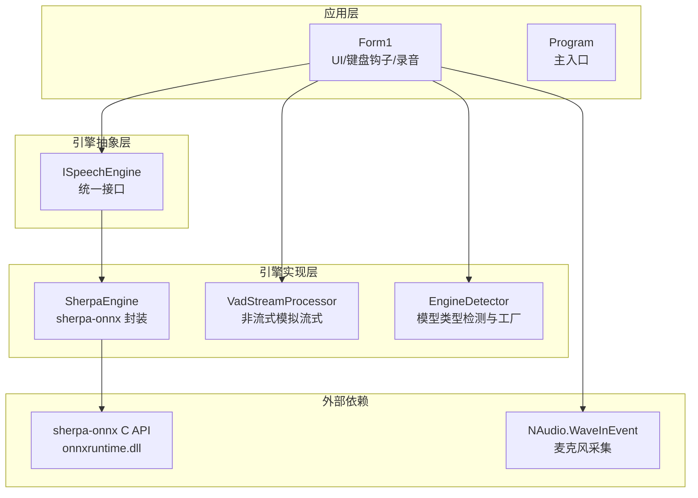
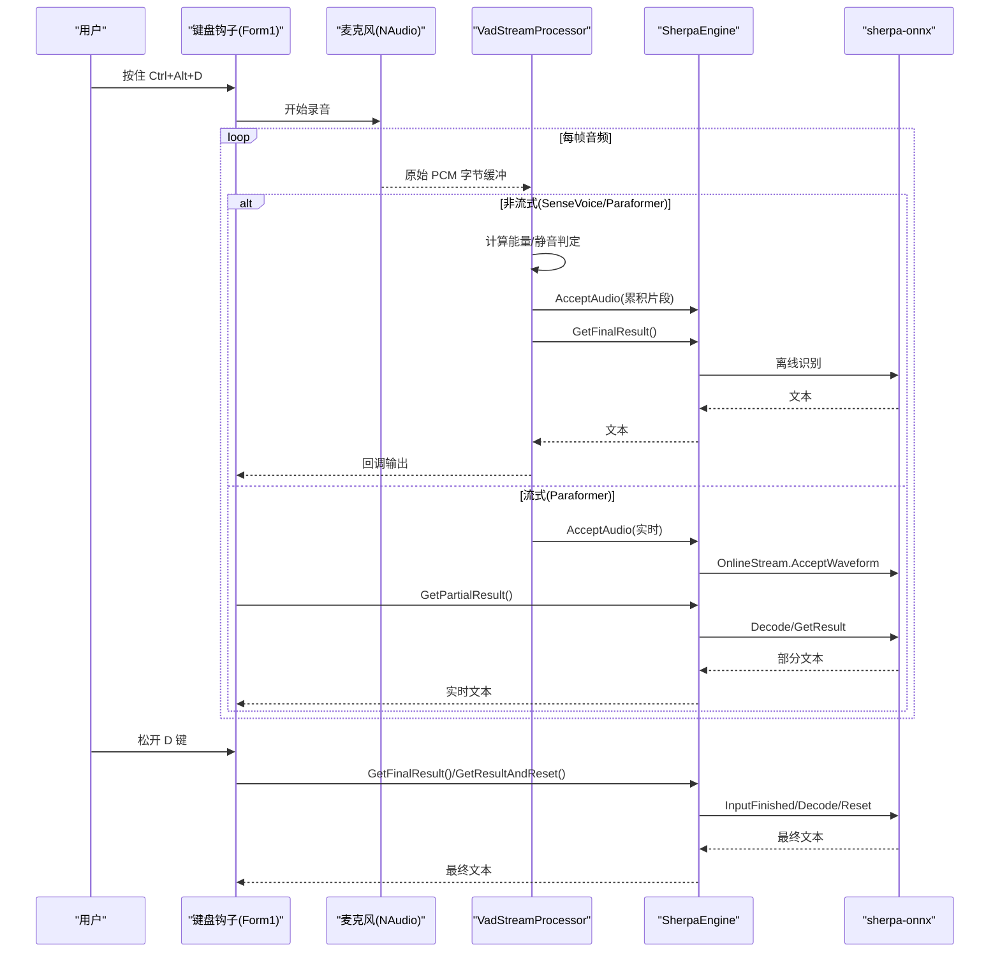
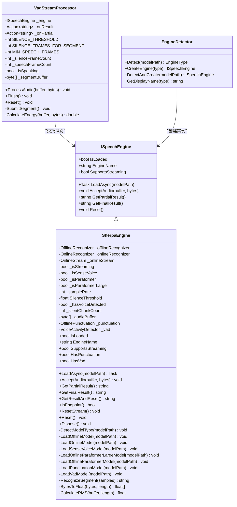
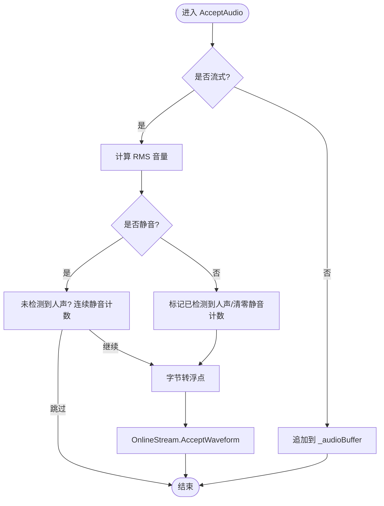
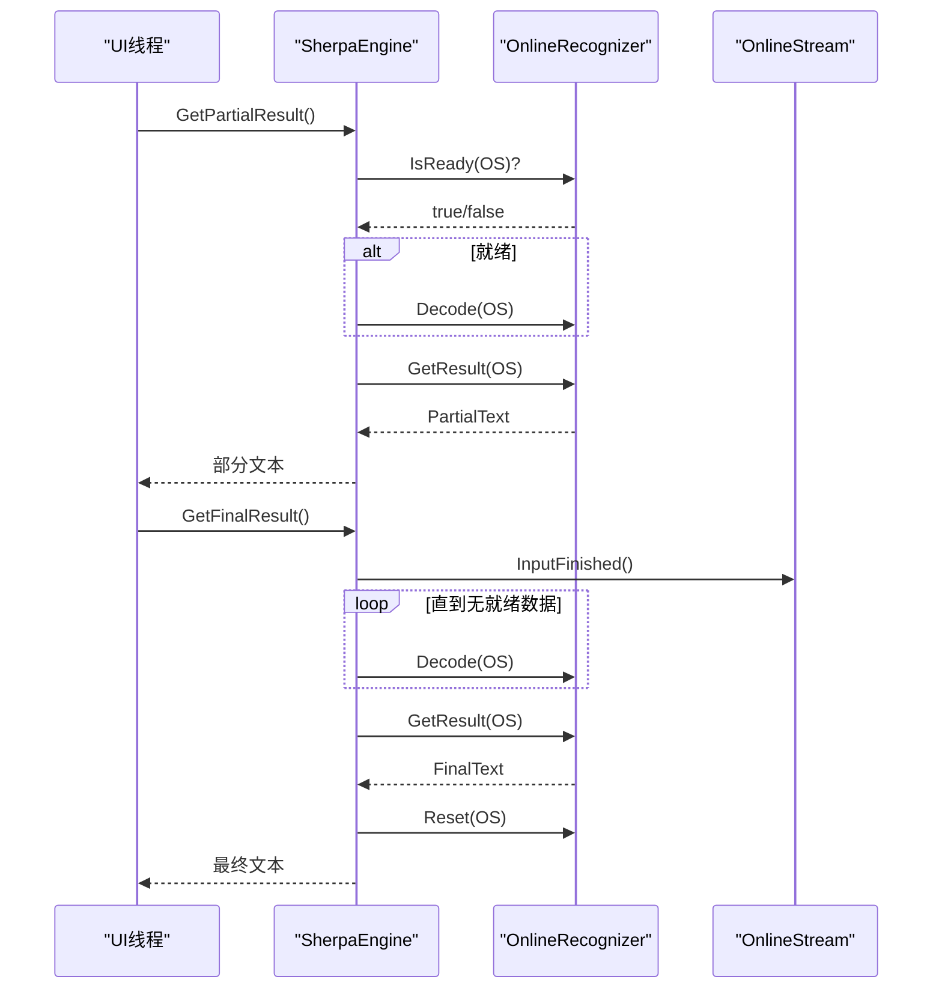
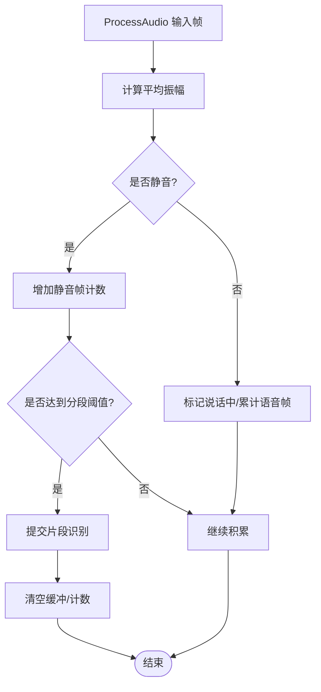
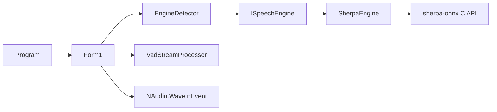

# SherpaEngine 具体实现

<cite>
**本文引用的文件**
- [SherpaEngine.cs](file://t9s2t/Engines/SherpaEngine.cs)
- [ISpeechEngine.cs](file://t9s2t/Engines/ISpeechEngine.cs)
- [VadStreamProcessor.cs](file://t9s2t/Engines/VadStreamProcessor.cs)
- [EngineDetector.cs](file://t9s2t/Engines/EngineDetector.cs)
- [Form1.cs](file://t9s2t/Form1.cs)
- [Program.cs](file://t9s2t/Program.cs)
</cite>

## 目录
1. [简介](#简介)
2. [项目结构](#项目结构)
3. [核心组件](#核心组件)
4. [架构总览](#架构总览)
5. [详细组件分析](#详细组件分析)
6. [依赖关系分析](#依赖关系分析)
7. [性能考量](#性能考量)
8. [故障排查指南](#故障排查指南)
9. [结论](#结论)
10. [附录：API 使用示例与调试技巧](#附录api-使用示例与调试技巧)

## 简介
本文件围绕 t9s2t 项目中对 sherpa-onnx 的封装实现，系统性阐述 SherpaEngine 的架构、模型加载机制、音频数据处理流程、流式识别原理、支持的模型类型与配置参数、性能优化策略、错误处理与异常恢复机制，并提供 API 使用示例与调试技巧。目标是帮助开发者快速理解并高效集成该引擎。

## 项目结构
本项目采用分层组织方式：
- 引擎抽象层：定义统一接口 ISpeechEngine
- 引擎实现层：SherpaEngine 封装 sherpa-onnx 的离线/流式识别能力
- 辅助处理器：VadStreamProcessor 为非流式模型提供“类流式”体验
- 自动检测器：EngineDetector 根据模型目录结构推断引擎类型并创建实例
- UI 与入口：Form1 负责用户交互、键盘钩子、录音控制；Program 为应用入口

图表来源
- [Form1.cs:1-120](file://t9s2t/Form1.cs#L1-L120)
- [Program.cs:1-27](file://t9s2t/Program.cs#L1-L27)
- [ISpeechEngine.cs:1-35](file://t9s2t/Engines/ISpeechEngine.cs#L1-L35)
- [SherpaEngine.cs:1-60](file://t9s2t/Engines/SherpaEngine.cs#L1-L60)
- [VadStreamProcessor.cs:1-40](file://t9s2t/Engines/VadStreamProcessor.cs#L1-L40)
- [EngineDetector.cs:1-40](file://t9s2t/Engines/EngineDetector.cs#L1-L40)

章节来源
- [Form1.cs:1-120](file://t9s2t/Form1.cs#L1-L120)
- [Program.cs:1-27](file://t9s2t/Program.cs#L1-L27)
- [ISpeechEngine.cs:1-35](file://t9s2t/Engines/ISpeechEngine.cs#L1-L35)
- [SherpaEngine.cs:1-60](file://t9s2t/Engines/SherpaEngine.cs#L1-L60)
- [VadStreamProcessor.cs:1-40](file://t9s2t/Engines/VadStreamProcessor.cs#L1-L40)
- [EngineDetector.cs:1-40](file://t9s2t/Engines/EngineDetector.cs#L1-L40)

## 核心组件
- ISpeechEngine：定义统一的语音识别引擎接口，包括加载、输入音频、获取部分/最终结果、重置等能力。
- SherpaEngine：基于 sherpa-onnx 的具体实现，支持 SenseVoice、Paraformer（离线）、Paraformer-large（离线）以及 Paraformer（流式）。
- VadStreamProcessor：通过静音检测将非流式模型包装成“类流式”，在检测到静音段落后提交识别并返回结果。
- EngineDetector：依据模型目录中的文件特征自动判断引擎类型，并创建对应引擎实例。
- Form1：整合键盘钩子、录音、模型下载与加载、UI 状态更新等。

章节来源
- [ISpeechEngine.cs:1-35](file://t9s2t/Engines/ISpeechEngine.cs#L1-L35)
- [SherpaEngine.cs:1-60](file://t9s2t/Engines/SherpaEngine.cs#L1-L60)
- [VadStreamProcessor.cs:1-40](file://t9s2t/Engines/VadStreamProcessor.cs#L1-L40)
- [EngineDetector.cs:1-40](file://t9s2t/Engines/EngineDetector.cs#L1-L40)
- [Form1.cs:1-120](file://t9s2t/Form1.cs#L1-L120)

## 架构总览
整体数据与控制流如下：
- 启动阶段：Program 初始化应用；Form1 检查引擎 DLL 与模型，必要时下载；根据模型目录结构选择引擎模式（流式/非流式），构造 SherpaEngine 并异步加载模型。
- 运行阶段：键盘钩子监听 Ctrl+Alt+D 组合键，按下开始录音，松开停止录音。录音回调中按模式分流：
  - 流式模式：直接调用 AcceptAudio 送入 OnlineStream，GetPartialResult 实时出字，GetFinalResult 或 GetResultAndReset 完成分句。
  - 非流式模式：通过 VadStreamProcessor 累积语音片段，检测到静音后提交识别，得到最终文本。
- 可选增强：若存在标点模型与 VAD 模型，则启用标点恢复与内置静音过滤。

图表来源
- [Form1.cs:420-460](file://t9s2t/Form1.cs#L420-L460)
- [VadStreamProcessor.cs:38-100](file://t9s2t/Engines/VadStreamProcessor.cs#L38-L100)
- [SherpaEngine.cs:351-479](file://t9s2t/Engines/SherpaEngine.cs#L351-L479)

## 详细组件分析

### SherpaEngine 类图与职责

图表来源
- [ISpeechEngine.cs:1-35](file://t9s2t/Engines/ISpeechEngine.cs#L1-L35)
- [SherpaEngine.cs:14-608](file://t9s2t/Engines/SherpaEngine.cs#L14-L608)
- [VadStreamProcessor.cs:12-162](file://t9s2t/Engines/VadStreamProcessor.cs#L12-L162)
- [EngineDetector.cs:10-122](file://t9s2t/Engines/EngineDetector.cs#L10-L122)

#### 模型加载机制
- 模型路径解析与类型检测：
  - 流式 Paraformer：需要 encoder.onnx/int8.onnx 与 decoder.onnx/int8.onnx 同时存在。
  - 离线 SenseVoice：存在 model.onnx/int8.onnx，且 tokens.txt 行数较大（多语言大词表）。
  - 离线 Paraformer-large：存在 model.onnx/int8.onnx，tokens.txt 行数较小（中文大模型）。
  - 离线 Paraformer：仅存在 encoder.onnx/int8.onnx。
- 模型格式验证：
  - 关键文件缺失时抛出相应异常（如缺少 tokens.txt）。
- 内存管理：
  - 非流式模式下使用 List<byte> 累积音频缓冲区，识别完成后清空。
  - 流式模式使用 OnlineStream 增量接收波形，避免整段缓存。
  - 所有原生对象（OnlineStream、OnlineRecognizer、OfflineRecognizer、OfflinePunctuation、VoiceActivityDetector）均在 Dispose 中释放。

章节来源
- [EngineDetector.cs:27-75](file://t9s2t/Engines/EngineDetector.cs#L27-L75)
- [SherpaEngine.cs:74-115](file://t9s2t/Engines/SherpaEngine.cs#L74-L115)
- [SherpaEngine.cs:119-216](file://t9s2t/Engines/SherpaEngine.cs#L119-L216)
- [SherpaEngine.cs:220-255](file://t9s2t/Engines/SherpaEngine.cs#L220-L255)
- [SherpaEngine.cs:591-606](file://t9s2t/Engines/SherpaEngine.cs#L591-L606)

#### 音频数据处理流程
- 采样率与特征维度：统一设置为 16kHz，特征维度 80。
- 字节到浮点转换：将 16bit PCM 转换为归一化 [-1,1] 的 float 数组。
- RMS 音量计算：用于静音过滤，低于阈值视为静音。
- 非流式：累积字节缓冲，识别前一次性转换并提交。
- 流式：逐帧转换并写入 OnlineStream，内部进行端点检测与解码。

图表来源
- [SherpaEngine.cs:351-384](file://t9s2t/Engines/SherpaEngine.cs#L351-L384)
- [SherpaEngine.cs:562-589](file://t9s2t/Engines/SherpaEngine.cs#L562-L589)

章节来源
- [SherpaEngine.cs:351-384](file://t9s2t/Engines/SherpaEngine.cs#L351-L384)
- [SherpaEngine.cs:562-589](file://t9s2t/Engines/SherpaEngine.cs#L562-L589)

#### 流式识别实现原理
- 实时结果获取：
  - 周期性调用 GetPartialResult，内部先尝试 Decode，再读取当前 Result.Text。
- 最终结果处理：
  - GetFinalResult：通知输入结束，循环解码剩余数据，读取最终文本，重置 stream，可选标点恢复。
  - GetResultAndReset：不通知输入结束，适合录音仍在继续时的中间最终结果，随后 Reset 以继续下一轮。
- 端点检测：
  - 使用 OnlineRecognizer.IsEndpoint 判断静音触发分句。
  - 结合 Rule1MinTrailingSilence、Rule2MinTrailingSilence、Rule3MinUtteranceLength 平衡出字速度与吞字问题。

图表来源
- [SherpaEngine.cs:388-479](file://t9s2t/Engines/SherpaEngine.cs#L388-L479)
- [SherpaEngine.cs:485-509](file://t9s2t/Engines/SherpaEngine.cs#L485-L509)
- [SherpaEngine.cs:516-531](file://t9s2t/Engines/SherpaEngine.cs#L516-L531)

章节来源
- [SherpaEngine.cs:388-479](file://t9s2t/Engines/SherpaEngine.cs#L388-L479)
- [SherpaEngine.cs:485-509](file://t9s2t/Engines/SherpaEngine.cs#L485-L509)
- [SherpaEngine.cs:516-531](file://t9s2t/Engines/SherpaEngine.cs#L516-L531)

#### 支持的模型类型与配置参数
- SenseVoice（离线）：
  - 模型文件：model.int8.onnx 或 model.onnx
  - 词表：tokens.txt
  - 配置要点：SampleRate=16000，FeatureDim=80，NumThreads=4，Language="auto"，InverseTextNormalization=1
- Paraformer-large（离线）：
  - 模型文件：model.int8.onnx 或 model.onnx
  - 词表：tokens.txt
  - 配置要点：SampleRate=16000，FeatureDim=80，NumThreads=4
- Paraformer（离线）：
  - 模型文件：encoder.int8.onnx 或 encoder.onnx
  - 词表：tokens.txt
  - 配置要点：SampleRate=16000，FeatureDim=80，NumThreads=4
- Paraformer（流式）：
  - 模型文件：encoder.int8.onnx 或 encoder.onnx，decoder.int8.onnx 或 decoder.onnx
  - 词表：tokens.txt
  - 配置要点：SampleRate=16000，FeatureDim=80，NumThreads=4，EnableEndpoint=1，Rule1MinTrailingSilence=1.2f，Rule2MinTrailingSilence=0.5f，Rule3MinUtteranceLength=12.0f

章节来源
- [SherpaEngine.cs:129-216](file://t9s2t/Engines/SherpaEngine.cs#L129-L216)
- [SherpaEngine.cs:220-255](file://t9s2t/Engines/SherpaEngine.cs#L220-L255)

#### 标点恢复与 VAD 集成
- 标点恢复：
  - 可选加载 punc.onnx 或 punc.int8.onnx，失败不影响主流程。
  - 在 GetFinalResult 或手动 AddPunctuation 时应用。
- VAD 模型：
  - 可选加载 vad.onnx，配置 SileroVad 相关参数（阈值、最小静音/语音时长、窗口大小、最大语音时长）。
  - 可用于静音过滤或更精细的语音活动检测。

章节来源
- [SherpaEngine.cs:259-290](file://t9s2t/Engines/SherpaEngine.cs#L259-L290)
- [SherpaEngine.cs:314-347](file://t9s2t/Engines/SherpaEngine.cs#L314-L347)
- [SherpaEngine.cs:295-310](file://t9s2t/Engines/SherpaEngine.cs#L295-L310)

#### 非流式“类流式”处理（VadStreamProcessor）
- 通过能量阈值与连续静音帧数判定语音段落边界。
- 当检测到语音结束时，提交累积片段给引擎识别，并通过回调返回结果。
- 支持 partial 反馈（例如“正在听...”提示）。

图表来源
- [VadStreamProcessor.cs:38-100](file://t9s2t/Engines/VadStreamProcessor.cs#L38-L100)
- [VadStreamProcessor.cs:114-136](file://t9s2t/Engines/VadStreamProcessor.cs#L114-L136)

章节来源
- [VadStreamProcessor.cs:38-100](file://t9s2t/Engines/VadStreamProcessor.cs#L38-L100)
- [VadStreamProcessor.cs:114-136](file://t9s2t/Engines/VadStreamProcessor.cs#L114-L136)

## 依赖关系分析
- 外部库：
  - sherpa-onnx C API：通过 NuGet 包引入，运行时依赖 onnxruntime.dll 与 sherpa-onnx-c-api.dll。
  - NAudio：用于麦克风采集（WaveInEvent）。
- 内部耦合：
  - Form1 通过 EngineDetector 自动选择引擎并加载，根据 SupportsStreaming 决定使用原生流式或 VadStreamProcessor。
  - SherpaEngine 与 ISpeechEngine 解耦，便于扩展其他引擎实现。

图表来源
- [Program.cs:1-27](file://t9s2t/Program.cs#L1-L27)
- [Form1.cs:645-721](file://t9s2t/Form1.cs#L645-L721)
- [EngineDetector.cs:80-104](file://t9s2t/Engines/EngineDetector.cs#L80-L104)
- [ISpeechEngine.cs:1-35](file://t9s2t/Engines/ISpeechEngine.cs#L1-L35)
- [SherpaEngine.cs:1-60](file://t9s2t/Engines/SherpaEngine.cs#L1-L60)
- [VadStreamProcessor.cs:12-40](file://t9s2t/Engines/VadStreamProcessor.cs#L12-L40)

章节来源
- [Program.cs:1-27](file://t9s2t/Program.cs#L1-L27)
- [Form1.cs:645-721](file://t9s2t/Form1.cs#L645-L721)
- [EngineDetector.cs:80-104](file://t9s2t/Engines/EngineDetector.cs#L80-L104)
- [ISpeechEngine.cs:1-35](file://t9s2t/Engines/ISpeechEngine.cs#L1-L35)
- [SherpaEngine.cs:1-60](file://t9s2t/Engines/SherpaEngine.cs#L1-L60)
- [VadStreamProcessor.cs:12-40](file://t9s2t/Engines/VadStreamProcessor.cs#L12-L40)

## 性能考量
- 多线程处理：
  - 各模型配置均设置 NumThreads（通常为 4），利用多核加速推理。
  - 标点模型与 VAD 模型分别设置较低线程数以减少资源竞争。
- 内存池使用：
  - 非流式模式使用 List<byte> 累积音频，识别后清空，减少频繁分配。
  - 流式模式通过 OnlineStream 增量处理，避免整段内存占用。
- 异步操作：
  - LoadAsync 在后台线程执行模型加载，避免阻塞 UI。
  - 网络请求（模型/引擎 DLL 下载）使用异步任务。
- 静音过滤：
  - 流式模式下基于 RMS 阈值与连续静音计数，减少无效数据送入模型，降低 CPU 消耗。
- 端点检测调优：
  - 合理设置 Rule1/Rule2 静音阈值与最小语句长度，平衡延迟与稳定性。

[本节为通用性能建议，不直接分析具体文件]

## 故障排查指南
- 模型类型无法识别：
  - 检查模型目录是否包含预期文件（model.onnx/int8.onnx、encoder.onnx/int8.onnx、decoder.onnx/int8.onnx、tokens.txt）。
  - 参考 DetectModelType 与 EngineDetector.Detect 的判断逻辑。
- 缺少 tokens.txt：
  - 加载时会抛出 FileNotFoundException，需确保词表文件存在。
- 标点/VAD 模型加载失败：
  - 日志会记录失败原因，但不影响主流程；可忽略或修复模型路径。
- 流式识别无结果或卡顿：
  - 检查 GetPartialResult 调用频率与端点参数；确认 IsReady 与 Decode 调用顺序。
  - 调整 Rule1MinTrailingSilence、Rule2MinTrailingSilence、Rule3MinUtteranceLength。
- 内存泄漏或资源未释放：
  - 确保在应用退出或切换引擎时调用 Dispose，释放 OnlineStream、OnlineRecognizer、OfflineRecognizer、OfflinePunctuation、VoiceActivityDetector。
- 网络下载失败：
  - 检查 TLS 设置与服务端可用性；查看备用 JSON 配置是否生效。

章节来源
- [SherpaEngine.cs:74-115](file://t9s2t/Engines/SherpaEngine.cs#L74-L115)
- [SherpaEngine.cs:259-290](file://t9s2t/Engines/SherpaEngine.cs#L259-L290)
- [SherpaEngine.cs:314-347](file://t9s2t/Engines/SherpaEngine.cs#L314-L347)
- [SherpaEngine.cs:388-479](file://t9s2t/Engines/SherpaEngine.cs#L388-L479)
- [SherpaEngine.cs:591-606](file://t9s2t/Engines/SherpaEngine.cs#L591-L606)
- [Form1.cs:510-567](file://t9s2t/Form1.cs#L510-L567)

## 结论
SherpaEngine 提供了对 sherpa-onnx 的统一封装，支持多种模型类型与流式/非流式识别场景。通过自动模型检测、静音过滤、标点恢复与 VAD 集成，实现了易用性与高性能的平衡。配合 Form1 的键盘钩子与录音控制，形成完整的桌面语音输入方案。建议在部署时关注模型完整性、端点参数调优与资源释放，以获得稳定高效的识别体验。

[本节为总结性内容，不直接分析具体文件]

## 附录：API 使用示例与调试技巧

### 基本用法（非流式）
- 步骤：
  - 使用 EngineDetector.DetectAndCreate 自动创建引擎实例。
  - 调用 LoadAsync 加载模型。
  - 循环调用 AcceptAudio 累积音频。
  - 调用 GetFinalResult 获取识别结果。
  - 调用 Reset 准备下一次识别。
- 适用场景：SenseVoice、Paraformer（离线）、Paraformer-large（离线）。

章节来源
- [EngineDetector.cs:100-104](file://t9s2t/Engines/EngineDetector.cs#L100-L104)
- [SherpaEngine.cs:57-72](file://t9s2t/Engines/SherpaEngine.cs#L57-L72)
- [SherpaEngine.cs:417-479](file://t9s2t/Engines/SherpaEngine.cs#L417-L479)
- [SherpaEngine.cs:533-543](file://t9s2t/Engines/SherpaEngine.cs#L533-L543)

### 基本用法（流式）
- 步骤：
  - 使用 EngineDetector.DetectAndCreate 自动创建引擎实例（流式模式）。
  - 调用 LoadAsync 加载模型。
  - 在录音回调中循环调用 AcceptAudio。
  - 周期调用 GetPartialResult 获取实时文本。
  - 在静音或用户松开按键时调用 GetFinalResult 或 GetResultAndReset 完成分句。
- 适用场景：Paraformer（流式）。

章节来源
- [EngineDetector.cs:80-95](file://t9s2t/Engines/EngineDetector.cs#L80-L95)
- [SherpaEngine.cs:220-255](file://t9s2t/Engines/SherpaEngine.cs#L220-L255)
- [SherpaEngine.cs:388-479](file://t9s2t/Engines/SherpaEngine.cs#L388-L479)
- [SherpaEngine.cs:485-509](file://t9s2t/Engines/SherpaEngine.cs#L485-L509)

### 非流式“类流式”用法（VadStreamProcessor）
- 步骤：
  - 创建 VadStreamProcessor，传入引擎实例与结果回调。
  - 在录音回调中调用 ProcessAudio 处理音频帧。
  - 在停止录音时调用 Flush 强制提交最后一段。
- 适用场景：SenseVoice、Paraformer（离线）希望获得近似流式的体验。

章节来源
- [VadStreamProcessor.cs:28-33](file://t9s2t/Engines/VadStreamProcessor.cs#L28-L33)
- [VadStreamProcessor.cs:38-100](file://t9s2t/Engines/VadStreamProcessor.cs#L38-L100)
- [VadStreamProcessor.cs:91-101](file://t9s2t/Engines/VadStreamProcessor.cs#L91-L101)

### 调试技巧
- 启用 Debug 输出：
  - 观察引擎加载、模型类型检测、标点/VAD 加载、识别过程的关键日志。
- 检查端点参数：
  - 若出现过早分句或吞字，调整 Rule1MinTrailingSilence、Rule2MinTrailingSilence、Rule3MinUtteranceLength。
- 监控内存与线程：
  - 非流式模式下注意 _audioBuffer 的大小变化；流式模式下关注 OnlineStream 的增量处理。
- 网络与依赖：
  - 确认 onnxruntime.dll 与 sherpa-onnx-c-api.dll 已正确下载且大小大于 0。
  - 检查 TLS 设置与服务端可达性。

章节来源
- [SherpaEngine.cs:74-115](file://t9s2t/Engines/SherpaEngine.cs#L74-L115)
- [SherpaEngine.cs:259-290](file://t9s2t/Engines/SherpaEngine.cs#L259-L290)
- [SherpaEngine.cs:314-347](file://t9s2t/Engines/SherpaEngine.cs#L314-L347)
- [Form1.cs:468-567](file://t9s2t/Form1.cs#L468-L567)