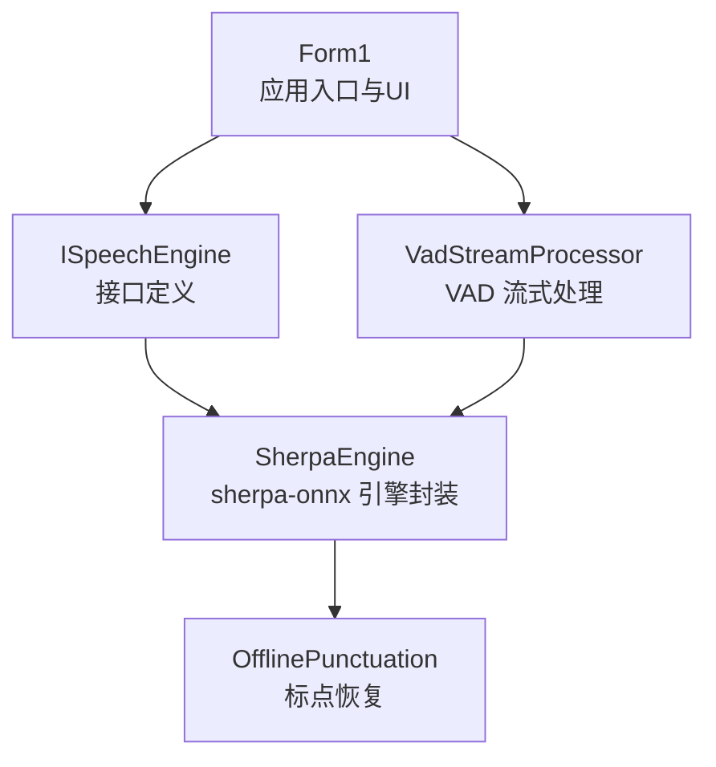
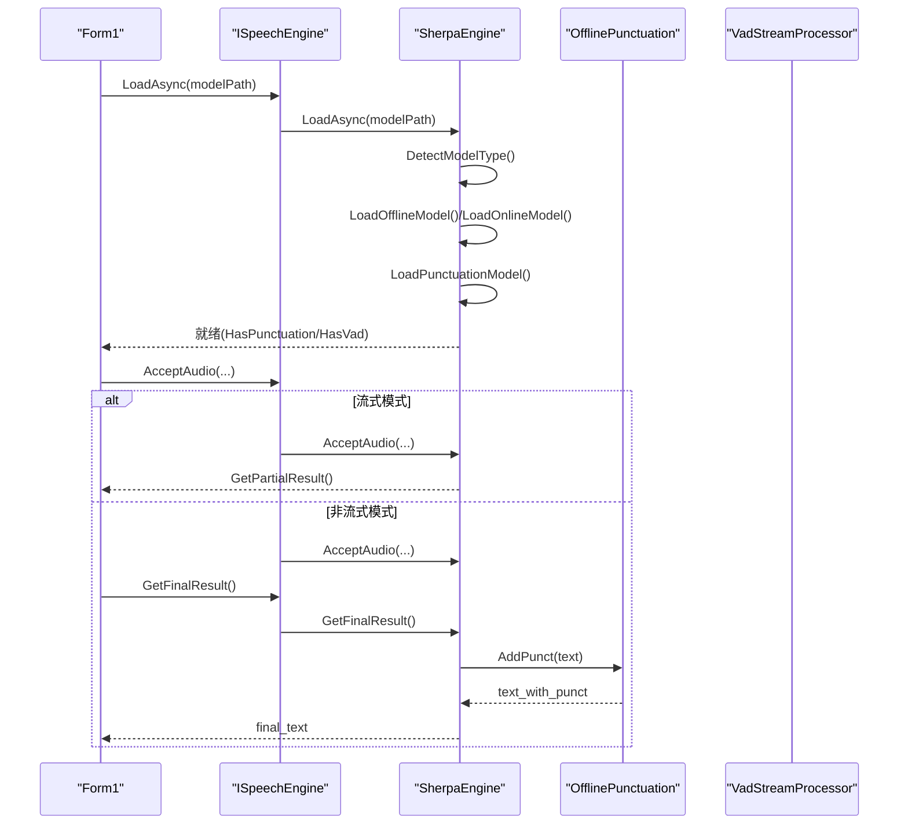
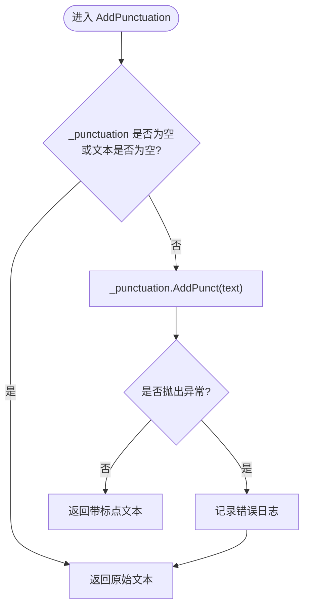
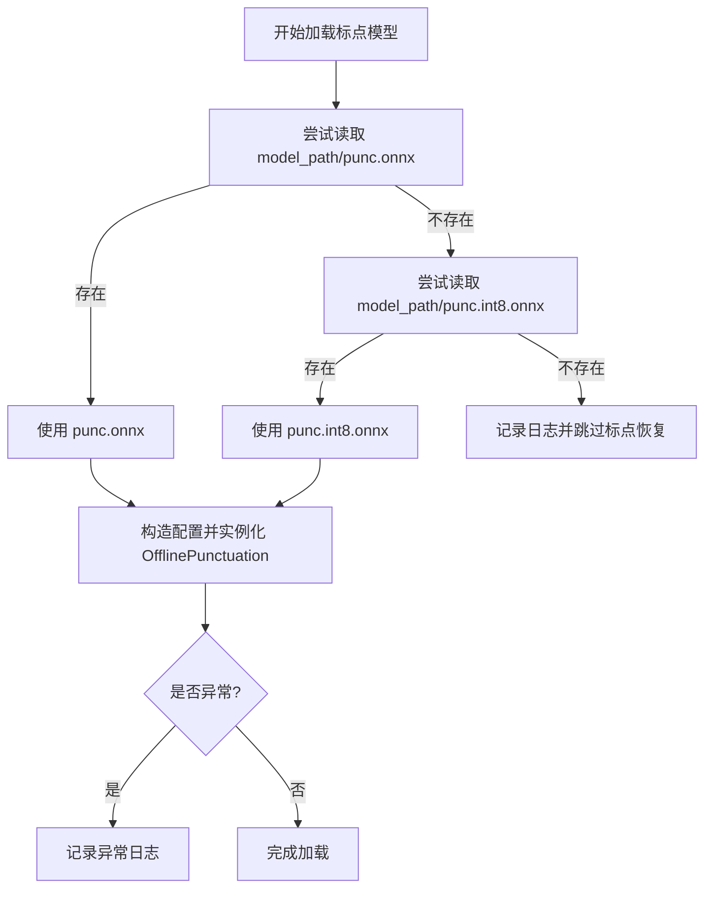
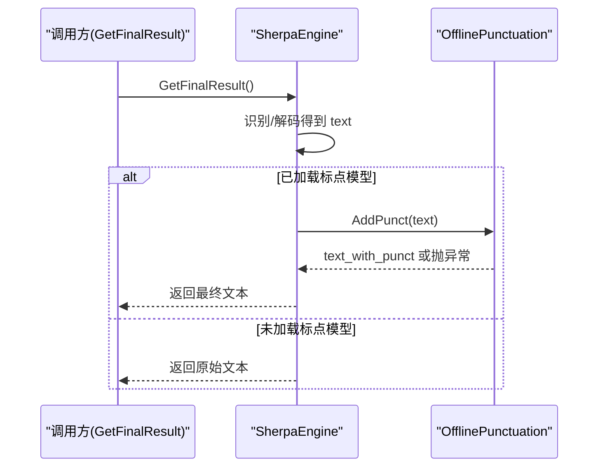
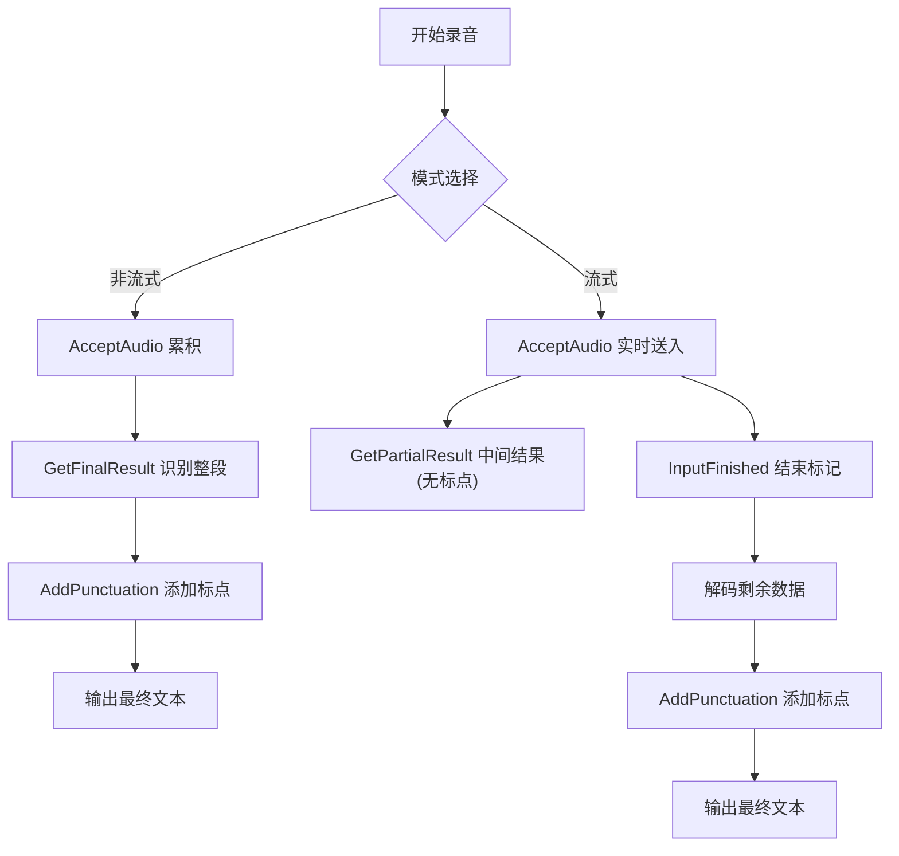
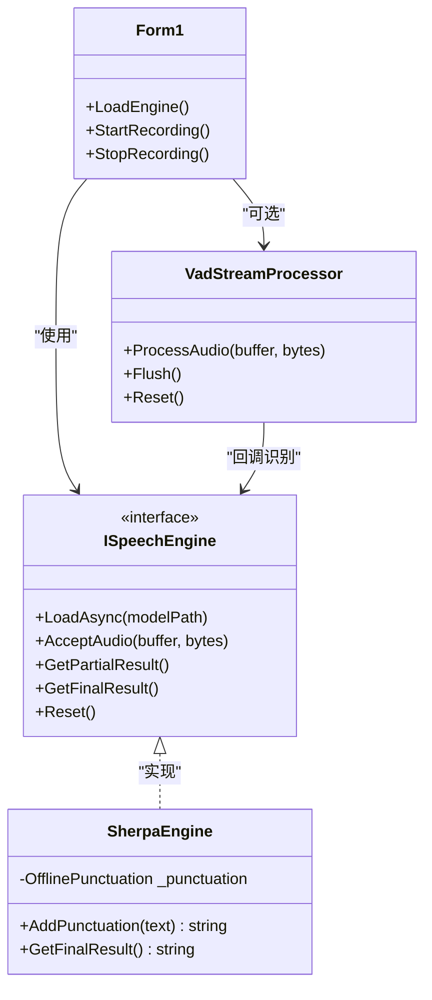
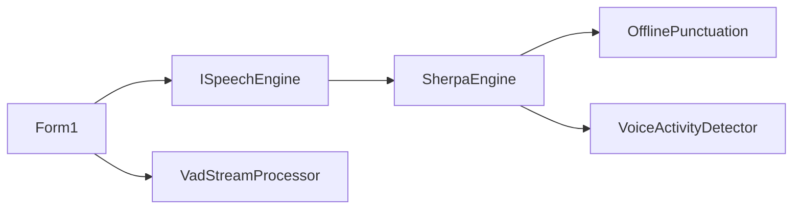

# 标点恢复系统

<cite>
**本文引用的文件**
- [SherpaEngine.cs](file://t9s2t/Engines/SherpaEngine.cs)
- [ISpeechEngine.cs](file://t9s2t/Engines/ISpeechEngine.cs)
- [VadStreamProcessor.cs](file://t9s2t/Engines/VadStreamProcessor.cs)
- [Form1.cs](file://t9s2t/Form1.cs)
</cite>

## 目录
1. [简介](#简介)
2. [项目结构](#项目结构)
3. [核心组件](#核心组件)
4. [架构总览](#架构总览)
5. [详细组件分析](#详细组件分析)
6. [依赖关系分析](#依赖关系分析)
7. [性能与配置](#性能与配置)
8. [故障排除指南](#故障排除指南)
9. [结论](#结论)

## 简介
本技术文档聚焦于 SherpaEngine 的标点恢复子系统，系统性阐述以下要点：
- 标点恢复功能的实现原理与集成位置（非流式与流式模式）
- OfflinePunctuation 组件的加载、调用与错误处理策略
- 标点模型文件加载机制（支持 punc.onnx 与 punc.int8.onnx）
- AddPunctuation 方法的调用流程与异常回退策略
- 在识别结果处理流程中的接入点与差异
- 标点模型的配置参数说明（NumThreads、Debug）
- 效果评估方法与常见问题排查建议

## 项目结构
本项目采用分层组织方式：
- 引擎层：语音识别引擎抽象与具体实现（SherpaEngine）
- 辅助处理器：VAD 流式处理器（VadStreamProcessor）
- UI 与编排：主窗体（Form1）负责模型检测、引擎创建与生命周期管理

图表来源
- [Form1.cs](file://t9s2t/Form1.cs)
- [ISpeechEngine.cs](file://t9s2t/Engines/ISpeechEngine.cs)
- [SherpaEngine.cs](file://t9s2t/Engines/SherpaEngine.cs)
- [VadStreamProcessor.cs](file://t9s2t/Engines/VadStreamProcessor.cs)

章节来源
- [Form1.cs](file://t9s2t/Form1.cs)
- [ISpeechEngine.cs](file://t9s2t/Engines/ISpeechEngine.cs)
- [SherpaEngine.cs](file://t9s2t/Engines/SherpaEngine.cs)
- [VadStreamProcessor.cs](file://t9s2t/Engines/VadStreamProcessor.cs)

## 核心组件
- ISpeechEngine：定义统一的语音识别引擎接口，包括加载、音频输入、部分/最终结果获取、重置等。
- SherpaEngine：基于 sherpa-onnx 的具体实现，支持 SenseVoice、离线 Paraformer、流式 Paraformer；内置标点恢复与可选 VAD。
- VadStreamProcessor：将非流式模型模拟为“类流式”体验，通过静音检测分段提交识别。

章节来源
- [ISpeechEngine.cs](file://t9s2t/Engines/ISpeechEngine.cs)
- [SherpaEngine.cs](file://t9s2t/Engines/SherpaEngine.cs)
- [VadStreamProcessor.cs](file://t9s2t/Engines/VadStreamProcessor.cs)

## 架构总览
下图展示从 UI 到引擎再到标点恢复的整体数据流与控制流。

图表来源
- [Form1.cs](file://t9s2t/Form1.cs)
- [ISpeechEngine.cs](file://t9s2t/Engines/ISpeechEngine.cs)
- [SherpaEngine.cs](file://t9s2t/Engines/SherpaEngine.cs)

## 详细组件分析

### 标点恢复组件（OfflinePunctuation）集成与使用
- 加载时机：在引擎初始化阶段统一调用 LoadPunctuationModel，优先查找 punc.onnx，不存在则回退至 punc.int8.onnx；若均不存在则跳过标点功能并记录日志。
- 配置项：
  - CtTransformer：指向标点模型 ONNX 文件路径
  - NumThreads：推理线程数（默认 2）
  - Debug：调试开关（默认 0）
- 调用入口：AddPunctuation(string text)
  - 当 _punctuation 为空或文本为空时直接返回原文
  - 成功时返回带标点的文本，失败时捕获异常并返回原文，保证识别链路健壮性

图表来源
- [SherpaEngine.cs](file://t9s2t/Engines/SherpaEngine.cs)

章节来源
- [SherpaEngine.cs](file://t9s2t/Engines/SherpaEngine.cs)

### 标点模型文件加载机制
- 文件优先级：
  - 首选：model_path/punc.onnx
  - 备选：model_path/punc.int8.onnx
  - 缺失：跳过标点恢复，不影响其他功能
- 加载过程：
  - 构造 OfflinePunctuationConfig -> OfflinePunctuationModelConfig
  - 设置 CtTransformer、NumThreads、Debug
  - 实例化 OfflinePunctuation
  - 异常捕获并记录日志，不中断引擎启动

图表来源
- [SherpaEngine.cs](file://t9s2t/Engines/SherpaEngine.cs)

章节来源
- [SherpaEngine.cs](file://t9s2t/Engines/SherpaEngine.cs)

### AddPunctuation 方法调用流程与错误处理
- 调用位置：
  - 非流式：GetFinalResult 中识别完成后对文本执行标点恢复
  - 流式：GetFinalResult 在 InputFinished 后解码完毕再执行标点恢复
- 错误处理策略：
  - 内部 try/catch 捕获异常，记录日志并回退为未加标点的原文
  - 上层调用无需感知异常，确保用户体验稳定

图表来源
- [SherpaEngine.cs](file://t9s2t/Engines/SherpaEngine.cs)

章节来源
- [SherpaEngine.cs](file://t9s2t/Engines/SherpaEngine.cs)

### 标点恢复在识别流程中的集成位置（流式 vs 非流式）
- 非流式模式：
  - AcceptAudio 累积音频片段
  - GetFinalResult 一次性识别整段音频，随后调用 AddPunctuation
- 流式模式：
  - AcceptAudio 实时送入 OnlineStream
  - GetPartialResult 提供中间结果（不包含标点）
  - GetFinalResult 在 InputFinished 后解码剩余数据，再进行标点恢复
  - GetResultAndReset 用于录音中途分句（不调用 InputFinished），该路径不执行标点恢复

图表来源
- [SherpaEngine.cs](file://t9s2t/Engines/SherpaEngine.cs)

章节来源
- [SherpaEngine.cs](file://t9s2t/Engines/SherpaEngine.cs)

### 与 VAD 流式处理的协作（SenseVoice 场景）
- 当使用非流式模型（如 SenseVoice）时，Form1 会启用 VadStreamProcessor 模拟流式：
  - 根据能量阈值判断静音/语音
  - 达到静音阈值后提交一段语音进行识别
  - 识别结果由引擎返回，标点恢复在引擎内部完成
- 对于原生流式引擎（Paraformer Online），不使用 VAD，直接使用 OnlineRecognizer 的端点检测

图表来源
- [Form1.cs](file://t9s2t/Form1.cs)
- [ISpeechEngine.cs](file://t9s2t/Engines/ISpeechEngine.cs)
- [SherpaEngine.cs](file://t9s2t/Engines/SherpaEngine.cs)
- [VadStreamProcessor.cs](file://t9s2t/Engines/VadStreamProcessor.cs)

章节来源
- [Form1.cs](file://t9s2t/Form1.cs)
- [VadStreamProcessor.cs](file://t9s2t/Engines/VadStreamProcessor.cs)

## 依赖关系分析
- 外部依赖：
  - sherpa-onnx 运行时（C API DLL）
  - ONNX Runtime（onnxruntime.dll）
- 内部依赖：
  - Form1 依赖 ISpeechEngine 抽象，实际运行期绑定 SherpaEngine
  - SherpaEngine 依赖 OfflinePunctuation（可选）、VAD（可选）
- 耦合与内聚：
  - 标点恢复逻辑集中在 SherpaEngine 内部，对外暴露 AddPunctuation 与 HasPunctuation 属性，便于 UI 显示能力状态
  - VadStreamProcessor 与引擎解耦，通过回调与接口交互，提升可替换性

图表来源
- [Form1.cs](file://t9s2t/Form1.cs)
- [ISpeechEngine.cs](file://t9s2t/Engines/ISpeechEngine.cs)
- [SherpaEngine.cs](file://t9s2t/Engines/SherpaEngine.cs)
- [VadStreamProcessor.cs](file://t9s2t/Engines/VadStreamProcessor.cs)

章节来源
- [Form1.cs](file://t9s2t/Form1.cs)
- [ISpeechEngine.cs](file://t9s2t/Engines/ISpeechEngine.cs)
- [SherpaEngine.cs](file://t9s2t/Engines/SherpaEngine.cs)
- [VadStreamProcessor.cs](file://t9s2t/Engines/VadStreamProcessor.cs)

## 性能与配置
- 标点模型配置参数
  - NumThreads：控制标点推理并行度，默认 2。可根据 CPU 核数与应用并发需求调整
  - Debug：调试开关，默认 0。开启后可获得更详细的运行日志，便于定位问题
- 识别引擎线程配置
  - 非流式/流式识别器均设置了 NumThreads 与 Debug，默认值分别为 4 与 0
- 内存与吞吐
  - 非流式模式需缓存整段音频，适合短语音；长语音建议使用流式模式降低峰值内存
  - 标点恢复在最终文本生成后进行，对实时性影响较小；可在高并发场景下适当降低 NumThreads 以平衡 CPU 占用

[本节为通用性能指导，不涉及特定代码行引用]

## 故障排除指南
- 现象：未检测到标点功能
  - 可能原因：模型目录缺少 punc.onnx 与 punc.int8.onnx
  - 处理：确认模型包包含标点模型文件；检查日志中“未找到标点模型”提示
- 现象：标点恢复失败但识别正常
  - 可能原因：标点模型加载异常或推理异常
  - 处理：查看“标点模型加载失败/标点恢复失败”日志；确认模型文件完整且路径正确
- 现象：流式模式下标点未生效
  - 可能原因：使用了 GetResultAndReset 路径（中途分句），该路径不执行标点恢复
  - 处理：如需标点，请在录音结束时调用 GetFinalResult
- 现象：CPU 占用偏高
  - 可能原因：NumThreads 设置过高或同时运行多个引擎实例
  - 处理：适当降低 NumThreads；避免重复创建引擎实例；复用已有实例

章节来源
- [SherpaEngine.cs](file://t9s2t/Engines/SherpaEngine.cs)

## 结论
本系统通过 SherpaEngine 将标点恢复无缝集成到识别流程中，具备以下特点：
- 自动检测并加载两种格式的标点模型（fp32/int8），缺失时优雅降级
- 在非流式与流式模式下均在最终文本生成后执行标点恢复，保障稳定性
- 完善的错误处理与日志记录，确保异常不会中断整体识别链路
- 提供可调的 NumThreads 与 Debug 参数，便于在不同硬件与场景下优化性能