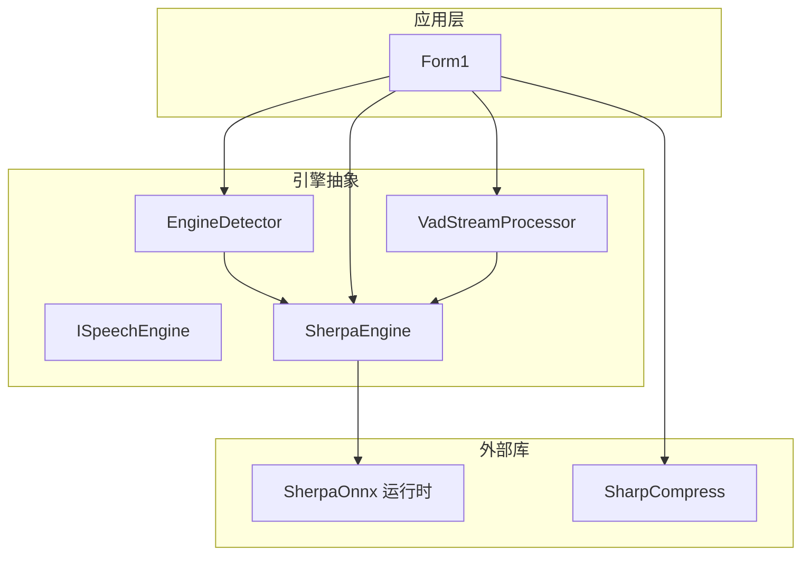
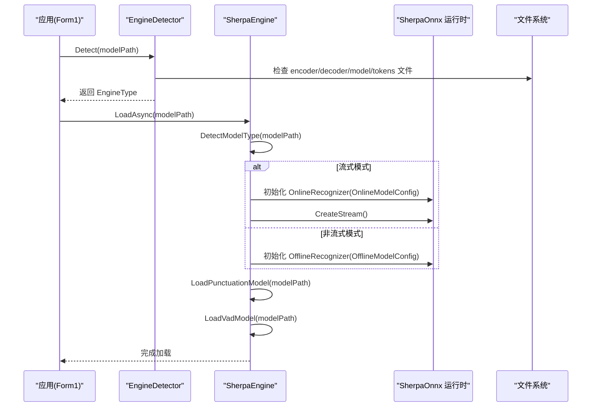
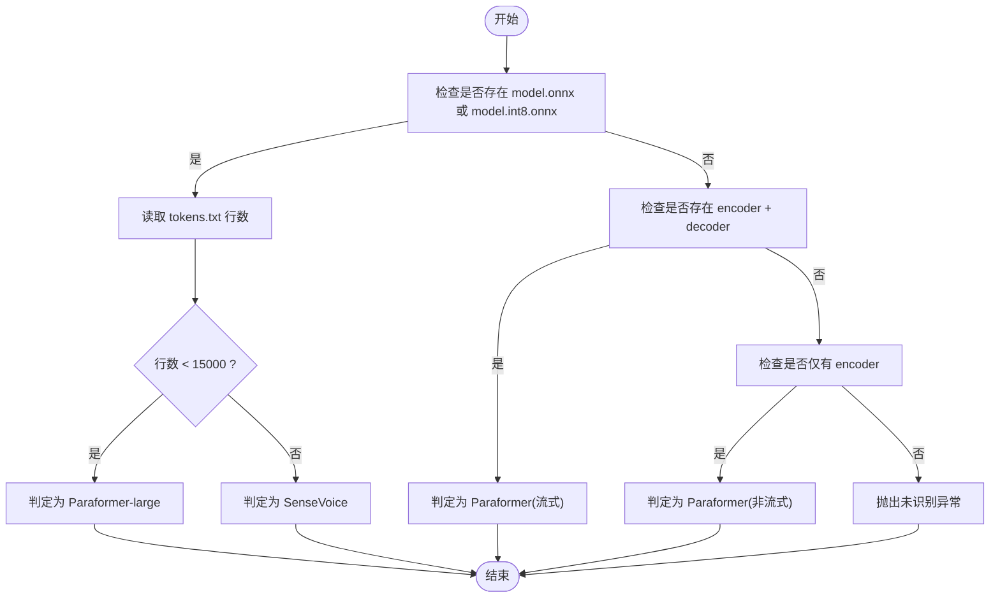
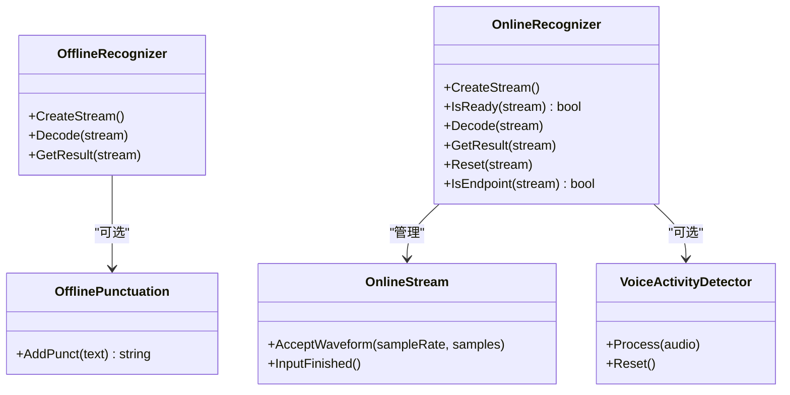
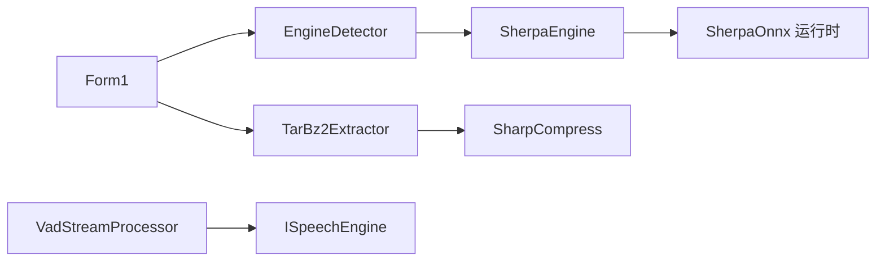

# 模型加载机制

<cite>
**本文引用的文件列表**
- [SherpaEngine.cs](file://t9s2t/Engines/SherpaEngine.cs)
- [EngineDetector.cs](file://t9s2t/Engines/EngineDetector.cs)
- [ISpeechEngine.cs](file://t9s2t/Engines/ISpeechEngine.cs)
- [VadStreamProcessor.cs](file://t9s2t/Engines/VadStreamProcessor.cs)
- [TarBz2Extractor.cs](file://t9s2t/Engines/TarBz2Extractor.cs)
- [Form1.cs](file://t9s2t/Form1.cs)
</cite>

## 目录
1. [简介](#简介)
2. [项目结构](#项目结构)
3. [核心组件](#核心组件)
4. [架构总览](#架构总览)
5. [详细组件分析](#详细组件分析)
6. [依赖关系分析](#依赖关系分析)
7. [性能考量](#性能考量)
8. [故障排查指南](#故障排查指南)
9. [结论](#结论)
10. [附录：配置与示例](#附录配置与示例)

## 简介
本技术文档聚焦于 SherpaEngine 的模型加载机制，系统性阐述以下要点：
- 模型类型检测算法：自动识别 SenseVoice、Paraformer（非流式）、Paraformer-large（离线大模型）三种模型。
- 不同模型类型的文件结构要求与验证过程：如 model.int8.onnx、encoder.onnx、decoder.onnx、tokens.txt 等。
- 离线模式与流式模式的加载差异：OfflineRecognizer 与 OnlineRecognizer 的配置参数与行为差异。
- 模型文件路径解析策略与回退机制：优先使用 int8 量化版本，不存在时回退到 fp32。
- 完整模型配置示例与错误处理方案。
- 兼容性检查与调试技巧。

## 项目结构
本项目围绕语音识别引擎封装展开，关键代码位于 Engines 目录中：
- ISpeechEngine：统一引擎接口定义。
- EngineDetector：基于模型目录结构的引擎类型检测与工厂创建。
- SherpaEngine：sherpa-onnx 引擎封装，支持 SenseVoice、Paraformer（非流式/流式）。
- VadStreamProcessor：基于能量阈值的 VAD 分段器，用于将非流式模型模拟为“类流式”体验。
- TarBz2Extractor：压缩文件解压工具，辅助模型包部署。
- Form1：应用入口，集成引擎检测、加载与 UI 交互。

图表来源
- [Form1.cs](file://t9s2t/Form1.cs)
- [EngineDetector.cs](file://t9s2t/Engines/EngineDetector.cs)
- [ISpeechEngine.cs](file://t9s2t/Engines/ISpeechEngine.cs)
- [SherpaEngine.cs](file://t9s2t/Engines/SherpaEngine.cs)
- [VadStreamProcessor.cs](file://t9s2t/Engines/VadStreamProcessor.cs)
- [TarBz2Extractor.cs](file://t9s2t/Engines/TarBz2Extractor.cs)

章节来源
- [Form1.cs](file://t9s2t/Form1.cs)
- [EngineDetector.cs](file://t9s2t/Engines/EngineDetector.cs)
- [ISpeechEngine.cs](file://t9s2t/Engines/ISpeechEngine.cs)
- [SherpaEngine.cs](file://t9s2t/Engines/SherpaEngine.cs)
- [VadStreamProcessor.cs](file://t9s2t/Engines/VadStreamProcessor.cs)
- [TarBz2Extractor.cs](file://t9s2t/Engines/TarBz2Extractor.cs)

## 核心组件
- ISpeechEngine：定义统一的加载、音频输入、结果获取与重置接口，屏蔽底层实现差异。
- EngineDetector：根据模型目录中的文件特征推断引擎类型并返回对应实例。
- SherpaEngine：核心实现，负责：
  - 模型类型检测（SenseVoice / Paraformer / Paraformer-large）
  - 离线/流式两种识别路径
  - 标点恢复与 VAD 可选加载
  - 静音过滤与端点检测
- VadStreamProcessor：对非流式模型进行“伪流式”处理，按静音段落切分提交识别。
- TarBz2Extractor：提供 tar.bz2/tar.gz/zip 等格式的解压能力，便于模型包部署。

章节来源
- [ISpeechEngine.cs](file://t9s2t/Engines/ISpeechEngine.cs)
- [EngineDetector.cs](file://t9s2t/Engines/EngineDetector.cs)
- [SherpaEngine.cs](file://t9s2t/Engines/SherpaEngine.cs)
- [VadStreamProcessor.cs](file://t9s2t/Engines/VadStreamProcessor.cs)
- [TarBz2Extractor.cs](file://t9s2t/Engines/TarBz2Extractor.cs)

## 架构总览
下图展示了从应用启动到模型加载与识别的关键流程，包括模型类型检测、离线/流式分支、以及可选的标点与 VAD 模块。

图表来源
- [Form1.cs](file://t9s2t/Form1.cs)
- [EngineDetector.cs](file://t9s2t/Engines/EngineDetector.cs)
- [SherpaEngine.cs](file://t9s2t/Engines/SherpaEngine.cs)

## 详细组件分析

### 模型类型检测算法
SherpaEngine 与 EngineDetector 共同实现了三类模型的自动识别逻辑：
- SenseVoice：存在 model.int8.onnx 或 model.onnx，且 tokens.txt 行数较大（多语言大词表）。
- Paraformer-large（离线）：存在 model.int8.onnx 或 model.onnx，且 tokens.txt 行数较小（中文大模型词表）。
- Paraformer（非流式）：仅存在 encoder.int8.onnx 或 encoder.onnx（无 decoder）。
- Paraformer（流式）：同时存在 encoder 与 decoder 文件。

检测关键点：
- 通过 tokens.txt 的行数阈值区分 SenseVoice 与 Paraformer-large。
- 通过是否存在 decoder 文件区分流式与非流式 Paraformer。
- 若无法匹配任何已知结构，抛出异常提示目录不可识别。

图表来源
- [SherpaEngine.cs](file://t9s2t/Engines/SherpaEngine.cs)
- [EngineDetector.cs](file://t9s2t/Engines/EngineDetector.cs)

章节来源
- [SherpaEngine.cs](file://t9s2t/Engines/SherpaEngine.cs)
- [EngineDetector.cs](file://t9s2t/Engines/EngineDetector.cs)

### 模型文件结构与验证
不同模型类型的文件要求如下：
- SenseVoice（非流式）
  - 必需：model.int8.onnx 或 model.onnx；tokens.txt
  - 可选：punc.onnx/punc.int8.onnx（标点恢复）；vad.onnx（VAD）
- Paraformer-large（离线）
  - 必需：model.int8.onnx 或 model.onnx；tokens.txt
  - 可选：punc.onnx/punc.int8.onnx；vad.onnx
- Paraformer（非流式）
  - 必需：encoder.int8.onnx 或 encoder.onnx；tokens.txt
  - 可选：punc.onnx/punc.int8.onnx；vad.onnx
- Paraformer（流式）
  - 必需：encoder.int8.onnx 或 encoder.onnx；decoder.int8.onnx 或 decoder.onnx；tokens.txt
  - 可选：punc.onnx/punc.int8.onnx；vad.onnx

验证过程：
- 在加载前检查必要文件是否存在，缺失则抛出相应异常（如缺少 tokens.txt）。
- 对于离线大模型，优先选择 model.int8.onnx，不存在时回退到 model.onnx。
- 对于非流式 Paraformer，使用 encoder.int8.onnx 作为模型文件。
- 对于流式 Paraformer，必须同时提供 encoder 与 decoder 文件。

章节来源
- [SherpaEngine.cs](file://t9s2t/Engines/SherpaEngine.cs)

### 离线模式与流式模式加载差异
- 离线模式（OfflineRecognizer）
  - 配置项：采样率、特征维度、模型路径、词表路径、线程数、调试开关。
  - 行为：一次性接收整段音频后解码，适合批量或录音结束后出字场景。
  - 适用模型：SenseVoice、Paraformer-large、非流式 Paraformer。
- 流式模式（OnlineRecognizer）
  - 配置项：采样率、特征维度、编码器/解码器路径、词表路径、线程数、调试开关、端点检测规则（最小尾随静音时长、最短语句长度等）。
  - 行为：持续接收音频片段，边说边出字；支持 IsReady/Decode/GetResult 循环；InputFinished 后收尾解码。
  - 适用模型：流式 Paraformer。

图表来源
- [SherpaEngine.cs](file://t9s2t/Engines/SherpaEngine.cs)

章节来源
- [SherpaEngine.cs](file://t9s2t/Engines/SherpaEngine.cs)

### 路径解析策略与回退机制
- 优先使用 int8 量化版本（更小更快），不存在时回退到 fp32 版本。
- 离线大模型：model.int8.onnx -> model.onnx。
- 非流式 Paraformer：encoder.int8.onnx（无回退到 encoder.onnx 的逻辑，但检测阶段兼容两者）。
- 流式 Paraformer：encoder.int8.onnx + decoder.int8.onnx（检测阶段兼容 .onnx 后缀）。
- 标点模型：punc.onnx -> punc.int8.onnx。
- VAD 模型：vad.onnx（可选）。

章节来源
- [SherpaEngine.cs](file://t9s2t/Engines/SherpaEngine.cs)

### 配置参数说明
- 通用特征配置
  - SampleRate：16000 Hz
  - FeatureDim：80
- 离线模型配置（OfflineModelConfig）
  - SenseVoice：Model、Language、UseInverseTextNormalization
  - Paraformer：Model（指向 encoder 或 model 文件）
  - Tokens：词表路径
  - NumThreads：推理线程数
  - Debug：调试开关
- 流式模型配置（OnlineModelConfig）
  - Paraformer：Encoder、Decoder
  - Tokens：词表路径
  - NumThreads、Debug
  - EnableEndpoint：启用端点检测
  - Rule1MinTrailingSilence：长句后触发静音阈值
  - Rule2MinTrailingSilence：有结果后的静音阈值
  - Rule3MinUtteranceLength：强制分句长度
- 标点模型配置（OfflinePunctuationConfig）
  - CtTransformer：模型路径
  - NumThreads、Debug
- VAD 模型配置（VadModelConfig）
  - SileroVad：Model、Threshold、MinSilenceDuration、MinSpeechDuration、WindowSize、MaxSpeechDuration
  - SampleRate、NumThreads、Debug

章节来源
- [SherpaEngine.cs](file://t9s2t/Engines/SherpaEngine.cs)

### 错误处理与异常
- 目录不可识别：当模型目录不符合任何已知结构时抛出 DirectoryNotFoundException。
- 缺少 tokens.txt：在需要词表的加载路径中抛出 FileNotFoundException。
- 标点/VAD 加载失败：捕获异常并记录日志，不影响主识别流程。
- 流式识别异常：在 GetPartialResult/GetFinalResult 中捕获异常并返回空结果，避免崩溃。

章节来源
- [SherpaEngine.cs](file://t9s2t/Engines/SherpaEngine.cs)

### 调试技巧
- 开启 Debug 输出：在配置中将 Debug 设为 1，观察 sherpa-onnx 内部日志。
- 查看引擎名称与状态：通过 EngineName、IsLoaded、SupportsStreaming 属性判断当前运行模式。
- 端点检测调试：调用 IsEndpoint 检查静音触发情况，结合 Rule* 参数调整。
- 音量阈值调试：调整 SilenceThreshold 与连续静音帧计数，避免误触发或吞字。
- 模型文件完整性校验：确保 tokens.txt 存在且行数符合预期，避免类型误判。

章节来源
- [SherpaEngine.cs](file://t9s2t/Engines/SherpaEngine.cs)

## 依赖关系分析
- 应用层依赖 EngineDetector 进行模型类型检测与引擎实例创建。
- SherpaEngine 依赖 SherpaOnnx 运行时进行推理。
- VadStreamProcessor 依赖 ISpeechEngine 接口，解耦具体引擎实现。
- TarBz2Extractor 依赖 SharpCompress 库，提供跨平台解压能力。

图表来源
- [Form1.cs](file://t9s2t/Form1.cs)
- [EngineDetector.cs](file://t9s2t/Engines/EngineDetector.cs)
- [ISpeechEngine.cs](file://t9s2t/Engines/ISpeechEngine.cs)
- [SherpaEngine.cs](file://t9s2t/Engines/SherpaEngine.cs)
- [VadStreamProcessor.cs](file://t9s2t/Engines/VadStreamProcessor.cs)
- [TarBz2Extractor.cs](file://t9s2t/Engines/TarBz2Extractor.cs)

章节来源
- [Form1.cs](file://t9s2t/Form1.cs)
- [EngineDetector.cs](file://t9s2t/Engines/EngineDetector.cs)
- [ISpeechEngine.cs](file://t9s2t/Engines/ISpeechEngine.cs)
- [SherpaEngine.cs](file://t9s2t/Engines/SherpaEngine.cs)
- [VadStreamProcessor.cs](file://t9s2t/Engines/VadStreamProcessor.cs)
- [TarBz2Extractor.cs](file://t9s2t/Engines/TarBz2Extractor.cs)

## 性能考量
- 优先使用 int8 量化模型：减小内存占用与推理延迟。
- 合理设置线程数：NumThreads 影响 CPU 利用率与吞吐，需根据设备核数调优。
- 流式端点参数调优：Rule1/Rule2/Rule3 平衡出字速度与误触发风险。
- 静音阈值与连续静音帧：避免噪音导致的假阳性与说话停顿导致的过早截断。
- 标点与 VAD 可选加载：按需启用，减少额外开销。

[本节为通用指导，不直接分析具体文件]

## 故障排查指南
- 模型目录不可识别
  - 现象：抛出 DirectoryNotFoundException。
  - 排查：确认目录包含 model/encoder/decoder 与 tokens.txt 的正确组合。
- 缺少 tokens.txt
  - 现象：抛出 FileNotFoundException。
  - 排查：确保词表文件存在且可读。
- 流式识别结果为空
  - 现象：GetPartialResult/GetFinalResult 返回 null。
  - 排查：检查端点检测参数、静音阈值、音频数据格式（16kHz/16bit PCM）。
- 标点恢复失败
  - 现象：日志显示标点模型加载失败。
  - 排查：确认 punc.onnx/punc.int8.onnx 存在且路径正确。
- VAD 未生效
  - 现象：HasVad 为 false。
  - 排查：确认 vad.onnx 存在且加载成功。

章节来源
- [SherpaEngine.cs](file://t9s2t/Engines/SherpaEngine.cs)

## 结论
SherpaEngine 通过严谨的模型类型检测、灵活的路径回退策略与完善的错误处理，实现了对 SenseVoice、Paraformer（非流式/流式）的统一封装。其离线与流式双路径设计兼顾了批处理与实时场景，配合可选的标点与 VAD 模块，提供了高可用性与可配置性。建议在实际部署中优先采用 int8 量化模型，并根据设备与应用需求调优端点与静音参数，以获得最佳性能与用户体验。

[本节为总结，不直接分析具体文件]

## 附录：配置与示例

### 模型目录结构示例
- SenseVoice（非流式）
  - model.int8.onnx 或 model.onnx
  - tokens.txt
  - 可选：punc.onnx/punc.int8.onnx；vad.onnx
- Paraformer-large（离线）
  - model.int8.onnx 或 model.onnx
  - tokens.txt
  - 可选：punc.onnx/punc.int8.onnx；vad.onnx
- Paraformer（非流式）
  - encoder.int8.onnx 或 encoder.onnx
  - tokens.txt
  - 可选：punc.onnx/punc.int8.onnx；vad.onnx
- Paraformer（流式）
  - encoder.int8.onnx 或 encoder.onnx
  - decoder.int8.onnx 或 decoder.onnx
  - tokens.txt
  - 可选：punc.onnx/punc.int8.onnx；vad.onnx

章节来源
- [SherpaEngine.cs](file://t9s2t/Engines/SherpaEngine.cs)

### 引擎创建与加载流程示例
- 使用 EngineDetector 自动检测并创建引擎实例。
- 调用 LoadAsync 异步加载模型。
- 根据 SupportsStreaming 决定使用 GetPartialResult 或 GetFinalResult。
- 可选：调用 AddPunctuation 进行标点恢复。

章节来源
- [EngineDetector.cs](file://t9s2t/Engines/EngineDetector.cs)
- [SherpaEngine.cs](file://t9s2t/Engines/SherpaEngine.cs)

### 流式端点与静音参数参考
- EnableEndpoint：启用端点检测。
- Rule1MinTrailingSilence：长句后静音阈值（秒）。
- Rule2MinTrailingSilence：有结果后的静音阈值（秒）。
- Rule3MinUtteranceLength：强制分句长度（秒）。
- SilenceThreshold：RMS 音量阈值（低于视为静音）。
- 连续静音帧计数：超过阈值停止送入模型，避免幻觉。

章节来源
- [SherpaEngine.cs](file://t9s2t/Engines/SherpaEngine.cs)

### 压缩模型包解压示例
- 支持 tar.bz2/tar.gz/zip 等格式。
- 使用 TarBz2Extractor.ExtractAsync 异步解压到目标目录。
- 解压完成后进行模型类型检测与引擎加载。

章节来源
- [TarBz2Extractor.cs](file://t9s2t/Engines/TarBz2Extractor.cs)