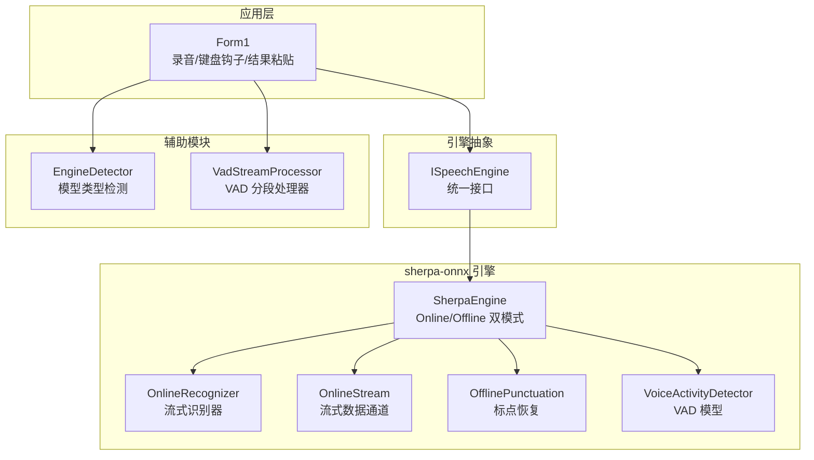
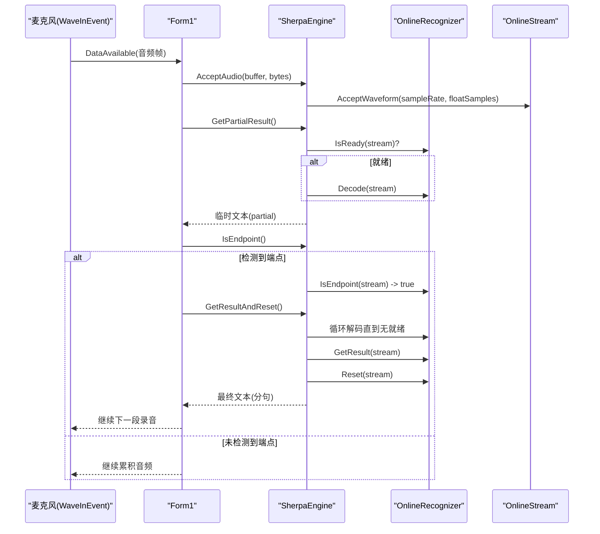
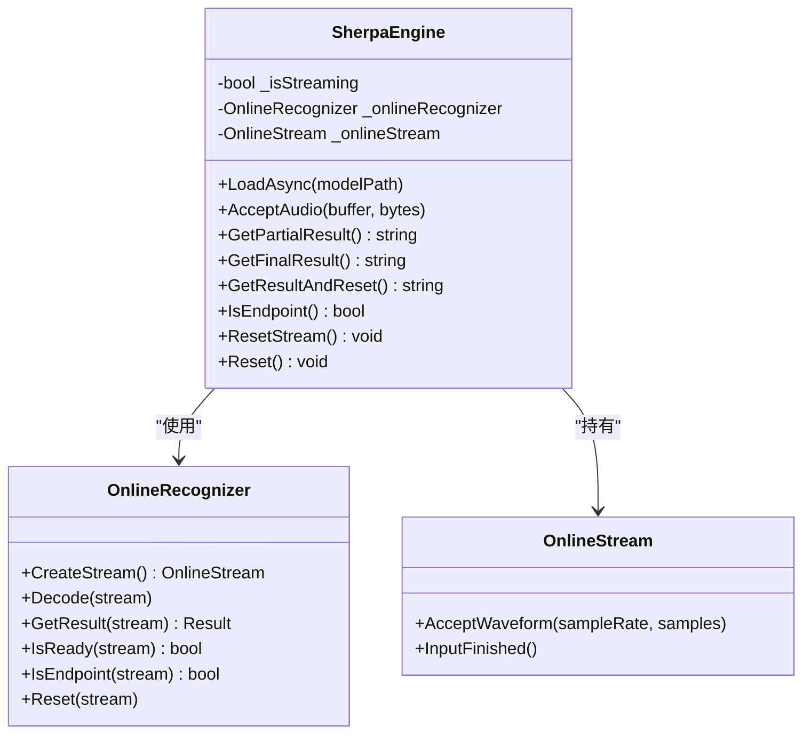
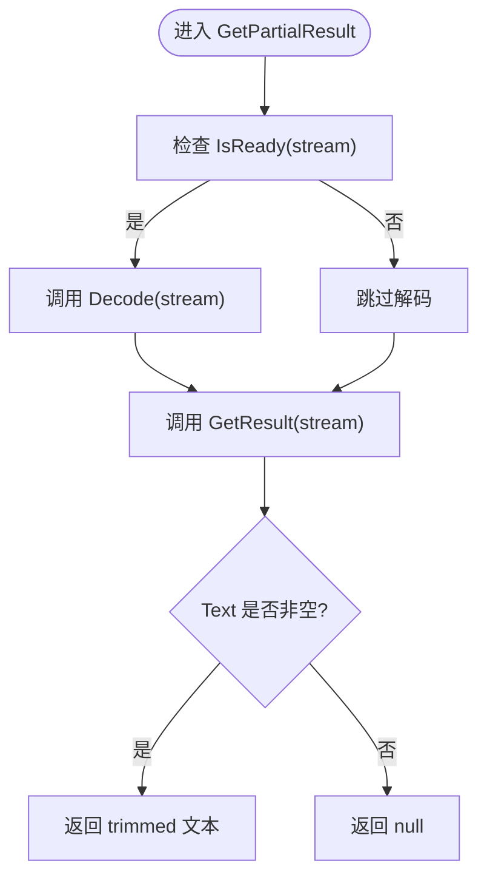
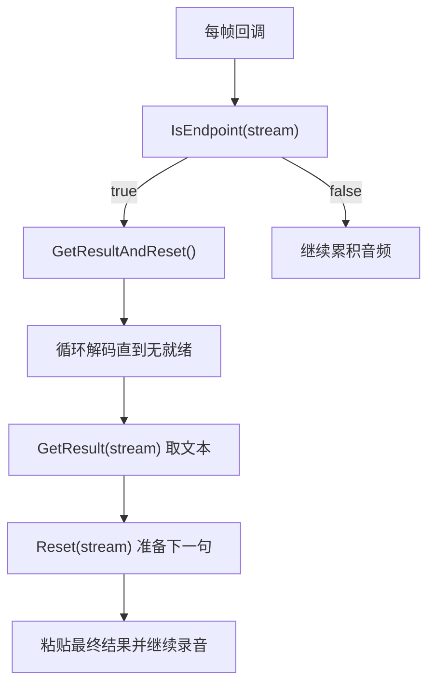
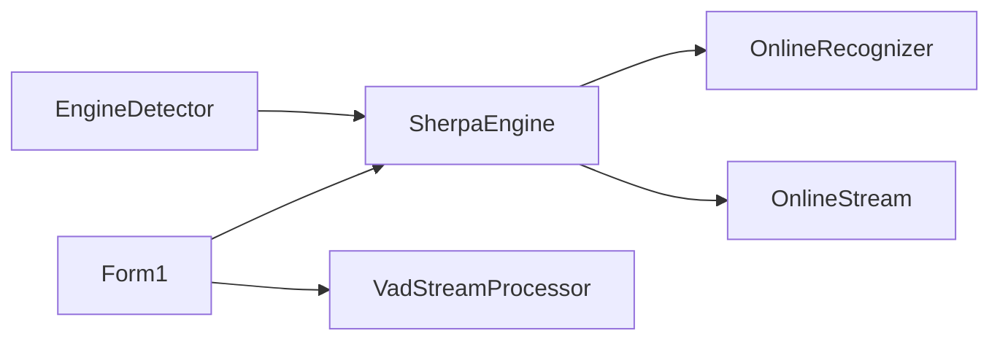

# 流式识别系统

<cite>
**本文引用的文件**
- [SherpaEngine.cs](file://t9s2t/Engines/SherpaEngine.cs)
- [ISpeechEngine.cs](file://t9s2t/Engines/ISpeechEngine.cs)
- [VadStreamProcessor.cs](file://t9s2t/Engines/VadStreamProcessor.cs)
- [EngineDetector.cs](file://t9s2t/Engines/EngineDetector.cs)
- [Form1.cs](file://t9s2t/Form1.cs)
</cite>

## 目录
1. [简介](#简介)
2. [项目结构](#项目结构)
3. [核心组件](#核心组件)
4. [架构总览](#架构总览)
5. [详细组件分析](#详细组件分析)
6. [依赖关系分析](#依赖关系分析)
7. [性能与调优](#性能与调优)
8. [故障排查指南](#故障排查指南)
9. [结论](#结论)

## 简介
本技术文档聚焦于 SherpaEngine 的流式识别子系统，围绕 OnlineRecognizer 与 OnlineStream 的协作机制、实时结果获取流程（GetPartialResult）、端点检测（IsEndpoint）与自动分句触发条件、流式模式下的结果重置策略（ResetStream 与 GetResultAndReset 的区别与应用场景），以及关键参数（Rule1MinTrailingSilence、Rule2MinTrailingSilence、Rule3MinUtteranceLength）的调优方法展开。同时给出错误处理与异常恢复建议，帮助读者在工程实践中稳定落地流式语音识别。

## 项目结构
本项目采用“引擎抽象 + 具体实现 + UI 集成”的分层组织方式：
- 引擎抽象接口 ISpeechEngine 定义统一的加载、音频输入、结果获取与重置能力。
- SherpaEngine 作为 sherpa-onnx 的具体实现，支持非流式与流式两种模式，并内置静音过滤、标点恢复与 VAD 模型加载。
- VadStreamProcessor 用于对非流式模型进行“类流式”分段识别（通过能量阈值与静音段判定）。
- EngineDetector 负责根据模型目录结构自动识别引擎类型并创建对应实例。
- Form1 负责录音采集、UI 交互、键盘钩子与结果粘贴输出，并在流式模式下驱动 IsEndpoint 与 GetResultAndReset 完成自动分句。

图表来源
- [Form1.cs:1057-1111](file://t9s2t/Form1.cs#L1057-L1111)
- [ISpeechEngine.cs:1-35](file://t9s2t/Engines/ISpeechEngine.cs#L1-L35)
- [SherpaEngine.cs:14-56](file://t9s2t/Engines/SherpaEngine.cs#L14-L56)
- [EngineDetector.cs:22-104](file://t9s2t/Engines/EngineDetector.cs#L22-L104)
- [VadStreamProcessor.cs:12-33](file://t9s2t/Engines/VadStreamProcessor.cs#L12-L33)

章节来源
- [ISpeechEngine.cs:1-35](file://t9s2t/Engines/ISpeechEngine.cs#L1-L35)
- [EngineDetector.cs:22-104](file://t9s2t/Engines/EngineDetector.cs#L22-L104)
- [SherpaEngine.cs:14-56](file://t9s2t/Engines/SherpaEngine.cs#L14-L56)
- [VadStreamProcessor.cs:12-33](file://t9s2t/Engines/VadStreamProcessor.cs#L12-L33)
- [Form1.cs:1057-1111](file://t9s2t/Form1.cs#L1057-L1111)

## 核心组件
- ISpeechEngine：定义 LoadAsync、AcceptAudio、GetPartialResult、GetFinalResult、Reset 等统一能力，屏蔽底层引擎差异。
- SherpaEngine：封装 sherpa-onnx 的 OfflineRecognizer 与 OnlineRecognizer/OnlineStream，提供流式与非流式识别、静音过滤、标点恢复与 VAD 加载。
- VadStreamProcessor：基于简单能量阈值的静音检测，将非流式模型包装为“类流式”体验。
- EngineDetector：依据模型目录中的 onnx/tokens 文件组合判断引擎类型，并返回对应的 SherpaEngine 实例。
- Form1：负责录音采集、按键钩子、流式端点检测与结果粘贴，串联整个识别链路。

章节来源
- [ISpeechEngine.cs:1-35](file://t9s2t/Engines/ISpeechEngine.cs#L1-L35)
- [SherpaEngine.cs:14-56](file://t9s2t/Engines/SherpaEngine.cs#L14-L56)
- [VadStreamProcessor.cs:12-33](file://t9s2t/Engines/VadStreamProcessor.cs#L12-L33)
- [EngineDetector.cs:22-104](file://t9s2t/Engines/EngineDetector.cs#L22-L104)
- [Form1.cs:1057-1111](file://t9s2t/Form1.cs#L1057-L1111)

## 架构总览
下图展示流式识别从麦克风到输出的完整时序，包括端点检测与自动分句。

图表来源
- [Form1.cs:1064-1111](file://t9s2t/Form1.cs#L1064-L1111)
- [SherpaEngine.cs:388-415](file://t9s2t/Engines/SherpaEngine.cs#L388-L415)
- [SherpaEngine.cs:485-509](file://t9s2t/Engines/SherpaEngine.cs#L485-L509)
- [SherpaEngine.cs:516-520](file://t9s2t/Engines/SherpaEngine.cs#L516-L520)

## 详细组件分析

### SherpaEngine 流式识别核心
- 在线识别初始化：当 streaming=true 时，构造 OnlineRecognizerConfig，启用端点检测并设置 Rule1/Rule2/Rule3 参数；随后创建 OnlineStream。
- 音频输入路径：AcceptAudio 在流式模式下计算 RMS 音量，若低于阈值且尚未检测到人声则丢弃；已检测到人声后，连续静音超过一定帧数也丢弃，避免“静音幻觉”。否则将 PCM 转换为浮点样本并送入 OnlineStream。
- 实时结果：GetPartialResult 先检查 IsReady，必要时调用 Decode，再取 GetResult 的 Text 作为临时结果。
- 最终结果：GetFinalResult 会调用 InputFinished 通知结束，循环解码直至无就绪，然后取最终结果并 Reset stream。
- 中间最终结果与重置：GetResultAndReset 不调用 InputFinished，仅解码所有就绪数据并取结果，然后 Reset stream，适合录音中自动分句。
- 端点检测：IsEndpoint 直接委托给 OnlineRecognizer.IsEndpoint。
- 流重置：ResetStream 仅对当前 stream 执行 Reset；Reset 还会清理内部状态与 VAD。

图表来源
- [SherpaEngine.cs:220-255](file://t9s2t/Engines/SherpaEngine.cs#L220-L255)
- [SherpaEngine.cs:351-384](file://t9s2t/Engines/SherpaEngine.cs#L351-L384)
- [SherpaEngine.cs:388-415](file://t9s2t/Engines/SherpaEngine.cs#L388-L415)
- [SherpaEngine.cs:417-479](file://t9s2t/Engines/SherpaEngine.cs#L417-L479)
- [SherpaEngine.cs:485-509](file://t9s2t/Engines/SherpaEngine.cs#L485-L509)
- [SherpaEngine.cs:516-531](file://t9s2t/Engines/SherpaEngine.cs#L516-L531)

章节来源
- [SherpaEngine.cs:220-255](file://t9s2t/Engines/SherpaEngine.cs#L220-L255)
- [SherpaEngine.cs:351-384](file://t9s2t/Engines/SherpaEngine.cs#L351-L384)
- [SherpaEngine.cs:388-415](file://t9s2t/Engines/SherpaEngine.cs#L388-L415)
- [SherpaEngine.cs:417-479](file://t9s2t/Engines/SherpaEngine.cs#L417-L479)
- [SherpaEngine.cs:485-509](file://t9s2t/Engines/SherpaEngine.cs#L485-L509)
- [SherpaEngine.cs:516-531](file://t9s2t/Engines/SherpaEngine.cs#L516-L531)

### 实时结果获取流程与 IsReady 状态检查
- 每收到一帧音频，UI 层调用 GetPartialResult。
- SherpaEngine 内部先判断 IsReady，若为真则 Decode，确保最新特征已被推理。
- 随后读取 GetResult 的 Text 作为 partial 结果返回。
- UI 层对 partial 做节流与去重，避免频繁更新造成闪烁。

图表来源
- [SherpaEngine.cs:388-415](file://t9s2t/Engines/SherpaEngine.cs#L388-L415)
- [Form1.cs:1086-1098](file://t9s2t/Form1.cs#L1086-L1098)

章节来源
- [SherpaEngine.cs:388-415](file://t9s2t/Engines/SherpaEngine.cs#L388-L415)
- [Form1.cs:1086-1098](file://t9s2t/Form1.cs#L1086-L1098)

### 端点检测与自动分句触发条件
- 端点检测由 OnlineRecognizer 内部规则驱动，SherpaEngine 暴露 IsEndpoint 供上层轮询。
- 默认配置：
  - Rule1MinTrailingSilence=1.2f：长句后约 1.2 秒静音触发分句。
  - Rule2MinTrailingSilence=0.5f：已有识别结果后约 0.5 秒静音触发分句（防止说话中停顿误触发）。
  - Rule3MinUtteranceLength=12.0f：超过 12 秒强制分句。
- UI 层在每帧回调中调用 IsEndpoint，若为真则调用 GetResultAndReset 获取当前分句的最终结果并重置 stream，从而在不中断录音的情况下实现自动分句。

图表来源
- [SherpaEngine.cs:247-250](file://t9s2t/Engines/SherpaEngine.cs#L247-L250)
- [SherpaEngine.cs:516-520](file://t9s2t/Engines/SherpaEngine.cs#L516-L520)
- [SherpaEngine.cs:485-509](file://t9s2t/Engines/SherpaEngine.cs#L485-L509)
- [Form1.cs:1076-1083](file://t9s2t/Form1.cs#L1076-L1083)

章节来源
- [SherpaEngine.cs:247-250](file://t9s2t/Engines/SherpaEngine.cs#L247-L250)
- [SherpaEngine.cs:516-520](file://t9s2t/Engines/SherpaEngine.cs#L516-L520)
- [SherpaEngine.cs:485-509](file://t9s2t/Engines/SherpaEngine.cs#L485-L509)
- [Form1.cs:1076-1083](file://t9s2t/Form1.cs#L1076-L1083)

### 流式模式下的结果重置策略：ResetStream 与 GetResultAndReset
- ResetStream：仅对当前 stream 执行 Reset，不取结果。适用于需要手动清空上下文但保留后续录音的场景。
- GetResultAndReset：先解码所有就绪数据，取当前结果，再 Reset stream。适合录音中自动分句，既得到当前分句的最终文本，又立即释放上下文以便下一句识别。
- 区别要点：
  - GetResultAndReset 包含“取结果 + 重置”，而 ResetStream 只重置。
  - GetResultAndReset 不会调用 InputFinished，因此不影响后续音频继续流入。

章节来源
- [SherpaEngine.cs:485-509](file://t9s2t/Engines/SherpaEngine.cs#L485-L509)
- [SherpaEngine.cs:524-531](file://t9s2t/Engines/SherpaEngine.cs#L524-L531)

### 非流式模型的“类流式”处理：VadStreamProcessor
- 通过能量阈值与连续静音帧计数，将非流式模型（如 SenseVoice）包装为“类流式”：检测到静音段落即提交识别并返回结果。
- 适用于不支持原生流式的模型，提升用户体验。

章节来源
- [VadStreamProcessor.cs:12-33](file://t9s2t/Engines/VadStreamProcessor.cs#L12-L33)
- [VadStreamProcessor.cs:38-86](file://t9s2t/Engines/VadStreamProcessor.cs#L38-L86)
- [VadStreamProcessor.cs:114-136](file://t9s2t/Engines/VadStreamProcessor.cs#L114-L136)

## 依赖关系分析
- 引擎选择：EngineDetector 根据模型目录中的文件组合判断引擎类型，并创建对应的 SherpaEngine 实例（streaming=true/false）。
- UI 集成：Form1 根据 SupportsStreaming 决定走原生流式（SherpaEngine）还是 VAD 模拟流式（VadStreamProcessor）。
- 资源管理：SherpaEngine 在 Dispose 中释放 OnlineStream、OnlineRecognizer、OfflineRecognizer、标点与 VAD 对象。

图表来源
- [EngineDetector.cs:80-104](file://t9s2t/Engines/EngineDetector.cs#L80-L104)
- [Form1.cs:664-721](file://t9s2t/Form1.cs#L664-L721)
- [SherpaEngine.cs:591-605](file://t9s2t/Engines/SherpaEngine.cs#L591-L605)

章节来源
- [EngineDetector.cs:80-104](file://t9s2t/Engines/EngineDetector.cs#L80-L104)
- [Form1.cs:664-721](file://t9s2t/Form1.cs#L664-L721)
- [SherpaEngine.cs:591-605](file://t9s2t/Engines/SherpaEngine.cs#L591-L605)

## 性能与调优
- 端点检测参数调优
  - Rule1MinTrailingSilence：控制长句后的静音阈值，增大可减少误切分，但可能延迟出字；减小可更快切分，但易在自然停顿处误触发。
  - Rule2MinTrailingSilence：针对已有识别结果后的静音阈值，适当降低可提升响应速度，但需警惕说话中停顿导致的误切分。
  - Rule3MinUtteranceLength：最大语句长度上限，超过则强制分句，避免超长语句导致内存或延迟问题。
- 静音过滤与 RMS 阈值
  - 在 AcceptAudio 中对低音量片段进行丢弃，有助于减少噪声与“静音幻觉”。可根据麦克风增益与环境噪声调整 SilenceThreshold 与连续静音帧阈值。
- 线程与解码频率
  - GetPartialResult 仅在 IsReady 时 Decode，避免过度解码；UI 层对 partial 做了节流与去重，降低 UI 刷新压力。
- 标点与 VAD
  - 可选加载标点模型与 VAD 模型，按需开启以平衡识别质量与性能。

章节来源
- [SherpaEngine.cs:247-250](file://t9s2t/Engines/SherpaEngine.cs#L247-L250)
- [SherpaEngine.cs:351-384](file://t9s2t/Engines/SherpaEngine.cs#L351-L384)
- [SherpaEngine.cs:388-415](file://t9s2t/Engines/SherpaEngine.cs#L388-L415)
- [Form1.cs:1086-1098](file://t9s2t/Form1.cs#L1086-L1098)

## 故障排查指南
- 常见异常与处理
  - 流式 partial 识别失败：GetPartialResult 捕获异常并记录日志，返回 null，避免中断主流程。
  - 流式 final 识别失败：GetFinalResult 捕获异常并记录日志，返回 null。
  - GetResultAndReset 失败：捕获异常并记录日志，返回 null。
  - 非流式识别失败：捕获异常并记录日志，清理缓冲区后返回 null。
- 恢复策略
  - 每次识别结束后调用 Reset 或 ResetStream，确保上下文干净。
  - 对于异常分支，保持 UI 提示与重试逻辑，保证用户体验。
- 调试建议
  - 关注控制台日志输出，定位具体失败环节。
  - 调整端点检测参数与静音阈值，观察误切分与延迟情况。

章节来源
- [SherpaEngine.cs:388-415](file://t9s2t/Engines/SherpaEngine.cs#L388-L415)
- [SherpaEngine.cs:417-479](file://t9s2t/Engines/SherpaEngine.cs#L417-L479)
- [SherpaEngine.cs:485-509](file://t9s2t/Engines/SherpaEngine.cs#L485-L509)

## 结论
SherpaEngine 的流式识别子系统通过 OnlineRecognizer 与 OnlineStream 的紧密协作，实现了边说边出的低延迟体验。结合端点检测与自动分句，可在不中断录音的前提下稳定产出分句结果。通过合理配置 Rule1/Rule2/Rule3 与静音过滤阈值，可在“出字速度”和“误切分风险”之间取得良好平衡。完善的异常捕获与重置策略进一步提升了系统的鲁棒性。