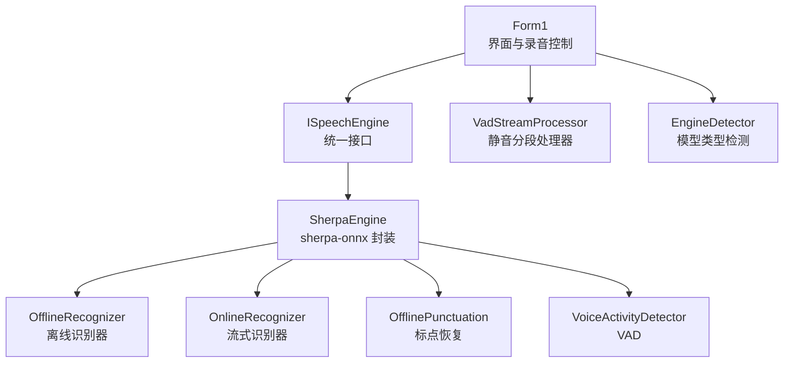
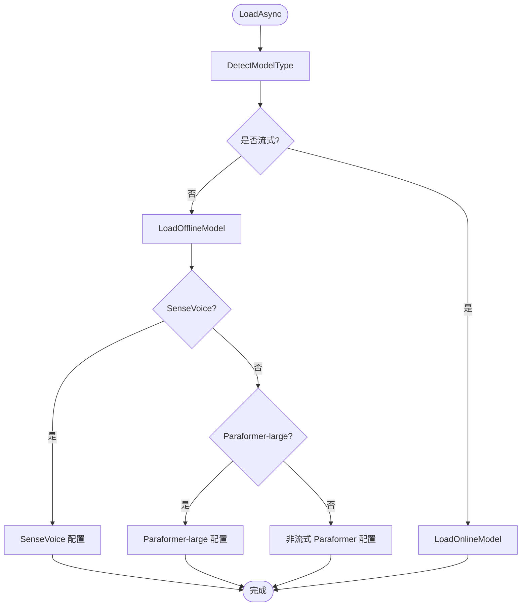
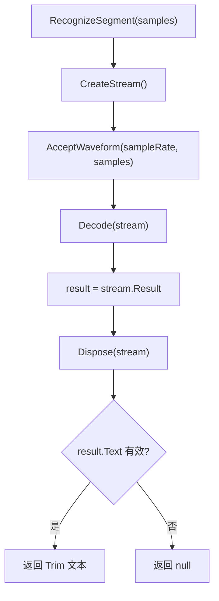
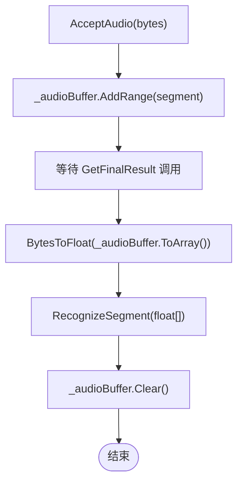
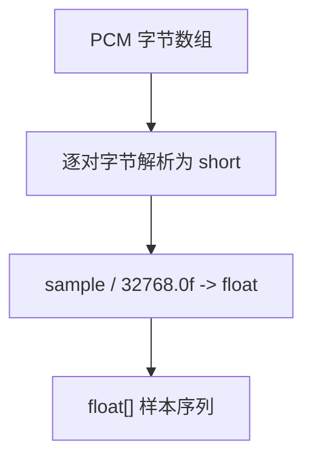
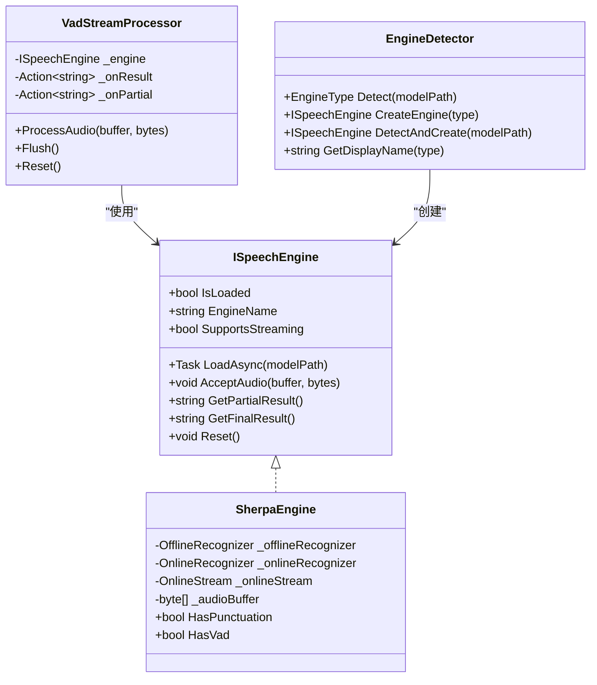
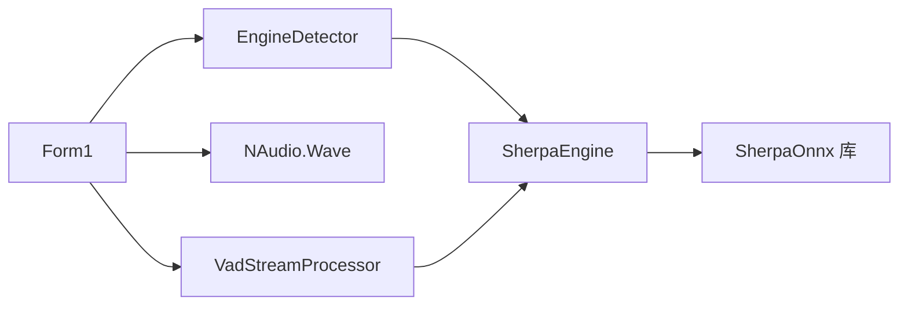

# 离线识别引擎

<cite>
**本文引用的文件**
- [SherpaEngine.cs](file://t9s2t/Engines/SherpaEngine.cs)
- [ISpeechEngine.cs](file://t9s2t/Engines/ISpeechEngine.cs)
- [VadStreamProcessor.cs](file://t9s2t/Engines/VadStreamProcessor.cs)
- [EngineDetector.cs](file://t9s2t/Engines/EngineDetector.cs)
- [Form1.cs](file://t9s2t/Form1.cs)
</cite>

## 目录
1. [简介](#简介)
2. [项目结构](#项目结构)
3. [核心组件](#核心组件)
4. [架构总览](#架构总览)
5. [详细组件分析](#详细组件分析)
6. [依赖关系分析](#依赖关系分析)
7. [性能考虑](#性能考虑)
8. [故障排查指南](#故障排查指南)
9. [结论](#结论)
10. [附录](#附录)

## 简介
本技术文档聚焦于 SherpaEngine 离线识别引擎的实现与使用，重点解释：
- OfflineRecognizer 的初始化与配置流程（SenseVoice、离线 Paraformer、离线 Paraformer-large）
- RecognizeSegment 内部方法的音频处理流程（从 PCM 字节到浮点样本再到识别结果）
- 非流式模式下的音频缓冲区管理策略（_audioBuffer 累积与释放）
- GetFinalResult 在非流式模式下的整段识别与标点恢复逻辑
- 离线识别的性能优化建议（线程数、内存分配、量化模型选择）
- 错误处理与调试技巧

## 项目结构
该仓库采用“引擎抽象 + 具体实现”的分层组织方式：
- ISpeechEngine：定义统一的语音识别接口
- SherpaEngine：基于 sherpa-onnx 的具体实现，同时支持 SenseVoice、Paraformer（含 large）、以及流式 Paraformer
- EngineDetector：根据模型目录结构自动检测引擎类型并创建对应实例
- VadStreamProcessor：用于将非流式模型模拟为“类流式”体验（通过静音分段触发识别）
- Form1：UI 与录音控制，负责加载引擎、按键监听、音频采集与结果输出



图表来源
- [Form1.cs:645-721](file://t9s2t/Form1.cs#L645-L721)
- [ISpeechEngine.cs:1-35](file://t9s2t/Engines/ISpeechEngine.cs#L1-L35)
- [SherpaEngine.cs:14-72](file://t9s2t/Engines/SherpaEngine.cs#L14-L72)
- [EngineDetector.cs:22-104](file://t9s2t/Engines/EngineDetector.cs#L22-L104)
- [VadStreamProcessor.cs:12-33](file://t9s2t/Engines/VadStreamProcessor.cs#L12-L33)

章节来源
- [Form1.cs:645-721](file://t9s2t/Form1.cs#L645-L721)
- [ISpeechEngine.cs:1-35](file://t9s2t/Engines/ISpeechEngine.cs#L1-L35)
- [EngineDetector.cs:22-104](file://t9s2t/Engines/EngineDetector.cs#L22-L104)
- [VadStreamProcessor.cs:12-33](file://t9s2t/Engines/VadStreamProcessor.cs#L12-L33)
- [SherpaEngine.cs:14-72](file://t9s2t/Engines/SherpaEngine.cs#L14-L72)

## 核心组件
- ISpeechEngine：定义了 LoadAsync、AcceptAudio、GetPartialResult、GetFinalResult、Reset 等统一方法，屏蔽底层引擎差异。
- SherpaEngine：实现上述接口，内部维护 OfflineRecognizer/OnlineRecognizer、标点恢复、VAD、音频缓冲等状态；根据模型目录自动选择 SenseVoice 或 Paraformer 路径。
- EngineDetector：依据模型目录中的 onnx 文件与 tokens.txt 行数判断模型类型，返回对应的 EngineType，并创建相应引擎实例。
- VadStreamProcessor：对非流式模型进行“伪流式”处理，按静音阈值切分语音段落，提交识别后回调结果。

章节来源
- [ISpeechEngine.cs:1-35](file://t9s2t/Engines/ISpeechEngine.cs#L1-L35)
- [SherpaEngine.cs:14-72](file://t9s2t/Engines/SherpaEngine.cs#L14-L72)
- [EngineDetector.cs:22-104](file://t9s2t/Engines/EngineDetector.cs#L22-L104)
- [VadStreamProcessor.cs:12-33](file://t9s2t/Engines/VadStreamProcessor.cs#L12-L33)

## 架构总览
下图展示了从 UI 到引擎的核心调用链与数据流向，包括离线识别的关键路径。

```mermaid
sequenceDiagram
participant UI as "Form1"
participant Eng as "SherpaEngine"
participant Off as "OfflineRecognizer"
participant Punc as "OfflinePunctuation"
UI->>Eng : LoadAsync(modelPath)
Eng->>Eng : DetectModelType()
Eng->>Off : 构造 OfflineRecognizerConfig/ModelConfig
Eng-->>UI : 完成加载可附带标点/VAD
UI->>Eng : AcceptAudio(PCM字节)
Eng->>Eng : _audioBuffer.AddRange(...)
UI->>Eng : GetFinalResult()
Eng->>Eng : BytesToFloat(_audioBuffer)
Eng->>Off : CreateStream/AcceptWaveform/Decode
Off-->>Eng : Result.Text
Eng->>Eng : _audioBuffer.Clear()
Eng->>Punc : AddPunct(text)可选
Eng-->>UI : 最终文本
```

图表来源
- [Form1.cs:645-721](file://t9s2t/Form1.cs#L645-L721)
- [SherpaEngine.cs:57-72](file://t9s2t/Engines/SherpaEngine.cs#L57-L72)
- [SherpaEngine.cs:119-216](file://t9s2t/Engines/SherpaEngine.cs#L119-L216)
- [SherpaEngine.cs:351-384](file://t9s2t/Engines/SherpaEngine.cs#L351-L384)
- [SherpaEngine.cs:417-479](file://t9s2t/Engines/SherpaEngine.cs#L417-L479)
- [SherpaEngine.cs:548-558](file://t9s2t/Engines/SherpaEngine.cs#L548-L558)
- [SherpaEngine.cs:562-572](file://t9s2t/Engines/SherpaEngine.cs#L562-L572)
- [SherpaEngine.cs:295-310](file://t9s2t/Engines/SherpaEngine.cs#L295-L310)

## 详细组件分析

### SherpaEngine 离线识别初始化与配置
- 模型类型检测：根据 model.onnx/model.int8.onnx 与 tokens.txt 行数区分 SenseVoice 与离线 Paraformer-large；若存在 encoder.onnx/encoder.int8.onnx 则判定为非流式或流式 Paraformer。
- 离线模型加载：
  - SenseVoice：设置 FeatureConfig（采样率、特征维度），OfflineSenseVoiceModelConfig（语言 auto、反规范化开关），OfflineModelConfig（NumThreads、Debug）。
  - 离线 Paraformer-large：优先使用 int8 量化模型，回退 fp32；同样设置 NumThreads、Debug。
  - 非流式 Paraformer：仅使用 encoder.onnx/int8.onnx。
- 可选能力：
  - 标点恢复：加载 punc.onnx/punc.int8.onnx，提供 AddPunctuation 方法。
  - VAD：加载 vad.onnx，提供静音检测辅助能力。



图表来源
- [SherpaEngine.cs:57-72](file://t9s2t/Engines/SherpaEngine.cs#L57-L72)
- [SherpaEngine.cs:74-115](file://t9s2t/Engines/SherpaEngine.cs#L74-L115)
- [SherpaEngine.cs:119-216](file://t9s2t/Engines/SherpaEngine.cs#L119-L216)

章节来源
- [SherpaEngine.cs:74-115](file://t9s2t/Engines/SherpaEngine.cs#L74-L115)
- [SherpaEngine.cs:119-216](file://t9s2t/Engines/SherpaEngine.cs#L119-L216)
- [EngineDetector.cs:27-75](file://t9s2t/Engines/EngineDetector.cs#L27-L75)

### RecognizeSegment 内部方法与音频处理流程
- 输入：float[] samples（由 PCM 字节转换而来）
- 处理：
  - 创建 OfflineStream
  - AcceptWaveform(采样率, float[])
  - Decode(stream)
  - 读取 stream.Result.Text
  - 释放 stream
- 输出：Trim 后的文本或 null



图表来源
- [SherpaEngine.cs:548-558](file://t9s2t/Engines/SherpaEngine.cs#L548-L558)

章节来源
- [SherpaEngine.cs:548-558](file://t9s2t/Engines/SherpaEngine.cs#L548-L558)

### 非流式模式下音频缓冲区管理与内存释放
- 累积策略：
  - AcceptAudio 在非流式模式下将 PCM 字节片段追加到 _audioBuffer（List<byte>）
  - 在 GetFinalResult 中一次性转换为 float[] 并识别
- 内存释放机制：
  - 成功识别后 _audioBuffer.Clear()
  - 异常分支也执行 Clear()，避免泄漏
  - Reset() 会清空 _audioBuffer 并重置静音检测状态
- 注意事项：
  - 长时间不释放会导致内存增长，需确保每次 GetFinalResult 后清理
  - 大段音频一次性转换会产生较大临时数组，应结合业务场景评估



图表来源
- [SherpaEngine.cs:351-384](file://t9s2t/Engines/SherpaEngine.cs#L351-L384)
- [SherpaEngine.cs:417-479](file://t9s2t/Engines/SherpaEngine.cs#L417-L479)
- [SherpaEngine.cs:533-543](file://t9s2t/Engines/SherpaEngine.cs#L533-L543)

章节来源
- [SherpaEngine.cs:351-384](file://t9s2t/Engines/SherpaEngine.cs#L351-L384)
- [SherpaEngine.cs:417-479](file://t9s2t/Engines/SherpaEngine.cs#L417-L479)
- [SherpaEngine.cs:533-543](file://t9s2t/Engines/SherpaEngine.cs#L533-L543)

### GetFinalResult 在非流式模式下的处理逻辑
- 前置检查：_offlineRecognizer 不为空且 _audioBuffer 有数据
- 转换与识别：
  - BytesToFloat 将累积的 PCM 字节转为浮点样本
  - 调用 RecognizeSegment 进行整段识别
- 标点恢复：
  - 如果已加载标点模型，调用 AddPunctuation 对文本进行标点恢复
- 清理与返回：
  - 成功后返回 Trim 后的文本
  - 异常时记录日志并清空 _audioBuffer，返回 null

```mermaid
sequenceDiagram
participant UI as "调用方"
participant Eng as "SherpaEngine"
participant Off as "OfflineRecognizer"
participant Punc as "OfflinePunctuation"
UI->>Eng : GetFinalResult()
Eng->>Eng : BytesToFloat(_audioBuffer)
Eng->>Eng : _audioBuffer.Clear()
Eng->>Off : RecognizeSegment(float[])
Off-->>Eng : text
alt 已加载标点模型
Eng->>Punc : AddPunct(text)
Punc-->>Eng : punctuatedText
Eng-->>UI : punctuatedText.Trim()
else 未加载标点模型
Eng-->>UI : text.Trim()
end
```

图表来源
- [SherpaEngine.cs:417-479](file://t9s2t/Engines/SherpaEngine.cs#L417-L479)
- [SherpaEngine.cs:548-558](file://t9s2t/Engines/SherpaEngine.cs#L548-L558)
- [SherpaEngine.cs:295-310](file://t9s2t/Engines/SherpaEngine.cs#L295-L310)

章节来源
- [SherpaEngine.cs:417-479](file://t9s2t/Engines/SherpaEngine.cs#L417-L479)
- [SherpaEngine.cs:295-310](file://t9s2t/Engines/SherpaEngine.cs#L295-L310)

### PCM 字节到浮点样本的转换与 RMS 音量计算
- BytesToFloat：
  - 每两个字节解析为一个 16-bit PCM 样本
  - 归一化到 [-1, 1] 范围（除以 32768.0f）
- CalculateRMS：
  - 计算当前帧的均方根音量，用于静音检测与流式端点判断



图表来源
- [SherpaEngine.cs:562-572](file://t9s2t/Engines/SherpaEngine.cs#L562-L572)
- [SherpaEngine.cs:576-589](file://t9s2t/Engines/SherpaEngine.cs#L576-L589)

章节来源
- [SherpaEngine.cs:562-572](file://t9s2t/Engines/SherpaEngine.cs#L562-L572)
- [SherpaEngine.cs:576-589](file://t9s2t/Engines/SherpaEngine.cs#L576-L589)

### 非流式与流式模式的切换与 UI 集成
- UI 侧通过 EngineDetector 自动检测模型类型并创建 SherpaEngine 实例
- 若 SupportsStreaming 为真，UI 可选择原生流式（Paraformer）或使用 VadStreamProcessor 模拟流式（SenseVoice）
- 非流式模式下，UI 在停止录音时调用 GetFinalResult 获取最终结果



图表来源
- [ISpeechEngine.cs:1-35](file://t9s2t/Engines/ISpeechEngine.cs#L1-L35)
- [SherpaEngine.cs:14-72](file://t9s2t/Engines/SherpaEngine.cs#L14-L72)
- [VadStreamProcessor.cs:12-33](file://t9s2t/Engines/VadStreamProcessor.cs#L12-L33)
- [EngineDetector.cs:22-104](file://t9s2t/Engines/EngineDetector.cs#L22-L104)

章节来源
- [Form1.cs:645-721](file://t9s2t/Form1.cs#L645-L721)
- [EngineDetector.cs:22-104](file://t9s2t/Engines/EngineDetector.cs#L22-L104)
- [VadStreamProcessor.cs:12-33](file://t9s2t/Engines/VadStreamProcessor.cs#L12-L33)

## 依赖关系分析
- 外部依赖：
  - SherpaOnnx：提供 OfflineRecognizer、OnlineRecognizer、OfflinePunctuation、VoiceActivityDetector 等运行时 API
  - NAudio.Wave：用于麦克风采集（在 UI 层）
- 内部耦合：
  - SherpaEngine 与 ISpeechEngine 解耦，便于替换其他引擎
  - VadStreamProcessor 依赖 ISpeechEngine 以复用同一引擎实例
  - EngineDetector 与 SherpaEngine 通过工厂方法松耦合



图表来源
- [Form1.cs:645-721](file://t9s2t/Form1.cs#L645-L721)
- [EngineDetector.cs:22-104](file://t9s2t/Engines/EngineDetector.cs#L22-L104)
- [VadStreamProcessor.cs:12-33](file://t9s2t/Engines/VadStreamProcessor.cs#L12-L33)
- [SherpaEngine.cs:14-72](file://t9s2t/Engines/SherpaEngine.cs#L14-L72)

章节来源
- [Form1.cs:645-721](file://t9s2t/Form1.cs#L645-L721)
- [EngineDetector.cs:22-104](file://t9s2t/Engines/EngineDetector.cs#L22-L104)
- [VadStreamProcessor.cs:12-33](file://t9s2t/Engines/VadStreamProcessor.cs#L12-L33)
- [SherpaEngine.cs:14-72](file://t9s2t/Engines/SherpaEngine.cs#L14-L72)

## 性能考虑
- 线程数配置：
  - 所有 OfflineRecognizerConfig 的 NumThreads 设置为 4，适合多数桌面 CPU；可根据设备核数调整
  - 标点模型的 NumThreads 设置为 2，避免与识别主线程争抢资源
- 量化模型选择：
  - 优先使用 .int8.onnx 模型，体积更小、推理更快；不存在时回退 fp32
- 内存优化：
  - 非流式模式下，GetFinalResult 后立即 Clear _audioBuffer，避免长期占用
  - 大段音频一次性转换会产生较大 float[]，建议在业务层控制单次识别长度
- 静音过滤：
  - 流式模式下通过 RMS 阈值与连续静音计数减少无效数据送入模型，降低解码开销
- 调试开关：
  - Debug=0 关闭内部调试输出，生产环境可减少 IO 开销

[本节为通用性能建议，不直接分析具体代码文件]

## 故障排查指南
- 模型未找到或无法识别：
  - 检查模型目录是否存在必要的 onnx 与 tokens.txt 文件
  - 查看 DetectModelType 抛出的 DirectoryNotFoundException 日志
- 标点恢复失败：
  - 确认存在 punc.onnx 或 punc.int8.onnx
  - 关注 AddPunctuation 的异常日志，失败时会回退原始文本
- VAD 加载失败：
  - 确认 vad.onnx 存在且格式正确
  - 关注 LoadVadModel 的异常日志
- 非流式识别结果为空：
  - 检查 _audioBuffer 是否为空
  - 确认 BytesToFloat 与 RecognizeSegment 正常执行
  - 查看异常分支是否触发了 _audioBuffer.Clear()
- 流式端点误触发：
  - 调整 Rule1MinTrailingSilence、Rule2MinTrailingSilence、Rule3MinUtteranceLength 参数
  - 观察 IsEndpoint 与 GetResultAndReset 的使用时机

章节来源
- [SherpaEngine.cs:74-115](file://t9s2t/Engines/SherpaEngine.cs#L74-L115)
- [SherpaEngine.cs:259-290](file://t9s2t/Engines/SherpaEngine.cs#L259-L290)
- [SherpaEngine.cs:314-347](file://t9s2t/Engines/SherpaEngine.cs#L314-L347)
- [SherpaEngine.cs:417-479](file://t9s2t/Engines/SherpaEngine.cs#L417-L479)
- [SherpaEngine.cs:220-255](file://t9s2t/Engines/SherpaEngine.cs#L220-L255)

## 结论
SherpaEngine 提供了统一的离线识别能力封装，支持多种模型类型与可选的标点恢复与 VAD 功能。其非流式模式通过 _audioBuffer 累积 PCM 数据并在 GetFinalResult 时一次性识别，配合合理的线程数与量化模型选择可获得良好性能。对于需要“边说边出字”的场景，可通过 VadStreamProcessor 将非流式模型模拟为流式体验，或在支持流式的 Paraformer 上直接使用原生流式识别。

[本节为总结性内容，不直接分析具体代码文件]

## 附录
- 关键方法路径参考：
  - 模型检测与加载：[DetectModelType:74-115](file://t9s2t/Engines/SherpaEngine.cs#L74-L115)、[LoadOfflineModel:119-127](file://t9s2t/Engines/SherpaEngine.cs#L119-L127)
  - 非流式识别流程：[GetFinalResult:417-479](file://t9s2t/Engines/SherpaEngine.cs#L417-L479)、[RecognizeSegment:548-558](file://t9s2t/Engines/SherpaEngine.cs#L548-L558)
  - 音频转换工具：[BytesToFloat:562-572](file://t9s2t/Engines/SherpaEngine.cs#L562-L572)、[CalculateRMS:576-589](file://t9s2t/Engines/SherpaEngine.cs#L576-L589)
  - 标点恢复：[AddPunctuation:295-310](file://t9s2t/Engines/SherpaEngine.cs#L295-L310)
  - 流式端点与重置：[IsEndpoint:516-520](file://t9s2t/Engines/SherpaEngine.cs#L516-L520)、[ResetStream:525-531](file://t9s2t/Engines/SherpaEngine.cs#L525-L531)
  - 引擎检测与创建：[EngineDetector.Detect:27-75](file://t9s2t/Engines/EngineDetector.cs#L27-L75)、[EngineDetector.CreateEngine:80-95](file://t9s2t/Engines/EngineDetector.cs#L80-L95)
  - UI 集成与加载：[Form1.LoadEngine:645-721](file://t9s2t/Form1.cs#L645-L721)