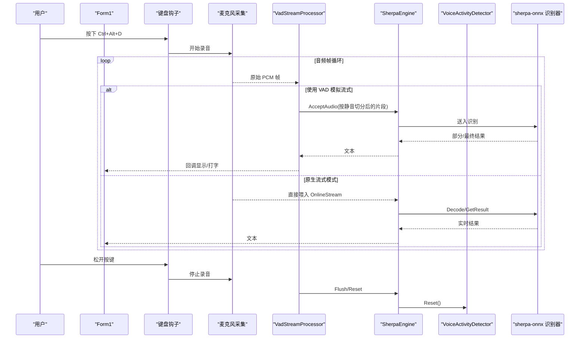
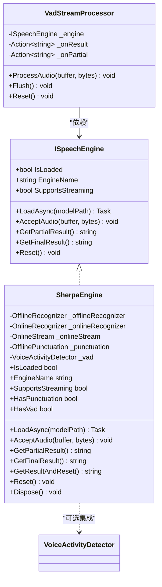
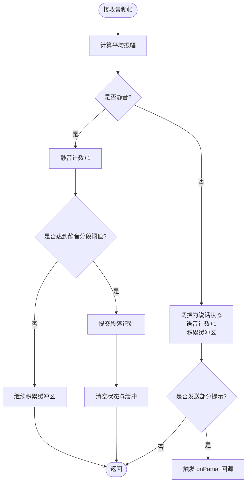
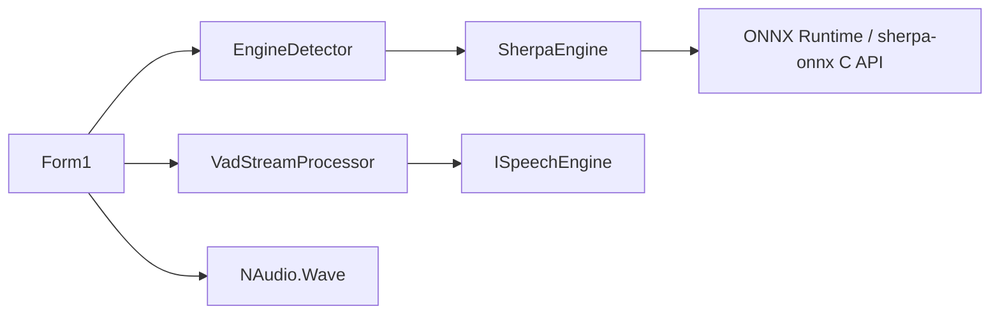

# 语音活动检测

<cite>
**本文引用的文件**
- [SherpaEngine.cs](file://t9s2t/Engines/SherpaEngine.cs)
- [VadStreamProcessor.cs](file://t9s2t/Engines/VadStreamProcessor.cs)
- [ISpeechEngine.cs](file://t9s2t/Engines/ISpeechEngine.cs)
- [EngineDetector.cs](file://t9s2t/Engines/EngineDetector.cs)
- [Form1.cs](file://t9s2t/Form1.cs)
</cite>

## 目录
1. [简介](#简介)
2. [项目结构](#项目结构)
3. [核心组件](#核心组件)
4. [架构总览](#架构总览)
5. [详细组件分析](#详细组件分析)
6. [依赖关系分析](#依赖关系分析)
7. [性能考量](#性能考量)
8. [故障排除指南](#故障排除指南)
9. [结论](#结论)
10. [附录](#附录)

## 简介
本技术文档聚焦于 SherpaEngine 中的语音活动检测（VAD）能力，系统性阐述以下要点：
- VAD 功能实现原理与集成方式
- vad.onnx 模型加载机制与 SileroVadModelConfig 配置项
- VAD 关键参数（Threshold、MinSilenceDuration、MinSpeechDuration、WindowSize、MaxSpeechDuration）的作用与调优建议
- VAD 在音频预处理中的应用场景与性能影响
- VAD 模型部署与常见问题排查
- 效果评估方法与优化建议

## 项目结构
本项目采用分层组织：
- 引擎抽象层：ISpeechEngine 定义统一接口
- 引擎实现层：SherpaEngine 封装 sherpa-onnx 识别能力，并内置 VAD 支持
- 流式处理层：VadStreamProcessor 将非流式模型模拟为“边说边出字”的流式体验
- 自动检测层：EngineDetector 根据模型目录结构选择合适引擎
- UI 集成层：Form1 负责键盘钩子、录音、模型下载与引擎初始化

```mermaid
graph TB
subgraph "UI"
F["Form1"]
end
subgraph "引擎抽象"
I["ISpeechEngine"]
end
subgraph "引擎实现"
S["SherpaEngine"]
D["EngineDetector"]
end
subgraph "VAD"
VP["VadStreamProcessor"]
VAD["VoiceActivityDetector (sherpa-onnx)"]
end
F --> D
D --> S
F --> VP
VP --> S
S --> I
S --> VAD
```

图表来源
- [Form1.cs](file://t9s2t/Form1.cs)
- [EngineDetector.cs](file://t9s2t/Engines/EngineDetector.cs)
- [ISpeechEngine.cs](file://t9s2t/Engines/ISpeechEngine.cs)
- [SherpaEngine.cs](file://t9s2t/Engines/SherpaEngine.cs)
- [VadStreamProcessor.cs](file://t9s2t/Engines/VadStreamProcessor.cs)

章节来源
- [Form1.cs](file://t9s2t/Form1.cs)
- [EngineDetector.cs](file://t9s2t/Engines/EngineDetector.cs)
- [ISpeechEngine.cs](file://t9s2t/Engines/ISpeechEngine.cs)
- [SherpaEngine.cs](file://t9s2t/Engines/SherpaEngine.cs)
- [VadStreamProcessor.cs](file://t9s2t/Engines/VadStreamProcessor.cs)

## 核心组件
- ISpeechEngine：定义统一的语音识别引擎接口，包括加载、输入、获取结果、重置等。
- SherpaEngine：基于 sherpa-onnx 的识别引擎，支持 SenseVoice、Paraformer（含 large）、流式 Paraformer；同时提供标点恢复与 VAD 模型加载。
- VadStreamProcessor：通过能量阈值法对音频进行分段，驱动非流式引擎实现“类流式”输出。
- EngineDetector：依据模型目录结构自动判断引擎类型并创建对应实例。
- Form1：应用入口，负责键盘钩子、录音、模型与引擎初始化，并根据引擎能力决定是否启用 VAD 模拟流式。

章节来源
- [ISpeechEngine.cs](file://t9s2t/Engines/ISpeechEngine.cs)
- [SherpaEngine.cs](file://t9s2t/Engines/SherpaEngine.cs)
- [VadStreamProcessor.cs](file://t9s2t/Engines/VadStreamProcessor.cs)
- [EngineDetector.cs](file://t9s2t/Engines/EngineDetector.cs)
- [Form1.cs](file://t9s2t/Form1.cs)

## 架构总览
下图展示了从音频采集到识别输出的完整链路，以及 VAD 在不同路径中的作用位置。



图表来源
- [Form1.cs](file://t9s2t/Form1.cs)
- [VadStreamProcessor.cs](file://t9s2t/Engines/VadStreamProcessor.cs)
- [SherpaEngine.cs](file://t9s2t/Engines/SherpaEngine.cs)

## 详细组件分析

### SherpaEngine 与 VAD 集成
- 模型类型自动检测：根据 model.onnx / encoder.onnx / decoder.onnx 及 tokens.txt 行数区分 SenseVoice、离线 Paraformer-large、流式 Paraformer。
- 标点恢复：可选加载 punc.onnx 或 punc.int8.onnx。
- VAD 模型加载：若检测到 vad.onnx，则构造 SileroVadModelConfig 并初始化 VoiceActivityDetector。
- 音频输入：
  - 流式模式：内部使用 RMS 音量阈值做简单静音门限，避免长时间静音进入识别器。
  - 非流式模式：累积整段音频后一次性识别。
- 结果获取：
  - GetPartialResult：流式模式下返回中间结果。
  - GetFinalResult：流式模式结束前调用 InputFinished，解码剩余数据并可选标点恢复。
  - GetResultAndReset：用于录音中端点分句，不标记输入结束。
- 资源释放：Dispose 释放所有内部对象，包含 VAD。



图表来源
- [ISpeechEngine.cs](file://t9s2t/Engines/ISpeechEngine.cs)
- [SherpaEngine.cs](file://t9s2t/Engines/SherpaEngine.cs)
- [VadStreamProcessor.cs](file://t9s2t/Engines/VadStreamProcessor.cs)

章节来源
- [SherpaEngine.cs](file://t9s2t/Engines/SherpaEngine.cs)

#### VAD 模型加载机制（vad.onnx 与 SileroVadModelConfig）
- 加载时机：在 LoadAsync 流程中，尝试加载 vad.onnx。若不存在则跳过 VAD 功能。
- 配置项（默认值）：
  - Threshold：说话概率阈值，控制是否判定为语音
  - MinSilenceDuration：最小静音时长（秒），用于抑制短促噪声
  - MinSpeechDuration：最小语音时长（秒），过滤极短片段
  - WindowSize：窗口大小（样本数），影响时域分辨率与延迟
  - MaxSpeechDuration：最大语音时长（秒），超过强制切分
  - SampleRate：采样率（与引擎一致，如 16kHz）
  - NumThreads：推理线程数
- 初始化：使用 VadModelConfig 和超时时间构造 VoiceActivityDetector。

章节来源
- [SherpaEngine.cs](file://t9s2t/Engines/SherpaEngine.cs)

#### VAD 参数配置与作用说明
- Threshold（阈值）
  - 作用：决定语音置信度达到多少才认为是语音
  - 调优建议：环境嘈杂时可适当提高；安静环境可降低以捕捉轻声
- MinSilenceDuration（最小静音时长）
  - 作用：防止将短暂停顿误判为语音结束
  - 调优建议：长句较多时增大，避免频繁切分
- MinSpeechDuration（最小语音时长）
  - 作用：过滤极短噪音片段，减少误触发
  - 调优建议：低质量麦克风可适度增大
- WindowSize（窗口大小）
  - 作用：影响特征计算粒度与响应延迟
  - 调优建议：较小窗口降低延迟但可能增加误判；较大窗口更稳健但延迟更高
- MaxSpeechDuration（最大语音时长）
  - 作用：限制单次语音长度，避免过长导致识别不稳定
  - 调优建议：对话式场景可适当增大，会议记录可更大

章节来源
- [SherpaEngine.cs](file://t9s2t/Engines/SherpaEngine.cs)

#### VAD 在音频预处理中的应用场景与性能影响
- 应用场景
  - 非流式模型（SenseVoice）模拟流式：VadStreamProcessor 基于能量阈值进行分段，提升交互体验
  - 流式模型（Paraformer）：原生端点检测已具备静音判断，通常无需额外 VAD
  - 降噪与节能：在进入识别器前过滤静音，减少无效计算
- 性能影响
  - 能量阈值法（VadStreamProcessor）开销极低，适合高频调用
  - 模型级 VAD（VoiceActivityDetector）引入 ONNX 推理，有 CPU/GPU 开销，需权衡精度与延迟
  - 合理设置 MaxSpeechDuration 与 MinSpeechDuration 可减少大段音频带来的内存与解码压力

章节来源
- [VadStreamProcessor.cs](file://t9s2t/Engines/VadStreamProcessor.cs)
- [SherpaEngine.cs](file://t9s2t/Engines/SherpaEngine.cs)

### VadStreamProcessor 流式处理器
- 设计目标：将非流式引擎包装成“边说边出字”的体验
- 核心逻辑
  - 计算当前帧平均振幅（简化 RMS）
  - 连续静音帧数达到阈值即认为语音结束，提交上一段语音
  - 最少语音帧数阈值用于过滤噪声
  - 支持 Flush 强制提交剩余内容
- 回调机制：识别完成后通过 onResult 回调返回文本；可选 onPartial 反馈进度



图表来源
- [VadStreamProcessor.cs](file://t9s2t/Engines/VadStreamProcessor.cs)

章节来源
- [VadStreamProcessor.cs](file://t9s2t/Engines/VadStreamProcessor.cs)

### 引擎自动检测与创建
- 检测规则
  - 流式 Paraformer：存在 encoder + decoder 文件
  - SenseVoice vs 离线 Paraformer-large：通过 tokens.txt 行数区分
  - 非流式 Paraformer：仅存在 encoder 文件
- 创建策略：根据检测结果返回对应的 SherpaEngine 实例（流式或非流式）

章节来源
- [EngineDetector.cs](file://t9s2t/Engines/EngineDetector.cs)

### UI 集成与 VAD 开关
- 当引擎支持原生流式（Paraformer）时，不使用 VadStreamProcessor
- 当引擎为非流式（SenseVoice）时，启用 VadStreamProcessor 模拟流式
- 界面显示引擎能力：是否支持流式、是否加载了标点、是否加载了 VAD

章节来源
- [Form1.cs](file://t9s2t/Form1.cs)

## 依赖关系分析
- 组件耦合
  - VadStreamProcessor 依赖 ISpeechEngine 接口，松耦合便于替换引擎
  - SherpaEngine 依赖 sherpa-onnx 运行时（ONNX 推理、C API）
  - Form1 依赖 EngineDetector 与 NAudio 进行设备与模型管理
- 外部依赖
  - ONNX Runtime 与 sherpa-onnx C API DLL 由 UI 层按需下载与校验
  - NAudio.Wave 用于麦克风采集



图表来源
- [Form1.cs](file://t9s2t/Form1.cs)
- [EngineDetector.cs](file://t9s2t/Engines/EngineDetector.cs)
- [ISpeechEngine.cs](file://t9s2t/Engines/ISpeechEngine.cs)
- [SherpaEngine.cs](file://t9s2t/Engines/SherpaEngine.cs)
- [VadStreamProcessor.cs](file://t9s2t/Engines/VadStreamProcessor.cs)

章节来源
- [Form1.cs](file://t9s2t/Form1.cs)
- [EngineDetector.cs](file://t9s2t/Engines/EngineDetector.cs)
- [ISpeechEngine.cs](file://t9s2t/Engines/ISpeechEngine.cs)
- [SherpaEngine.cs](file://t9s2t/Engines/SherpaEngine.cs)
- [VadStreamProcessor.cs](file://t9s2t/Engines/VadStreamProcessor.cs)

## 性能考量
- 能量阈值法（VadStreamProcessor）
  - 优点：CPU 开销极低，适合高频调用
  - 缺点：易受环境噪声影响，需要合理阈值
- 模型级 VAD（VoiceActivityDetector）
  - 优点：基于声学模型，鲁棒性更强
  - 缺点：引入 ONNX 推理开销，需平衡延迟与精度
- 流式端点检测（Paraformer）
  - 通过 Rule1/Rule2/Rule3 参数控制端点触发，兼顾出字速度与吞字问题
- 资源释放
  - 及时 Dispose 与 Reset，避免内存泄漏与状态污染

[本节为通用指导，不直接分析具体文件]

## 故障排除指南
- 未找到 VAD 模型（vad.onnx）
  - 现象：日志提示未找到 VAD 模型，跳过 VAD
  - 处理：确保模型目录包含 vad.onnx，或接受无 VAD 运行
- VAD 模型加载失败
  - 现象：日志打印加载失败信息
  - 处理：检查模型路径、文件格式、权限；确认 sherpa-onnx 版本兼容
- 引擎 DLL 缺失或不完整
  - 现象：启动时提示缺少 onnxruntime.dll 或 sherpa-onnx-c-api.dll
  - 处理：点击“下载引擎组件”，等待下载完成后再检测模型
- 模型未识别
  - 现象：无法识别模型类型
  - 处理：确认模型目录结构符合预期（encoder/decoder/tokens.txt 等）
- 流式模式无结果或频繁断句
  - 现象：出字慢或频繁切分
  - 处理：调整流式端点参数（Rule1/Rule2/Rule3）或改用非流式 + VAD 模拟流式

章节来源
- [Form1.cs](file://t9s2t/Form1.cs)
- [SherpaEngine.cs](file://t9s2t/Engines/SherpaEngine.cs)

## 结论
- SherpaEngine 提供了完善的 VAD 集成能力，既支持模型级 VAD（vad.onnx），也通过 VadStreamProcessor 实现了轻量级的能量阈值分段
- 针对不同引擎（SenseVoice、Paraformer）与应用场景，可灵活选择原生流式或 VAD 模拟流式方案
- 合理的参数调优与模型部署是保障识别质量与性能的关键

[本节为总结，不直接分析具体文件]

## 附录

### VAD 模型部署清单
- 必备文件
  - vad.onnx：Silero VAD 模型文件
  - 引擎模型文件：model.onnx / encoder.onnx / decoder.onnx / tokens.txt（依引擎类型而定）
  - 可选：punc.onnx 或 punc.int8.onnx（标点恢复）
- 运行时依赖
  - onnxruntime.dll
  - sherpa-onnx-c-api.dll
- 目录结构示例
  - model/
    - vad.onnx
    - model.onnx 或 encoder.onnx / decoder.onnx
    - tokens.txt
    - punc.onnx（可选）

章节来源
- [Form1.cs](file://t9s2t/Form1.cs)
- [SherpaEngine.cs](file://t9s2t/Engines/SherpaEngine.cs)

### 参数调优速查表
- Threshold：提高→更少误报；降低→更易捕获轻声
- MinSilenceDuration：增大→减少短停顿导致的切分
- MinSpeechDuration：增大→过滤短噪；减小→更快响应
- WindowSize：增大→更稳健；减小→更低延迟
- MaxSpeechDuration：增大→允许更长语音；减小→更早切分

章节来源
- [SherpaEngine.cs](file://t9s2t/Engines/SherpaEngine.cs)

### 效果评估方法
- 主观评测
  - 不同噪声环境下的人声检出率与误报率
  - 对话流畅度与断句合理性
- 客观指标
  - 端到端延迟（从发声到首字输出）
  - 每句识别耗时与 CPU 占用
  - 内存峰值（尤其大段语音场景）
- 对比实验
  - 原生流式 vs VAD 模拟流式
  - 不同参数组合下的稳定性与准确率

[本节为通用指导，不直接分析具体文件]