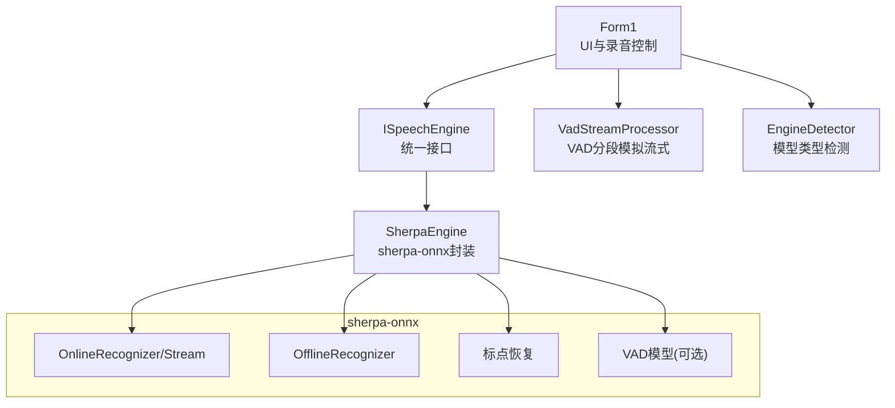
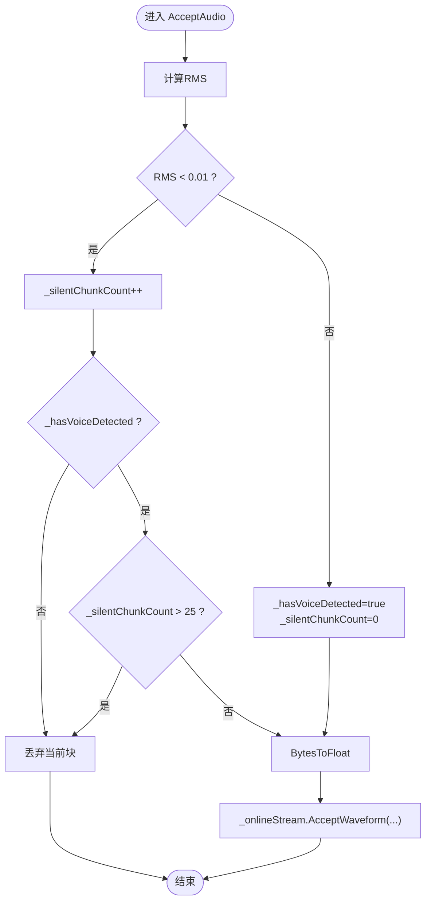
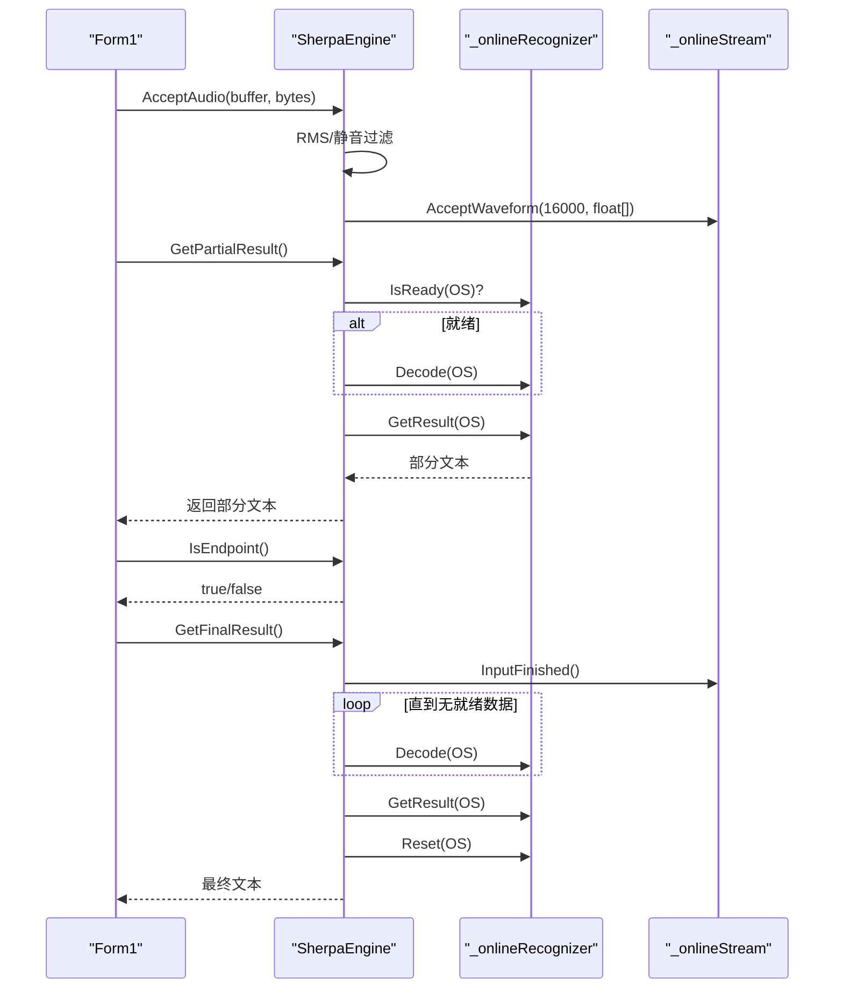
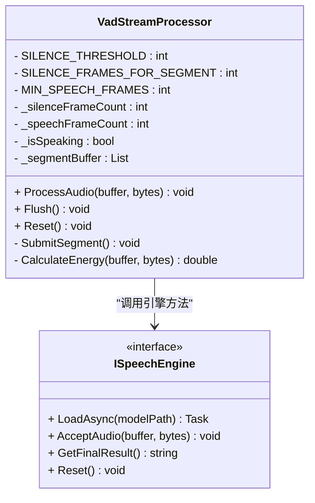
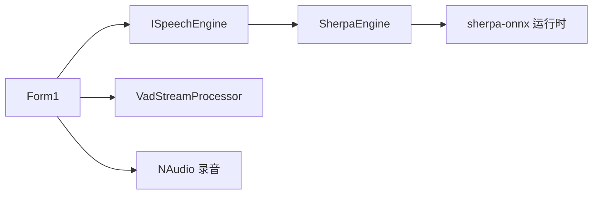

# 音频处理管道

<cite>
**本文引用的文件**   
- [SherpaEngine.cs](file://t9s2t/Engines/SherpaEngine.cs)
- [VadStreamProcessor.cs](file://t9s2t/Engines/VadStreamProcessor.cs)
- [ISpeechEngine.cs](file://t9s2t/Engines/ISpeechEngine.cs)
- [EngineDetector.cs](file://t9s2t/Engines/EngineDetector.cs)
- [Form1.cs](file://t9s2t/Form1.cs)
</cite>

## 目录
1. [简介](#简介)
2. [项目结构](#项目结构)
3. [核心组件](#核心组件)
4. [架构总览](#架构总览)
5. [详细组件分析](#详细组件分析)
6. [依赖关系分析](#依赖关系分析)
7. [性能与优化](#性能与优化)
8. [故障排查指南](#故障排查指南)
9. [结论](#结论)
10. [附录：格式与采样率说明](#附录格式与采样率说明)

## 简介
本技术文档聚焦 SherpaEngine 音频处理管道的实现细节，覆盖以下关键主题：
- 原始 PCM 字节数组到浮点样本的转换算法
- RMS 音量计算与静音检测机制（含 SilenceThreshold 阈值与连续静音帧计数）
- 流式模式下 _onlineStream.AcceptWaveform 的数据流处理方式
- 非流式模式下的音频累积策略与内存管理
- 音频质量优化技巧与性能调优参数
- 音频格式支持与采样率处理的完整说明

## 项目结构
本项目采用“引擎抽象 + 具体实现 + 前端集成”的分层组织方式：
- 接口层：定义统一的语音识别引擎能力
- 引擎实现层：基于 sherpa-onnx 的多种模型支持（SenseVoice、Paraformer、Paraformer-large、流式 Paraformer）
- 应用层：通过 NAudio 采集麦克风数据，按不同引擎模式驱动识别并输出文本



图表来源
- [Form1.cs:1057-1111](file://t9s2t/Form1.cs#L1057-L1111)
- [ISpeechEngine.cs:1-35](file://t9s2t/Engines/ISpeechEngine.cs#L1-L35)
- [SherpaEngine.cs:14-55](file://t9s2t/Engines/SherpaEngine.cs#L14-L55)
- [VadStreamProcessor.cs:12-33](file://t9s2t/Engines/VadStreamProcessor.cs#L12-L33)
- [EngineDetector.cs:22-75](file://t9s2t/Engines/EngineDetector.cs#L22-L75)

章节来源
- [Form1.cs:1057-1111](file://t9s2t/Form1.cs#L1057-L1111)
- [ISpeechEngine.cs:1-35](file://t9s2t/Engines/ISpeechEngine.cs#L1-L35)
- [SherpaEngine.cs:14-55](file://t9s2t/Engines/SherpaEngine.cs#L14-L55)
- [VadStreamProcessor.cs:12-33](file://t9s2t/Engines/VadStreamProcessor.cs#L12-L33)
- [EngineDetector.cs:22-75](file://t9s2t/Engines/EngineDetector.cs#L22-L75)

## 核心组件
- ISpeechEngine：定义加载、输入、结果获取、重置等统一能力
- SherpaEngine：sherpa-onnx 的具体实现，包含离线/流式两种路径、RMS 静音过滤、标点恢复、VAD 模型加载
- VadStreamProcessor：对非流式模型进行“分段+提交”的类流式处理
- EngineDetector：根据模型目录结构自动识别引擎类型并创建实例
- Form1：负责录音采集、线程调度、端点分句、结果粘贴与 UI 反馈

章节来源
- [ISpeechEngine.cs:1-35](file://t9s2t/Engines/ISpeechEngine.cs#L1-L35)
- [SherpaEngine.cs:14-55](file://t9s2t/Engines/SherpaEngine.cs#L14-L55)
- [VadStreamProcessor.cs:12-33](file://t9s2t/Engines/VadStreamProcessor.cs#L12-L33)
- [EngineDetector.cs:22-75](file://t9s2t/Engines/EngineDetector.cs#L22-L75)
- [Form1.cs:1057-1111](file://t9s2t/Form1.cs#L1057-L1111)

## 架构总览
下图展示从麦克风采集到最终文本输出的端到端流程，包括流式与非流式两条路径。

```mermaid
sequenceDiagram
participant Mic as "NAudio WaveInEvent"
participant UI as "Form1.WaveIn_DataAvailable"
participant Eng as "SherpaEngine"
participant OS as "_onlineStream"
participant OR as "_onlineRecognizer"
participant OFF as "_offlineRecognizer"
participant VAD as "VadStreamProcessor"
Mic->>UI : 回调 DataAvailable(buffer, bytes)
alt 流式引擎(SherpaEngine.SupportsStreaming=true)
UI->>Eng : AcceptAudio(buffer, bytes)
Eng->>Eng : 计算RMS与静音判断
Eng->>OS : AcceptWaveform(sampleRate, floatSamples)
UI->>Eng : GetPartialResult()
Eng->>OR : IsReady()/Decode()/GetResult()
OR-->>Eng : 部分结果
Eng-->>UI : 返回部分文本
UI->>Eng : IsEndpoint()
Eng-->>UI : true/false
UI->>Eng : GetResultAndReset() 或 GetFinalResult()
else 非流式引擎或VAD模拟
UI->>VAD : ProcessAudio(buffer, bytes)
VAD->>Eng : Reset()/AcceptAudio()/GetFinalResult()
Eng->>OFF : CreateStream()/AcceptWaveform()/Decode()
OFF-->>Eng : 整段结果
Eng-->>VAD : 返回文本
VAD-->>UI : 触发onResult回调
end
```

图表来源
- [Form1.cs:1064-1111](file://t9s2t/Form1.cs#L1064-L1111)
- [SherpaEngine.cs:351-479](file://t9s2t/Engines/SherpaEngine.cs#L351-L479)
- [VadStreamProcessor.cs:38-136](file://t9s2t/Engines/VadStreamProcessor.cs#L38-L136)

## 详细组件分析

### 音频数据格式与采样率
- 输入格式：NAudio 以 16kHz、单声道、16-bit PCM 采集，回调中提供 byte[] 缓冲
- 内部转换：将每两个字节解析为 little-endian 的 short 样本，归一化到 [-1, 1] 的 float 范围
- 采样率：全局固定为 16000Hz，所有 sherpa-onnx 配置均使用相同采样率

章节来源
- [Form1.cs:1057-1062](file://t9s2t/Form1.cs#L1057-L1062)
- [SherpaEngine.cs:562-572](file://t9s2t/Engines/SherpaEngine.cs#L562-L572)
- [SherpaEngine.cs:136-141](file://t9s2t/Engines/SherpaEngine.cs#L136-L141)
- [SherpaEngine.cs:169-174](file://t9s2t/Engines/SherpaEngine.cs#L169-L174)
- [SherpaEngine.cs:197-202](file://t9s2t/Engines/SherpaEngine.cs#L197-L202)
- [SherpaEngine.cs:229-234](file://t9s2t/Engines/SherpaEngine.cs#L229-L234)

### 从 PCM 字节到浮点样本的转换算法
- 字节序：little-endian，低字节在前，高字节在后
- 归一化：short / 32768.0f，得到 [-1, 1] 范围的 float 样本
- 复杂度：O(N)，N 为样本数；空间：每次调用分配新 float[]

章节来源
- [SherpaEngine.cs:562-572](file://t9s2t/Engines/SherpaEngine.cs#L562-L572)

### RMS 音量计算与静音检测
- RMS 计算：对每个归一化样本平方求和，再除以样本数后开方，得到 0~1 的 RMS 值
- 静音阈值：SilenceThreshold = 0.01f，低于该值视为静音
- 连续静音计数：_silentChunkCount 记录连续静音块数量
- 人声首次检测：_hasVoiceDetected 标记是否已检测到过人声
- 静音丢弃策略：
  - 未检测到人声前：直接丢弃静音块，避免“静音幻觉”
  - 已检测到人声后：允许最多约 1.5 秒（约 25 帧 @ 16kHz/1024 样本）的静音继续送入，超过则丢弃



图表来源
- [SherpaEngine.cs:351-384](file://t9s2t/Engines/SherpaEngine.cs#L351-L384)
- [SherpaEngine.cs:577-589](file://t9s2t/Engines/SherpaEngine.cs#L577-L589)

章节来源
- [SherpaEngine.cs:351-384](file://t9s2t/Engines/SherpaEngine.cs#L351-L384)
- [SherpaEngine.cs:577-589](file://t9s2t/Engines/SherpaEngine.cs#L577-L589)

### 流式模式下的缓冲区管理与数据流
- 在线识别器：_onlineRecognizer 与 _onlineStream 在构造时创建
- 数据推送：AcceptAudio 中将 float[] 通过 _onlineStream.AcceptWaveform 推入
- 部分结果：GetPartialResult 在 IsReady 时 Decode，然后 GetResult 返回临时文本
- 端点检测：IsEndpoint 由 OnlineRecognizer 内部规则判定（可配置 Rule1/Rule2/Rule3）
- 最终结果：GetFinalResult 先 InputFinished，循环解码剩余数据，再 GetResult，最后 Reset 以便下一轮



图表来源
- [SherpaEngine.cs:388-479](file://t9s2t/Engines/SherpaEngine.cs#L388-L479)
- [SherpaEngine.cs:516-531](file://t9s2t/Engines/SherpaEngine.cs#L516-L531)
- [Form1.cs:1072-1111](file://t9s2t/Form1.cs#L1072-L1111)

章节来源
- [SherpaEngine.cs:388-479](file://t9s2t/Engines/SherpaEngine.cs#L388-L479)
- [SherpaEngine.cs:516-531](file://t9s2t/Engines/SherpaEngine.cs#L516-L531)
- [Form1.cs:1072-1111](file://t9s2t/Form1.cs#L1072-L1111)

### 非流式模式下的音频累积与内存管理
- 累积策略：AcceptAudio 在非流式模式下将字节拷贝到 _audioBuffer（List<byte>）
- 一次性识别：GetFinalResult 时将 List 转为 float[]，调用 RecognizeSegment 整段识别
- 内存释放：识别完成后 Clear 列表，避免长期占用内存
- 适用场景：Paraformer-large 等离线大模型，能容忍整段含静音的音频

章节来源
- [SherpaEngine.cs:377-384](file://t9s2t/Engines/SherpaEngine.cs#L377-L384)
- [SherpaEngine.cs:454-479](file://t9s2t/Engines/SherpaEngine.cs#L454-L479)
- [SherpaEngine.cs:548-558](file://t9s2t/Engines/SherpaEngine.cs#L548-L558)

### VAD 流式处理器（非流式模型的“类流式”体验）
- 能量估计：对每帧计算平均振幅（简化版 RMS），低于阈值视为静音
- 分段逻辑：连续静音达到阈值后，若之前有足够语音帧，则提交一段音频进行识别
- 最小语音长度：至少若干帧才提交，避免噪声误触发
- 回调机制：识别完成通过 onResult 回调返回文本；onPartial 用于进度提示



图表来源
- [VadStreamProcessor.cs:12-162](file://t9s2t/Engines/VadStreamProcessor.cs#L12-L162)
- [ISpeechEngine.cs:1-35](file://t9s2t/Engines/ISpeechEngine.cs#L1-L35)

章节来源
- [VadStreamProcessor.cs:38-136](file://t9s2t/Engines/VadStreamProcessor.cs#L38-L136)
- [VadStreamProcessor.cs:141-152](file://t9s2t/Engines/VadStreamProcessor.cs#L141-L152)

### 端点检测与分句（流式模式）
- 内置规则：Rule1MinTrailingSilence、Rule2MinTrailingSilence、Rule3MinUtteranceLength 控制停顿与强制分句
- 应用侧配合：Form1 在 IsEndpoint 为真时调用 GetResultAndReset 获取中间最终结果并重置 stream，不中断后续录音

章节来源
- [SherpaEngine.cs:246-255](file://t9s2t/Engines/SherpaEngine.cs#L246-L255)
- [Form1.cs:1077-1083](file://t9s2t/Form1.cs#L1077-L1083)

### 标点恢复与可选 VAD 模型
- 标点恢复：若存在 punc.onnx/punc.int8.onnx，则在 GetFinalResult 后调用 AddPunctuation
- VAD 模型：若存在 vad.onnx，则加载 SileroVad 配置（阈值、窗口大小等），可用于更精细的语音活动检测

章节来源
- [SherpaEngine.cs:259-290](file://t9s2t/Engines/SherpaEngine.cs#L259-L290)
- [SherpaEngine.cs:314-347](file://t9s2t/Engines/SherpaEngine.cs#L314-L347)
- [SherpaEngine.cs:440-444](file://t9s2t/Engines/SherpaEngine.cs#L440-L444)

## 依赖关系分析
- 外部库：NAudio（录音）、sherpa-onnx（推理）、Newtonsoft.Json（配置解析）
- 内部耦合：
  - Form1 依赖 ISpeechEngine 抽象，运行时选择 SherpaEngine
  - SherpaEngine 依赖 sherpa-onnx C API（通过托管包装）
  - VadStreamProcessor 依赖 ISpeechEngine 的非流式路径



图表来源
- [Form1.cs:1057-1111](file://t9s2t/Form1.cs#L1057-L1111)
- [ISpeechEngine.cs:1-35](file://t9s2t/Engines/ISpeechEngine.cs#L1-L35)
- [SherpaEngine.cs:14-55](file://t9s2t/Engines/SherpaEngine.cs#L14-L55)
- [VadStreamProcessor.cs:12-33](file://t9s2t/Engines/VadStreamProcessor.cs#L12-L33)

章节来源
- [Form1.cs:1057-1111](file://t9s2t/Form1.cs#L1057-L1111)
- [ISpeechEngine.cs:1-35](file://t9s2t/Engines/ISpeechEngine.cs#L1-L35)
- [SherpaEngine.cs:14-55](file://t9s2t/Engines/SherpaEngine.cs#L14-L55)
- [VadStreamProcessor.cs:12-33](file://t9s2t/Engines/VadStreamProcessor.cs#L12-L33)

## 性能与优化
- 线程与锁
  - 录音回调与键盘/剪贴板操作共用 _inputLock，避免竞态条件
  - partial 更新节流：PartialThrottleMs=200ms，减少 UI 刷新频率
- 内存与分配
  - 非流式模式使用 List<byte> 累积，识别后 Clear，降低 GC 压力
  - 流式模式直接推送 float[]，避免额外复制
- 静音过滤
  - 早期丢弃静音块可减少无效推理，提升吞吐
  - 连续静音上限约 1.5 秒，平衡“吞字”与“延迟出字”
- 端点规则
  - Rule1/Rule2/Rule3 参数已在代码中设置，可根据实际语速与停顿习惯微调
- 资源释放
  - Dispose 顺序确保在线/离线识别器、标点、VAD 对象正确释放

章节来源
- [Form1.cs:988-1000](file://t9s2t/Form1.cs#L988-L1000)
- [Form1.cs:1088-1097](file://t9s2t/Form1.cs#L1088-L1097)
- [SherpaEngine.cs:591-605](file://t9s2t/Engines/SherpaEngine.cs#L591-L605)
- [SherpaEngine.cs:246-255](file://t9s2t/Engines/SherpaEngine.cs#L246-L255)

## 故障排查指南
- 未检测到麦克风
  - 现象：初始化失败，提示缺少设备
  - 排查：确认系统默认录音设备可用，检查权限与独占模式
- 模型未找到或类型无法识别
  - 现象：启动后提示模型缺失或无法识别
  - 排查：确认 model 目录下存在 tokens.txt 及对应 onnx 文件；参考 EngineDetector 的检测逻辑
- 流式无结果或频繁断句
  - 现象：长时间不出字或过早断句
  - 排查：调整 Rule1/Rule2/Rule3 参数；检查 SilenceThreshold 与连续静音计数
- 标点恢复失败
  - 现象：AddPunctuation 抛异常或返回原样
  - 排查：确认 punct.onnx 存在且可读；查看日志中的错误信息
- VAD 模型加载失败
  - 现象：vad.onnx 不存在或加载异常
  - 排查：确认文件路径与权限；必要时移除 VAD 功能

章节来源
- [Form1.cs:1057-1062](file://t9s2t/Form1.cs#L1057-L1062)
- [EngineDetector.cs:27-75](file://t9s2t/Engines/EngineDetector.cs#L27-L75)
- [SherpaEngine.cs:259-290](file://t9s2t/Engines/SherpaEngine.cs#L259-L290)
- [SherpaEngine.cs:314-347](file://t9s2t/Engines/SherpaEngine.cs#L314-L347)

## 结论
SherpaEngine 提供了统一的音频处理管道，兼容 SenseVoice、Paraformer 与 Paraformer-large，并在流式与非流式路径上分别实现了高效的静音过滤、端点分句与结果输出。结合 VadStreamProcessor，可在非流式模型上获得近似流式的用户体验。通过合理的静音阈值、端点规则与内存管理，系统在实时性与稳定性之间取得良好平衡。

## 附录：格式与采样率说明
- 输入格式
  - 编码：PCM 16-bit
  - 通道：单声道
  - 采样率：16000 Hz
- 内部转换
  - 字节序：little-endian
  - 归一化：short / 32768.0f → float ∈ [-1, 1]
- sherpa-onnx 配置
  - FeatureConfig.SampleRate = 16000
  - FeatureConfig.FeatureDim = 80
- 端点与静音
  - SilenceThreshold = 0.01（RMS）
  - 连续静音上限 ≈ 25 帧（约 1.5 秒）
  - 流式端点规则：Rule1MinTrailingSilence=1.2s，Rule2MinTrailingSilence=0.5s，Rule3MinUtteranceLength=12.0s

章节来源
- [Form1.cs:1057-1062](file://t9s2t/Form1.cs#L1057-L1062)
- [SherpaEngine.cs:136-141](file://t9s2t/Engines/SherpaEngine.cs#L136-L141)
- [SherpaEngine.cs:169-174](file://t9s2t/Engines/SherpaEngine.cs#L169-L174)
- [SherpaEngine.cs:197-202](file://t9s2t/Engines/SherpaEngine.cs#L197-L202)
- [SherpaEngine.cs:229-234](file://t9s2t/Engines/SherpaEngine.cs#L229-L234)
- [SherpaEngine.cs:351-384](file://t9s2t/Engines/SherpaEngine.cs#L351-L384)
- [SherpaEngine.cs:246-255](file://t9s2t/Engines/SherpaEngine.cs#L246-L255)