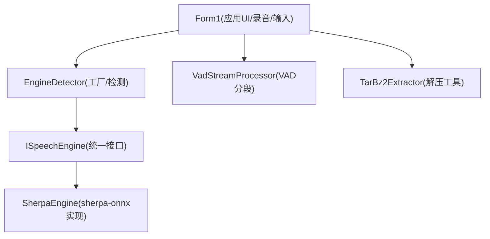
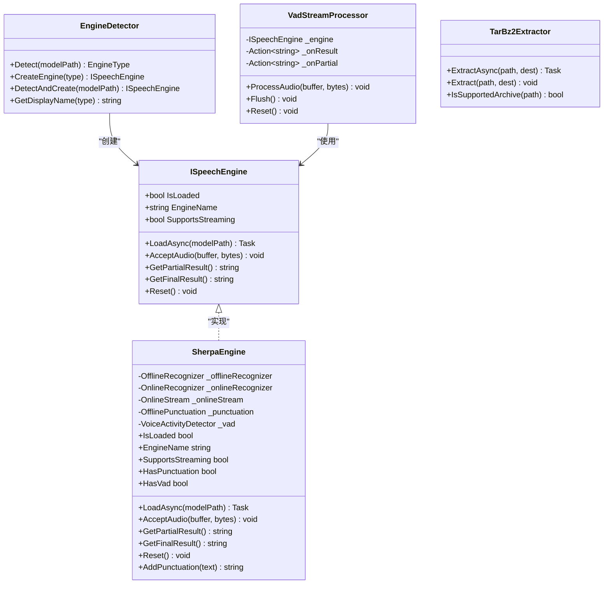
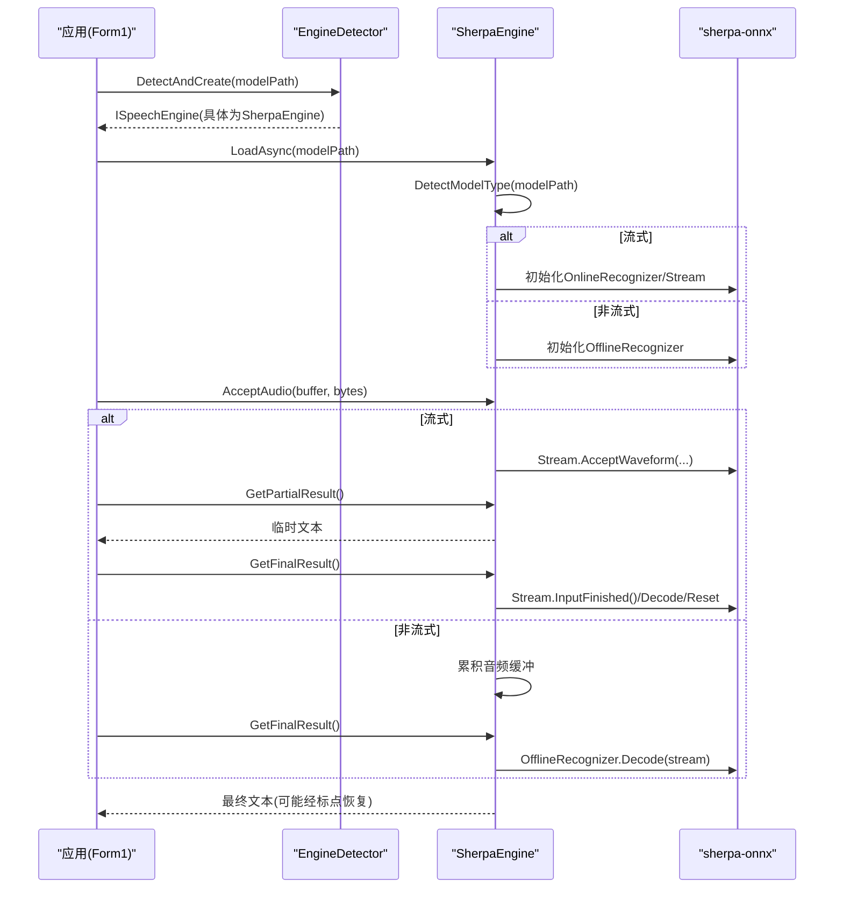
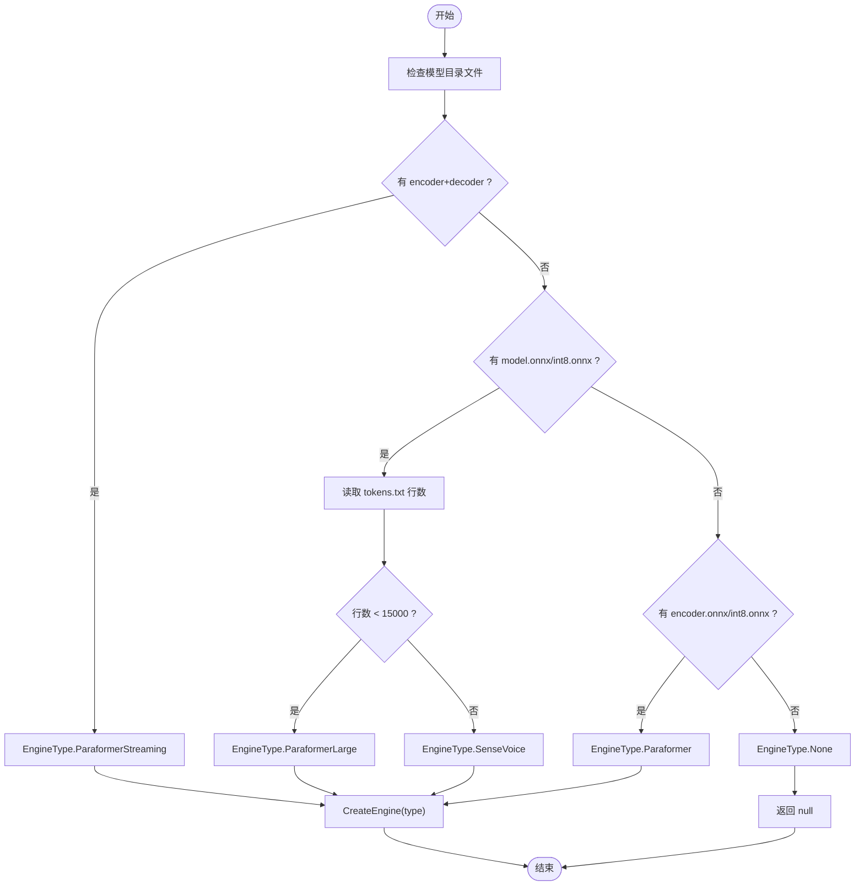
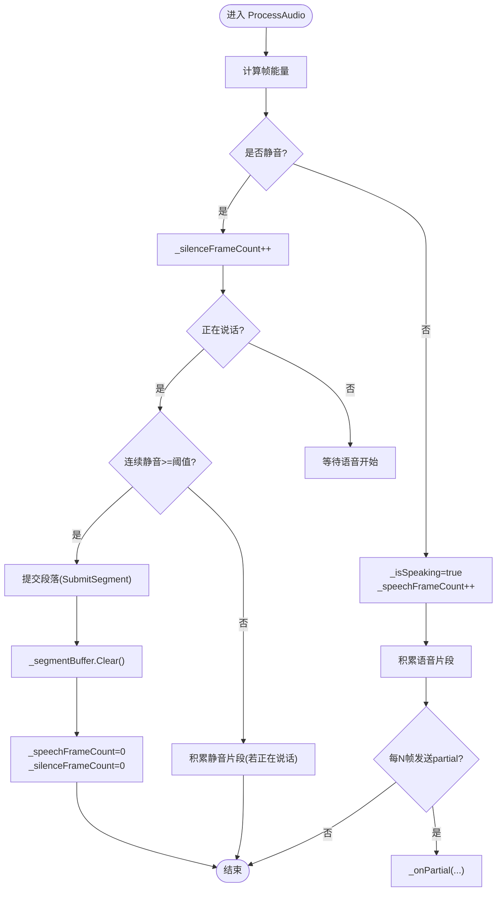
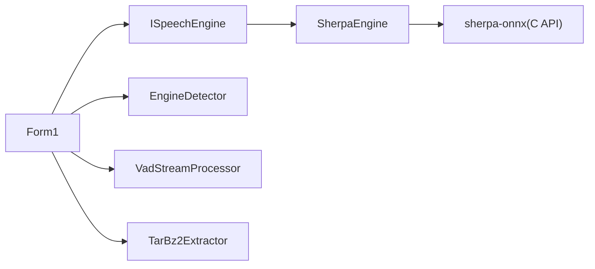

# 语音识别引擎

<cite>
**本文引用的文件**   
- [ISpeechEngine.cs](file://t9s2t/Engines/ISpeechEngine.cs)
- [SherpaEngine.cs](file://t9s2t/Engines/SherpaEngine.cs)
- [EngineDetector.cs](file://t9s2t/Engines/EngineDetector.cs)
- [VadStreamProcessor.cs](file://t9s2t/Engines/VadStreamProcessor.cs)
- [TarBz2Extractor.cs](file://t9s2t/Engines/TarBz2Extractor.cs)
- [Form1.cs](file://t9s2t/Form1.cs)
- [Program.cs](file://t9s2t/Program.cs)
</cite>

## 目录
1. [简介](#简介)
2. [项目结构](#项目结构)
3. [核心组件](#核心组件)
4. [架构总览](#架构总览)
5. [详细组件分析](#详细组件分析)
6. [依赖关系分析](#依赖关系分析)
7. [性能与切换机制](#性能与切换机制)
8. [故障排查指南](#故障排查指南)
9. [结论](#结论)
10. [附录：新引擎集成指南与最佳实践](#附录新引擎集成指南与最佳实践)

## 简介
本仓库实现了一个可插拔的本地语音识别引擎层，通过统一接口屏蔽底层推理差异，支持多种模型（SenseVoice、Paraformer、Paraformer-large）以及流式与非流式两种工作模式。上层应用仅需面向 ISpeechEngine 接口进行调用，即可在运行时根据模型目录自动选择并加载合适的引擎实例。

## 项目结构
- 引擎抽象与实现位于 Engines 目录：
  - ISpeechEngine.cs：定义统一的语音识别引擎接口
  - SherpaEngine.cs：基于 sherpa-onnx 的具体实现，封装离线/流式识别、标点恢复、VAD 等能力
  - EngineDetector.cs：工厂类，按模型目录结构检测类型并创建对应引擎实例
  - VadStreamProcessor.cs：将非流式模型“模拟”为流式体验的静音分段处理器
  - TarBz2Extractor.cs：解压 tar.bz2/tar.gz/zip 等压缩包的通用工具
- 应用入口与 UI 逻辑位于 Form1.cs，负责键盘钩子、录音、下载模型、动态 UI 更新、结果粘贴到前台窗口等
- Program.cs 设置 TLS 安全协议并启动 WinForms 主窗体

图表来源
- [Form1.cs:645-721](file://t9s2t/Form1.cs#L645-L721)
- [EngineDetector.cs:27-104](file://t9s2t/Engines/EngineDetector.cs#L27-L104)
- [ISpeechEngine.cs:1-35](file://t9s2t/Engines/ISpeechEngine.cs#L1-L35)
- [SherpaEngine.cs:57-72](file://t9s2t/Engines/SherpaEngine.cs#L57-L72)
- [VadStreamProcessor.cs:28-33](file://t9s2t/Engines/VadStreamProcessor.cs#L28-L33)
- [TarBz2Extractor.cs:22-96](file://t9s2t/Engines/TarBz2Extractor.cs#L22-L96)

章节来源
- [Program.cs:16-24](file://t9s2t/Program.cs#L16-L24)
- [Form1.cs:151-235](file://t9s2t/Form1.cs#L151-L235)

## 核心组件
- ISpeechEngine：统一抽象，屏蔽不同引擎的差异，提供加载、音频送入、部分/最终结果获取、重置等能力
- SherpaEngine：sherpa-onnx 的封装，支持 SenseVoice、Paraformer、Paraformer-large；同时支持流式与非流式；可选加载标点恢复与 VAD 模型
- EngineDetector：根据模型目录中的关键文件特征推断引擎类型，并返回对应的 ISpeechEngine 实例
- VadStreamProcessor：对非流式模型进行静音分段，模拟流式体验
- TarBz2Extractor：解压多格式压缩包，辅助模型安装流程

章节来源
- [ISpeechEngine.cs:1-35](file://t9s2t/Engines/ISpeechEngine.cs#L1-L35)
- [SherpaEngine.cs:14-72](file://t9s2t/Engines/SherpaEngine.cs#L14-L72)
- [EngineDetector.cs:10-122](file://t9s2t/Engines/EngineDetector.cs#L10-L122)
- [VadStreamProcessor.cs:12-33](file://t9s2t/Engines/VadStreamProcessor.cs#L12-L33)
- [TarBz2Extractor.cs:17-96](file://t9s2t/Engines/TarBz2Extractor.cs#L17-L96)

## 架构总览
系统采用“接口 + 具体实现 + 工厂检测”的分层设计：
- 应用层（Form1）只依赖 ISpeechEngine 接口
- 引擎实现层（SherpaEngine）封装 sherpa-onnx 的离线/流式识别、标点恢复、VAD
- 工厂层（EngineDetector）依据模型目录结构自动选择引擎类型并创建实例
- 辅助层（VadStreamProcessor、TarBz2Extractor）增强用户体验与部署便利性

图表来源
- [ISpeechEngine.cs:1-35](file://t9s2t/Engines/ISpeechEngine.cs#L1-L35)
- [SherpaEngine.cs:14-72](file://t9s2t/Engines/SherpaEngine.cs#L14-L72)
- [EngineDetector.cs:22-122](file://t9s2t/Engines/EngineDetector.cs#L22-L122)
- [VadStreamProcessor.cs:12-33](file://t9s2t/Engines/VadStreamProcessor.cs#L12-L33)
- [TarBz2Extractor.cs:17-96](file://t9s2t/Engines/TarBz2Extractor.cs#L17-L96)

## 详细组件分析

### ISpeechEngine 接口设计与优势
- 设计理念
  - 统一抽象：屏蔽不同引擎（SenseVoice、Paraformer、Paraformer-large）及流式/非流式差异
  - 最小必要方法：加载、音频送入、部分/最终结果、重置，满足大多数场景
  - 资源管理：继承 IDisposable，确保底层原生资源释放
- 统一接口的优势
  - 应用层无需关心具体引擎细节，便于扩展新引擎
  - 工厂检测与运行时切换更简单
  - 测试与替换成本低

章节来源
- [ISpeechEngine.cs:1-35](file://t9s2t/Engines/ISpeechEngine.cs#L1-L35)

### SherpaEngine 实现要点
- 模型类型检测
  - 依据 model.onnx/int8.onnx、encoder.onnx/int8.onnx、decoder.onnx/int8.onnx、tokens.txt 的存在与 tokens 行数区分 SenseVoice 与 Paraformer-large
- 加载策略
  - 非流式：SenseVoice、Paraformer-large、非流式 Paraformer（仅 encoder）
  - 流式：Paraformer（encoder+decoder），配置端点检测参数以平衡出字速度与吞字问题
- 可选增强
  - 标点恢复：加载 punc.onnx/punc.int8.onnx，提供 AddPunctuation 方法
  - VAD：加载 vad.onnx，用于静音检测与语音活动判断
- 音频处理
  - 流式：RMS 音量阈值过滤静音片段，避免“静音幻觉”，连续静音超过阈值停止送入
  - 非流式：累积音频缓冲，最终整段识别
- 结果获取
  - GetPartialResult：流式模式下实时返回临时文本
  - GetFinalResult：流式模式通知结束并解码剩余数据；非流式模式直接整段识别
  - GetResultAndReset：流式中间分句时获取当前结果并重置 stream，不触发 InputFinished
- 资源清理
  - Dispose 释放 OnlineStream、OnlineRecognizer、OfflineRecognizer、标点与 VAD 对象

图表来源
- [EngineDetector.cs:100-104](file://t9s2t/Engines/EngineDetector.cs#L100-L104)
- [SherpaEngine.cs:57-72](file://t9s2t/Engines/SherpaEngine.cs#L57-L72)
- [SherpaEngine.cs:74-115](file://t9s2t/Engines/SherpaEngine.cs#L74-L115)
- [SherpaEngine.cs:219-255](file://t9s2t/Engines/SherpaEngine.cs#L219-L255)
- [SherpaEngine.cs:351-479](file://t9s2t/Engines/SherpaEngine.cs#L351-L479)

章节来源
- [SherpaEngine.cs:14-608](file://t9s2t/Engines/SherpaEngine.cs#L14-L608)

### EngineDetector 工厂模式
- 检测规则
  - 流式 Paraformer：存在 encoder.onnx/int8.onnx 且 decoder.onnx/int8.onnx
  - 非流式 SenseVoice / Paraformer-large：存在 model.onnx/int8.onnx，并通过 tokens.txt 行数区分
  - 非流式 Paraformer：仅存在 encoder.onnx/int8.onnx
- 创建策略
  - 根据 EngineType 返回 new SherpaEngine(streaming) 实例
- 便捷方法
  - DetectAndCreate：一步完成检测与创建
  - GetDisplayName：返回用户可读的引擎名称

图表来源
- [EngineDetector.cs:27-75](file://t9s2t/Engines/EngineDetector.cs#L27-L75)
- [EngineDetector.cs:80-95](file://t9s2t/Engines/EngineDetector.cs#L80-L95)

章节来源
- [EngineDetector.cs:10-122](file://t9s2t/Engines/EngineDetector.cs#L10-L122)

### VadStreamProcessor 非流式模拟流式
- 目标：对非流式模型（如 SenseVoice）通过静音分段模拟流式体验
- 算法要点
  - 计算帧能量（简化 RMS），低于阈值视为静音
  - 连续静音达到阈值后提交已积累的语音段落
  - 最少语音帧数过滤噪音
  - 可选 partial 回调反馈进度
- 与引擎协作
  - 内部调用 engine.Reset/AcceptAudio/GetFinalResult 完成一次识别

图表来源
- [VadStreamProcessor.cs:38-86](file://t9s2t/Engines/VadStreamProcessor.cs#L38-L86)
- [VadStreamProcessor.cs:114-136](file://t9s2t/Engines/VadStreamProcessor.cs#L114-L136)

章节来源
- [VadStreamProcessor.cs:12-162](file://t9s2t/Engines/VadStreamProcessor.cs#L12-L162)

### TarBz2Extractor 解压工具
- 功能：支持 tar.bz2、tar.gz、zip 等格式的解压
- 特殊处理：tar.bz2 先解 bzip2 得到 .tar，再解 tar
- 用途：模型下载后的自动解压与目录重命名

章节来源
- [TarBz2Extractor.cs:17-143](file://t9s2t/Engines/TarBz2Extractor.cs#L17-L143)

### 应用层集成（Form1）
- 引擎生命周期
  - 启动时检查引擎 DLL 与模型，自动检测类型并加载
  - 根据 SupportsStreaming 决定使用原生流式或 VAD 模拟流式
- 录音与输入
  - 键盘钩子监听 Ctrl+Alt+D 组合键控制录音
  - 流式模式：GetPartialResult 节流去重显示，端点检测分句输出
  - 非流式模式：录音结束后一次性识别并粘贴
- 结果粘贴
  - 优先剪贴板+快捷键粘贴，失败回退逐字符输入
  - 防止 Alt 残留导致系统菜单弹出

章节来源
- [Form1.cs:645-721](file://t9s2t/Form1.cs#L645-L721)
- [Form1.cs:1057-1111](file://t9s2t/Form1.cs#L1057-L1111)
- [Form1.cs:1146-1273](file://t9s2t/Form1.cs#L1146-L1273)
- [Form1.cs:993-1051](file://t9s2t/Form1.cs#L993-L1051)

## 依赖关系分析
- 外部依赖
  - NAudio.Wave：录音采集
  - Newtonsoft.Json：解析远程模型/引擎配置
  - SharpCompress：解压 tar.bz2/tar.gz/zip
  - org.k2fsa.sherpa.onnx：sherpa-onnx 的 C API 托管封装
- 内部耦合
  - Form1 仅依赖 ISpeechEngine 接口，松耦合
  - EngineDetector 与 SherpaEngine 强耦合（创建逻辑）
  - VadStreamProcessor 依赖 ISpeechEngine 接口，低耦合

图表来源
- [Form1.cs:16-17](file://t9s2t/Form1.cs#L16-L17)
- [EngineDetector.cs:80-95](file://t9s2t/Engines/EngineDetector.cs#L80-L95)
- [SherpaEngine.cs:6](file://t9s2t/Engines/SherpaEngine.cs#L6)

章节来源
- [packages.config 与工程引用](file://t9s2t/packages.config)
- [Form1.cs:1-20](file://t9s2t/Form1.cs#L1-L20)

## 性能与切换机制
- 引擎切换机制
  - 启动时 EngineDetector.DetectAndCreate 自动选择引擎类型
  - 根据 SupportsStreaming 决定流式路径（原生 sherpa-onnx 流式 vs VAD 模拟）
- 性能特性
  - 流式 Paraformer：端点检测参数平衡出字速度与吞字问题，适合长对话实时出字
  - 非流式 Paraformer-large：整段识别，质量高但延迟大，适合松开按键后出字
  - SenseVoice：多语言大词汇量，结合 VAD 模拟流式，适合多语言场景
- 优化建议
  - 合理设置静音阈值与连续静音帧数，减少误触发
  - 流式 partial 节流与去重，降低 UI 刷新开销
  - 使用 int8 量化模型减小内存占用与提升速度

章节来源
- [Form1.cs:645-721](file://t9s2t/Form1.cs#L645-L721)
- [SherpaEngine.cs:246-255](file://t9s2t/Engines/SherpaEngine.cs#L246-L255)
- [VadStreamProcessor.cs:18-26](file://t9s2t/Engines/VadStreamProcessor.cs#L18-L26)

## 故障排查指南
- 常见问题
  - 未检测到麦克风：检查设备计数与默认设备
  - 引擎 DLL 缺失：提示下载 onnxruntime.dll 与 sherpa-onnx-c-api.dll
  - 模型目录无效：确认包含 model.onnx/int8.onnx 或 encoder.onnx/int8.onnx 与 tokens.txt
  - 标点/VAD 模型缺失：不影响主流程，仅缺少增强功能
- 错误处理策略
  - 网络请求失败时使用内置备用 JSON 列表
  - 解压失败给出明确提示与修复建议
  - 粘贴失败回退至逐字符输入

章节来源
- [Form1.cs:1057-1062](file://t9s2t/Form1.cs#L1057-L1062)
- [Form1.cs:468-567](file://t9s2t/Form1.cs#L468-L567)
- [Form1.cs:908-966](file://t9s2t/Form1.cs#L908-L966)
- [SherpaEngine.cs:259-290](file://t9s2t/Engines/SherpaEngine.cs#L259-L290)
- [SherpaEngine.cs:314-347](file://t9s2t/Engines/SherpaEngine.cs#L314-L347)

## 结论
该语音识别引擎通过统一接口与工厂检测实现了良好的可扩展性与易用性。SherpaEngine 对 sherpa-onnx 的封装覆盖了主流模型与工作模式，配合 VAD 与标点恢复提升了用户体验。应用层仅关注业务逻辑，降低了维护成本。未来可通过新增引擎实现与扩展检测规则进一步丰富生态。

## 附录：新引擎集成指南与最佳实践
- 步骤
  - 实现 ISpeechEngine 接口，遵循加载、音频送入、结果获取、重置等约定
  - 在 EngineDetector 中增加模型类型检测与创建逻辑
  - 如需模拟流式，参考 VadStreamProcessor 的静音分段策略
  - 在 Form1 中按需启用新功能（如新的增强模块）
- 最佳实践
  - 资源管理：确保 Dispose 正确释放所有原生资源
  - 线程安全：音频回调与 UI 更新需加锁或使用 BeginInvoke
  - 错误处理：对外抛出清晰异常，内部记录调试信息
  - 性能优化：合理使用 int8 模型、端点检测参数与节流策略
- API 使用示例（路径指引）
  - 加载引擎：[Form1.cs:645-721](file://t9s2t/Form1.cs#L645-L721)
  - 录音回调：[Form1.cs:1057-1111](file://t9s2t/Form1.cs#L1057-L1111)
  - 开始/停止录音：[Form1.cs:1146-1273](file://t9s2t/Form1.cs#L1146-L1273)
  - 引擎检测与创建：[EngineDetector.cs:100-104](file://t9s2t/Engines/EngineDetector.cs#L100-L104)
  - 流式/非流式处理：[SherpaEngine.cs:351-479](file://t9s2t/Engines/SherpaEngine.cs#L351-L479)
  - VAD 分段处理：[VadStreamProcessor.cs:38-86](file://t9s2t/Engines/VadStreamProcessor.cs#L38-L86)
  - 解压模型包：[TarBz2Extractor.cs:22-96](file://t9s2t/Engines/TarBz2Extractor.cs#L22-L96)