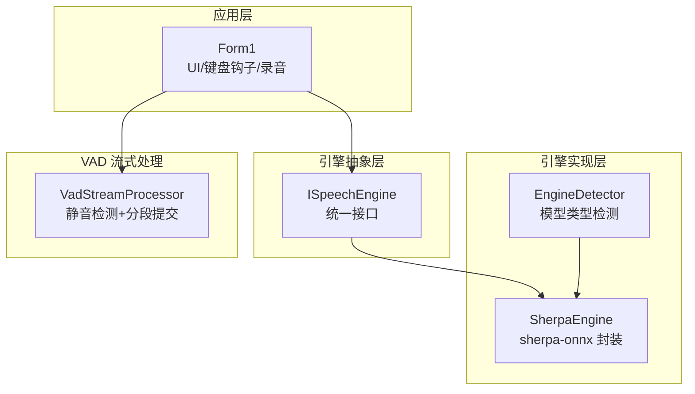
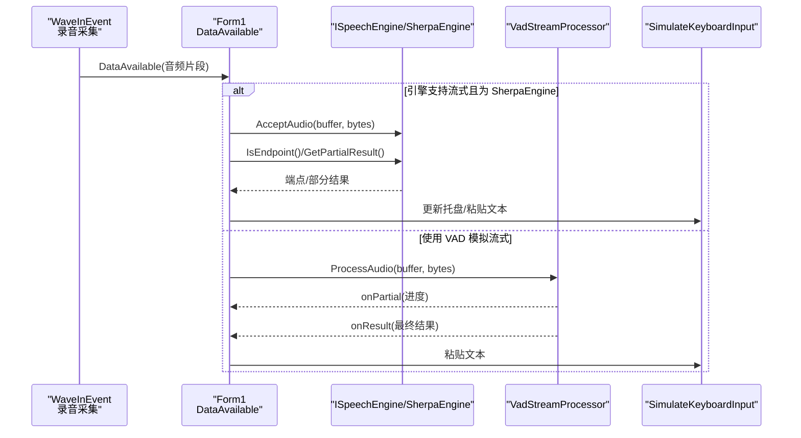
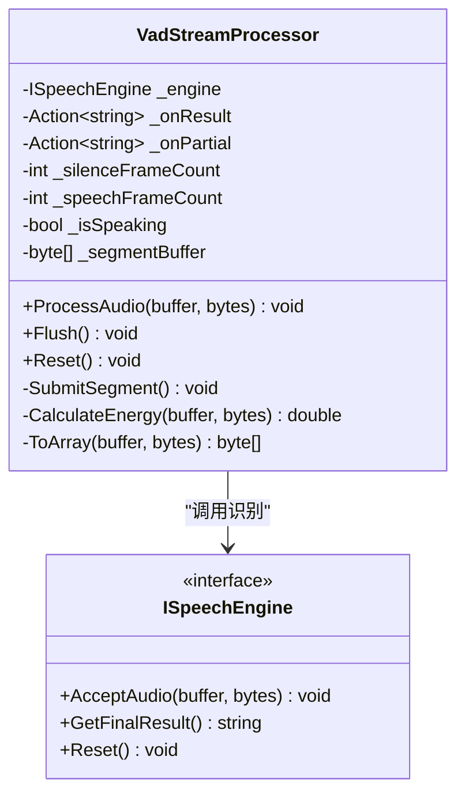
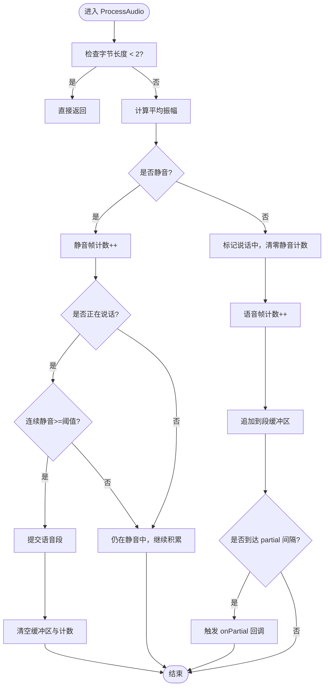
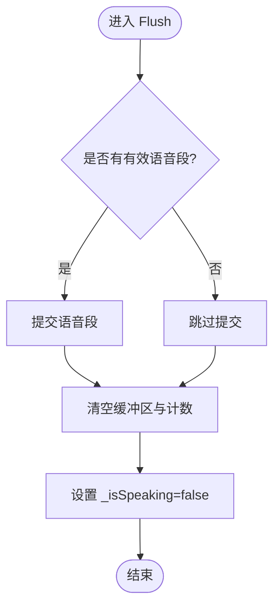
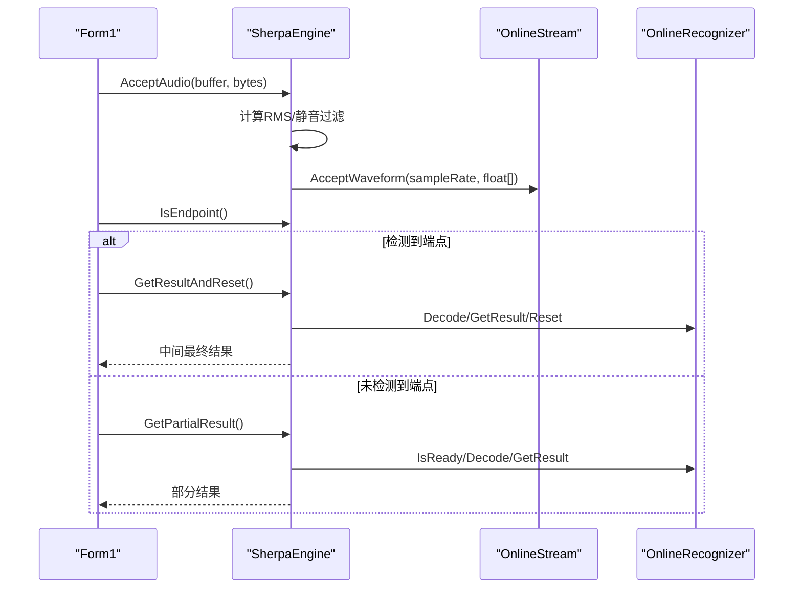
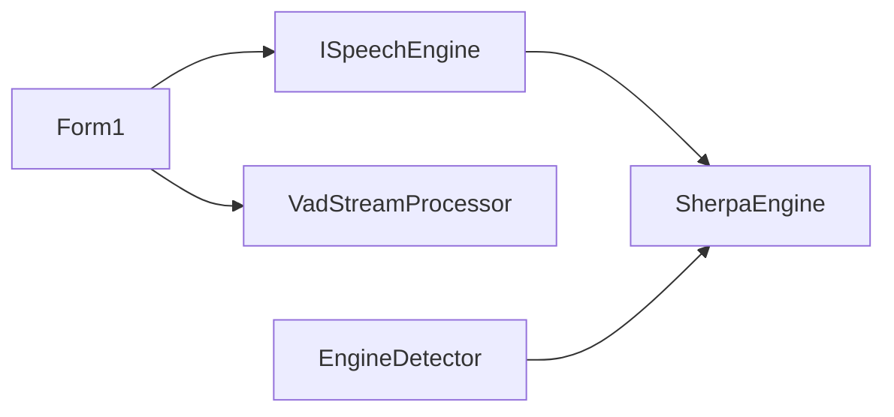

# 流式处理架构

<cite>
**本文引用的文件**   
- [VadStreamProcessor.cs](file://t9s2t/Engines/VadStreamProcessor.cs)
- [ISpeechEngine.cs](file://t9s2t/Engines/ISpeechEngine.cs)
- [SherpaEngine.cs](file://t9s2t/Engines/SherpaEngine.cs)
- [EngineDetector.cs](file://t9s2t/Engines/EngineDetector.cs)
- [Form1.cs](file://t9s2t/Form1.cs)
</cite>

## 目录
1. [简介](#简介)
2. [项目结构](#项目结构)
3. [核心组件](#核心组件)
4. [架构总览](#架构总览)
5. [详细组件分析](#详细组件分析)
6. [依赖关系分析](#依赖关系分析)
7. [性能考量与优化建议](#性能考量与优化建议)
8. [故障排查指南](#故障排查指南)
9. [结论](#结论)
10. [附录：关键流程示例路径](#附录关键流程示例路径)

## 简介
本技术文档围绕“流式处理架构”展开，重点解析 VadStreamProcessor 的流式处理设计模式、数据管道架构、事件驱动机制与回调函数设计；深入说明 ProcessAudio 的数据处理流程（音频缓冲累积、语音段落识别、结果提交）、Flush 与 Reset 的状态管理与资源释放策略；解释部分结果反馈机制（onPartial 回调）的实现原理与用户体验优化；并给出错误处理与异常恢复策略、内存溢出保护思路以及性能调优建议。文档同时提供代码级流程图与时序图，帮助读者快速理解系统行为与最佳实践。

## 项目结构
本项目采用分层与职责分离的组织方式：
- 引擎抽象层：定义统一的语音识别接口 ISpeechEngine，屏蔽不同模型差异。
- 引擎实现层：SherpaEngine 封装 sherpa-onnx 的离线/流式识别能力，支持 SenseVoice、Paraformer、Paraformer-large 等模型。
- VAD 流式处理器：VadStreamProcessor 将非流式模型模拟为“类流式”，通过静音检测切分语音段，触发识别并回调结果。
- 应用层：Form1 负责 UI、键盘钩子、录音采集、状态管理以及与引擎和 VAD 的协作。

图表来源
- [Form1.cs:144-235](file://t9s2t/Form1.cs#L144-L235)
- [ISpeechEngine.cs:1-35](file://t9s2t/Engines/ISpeechEngine.cs#L1-L35)
- [SherpaEngine.cs:14-72](file://t9s2t/Engines/SherpaEngine.cs#L14-L72)
- [EngineDetector.cs:22-122](file://t9s2t/Engines/EngineDetector.cs#L22-L122)
- [VadStreamProcessor.cs:12-33](file://t9s2t/Engines/VadStreamProcessor.cs#L12-L33)

章节来源
- [Form1.cs:144-235](file://t9s2t/Form1.cs#L144-L235)
- [ISpeechEngine.cs:1-35](file://t9s2t/Engines/ISpeechEngine.cs#L1-L35)
- [SherpaEngine.cs:14-72](file://t9s2t/Engines/SherpaEngine.cs#L14-L72)
- [EngineDetector.cs:22-122](file://t9s2t/Engines/EngineDetector.cs#L22-L122)
- [VadStreamProcessor.cs:12-33](file://t9s2t/Engines/VadStreamProcessor.cs#L12-L33)

## 核心组件
- ISpeechEngine：定义统一的语音识别能力，包括加载、接受音频、获取部分/最终结果、重置等。
- SherpaEngine：基于 sherpa-onnx 的完整实现，支持离线与非流式 Paraformer、SenseVoice，以及流式 Paraformer；内置标点恢复与可选 VAD 模型。
- VadStreamProcessor：面向非流式模型的“伪流式”处理器，通过能量阈值与连续静音帧数判断语音起止，自动分段并提交识别，支持 onPartial 进度反馈。
- EngineDetector：根据模型目录结构自动识别引擎类型并创建对应实例。
- Form1：集成键盘钩子、录音设备、UI 提示、结果粘贴到前台窗口，协调引擎与 VAD 的调用。

章节来源
- [ISpeechEngine.cs:1-35](file://t9s2t/Engines/ISpeechEngine.cs#L1-L35)
- [SherpaEngine.cs:14-72](file://t9s2t/Engines/SherpaEngine.cs#L14-L72)
- [VadStreamProcessor.cs:12-33](file://t9s2t/Engines/VadStreamProcessor.cs#L12-L33)
- [EngineDetector.cs:22-122](file://t9s2t/Engines/EngineDetector.cs#L22-L122)
- [Form1.cs:1057-1111](file://t9s2t/Form1.cs#L1057-L1111)

## 架构总览
整体数据流从麦克风采集开始，经应用层路由至引擎或 VAD 处理器，再由引擎完成识别并将结果以回调形式返回应用层进行输入模拟。

图表来源
- [Form1.cs:1064-1111](file://t9s2t/Form1.cs#L1064-L1111)
- [VadStreamProcessor.cs:38-86](file://t9s2t/Engines/VadStreamProcessor.cs#L38-L86)
- [SherpaEngine.cs:351-415](file://t9s2t/Engines/SherpaEngine.cs#L351-L415)

## 详细组件分析

### VadStreamProcessor 流式处理设计模式
- 设计目标：将非流式模型（如 SenseVoice）模拟为“边说边出字”的体验。
- 核心思想：
  - 计算每帧音频的平均振幅（简化 RMS），低于阈值视为静音。
  - 连续静音达到阈值后，认为语音结束，提交已积累的语音段进行识别。
  - 在语音进行中，周期性触发 onPartial 回调，用于 UI 进度反馈。
- 关键参数：
  - 静音阈值、连续静音帧数、最少语音帧数，用于平衡灵敏度与误判。
- 数据结构：
  - 使用 List<byte> 作为段缓冲区，累积当前语音段的原始 PCM 字节。
  - 计数变量跟踪静音/语音帧数量与说话状态。

图表来源
- [VadStreamProcessor.cs:12-162](file://t9s2t/Engines/VadStreamProcessor.cs#L12-L162)
- [ISpeechEngine.cs:1-35](file://t9s2t/Engines/ISpeechEngine.cs#L1-L35)

章节来源
- [VadStreamProcessor.cs:12-162](file://t9s2t/Engines/VadStreamProcessor.cs#L12-L162)

#### ProcessAudio 数据处理流程
- 输入校验：忽略过短缓冲区。
- 能量计算：按 16bit PCM 样本计算平均绝对值作为能量指标。
- 静音分支：
  - 增加静音帧计数；若处于说话中且连续静音达到阈值，则提交当前语音段。
  - 提交前检查最少语音帧数与缓冲区大小，避免噪音误提交。
  - 提交后清空缓冲区与计数，重置状态。
- 语音分支：
  - 标记正在说话，清零静音计数，累加语音帧计数。
  - 将当前帧追加到段缓冲区。
  - 每隔若干帧触发 onPartial 回调，用于 UI 反馈。

图表来源
- [VadStreamProcessor.cs:38-86](file://t9s2t/Engines/VadStreamProcessor.cs#L38-L86)

章节来源
- [VadStreamProcessor.cs:38-86](file://t9s2t/Engines/VadStreamProcessor.cs#L38-L86)

#### Flush 与 Reset 状态管理逻辑
- Flush：
  - 当存在有效语音段时强制提交，随后清理缓冲区与状态，确保停止录音时不会丢失最后一段语音。
- Reset：
  - 清理所有内部状态与缓冲区，适用于新一轮录音开始前或异常恢复场景。

图表来源
- [VadStreamProcessor.cs:91-112](file://t9s2t/Engines/VadStreamProcessor.cs#L91-L112)

章节来源
- [VadStreamProcessor.cs:91-112](file://t9s2t/Engines/VadStreamProcessor.cs#L91-L112)

#### 部分结果反馈机制（onPartial 回调）
- 触发时机：在语音进行中，每隔固定帧数（例如 15 帧）触发一次。
- 用途：向 UI 展示“正在听...”等进度信息，提升用户感知。
- 注意：onPartial 不模拟输入到目标窗口，避免闪烁与重复删除粘贴问题。

章节来源
- [VadStreamProcessor.cs:80-85](file://t9s2t/Engines/VadStreamProcessor.cs#L80-L85)
- [Form1.cs:673-686](file://t9s2t/Form1.cs#L673-L686)

#### 错误处理与异常恢复策略
- 提交段落失败：捕获异常并记录日志，防止中断主流程。
- 引擎异常：在 GetPartialResult/GetFinalResult 等方法中捕获异常并返回空结果，保证稳定性。
- 资源释放：Dispose 方法释放在线/离线识别器、VAD、标点模型等资源，避免内存泄漏。

章节来源
- [VadStreamProcessor.cs:114-136](file://t9s2t/Engines/VadStreamProcessor.cs#L114-L136)
- [SherpaEngine.cs:388-479](file://t9s2t/Engines/SherpaEngine.cs#L388-L479)
- [SherpaEngine.cs:591-606](file://t9s2t/Engines/SherpaEngine.cs#L591-L606)

### SherpaEngine 流式与非流式处理
- 模型检测：根据 tokens.txt 行数与文件结构区分 SenseVoice、Paraformer、Paraformer-large、流式 Paraformer。
- 流式模式：
  - 使用 OnlineRecognizer 与 OnlineStream，支持实时解码与端点检测。
  - 静音过滤：RMS 音量低于阈值时跳过送入模型，避免静音幻觉。
  - 端点检测：根据 Rule1/Rule2/Rule3 参数控制停顿分句。
- 非流式模式：
  - 使用 OfflineRecognizer，累积音频后一次性识别。
  - 支持标点恢复与可选 VAD 模型。

图表来源
- [SherpaEngine.cs:351-415](file://t9s2t/Engines/SherpaEngine.cs#L351-L415)
- [SherpaEngine.cs:485-509](file://t9s2t/Engines/SherpaEngine.cs#L485-L509)
- [Form1.cs:1072-1099](file://t9s2t/Form1.cs#L1072-L1099)

章节来源
- [SherpaEngine.cs:74-115](file://t9s2t/Engines/SherpaEngine.cs#L74-L115)
- [SherpaEngine.cs:220-255](file://t9s2t/Engines/SherpaEngine.cs#L220-L255)
- [SherpaEngine.cs:351-415](file://t9s2t/Engines/SherpaEngine.cs#L351-L415)
- [SherpaEngine.cs:485-509](file://t9s2t/Engines/SherpaEngine.cs#L485-L509)
- [Form1.cs:1072-1099](file://t9s2t/Form1.cs#L1072-L1099)

### 应用层集成与输入模拟
- 键盘钩子：监听 Ctrl+Alt+D 组合键，启动/停止录音。
- 录音回调：
  - 流式引擎：直接送入引擎，查询端点或部分结果。
  - VAD 处理器：交给 VadStreamProcessor 处理，接收 onPartial/onResult。
  - 离线引擎：累积音频，松开后一次性识别。
- 输入模拟：
  - final 结果：原子化粘贴到前台窗口，避免闪烁。
  - partial 结果：仅更新托盘图标文本，不模拟输入。

章节来源
- [Form1.cs:422-460](file://t9s2t/Form1.cs#L422-L460)
- [Form1.cs:1064-1111](file://t9s2t/Form1.cs#L1064-L1111)
- [Form1.cs:993-1051](file://t9s2t/Form1.cs#L993-L1051)

## 依赖关系分析
- 耦合与内聚：
  - VadStreamProcessor 仅依赖 ISpeechEngine 接口，内聚于静音检测与分段提交逻辑，具备良好的可替换性。
  - SherpaEngine 实现 ISpeechEngine，封装 sherpa-onnx 细节，内聚于模型加载与识别流程。
  - Form1 作为编排者，协调录音、引擎与 VAD，保持 UI 与业务解耦。
- 外部依赖：
  - NAudio.Wave：录音采集。
  - sherpa-onnx：语音识别推理。
  - Windows API：键盘钩子、剪贴板、前台窗口操作。

图表来源
- [Form1.cs:1057-1111](file://t9s2t/Form1.cs#L1057-L1111)
- [ISpeechEngine.cs:1-35](file://t9s2t/Engines/ISpeechEngine.cs#L1-L35)
- [SherpaEngine.cs:14-72](file://t9s2t/Engines/SherpaEngine.cs#L14-L72)
- [EngineDetector.cs:22-122](file://t9s2t/Engines/EngineDetector.cs#L22-L122)

章节来源
- [Form1.cs:1057-1111](file://t9s2t/Form1.cs#L1057-L1111)
- [ISpeechEngine.cs:1-35](file://t9s2t/Engines/ISpeechEngine.cs#L1-L35)
- [SherpaEngine.cs:14-72](file://t9s2t/Engines/SherpaEngine.cs#L14-L72)
- [EngineDetector.cs:22-122](file://t9s2t/Engines/EngineDetector.cs#L22-L122)

## 性能考量与优化建议
- 缓冲区大小调优：
  - 适当增大录音块可减少频繁分配与拷贝开销，但会增加延迟；建议在 10ms-20ms 之间权衡。
- 内存管理：
  - 避免在热路径上频繁创建临时数组；VadStreamProcessor 使用 List<byte> 累积，必要时考虑预分配容量或使用 Span<T>/Memory<T>。
  - 及时调用 Reset/Flush 清理状态，防止长时间运行导致内存增长。
- 异步处理模式：
  - 识别与 UI 更新应异步执行，避免阻塞录音线程；Form1 已通过 BeginInvoke 与锁机制降低竞争。
- 静音阈值与分段策略：
  - 根据麦克风增益与环境噪声调整 SILENCE_THRESHOLD 与 SILENCE_FRAMES_FOR_SEGMENT，减少误切分与漏切分。
- 节流与去重：
  - partial 结果更新需节流与去重，避免 UI 抖动与重复输入；Form1 已实现 200ms 最小间隔与文本去重。

[本节为通用指导，无需具体文件引用]

## 故障排查指南
- 无法识别或无结果：
  - 检查模型是否正确加载（tokens.txt 是否存在、模型文件是否齐全）。
  - 查看引擎日志输出，确认是否抛出异常。
- 部分结果不更新：
  - 确认 onPartial 回调是否被注册，partial 节流时间是否过长。
- 输入闪烁或重复：
  - 检查 SimulateKeyboardInput 的节流与去重逻辑，确保 partial 不模拟输入。
- 内存占用过高：
  - 确认是否频繁调用 Reset/Flush，避免长时间累积未提交。
- 网络下载失败：
  - 检查远程配置地址与 TLS 协议版本，必要时回退到本地备用列表。

章节来源
- [VadStreamProcessor.cs:114-136](file://t9s2t/Engines/VadStreamProcessor.cs#L114-L136)
- [SherpaEngine.cs:388-479](file://t9s2t/Engines/SherpaEngine.cs#L388-L479)
- [Form1.cs:993-1051](file://t9s2t/Form1.cs#L993-L1051)

## 结论
VadStreamProcessor 通过简洁的能量阈值与连续静音检测，成功将非流式模型模拟为“类流式”体验；结合 SherpaEngine 的原生流式能力与 Form1 的应用编排，实现了端到端的低延迟语音识别与输入模拟。合理的错误处理、资源释放与性能优化策略保障了系统的稳定性与用户体验。

[本节为总结，无需具体文件引用]

## 附录：关键流程示例路径
- 流式处理入口与回调绑定
  - [Form1.cs:664-686](file://t9s2t/Form1.cs#L664-L686)
- 录音回调与引擎/VAD 路由
  - [Form1.cs:1064-1111](file://t9s2t/Form1.cs#L1064-L1111)
- VAD 分段提交与结果回调
  - [VadStreamProcessor.cs:114-136](file://t9s2t/Engines/VadStreamProcessor.cs#L114-L136)
- 流式引擎端点检测与结果获取
  - [SherpaEngine.cs:485-509](file://t9s2t/Engines/SherpaEngine.cs#L485-L509)
- 非流式引擎最终结果与标点恢复
  - [SherpaEngine.cs:417-479](file://t9s2t/Engines/SherpaEngine.cs#L417-L479)
- 输入模拟与防闪烁策略
  - [Form1.cs:993-1051](file://t9s2t/Form1.cs#L993-L1051)