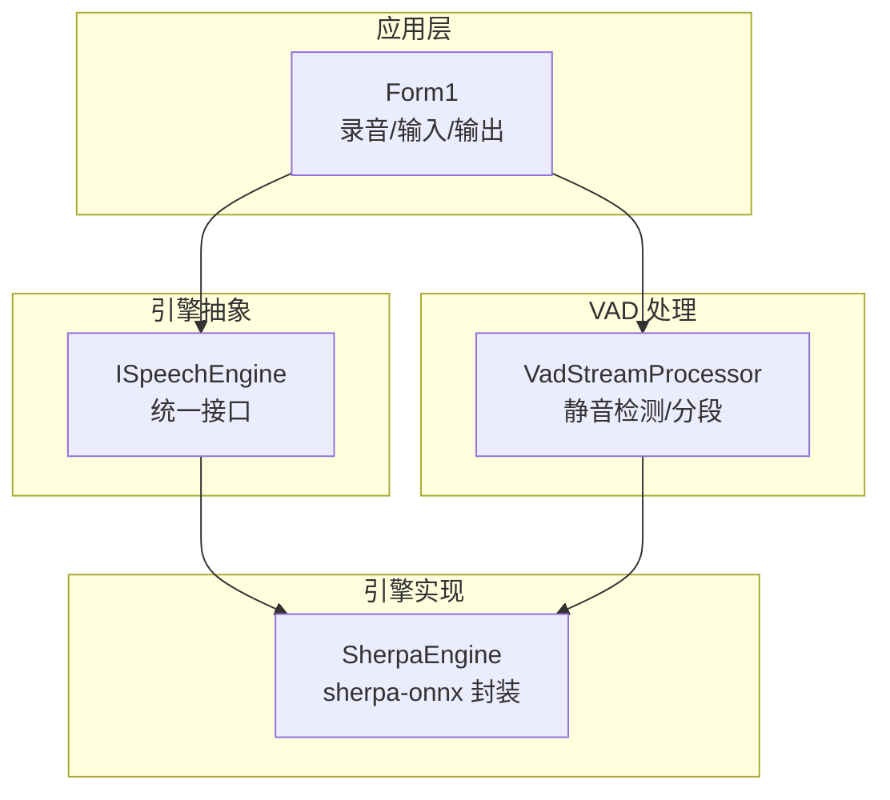
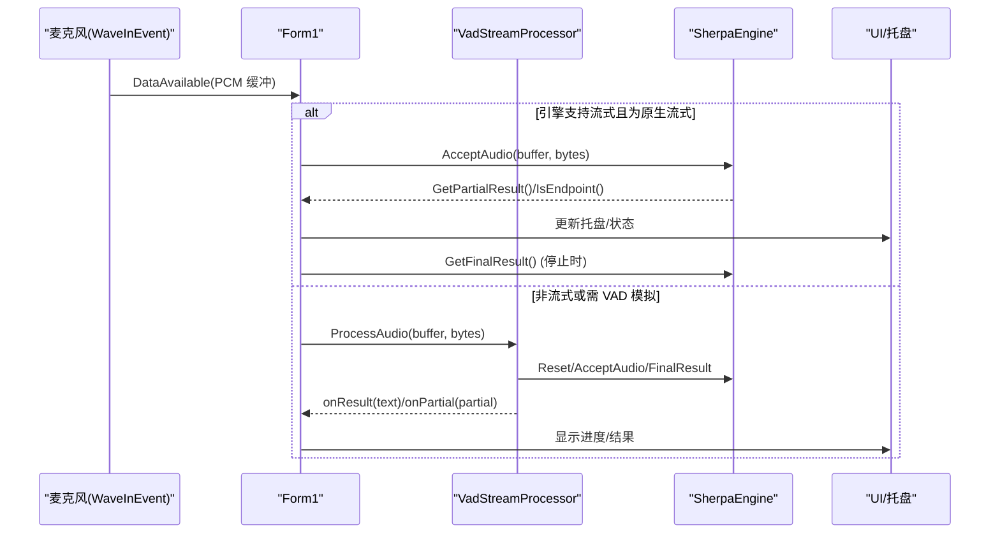
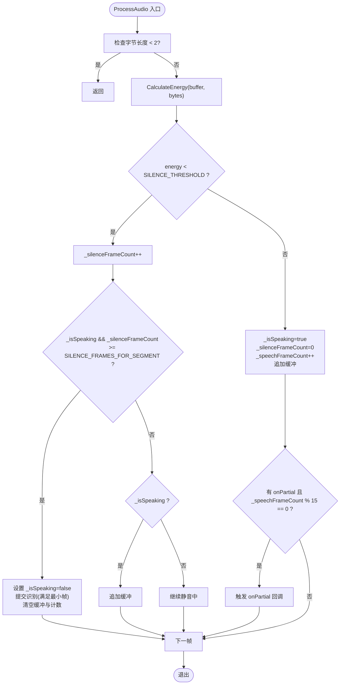
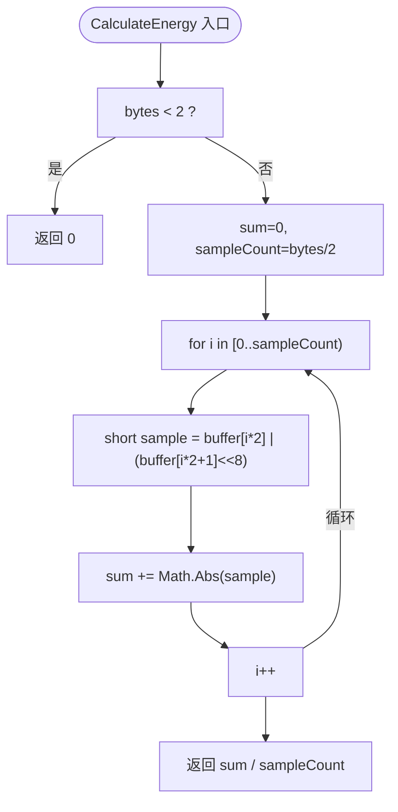
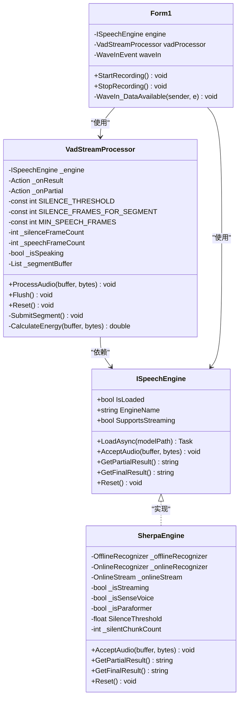

# 语音活动检测算法

<cite>
**本文引用的文件**   
- [VadStreamProcessor.cs](file://t9s2t/Engines/VadStreamProcessor.cs)
- [SherpaEngine.cs](file://t9s2t/Engines/SherpaEngine.cs)
- [ISpeechEngine.cs](file://t9s2t/Engines/ISpeechEngine.cs)
- [Form1.cs](file://t9s2t/Form1.cs)
</cite>

## 目录
1. [简介](#简介)
2. [项目结构](#项目结构)
3. [核心组件](#核心组件)
4. [架构总览](#架构总览)
5. [详细组件分析](#详细组件分析)
6. [依赖关系分析](#依赖关系分析)
7. [性能考量](#性能考量)
8. [故障排查指南](#故障排查指南)
9. [结论](#结论)
10. [附录：参数调优与场景配置](#附录参数调优与场景配置)

## 简介
本技术文档聚焦于语音活动检测（VAD）算法在工程中的实现与应用，重点围绕以下目标展开：
- 解释 VAD 的核心原理：RMS 音量计算、静音检测与语音分段逻辑。
- 深入剖析 VadStreamProcessor 的关键参数：SILENCE_THRESHOLD（静音阈值）、SILENCE_FRAMES_FOR_SEGMENT（分段帧数）、MIN_SPEECH_FRAMES（最小语音帧数）。
- 详解能量计算方法 CalculateEnergy 的实现细节：音频样本解析、振幅计算与阈值判断。
- 说明语音状态管理机制：_isSpeaking 状态切换、_silenceFrameCount 与 _speechFrameCount 的计数逻辑。
- 提供算法调优建议与不同场景下的参数配置指南。
- 通过代码片段路径展示处理流程与边界情况处理。

## 项目结构
本项目采用分层与模块化组织方式：
- 引擎抽象层：ISpeechEngine 定义统一的识别接口。
- 引擎实现层：SherpaEngine 封装 sherpa-onnx 的多种模型（SenseVoice、Paraformer、流式与非流式），并提供内置 RMS 音量检测与可选 VAD 模型加载。
- VAD 流处理器：VadStreamProcessor 基于简单能量阈值进行静音检测与语音分段，将非流式模型“模拟”为流式识别。
- 应用层：Form1 负责录音采集、UI 交互、键盘钩子、结果粘贴等。

图表来源
- [Form1.cs:1057-1111](file://t9s2t/Form1.cs#L1057-L1111)
- [ISpeechEngine.cs:1-35](file://t9s2t/Engines/ISpeechEngine.cs#L1-L35)
- [SherpaEngine.cs:351-479](file://t9s2t/Engines/SherpaEngine.cs#L351-L479)
- [VadStreamProcessor.cs:38-136](file://t9s2t/Engines/VadStreamProcessor.cs#L38-L136)

章节来源
- [Form1.cs:1057-1111](file://t9s2t/Form1.cs#L1057-L1111)
- [ISpeechEngine.cs:1-35](file://t9s2t/Engines/ISpeechEngine.cs#L1-L35)
- [SherpaEngine.cs:351-479](file://t9s2t/Engines/SherpaEngine.cs#L351-L479)
- [VadStreamProcessor.cs:38-136](file://t9s2t/Engines/VadStreamProcessor.cs#L38-L136)

## 核心组件
- ISpeechEngine：定义识别器统一接口，包括加载、接受音频、获取部分/最终结果、重置等能力。
- SherpaEngine：实现多模型支持（SenseVoice、离线 Paraformer、流式 Paraformer），包含内置 RMS 音量检测与可选 VAD 模型加载；同时提供端点检测与标点恢复。
- VadStreamProcessor：基于简单能量阈值的 VAD 流处理器，负责静音检测、语音分段、提交识别与回调。
- Form1：集成录音设备、键盘钩子、结果粘贴与 UI 提示，协调引擎与 VAD 的工作流。

章节来源
- [ISpeechEngine.cs:1-35](file://t9s2t/Engines/ISpeechEngine.cs#L1-L35)
- [SherpaEngine.cs:14-608](file://t9s2t/Engines/SherpaEngine.cs#L14-L608)
- [VadStreamProcessor.cs:12-162](file://t9s2t/Engines/VadStreamProcessor.cs#L12-L162)
- [Form1.cs:1057-1111](file://t9s2t/Form1.cs#L1057-L1111)

## 架构总览
整体数据流如下：
- 录音线程捕获 PCM 数据（16kHz, 单声道, 16-bit）。
- 若引擎支持流式且使用原生流式模式（如 Paraformer 流式），直接送入引擎并实时出字。
- 若为非流式模型但需要“模拟流式”，则通过 VadStreamProcessor 进行静音检测与分段，再调用引擎进行整段识别。
- 最终结果通过剪贴板与快捷键粘贴到前台窗口。

图表来源
- [Form1.cs:1057-1111](file://t9s2t/Form1.cs#L1057-L1111)
- [VadStreamProcessor.cs:38-136](file://t9s2t/Engines/VadStreamProcessor.cs#L38-L136)
- [SherpaEngine.cs:351-479](file://t9s2t/Engines/SherpaEngine.cs#L351-L479)

## 详细组件分析

### VadStreamProcessor 类分析
VadStreamProcessor 是 VAD 算法的核心实现，负责：
- 计算每帧平均振幅（简化版 RMS）。
- 根据静音阈值判定是否静音。
- 维护语音状态与计数，完成语音分段与提交识别。
- 提供 Flush 与 Reset 以支持停止录音与状态复位。

关键参数
- SILENCE_THRESHOLD：静音振幅阈值，用于区分静音与语音。
- SILENCE_FRAMES_FOR_SEGMENT：连续静音帧数触发分段，约 0.5 秒（取决于采样率与帧大小）。
- MIN_SPEECH_FRAMES：最少语音帧数才提交识别，过滤噪音。

状态变量
- _isSpeaking：当前是否在说话。
- _silenceFrameCount：连续静音帧计数。
- _speechFrameCount：累计语音帧计数。
- _segmentBuffer：累积待提交的音频字节缓冲。

处理流程
- 进入 ProcessAudio：
  - 计算能量 energy = CalculateEnergy(buffer, bytes)。
  - isSilent = energy < SILENCE_THRESHOLD。
  - 静音分支：
    - _silenceFrameCount++。
    - 若 _isSpeaking 且 _silenceFrameCount >= SILENCE_FRAMES_FOR_SEGMENT：
      - 标记语音结束，提交识别（满足最小语音帧条件）。
      - 清空缓冲与计数。
    - 否则继续积累缓冲（仅在 _isSpeaking 时）。
  - 语音分支：
    - _isSpeaking = true，_silenceFrameCount = 0，_speechFrameCount++。
    - 追加缓冲。
    - 每隔一定帧数发送 partial 反馈（可选）。

提交识别 SubmitSegment：
- 复制缓冲，调用引擎 Reset/AcceptAudio/FinalResult。
- 若结果非空，触发 onResult 回调。

Flush：
- 强制提交当前缓冲（停止录音时调用），并清理状态。

Reset：
- 清空缓冲与所有计数与状态。

图表来源
- [VadStreamProcessor.cs:38-86](file://t9s2t/Engines/VadStreamProcessor.cs#L38-L86)
- [VadStreamProcessor.cs:114-136](file://t9s2t/Engines/VadStreamProcessor.cs#L114-L136)

章节来源
- [VadStreamProcessor.cs:12-162](file://t9s2t/Engines/VadStreamProcessor.cs#L12-L162)

#### 能量计算方法 CalculateEnergy 实现细节
- 输入：PCM 缓冲（16-bit 小端序），按每两个字节解析为一个 short 样本。
- 计算：对每个样本取绝对值并累加，最后除以样本数量得到平均振幅。
- 输出：double 类型的平均振幅，作为能量指标。
- 复杂度：O(N)，N 为样本数量。空间复杂度 O(1)。
- 注意：该实现为简化版 RMS（未平方开方），仅用平均绝对值作为能量近似，适合快速静音检测。

图表来源
- [VadStreamProcessor.cs:141-152](file://t9s2t/Engines/VadStreamProcessor.cs#L141-L152)

章节来源
- [VadStreamProcessor.cs:141-152](file://t9s2t/Engines/VadStreamProcessor.cs#L141-L152)

#### 语音状态管理机制
- _isSpeaking：表示当前是否处于说话状态。
- _silenceFrameCount：记录连续静音帧数，达到分段阈值后触发提交识别。
- _speechFrameCount：累计语音帧数，用于过滤短噪声与 partial 反馈频率控制。
- 状态切换：
  - 静音时：_silenceFrameCount++；若满足分段条件，则结束语音并重置计数。
  - 语音时：_isSpeaking=true，_silenceFrameCount=0，_speechFrameCount++，并追加缓冲。
- 边界情况：
  - 开始即静音：不进入语音分支，不会误提交。
  - 极短语音：若 _speechFrameCount < MIN_SPEECH_FRAMES，不会提交识别。
  - 长时间停顿：在 _isSpeaking 状态下，连续静音超过阈值才会分段，避免自然停顿导致频繁切分。

章节来源
- [VadStreamProcessor.cs:23-86](file://t9s2t/Engines/VadStreamProcessor.cs#L23-L86)

### SherpaEngine 与内置 VAD/RMS
SherpaEngine 除了封装识别模型外，还实现了：
- 内置 RMS 音量检测：用于流式模式的静音过滤与端点辅助。
- 可选 VAD 模型加载：当存在 vad.onnx 时，可启用更复杂的 VAD 模型（Silero VAD）。
- 端点检测：流式模式下通过规则（静音时长、最小语句长度）自动分句。

关键点
- RMS 计算：归一化样本到 [-1,1]，计算均方根，范围 0~1。
- SilenceThreshold：默认 0.01f，低于此值视为静音。
- 静音过滤：在未检测到过人声前，静音不送入模型；已检测到人声后，连续静音超过一定帧数（约 1.5 秒）才停止送入。
- 端点检测：Rule1MinTrailingSilence、Rule2MinTrailingSilence、Rule3MinUtteranceLength 控制分句行为。

章节来源
- [SherpaEngine.cs:351-479](file://t9s2t/Engines/SherpaEngine.cs#L351-L479)
- [SherpaEngine.cs:577-589](file://t9s2t/Engines/SherpaEngine.cs#L577-L589)
- [SherpaEngine.cs:314-347](file://t9s2t/Engines/SherpaEngine.cs#L314-L347)

### 应用层集成（Form1）
Form1 负责：
- 初始化 WaveInEvent 录音设备（16kHz, 单声道）。
- 根据引擎类型选择 VAD 或原生流式处理。
- 在 DataAvailable 回调中分发音频数据。
- 处理端点检测与 partial 节流，避免 UI 闪烁。
- 停止录音时调用 Flush 或 GetFinalResult 完成识别。

章节来源
- [Form1.cs:1057-1111](file://t9s2t/Form1.cs#L1057-L1111)
- [Form1.cs:1146-1273](file://t9s2t/Form1.cs#L1146-L1273)

## 依赖关系分析
- VadStreamProcessor 依赖 ISpeechEngine 接口，具体由 SherpaEngine 实现。
- Form1 同时依赖 VadStreamProcessor 与 SherpaEngine，根据引擎能力选择处理路径。
- SherpaEngine 内部依赖 sherpa-onnx 库（C API 封装），以及可选的标点与 VAD 模型。

图表来源
- [ISpeechEngine.cs:1-35](file://t9s2t/Engines/ISpeechEngine.cs#L1-L35)
- [SherpaEngine.cs:14-608](file://t9s2t/Engines/SherpaEngine.cs#L14-L608)
- [VadStreamProcessor.cs:12-162](file://t9s2t/Engines/VadStreamProcessor.cs#L12-L162)
- [Form1.cs:1057-1111](file://t9s2t/Form1.cs#L1057-L1111)

章节来源
- [ISpeechEngine.cs:1-35](file://t9s2t/Engines/ISpeechEngine.cs#L1-L35)
- [SherpaEngine.cs:14-608](file://t9s2t/Engines/SherpaEngine.cs#L14-L608)
- [VadStreamProcessor.cs:12-162](file://t9s2t/Engines/VadStreamProcessor.cs#L12-L162)
- [Form1.cs:1057-1111](file://t9s2t/Form1.cs#L1057-L1111)

## 性能考量
- 能量计算复杂度：O(N)，N 为样本数。由于每帧样本量较小（例如 16kHz/10ms 约为 160 样本），CPU 开销极低。
- 内存分配：VadStreamProcessor 使用 List<byte> 累积缓冲，提交时转换为数组，可能产生临时对象。在高吞吐场景下可考虑复用缓冲区以减少 GC 压力。
- 流式 vs 非流式：原生流式（SherpaEngine 流式模式）延迟更低，无需 VAD 分段；非流式模型通过 VAD 模拟流式，会增加分段与提交开销。
- 端点检测：SherpaEngine 的端点规则（静音时长、最小语句长度）影响分句时机与延迟，需平衡出字速度与吞字问题。

[本节为通用性能讨论，不直接分析具体文件]

## 故障排查指南
常见问题与建议：
- 静音阈值过高或过低：
  - 现象：过高的阈值会导致频繁分段（把弱音当作静音）；过低的阈值会漏检静音，导致长句不分段。
  - 调整：根据麦克风增益与环境噪声调整 SILENCE_THRESHOLD。
- 分段帧数不合理：
  - 现象：SILENCE_FRAMES_FOR_SEGMENT 过小会导致自然停顿频繁切分；过大则延迟提交。
  - 调整：结合采样率与帧大小估算时间，通常 0.5 秒左右较为合适。
- 最小语音帧数不当：
  - 现象：MIN_SPEECH_FRAMES 过小会提交噪声片段；过大可能导致短语音不被识别。
  - 调整：根据实际语速与噪声水平微调。
- 流式模式静音过滤：
  - 现象：SilenceThreshold 设置不当会导致早期静音被送入模型，产生幻觉。
  - 调整：确保未检测到过人声前不送入静音；已检测到人声后允许一定静音缓冲。
- 端点检测误触发：
  - 现象：Rule1/Rule2 过小会在说话中停顿误触发；过大则延迟出字。
  - 调整：适当增大 Rule2MinTrailingSilence 以避免说话中停顿误触发。

章节来源
- [VadStreamProcessor.cs:18-21](file://t9s2t/Engines/VadStreamProcessor.cs#L18-L21)
- [SherpaEngine.cs:351-479](file://t9s2t/Engines/SherpaEngine.cs#L351-L479)

## 结论
VadStreamProcessor 通过简单的平均振幅阈值实现高效的静音检测与语音分段，适用于将非流式模型“模拟”为流式识别的场景。其参数配置直接影响静音判定、分段时机与识别质量。结合 SherpaEngine 的内置 RMS 与可选 VAD 模型，系统可在不同场景下灵活平衡延迟与准确率。合理调参与场景适配是获得良好用户体验的关键。

[本节为总结性内容，不直接分析具体文件]

## 附录：参数调优与场景配置

### 参数含义与默认值
- SILENCE_THRESHOLD：静音振幅阈值。默认值较低以兼容低增益麦克风。
- SILENCE_FRAMES_FOR_SEGMENT：连续静音帧数触发分段。默认约 0.5 秒。
- MIN_SPEECH_FRAMES：最少语音帧数才提交识别。默认用于过滤噪音。

章节来源
- [VadStreamProcessor.cs:18-21](file://t9s2t/Engines/VadStreamProcessor.cs#L18-L21)

### 调优建议
- 安静环境（办公室、书房）：
  - SILENCE_THRESHOLD：保持默认或略降低。
  - SILENCE_FRAMES_FOR_SEGMENT：0.5 秒左右。
  - MIN_SPEECH_FRAMES：5 帧左右。
- 嘈杂环境（咖啡厅、街道）：
  - SILENCE_THRESHOLD：适当提高，减少噪声误判。
  - SILENCE_FRAMES_FOR_SEGMENT：可适当增大，避免噪声导致的频繁分段。
  - MIN_SPEECH_FRAMES：适当提高，过滤短噪声。
- 高延迟敏感场景（实时对话）：
  - SILENCE_FRAMES_FOR_SEGMENT：减小至 0.3~0.5 秒，提升出字速度。
  - MIN_SPEECH_FRAMES：降低至 3~5 帧，尽早提交。
- 低延迟容忍场景（会议记录）：
  - SILENCE_FRAMES_FOR_SEGMENT：增大至 0.5~1.0 秒，减少误切分。
  - MIN_SPEECH_FRAMES：提高至 5~10 帧，提升稳定性。

### 代码示例路径（处理流程与边界情况）
- 主处理流程：
  - [VadStreamProcessor.cs:38-86](file://t9s2t/Engines/VadStreamProcessor.cs#L38-L86)
- 提交识别与错误处理：
  - [VadStreamProcessor.cs:114-136](file://t9s2t/Engines/VadStreamProcessor.cs#L114-L136)
- 能量计算实现：
  - [VadStreamProcessor.cs:141-152](file://t9s2t/Engines/VadStreamProcessor.cs#L141-L152)
- 停止录音时的强制提交：
  - [VadStreamProcessor.cs:91-101](file://t9s2t/Engines/VadStreamProcessor.cs#L91-L101)
- 应用层集成与端点检测：
  - [Form1.cs:1057-1111](file://t9s2t/Form1.cs#L1057-L1111)
  - [Form1.cs:1146-1273](file://t9s2t/Form1.cs#L1146-L1273)
- 引擎内置 RMS 与静音过滤：
  - [SherpaEngine.cs:351-479](file://t9s2t/Engines/SherpaEngine.cs#L351-L479)
  - [SherpaEngine.cs:577-589](file://t9s2t/Engines/SherpaEngine.cs#L577-L589)