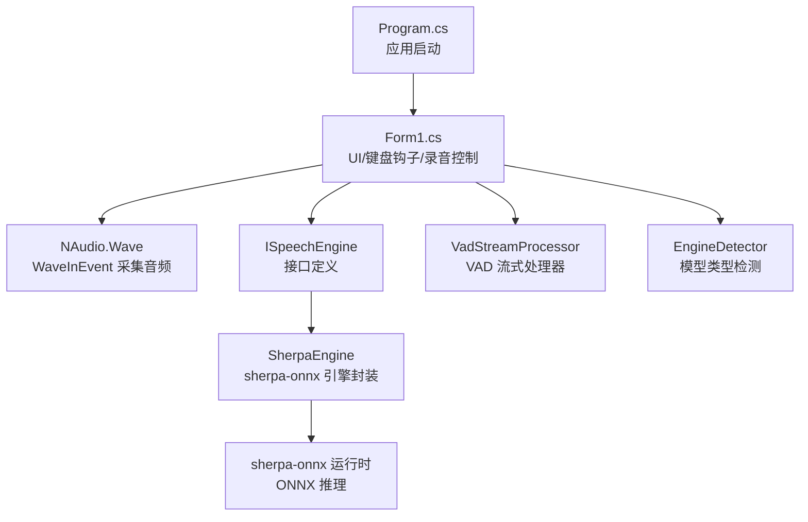
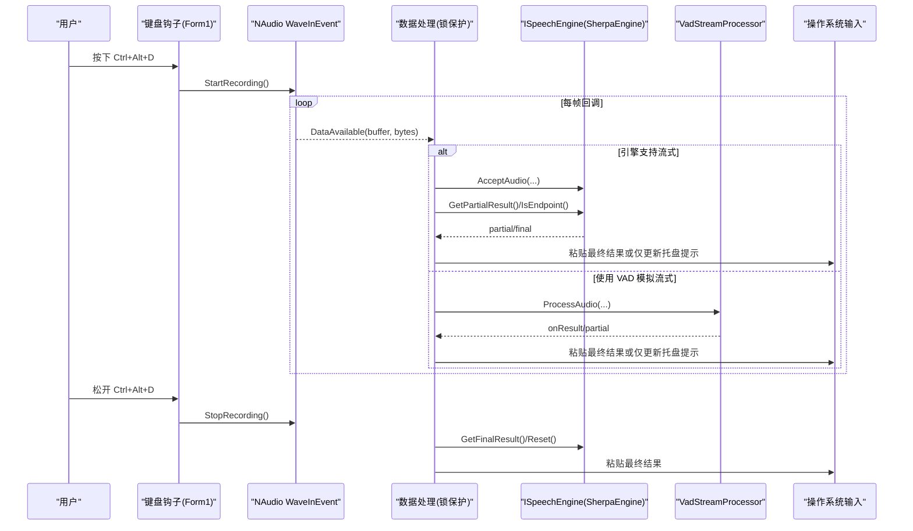
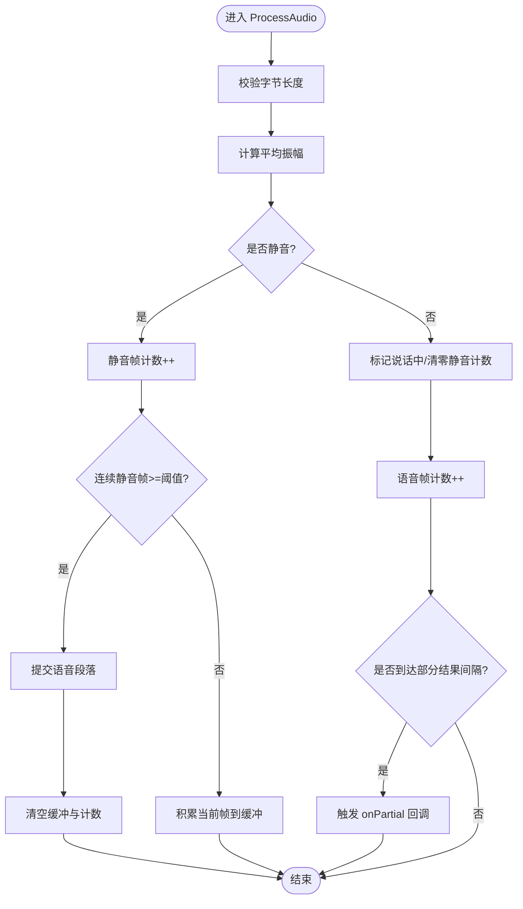
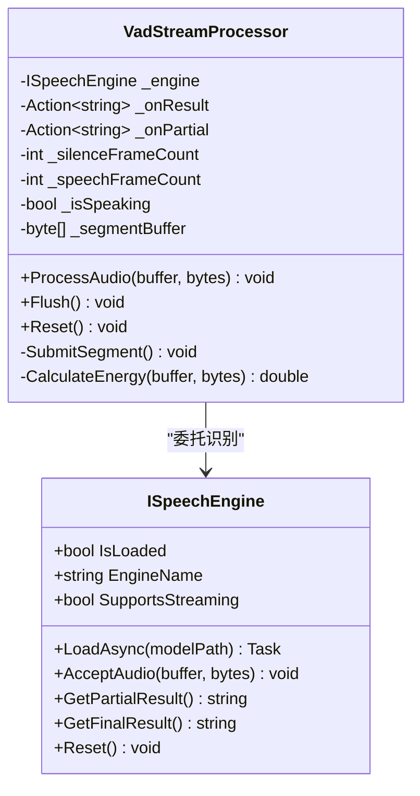
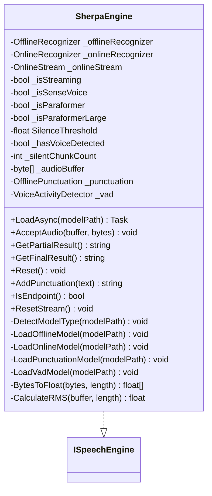
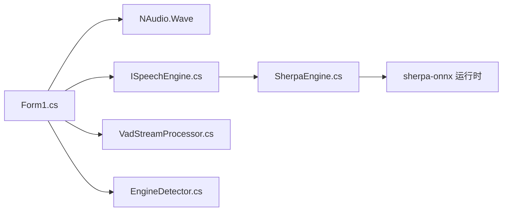

# 音频处理系统

<cite>
**本文引用的文件**
- [Form1.cs](file://t9s2t/Form1.cs)
- [Program.cs](file://t9s2t/Program.cs)
- [ISpeechEngine.cs](file://t9s2t/Engines/ISpeechEngine.cs)
- [SherpaEngine.cs](file://t9s2t/Engines/SherpaEngine.cs)
- [VadStreamProcessor.cs](file://t9s2t/Engines/VadStreamProcessor.cs)
- [EngineDetector.cs](file://t9s2t/Engines/EngineDetector.cs)
</cite>

## 目录
1. [简介](#简介)
2. [项目结构](#项目结构)
3. [核心组件](#核心组件)
4. [架构总览](#架构总览)
5. [详细组件分析](#详细组件分析)
6. [依赖关系分析](#依赖关系分析)
7. [性能与优化](#性能与优化)
8. [故障排查指南](#故障排查指南)
9. [结论](#结论)
10. [附录：关键实现路径参考](#附录关键实现路径参考)

## 简介
本技术文档围绕一个基于 NAudio 的桌面端实时语音识别系统，系统性阐述以下方面：
- 音频数据采集：使用 NAudio.Wave 枚举设备、配置采样率与通道、捕获 PCM 流。
- 语音活动检测（VAD）：RMS 能量计算、静音阈值、分段策略与部分结果反馈。
- 流式处理器 VadStreamProcessor：设计模式与流式处理架构，如何为非流式模型模拟“边说边出字”。
- 引擎层 SherpaEngine：支持 SenseVoice、离线 Paraformer、流式 Paraformer，并集成标点恢复与可选 VAD 模型。
- 多线程安全：录音回调线程与 UI/输入线程的数据共享与锁机制。
- 性能调优建议与常见问题排查方法。

## 项目结构
系统采用分层组织方式：
- 应用入口与 UI 控制：Program.cs、Form1.cs
- 引擎抽象与实现：ISpeechEngine.cs、SherpaEngine.cs
- 流式处理与 VAD：VadStreamProcessor.cs
- 引擎类型检测：EngineDetector.cs

图表来源
- [Program.cs:15-24](file://t9s2t/Program.cs#L15-L24)
- [Form1.cs:1056-1111](file://t9s2t/Form1.cs#L1056-L1111)
- [ISpeechEngine.cs:1-35](file://t9s2t/Engines/ISpeechEngine.cs#L1-L35)
- [SherpaEngine.cs:14-56](file://t9s2t/Engines/SherpaEngine.cs#L14-L56)
- [VadStreamProcessor.cs:12-33](file://t9s2t/Engines/VadStreamProcessor.cs#L12-L33)
- [EngineDetector.cs:22-75](file://t9s2t/Engines/EngineDetector.cs#L22-L75)

章节来源
- [Program.cs:15-24](file://t9s2t/Program.cs#L15-L24)
- [Form1.cs:1056-1111](file://t9s2t/Form1.cs#L1056-L1111)
- [ISpeechEngine.cs:1-35](file://t9s2t/Engines/ISpeechEngine.cs#L1-L35)
- [SherpaEngine.cs:14-56](file://t9s2t/Engines/SherpaEngine.cs#L14-L56)
- [VadStreamProcessor.cs:12-33](file://t9s2t/Engines/VadStreamProcessor.cs#L12-L33)
- [EngineDetector.cs:22-75](file://t9s2t/Engines/EngineDetector.cs#L22-L75)

## 核心组件
- ISpeechEngine：统一语音识别引擎接口，屏蔽不同后端差异，提供加载、接受音频、获取部分/最终结果、重置等能力。
- SherpaEngine：sherpa-onnx 引擎封装，支持多种模型（SenseVoice、离线 Paraformer、流式 Paraformer），内置 RMS 音量判断、可选标点恢复与可选 VAD 模型。
- VadStreamProcessor：面向非流式模型的“伪流式”处理器，通过 VAD 将长音频切分为片段，触发识别并返回结果，同时支持部分进度提示。
- EngineDetector：根据模型目录结构自动识别引擎类型并创建对应实例。
- Form1：应用主窗体，负责键盘钩子、录音控制、线程同步、输出粘贴与 UI 状态更新。

章节来源
- [ISpeechEngine.cs:1-35](file://t9s2t/Engines/ISpeechEngine.cs#L1-L35)
- [SherpaEngine.cs:14-56](file://t9s2t/Engines/SherpaEngine.cs#L14-L56)
- [VadStreamProcessor.cs:12-33](file://t9s2t/Engines/VadStreamProcessor.cs#L12-L33)
- [EngineDetector.cs:22-75](file://t9s2t/Engines/EngineDetector.cs#L22-L75)
- [Form1.cs:987-1051](file://t9s2t/Form1.cs#L987-L1051)

## 架构总览
整体数据流从麦克风到识别结果再到目标窗口输入的时序如下：

图表来源
- [Form1.cs:1146-1173](file://t9s2t/Form1.cs#L1146-L1173)
- [Form1.cs:1064-1111](file://t9s2t/Form1.cs#L1064-L1111)
- [Form1.cs:1228-1273](file://t9s2t/Form1.cs#L1228-L1273)
- [SherpaEngine.cs:351-479](file://t9s2t/Engines/SherpaEngine.cs#L351-L479)
- [VadStreamProcessor.cs:38-136](file://t9s2t/Engines/VadStreamProcessor.cs#L38-L136)

## 详细组件分析

### 音频数据采集（NAudio）
- 设备枚举与初始化：检查可用设备数量，选择默认设备，设置采样率为 16kHz、单声道，注册 DataAvailable 回调。
- 回调处理：在录音状态下，对每一帧 PCM 数据进行分流处理：
  - 若引擎支持流式：直接送入引擎，并根据 IsEndpoint 或 GetPartialResult 进行分句与节流输出。
  - 若使用 VAD：交给 VadStreamProcessor 做静音检测与分段提交。
  - 若为离线模式：累积音频，等待停止后一次性识别。
- 线程安全：DataAvailable 回调与 UI/输入操作通过互斥锁保护，避免竞态条件。

章节来源
- [Form1.cs:1056-1062](file://t9s2t/Form1.cs#L1056-L1062)
- [Form1.cs:1064-1111](file://t9s2t/Form1.cs#L1064-L1111)
- [Form1.cs:987-1051](file://t9s2t/Form1.cs#L987-L1051)

### 语音活动检测（VAD）算法
- 能量计算：对每帧 PCM 样本计算平均振幅（简化版 RMS），用于判断静音/语音。
- 静音阈值与分段：
  - 当能量低于阈值时累计静音帧数；达到连续静音帧数阈值且处于说话状态时，提交已积累的语音段落。
  - 最少语音帧数过滤噪音，避免误触发。
- 部分结果反馈：每隔若干帧调用 onPartial 回调，用于 UI 显示“正在听...”。
- 强制提交：停止录音时调用 Flush，确保最后一段语音被提交识别。

图表来源
- [VadStreamProcessor.cs:38-86](file://t9s2t/Engines/VadStreamProcessor.cs#L38-L86)
- [VadStreamProcessor.cs:114-136](file://t9s2t/Engines/VadStreamProcessor.cs#L114-L136)
- [VadStreamProcessor.cs:141-152](file://t9s2t/Engines/VadStreamProcessor.cs#L141-L152)

章节来源
- [VadStreamProcessor.cs:12-33](file://t9s2t/Engines/VadStreamProcessor.cs#L12-L33)
- [VadStreamProcessor.cs:38-86](file://t9s2t/Engines/VadStreamProcessor.cs#L38-L86)
- [VadStreamProcessor.cs:114-136](file://t9s2t/Engines/VadStreamProcessor.cs#L114-L136)
- [VadStreamProcessor.cs:141-152](file://t9s2t/Engines/VadStreamProcessor.cs#L141-L152)

### 流式处理器 VadStreamProcessor 的设计模式与架构
- 职责分离：VadStreamProcessor 只负责静音检测与分段，具体识别逻辑委托给 ISpeechEngine。
- 回调驱动：onResult/onPartial 回调解耦识别结果与 UI 展示。
- 状态机：内部维护说话/静音状态、帧计数与缓冲区，保证分段边界清晰。
- 容错：提交失败捕获异常并记录日志，不影响后续处理。

图表来源
- [ISpeechEngine.cs:1-35](file://t9s2t/Engines/ISpeechEngine.cs#L1-L35)
- [VadStreamProcessor.cs:12-33](file://t9s2t/Engines/VadStreamProcessor.cs#L12-L33)
- [VadStreamProcessor.cs:38-136](file://t9s2t/Engines/VadStreamProcessor.cs#L38-L136)

章节来源
- [VadStreamProcessor.cs:12-33](file://t9s2t/Engines/VadStreamProcessor.cs#L12-L33)
- [VadStreamProcessor.cs:38-136](file://t9s2t/Engines/VadStreamProcessor.cs#L38-L136)
- [ISpeechEngine.cs:1-35](file://t9s2t/Engines/ISpeechEngine.cs#L1-L35)

### 引擎层 SherpaEngine 的实现要点
- 模型类型检测：根据 tokens.txt 行数与文件结构区分 SenseVoice、离线 Paraformer-large、流式 Paraformer。
- 非流式模式：累积音频至 List<byte>，结束时整段识别，支持标点恢复。
- 流式模式：按帧送入 OnlineStream，结合端点检测规则（静音时长、最小语句长度）自动分句。
- RMS 音量判断：在流式模式下计算 RMS，避免长时间静音导致幻觉。
- 可选 VAD 模型：加载 vad.onnx 以增强静音检测能力。

图表来源
- [ISpeechEngine.cs:1-35](file://t9s2t/Engines/ISpeechEngine.cs#L1-L35)
- [SherpaEngine.cs:14-56](file://t9s2t/Engines/SherpaEngine.cs#L14-L56)
- [SherpaEngine.cs:74-115](file://t9s2t/Engines/SherpaEngine.cs#L74-L115)
- [SherpaEngine.cs:119-216](file://t9s2t/Engines/SherpaEngine.cs#L119-L216)
- [SherpaEngine.cs:220-255](file://t9s2t/Engines/SherpaEngine.cs#L220-L255)
- [SherpaEngine.cs:259-310](file://t9s2t/Engines/SherpaEngine.cs#L259-L310)
- [SherpaEngine.cs:314-347](file://t9s2t/Engines/SherpaEngine.cs#L314-L347)
- [SherpaEngine.cs:351-479](file://t9s2t/Engines/SherpaEngine.cs#L351-L479)
- [SherpaEngine.cs:562-589](file://t9s2t/Engines/SherpaEngine.cs#L562-L589)

章节来源
- [SherpaEngine.cs:14-56](file://t9s2t/Engines/SherpaEngine.cs#L14-L56)
- [SherpaEngine.cs:74-115](file://t9s2t/Engines/SherpaEngine.cs#L74-L115)
- [SherpaEngine.cs:119-216](file://t9s2t/Engines/SherpaEngine.cs#L119-L216)
- [SherpaEngine.cs:220-255](file://t9s2t/Engines/SherpaEngine.cs#L220-L255)
- [SherpaEngine.cs:259-310](file://t9s2t/Engines/SherpaEngine.cs#L259-L310)
- [SherpaEngine.cs:314-347](file://t9s2t/Engines/SherpaEngine.cs#L314-L347)
- [SherpaEngine.cs:351-479](file://t9s2t/Engines/SherpaEngine.cs#L351-L479)
- [SherpaEngine.cs:562-589](file://t9s2t/Engines/SherpaEngine.cs#L562-L589)

### 引擎类型检测与创建
- 检测规则：
  - 流式 Paraformer：存在 encoder 与 decoder ONNX 文件。
  - 非流式：存在 model.onnx/int8.onnx，并通过 tokens.txt 行数区分 SenseVoice 与 Paraformer-large。
  - 非流式 Paraformer：仅存在 encoder 文件。
- 工厂方法：根据检测结果创建对应的 ISpeechEngine 实例。

章节来源
- [EngineDetector.cs:22-75](file://t9s2t/Engines/EngineDetector.cs#L22-L75)
- [EngineDetector.cs:80-104](file://t9s2t/Engines/EngineDetector.cs#L80-L104)

### 多线程安全与数据共享
- 互斥锁：_inputLock 保护录音回调、引擎调用与剪贴板/键盘输入操作，避免并发冲突。
- 双重检查：在加锁后再次检查 isRecording 状态，防止停止录音时的竞态。
- UI 更新：使用 BeginInvoke 将 UI 更新调度到 UI 线程，避免跨线程访问控件。
- 节流与去重：partial 结果更新有最小时间间隔与文本变化判断，减少频繁粘贴导致的闪烁。

章节来源
- [Form1.cs:987-1051](file://t9s2t/Form1.cs#L987-L1051)
- [Form1.cs:1064-1111](file://t9s2t/Form1.cs#L1064-L1111)
- [Form1.cs:1146-1173](file://t9s2t/Form1.cs#L1146-L1173)
- [Form1.cs:1228-1273](file://t9s2t/Form1.cs#L1228-L1273)

## 依赖关系分析
- 外部依赖：
  - NAudio.Wave：音频采集与回调。
  - sherpa-onnx：语音识别推理（C API 封装）。
  - Newtonsoft.Json：远程模型/引擎配置解析。
  - Windows API：键盘钩子、剪贴板、前台窗口控制。
- 内部依赖：
  - Form1 依赖 ISpeechEngine 与 VadStreamProcessor。
  - SherpaEngine 依赖 sherpa-onnx 运行时。
  - EngineDetector 依赖文件系统与调试输出。

图表来源
- [Form1.cs:1056-1111](file://t9s2t/Form1.cs#L1056-L1111)
- [ISpeechEngine.cs:1-35](file://t9s2t/Engines/ISpeechEngine.cs#L1-L35)
- [SherpaEngine.cs:14-56](file://t9s2t/Engines/SherpaEngine.cs#L14-L56)
- [VadStreamProcessor.cs:12-33](file://t9s2t/Engines/VadStreamProcessor.cs#L12-L33)
- [EngineDetector.cs:22-75](file://t9s2t/Engines/EngineDetector.cs#L22-L75)

章节来源
- [Form1.cs:1056-1111](file://t9s2t/Form1.cs#L1056-L1111)
- [ISpeechEngine.cs:1-35](file://t9s2t/Engines/ISpeechEngine.cs#L1-L35)
- [SherpaEngine.cs:14-56](file://t9s2t/Engines/SherpaEngine.cs#L14-L56)
- [VadStreamProcessor.cs:12-33](file://t9s2t/Engines/VadStreamProcessor.cs#L12-L33)
- [EngineDetector.cs:22-75](file://t9s2t/Engines/EngineDetector.cs#L22-L75)

## 性能与优化
- 采样率与格式：统一使用 16kHz 单声道 PCM，降低带宽与计算量，适配多数 ASR 模型要求。
- 静音抑制：
  - SherpaEngine 流式模式使用 RMS 阈值与连续静音计数，避免无意义数据送入模型。
  - VadStreamProcessor 使用平均振幅阈值与连续静音帧数，提高分段准确性。
- 节流与去重：partial 结果更新限制最小间隔与文本变化，减少 UI 抖动与输入干扰。
- 端点检测参数：流式模式下的 Rule1/Rule2/Rule3 平衡出字速度与吞字问题，避免自然停顿误触发。
- 资源释放：Dispose 顺序合理，避免内存泄漏与句柄占用。

[本节为通用指导，不直接分析具体文件]

## 故障排查指南
- 未检测到麦克风：
  - 现象：界面提示“未检测到麦克风”。
  - 排查：确认设备列表与权限，检查默认设备索引是否为 0。
  - 参考路径：[Form1.cs:1056-1062](file://t9s2t/Form1.cs#L1056-L1062)
- 引擎 DLL 缺失：
  - 现象：按钮变为“下载引擎组件”，状态栏提示缺少组件。
  - 排查：检查 onnxruntime.dll 与 sherpa-onnx-c-api.dll 是否存在且大小大于 0。
  - 参考路径：[Form1.cs:468-505](file://t9s2t/Form1.cs#L468-L505)
- 模型未找到：
  - 现象：状态栏提示“模型未找到”。
  - 排查：确认 model 目录下包含正确的 ONNX 文件与 tokens.txt。
  - 参考路径：[EngineDetector.cs:22-75](file://t9s2t/Engines/EngineDetector.cs#L22-L75)
- 识别结果为空或卡顿：
  - 现象：松开按键后无结果或延迟明显。
  - 排查：检查 RMS 阈值与静音计数是否过于严格；调整端点检测参数；查看 Debug 输出中的错误信息。
  - 参考路径：[SherpaEngine.cs:351-479](file://t9s2t/Engines/SherpaEngine.cs#L351-L479)
- 粘贴失败或 Alt 键冲突：
  - 现象：粘贴时弹出系统菜单或无法输入。
  - 排查：确认临时释放 Alt 的逻辑生效；必要时回退到逐字符输入方案。
  - 参考路径：[Form1.cs:993-1051](file://t9s2t/Form1.cs#L993-L1051)

章节来源
- [Form1.cs:1056-1062](file://t9s2t/Form1.cs#L1056-L1062)
- [Form1.cs:468-505](file://t9s2t/Form1.cs#L468-L505)
- [EngineDetector.cs:22-75](file://t9s2t/Engines/EngineDetector.cs#L22-L75)
- [SherpaEngine.cs:351-479](file://t9s2t/Engines/SherpaEngine.cs#L351-L479)
- [Form1.cs:993-1051](file://t9s2t/Form1.cs#L993-L1051)

## 结论
该系统通过清晰的层次划分与职责分离，实现了稳定高效的实时语音识别流程：
- NAudio 负责低延迟音频采集；
- SherpaEngine 封装多模型推理与可选 VAD/标点恢复；
- VadStreamProcessor 为非流式模型提供“伪流式”体验；
- 严格的线程同步与节流策略保障用户体验与稳定性。
建议在部署时关注模型选择、端点参数与静音阈值的调优，以获得最佳识别质量与响应速度。

[本节为总结性内容，不直接分析具体文件]

## 附录：关键实现路径参考
- 应用启动与 TLS 设置：[Program.cs:15-24](file://t9s2t/Program.cs#L15-L24)
- 麦克风初始化与回调：[Form1.cs:1056-1111](file://t9s2t/Form1.cs#L1056-L1111)
- 录音开始/结束流程：[Form1.cs:1146-1173](file://t9s2t/Form1.cs#L1146-L1173)、[Form1.cs:1228-1273](file://t9s2t/Form1.cs#L1228-L1273)
- 输入粘贴与防冲突：[Form1.cs:993-1051](file://t9s2t/Form1.cs#L993-L1051)
- 引擎接口定义：[ISpeechEngine.cs:1-35](file://t9s2t/Engines/ISpeechEngine.cs#L1-L35)
- SherpaEngine 模型加载与识别：[SherpaEngine.cs:119-216](file://t9s2t/Engines/SherpaEngine.cs#L119-L216)、[SherpaEngine.cs:220-255](file://t9s2t/Engines/SherpaEngine.cs#L220-L255)、[SherpaEngine.cs:351-479](file://t9s2t/Engines/SherpaEngine.cs#L351-L479)
- VAD 流式处理器：[VadStreamProcessor.cs:38-136](file://t9s2t/Engines/VadStreamProcessor.cs#L38-L136)
- 引擎类型检测：[EngineDetector.cs:22-75](file://t9s2t/Engines/EngineDetector.cs#L22-L75)