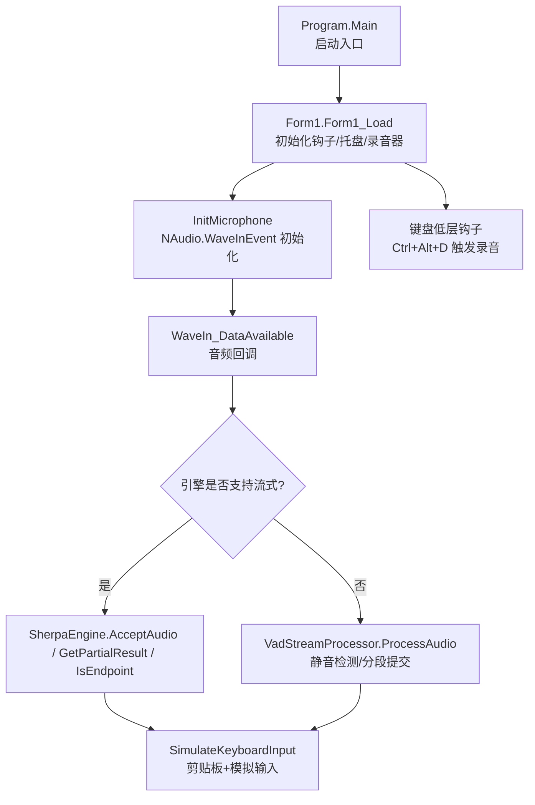
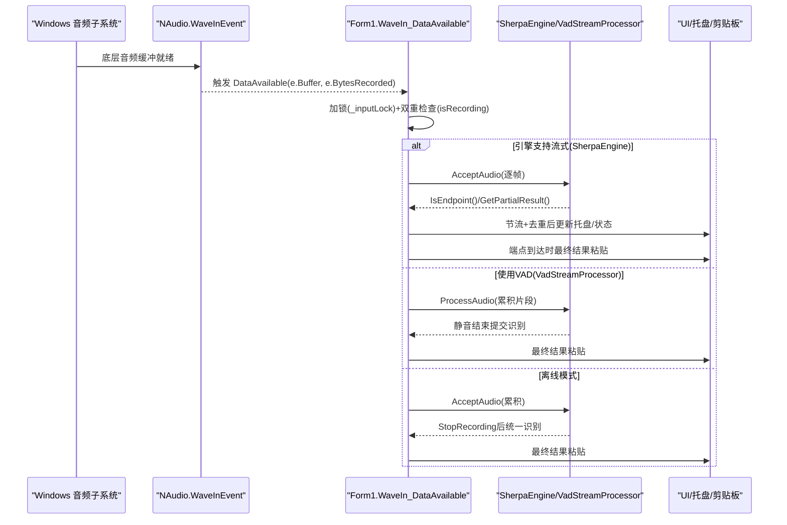
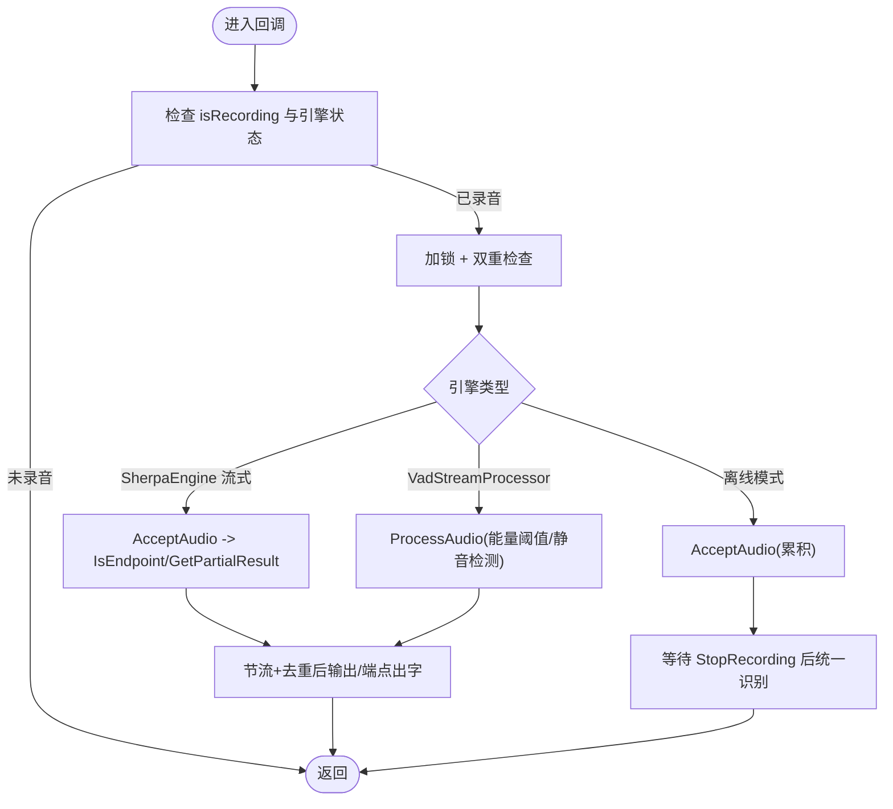
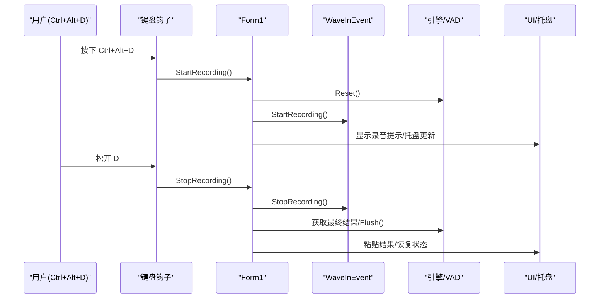
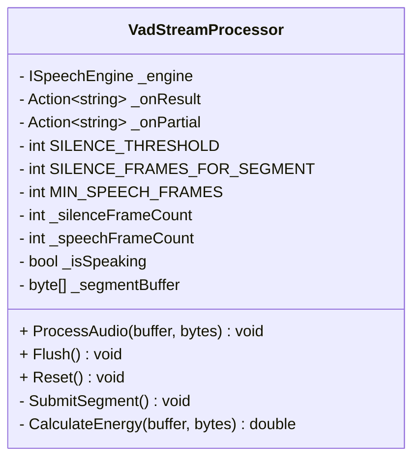
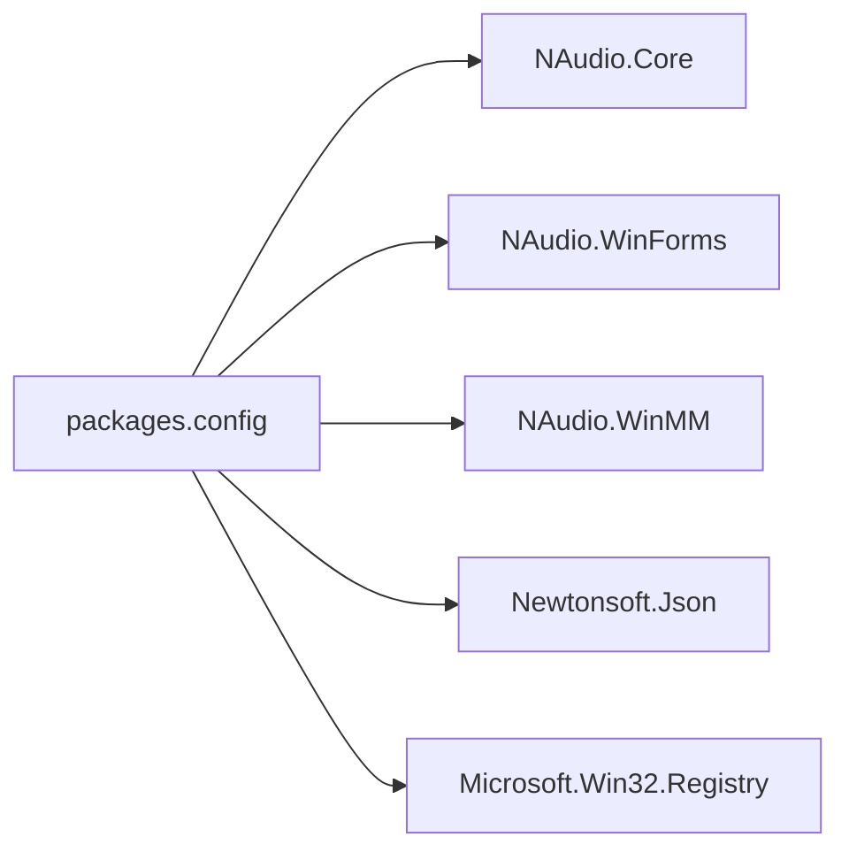

# 音频采集模块

<cite>
**本文引用的文件**   
- [Form1.cs](file://t9s2t/Form1.cs)
- [VadStreamProcessor.cs](file://t9s2t/Engines/VadStreamProcessor.cs)
- [Program.cs](file://t9s2t/Program.cs)
- [packages.config](file://t9s2t/packages.config)
</cite>

## 目录
1. [简介](#简介)
2. [项目结构](#项目结构)
3. [核心组件](#核心组件)
4. [架构总览](#架构总览)
5. [详细组件分析](#详细组件分析)
6. [依赖分析](#依赖分析)
7. [性能考虑](#性能考虑)
8. [故障排查指南](#故障排查指南)
9. [结论](#结论)
10. [附录](#附录)

## 简介
本技术文档聚焦于 t9s2t 项目的音频采集模块，系统性阐述 NAudio 库在该项目中的使用方式与实现细节。内容涵盖：
- 麦克风设备枚举、音频流捕获与缓冲区管理
- 采样率设置、音频格式与实时数据流处理
- 多线程环境下的采集机制、线程同步与数据共享策略
- 音频质量优化思路（降噪、增益控制、动态范围调整）
- 关键流程的代码级示例路径（不直接粘贴代码），包括设备选择、流初始化、数据回调处理与异常处理

## 项目结构
本项目采用 WinForms 应用形态，音频采集逻辑集中在主窗体类中，并通过事件驱动的方式将音频帧送入语音识别引擎或 VAD 处理器。

图示来源
- [Program.cs:15-24](file://t9s2t/Program.cs#L15-L24)
- [Form1.cs:151-235](file://t9s2t/Form1.cs#L151-L235)
- [Form1.cs:1056-1111](file://t9s2t/Form1.cs#L1056-L1111)
- [VadStreamProcessor.cs:38-86](file://t9s2t/Engines/VadStreamProcessor.cs#L38-L86)

章节来源
- [Program.cs:15-24](file://t9s2t/Program.cs#L15-L24)
- [Form1.cs:151-235](file://t9s2t/Form1.cs#L151-L235)

## 核心组件
- 音频采集入口与生命周期管理
  - 设备枚举与初始化：通过 WaveInEvent.DeviceCount 检查可用设备，并以固定采样率与位深创建 WaveFormat，绑定 DataAvailable 回调。
  - 开始/停止录音：StartRecording/StopRecording 负责状态切换、引擎重置、VAD 重置以及 UI 提示更新。
- 音频回调与分流处理
  - WaveIn_DataAvailable 根据引擎能力分流：
    - SherpaEngine 流式模式：逐帧 AcceptAudio，按端点检测输出最终结果，节流去重后输出部分结果。
    - VadStreamProcessor 非流式模型：计算能量阈值进行静音检测，累积片段并在静音段结束时提交识别。
    - 离线模式：仅累积音频，松开按键后一次性识别。
- 输入合成与防抖
  - SimulateKeyboardInput 负责最终文本的原子化粘贴，避免闪烁；对 partial 结果仅做 UI 展示，不做实际输入。
- 线程同步与状态保护
  - 使用互斥锁 _inputLock 保护 isRecording、引擎调用、剪贴板与输入模拟等共享资源访问。
  - 双重检查（double-check）确保在获取锁后仍校验录音状态，防止竞态导致的数据丢弃或重复提交。

章节来源
- [Form1.cs:1056-1111](file://t9s2t/Form1.cs#L1056-L1111)
- [Form1.cs:1146-1173](file://t9s2t/Form1.cs#L1146-L1173)
- [Form1.cs:1228-1273](file://t9s2t/Form1.cs#L1228-L1273)
- [Form1.cs:992-1051](file://t9s2t/Form1.cs#L992-L1051)
- [Form1.cs:987-990](file://t9s2t/Form1.cs#L987-L990)

## 架构总览
下图展示了从系统音频驱动到识别输出的端到端数据流，以及关键线程交互关系。

图示来源
- [Form1.cs:1056-1111](file://t9s2t/Form1.cs#L1056-L1111)
- [Form1.cs:1146-1173](file://t9s2t/Form1.cs#L1146-L1173)
- [Form1.cs:1228-1273](file://t9s2t/Form1.cs#L1228-L1273)
- [VadStreamProcessor.cs:38-86](file://t9s2t/Engines/VadStreamProcessor.cs#L38-L86)

## 详细组件分析

### 设备枚举与流初始化
- 设备可用性检查：通过 WaveInEvent.DeviceCount 判断是否存在至少一个输入设备。
- 采样率与格式：使用 WaveFormat(16000, 1) 指定 16kHz 单声道 PCM，满足多数 ASR 模型的输入要求。
- 回调绑定：为 waveIn.DataAvailable 注册处理函数，用于接收音频帧。

章节来源
- [Form1.cs:1056-1062](file://t9s2t/Form1.cs#L1056-L1062)

### 音频回调与数据处理
- 线程安全：回调可能由 NAudio 内部线程触发，需加锁并再次检查 isRecording，避免并发写入导致的竞争条件。
- 分流策略：
  - SherpaEngine 流式：AcceptAudio 逐帧推送；IsEndpoint 判定分句；GetPartialResult 提供部分结果，配合节流与去重降低 UI 抖动。
  - VadStreamProcessor：基于平均振幅的能量估计进行静音检测，达到静音阈值与连续静音帧数后提交片段识别。
  - 离线模式：仅在停止录音后统一识别整段音频。

图示来源
- [Form1.cs:1064-1111](file://t9s2t/Form1.cs#L1064-L1111)
- [VadStreamProcessor.cs:38-86](file://t9s2t/Engines/VadStreamProcessor.cs#L38-L86)

章节来源
- [Form1.cs:1064-1111](file://t9s2t/Form1.cs#L1064-L1111)
- [VadStreamProcessor.cs:38-86](file://t9s2t/Engines/VadStreamProcessor.cs#L38-L86)

### 开始/停止录音流程
- 开始录音：
  - 重置引擎与 VAD 状态
  - 启动录音设备
  - 保存前台窗口句柄，显示录音提示浮窗
- 停止录音：
  - 先停止录音设备，确保最后几帧被处理
  - 加锁后设置 isRecording=false
  - 根据引擎能力获取最终结果并提交输入

图示来源
- [Form1.cs:1146-1173](file://t9s2t/Form1.cs#L1146-L1173)
- [Form1.cs:1228-1273](file://t9s2t/Form1.cs#L1228-L1273)

章节来源
- [Form1.cs:1146-1173](file://t9s2t/Form1.cs#L1146-L1173)
- [Form1.cs:1228-1273](file://t9s2t/Form1.cs#L1228-L1273)

### 输入合成与防抖
- 最终结果粘贴：
  - 优先尝试将目标窗口置前，临时释放 Alt 键以避免误触系统菜单
  - 使用剪贴板+快捷键组合完成一次粘贴，随后追加空格
  - 失败回退至逐字符输入
- 部分结果节流：
  - 仅更新托盘图标文本，避免频繁粘贴造成闪烁
  - 基于时间戳与上次文本去重，最小间隔 200ms

章节来源
- [Form1.cs:992-1051](file://t9s2t/Form1.cs#L992-L1051)

### VAD 流式处理器
- 能量估计：对每帧 PCM 样本计算平均绝对值作为能量指标
- 静音检测：当能量低于阈值且连续静音帧数达到设定值，认为语音段落结束
- 片段提交：积累片段长度超过最少语音帧数后提交识别，否则继续累积
- 刷新与重置：停止录音时强制 Flush，保证末尾片段不被丢弃

图示来源
- [VadStreamProcessor.cs:12-160](file://t9s2t/Engines/VadStreamProcessor.cs#L12-L160)

章节来源
- [VadStreamProcessor.cs:38-86](file://t9s2t/Engines/VadStreamProcessor.cs#L38-L86)
- [VadStreamProcessor.cs:114-136](file://t9s2t/Engines/VadStreamProcessor.cs#L114-L136)
- [VadStreamProcessor.cs:141-152](file://t9s2t/Engines/VadStreamProcessor.cs#L141-L152)

## 依赖分析
- NAudio 相关包：
  - NAudio.Core、NAudio.WinForms、NAudio.WinMM 提供 WaveIn/WaveInEvent 与波形设备能力
- 运行时与平台：
  - .NET Framework 4.8（packages.config 指定 targetFramework）
- 其他依赖：
  - Newtonsoft.Json 用于远程配置解析
  - Microsoft.Win32.Registry 用于开机自启项读写

图示来源
- [packages.config:1-20](file://t9s2t/packages.config#L1-L20)

章节来源
- [packages.config:1-20](file://t9s2t/packages.config#L1-L20)

## 性能考虑
- 回调开销控制
  - 在回调中避免耗时操作，尽量只做轻量转发与节流判断
  - 使用节流与去重减少 UI 更新频率，降低主线程压力
- 内存分配
  - 避免在高频回调中频繁创建大对象；VAD 使用 List<byte> 累积片段，注意在提交后及时清空
- 线程安全
  - 使用单一互斥锁保护共享状态，减少锁粒度带来的上下文切换成本
- 输入稳定性
  - 最终结果采用剪贴板+快捷键粘贴，减少逐字符输入的延迟与错误率

[本节为通用指导，无需源码引用]

## 故障排查指南
- 未检测到麦克风
  - 现象：初始化阶段提示“未检测到麦克风”
  - 排查：确认设备数量大于 0，检查默认设备索引是否正确
- 无音频数据回调
  - 现象：DataAvailable 未被触发
  - 排查：确认 StartRecording 已调用，isRecording 状态正确，回调已绑定
- 部分结果闪烁或重复
  - 现象：UI 上部分结果频繁变化
  - 排查：检查节流时间与去重逻辑，确认 _lastDisplayedPartial 与时间戳比较
- 粘贴失败或误触系统菜单
  - 现象：粘贴无效或弹出系统菜单
  - 排查：确认临时释放 Alt 键逻辑生效，必要时启用逐字符回退方案

章节来源
- [Form1.cs:1056-1062](file://t9s2t/Form1.cs#L1056-L1062)
- [Form1.cs:992-1051](file://t9s2t/Form1.cs#L992-L1051)

## 结论
该音频采集模块以 NAudio 的事件驱动为核心，结合线程同步与节流去重策略，实现了稳定高效的实时语音输入体验。针对不同引擎能力，模块提供了流式、VAD 分段与离线三种处理路径，兼顾了低延迟与高准确率的需求。后续可在音频预处理（降噪、增益、动态范围）方面进一步增强，以提升复杂环境下的识别鲁棒性。

[本节为总结性内容，无需源码引用]

## 附录

### 关键实现路径参考
- 设备枚举与初始化
  - [Form1.cs:1056-1062](file://t9s2t/Form1.cs#L1056-L1062)
- 音频回调与分流处理
  - [Form1.cs:1064-1111](file://t9s2t/Form1.cs#L1064-L1111)
- 开始/停止录音
  - [Form1.cs:1146-1173](file://t9s2t/Form1.cs#L1146-L1173)
  - [Form1.cs:1228-1273](file://t9s2t/Form1.cs#L1228-L1273)
- 输入合成与防抖
  - [Form1.cs:992-1051](file://t9s2t/Form1.cs#L992-L1051)
- VAD 处理器
  - [VadStreamProcessor.cs:38-86](file://t9s2t/Engines/VadStreamProcessor.cs#L38-L86)
  - [VadStreamProcessor.cs:114-136](file://t9s2t/Engines/VadStreamProcessor.cs#L114-L136)
  - [VadStreamProcessor.cs:141-152](file://t9s2t/Engines/VadStreamProcessor.cs#L141-L152)
- 程序启动与 TLS 设置
  - [Program.cs:15-24](file://t9s2t/Program.cs#L15-L24)
- 依赖清单
  - [packages.config:1-20](file://t9s2t/packages.config#L1-L20)

### 音频质量优化建议（概念性）
- 降噪处理
  - 在回调中对 PCM 数据进行频谱滤波或谱减法，抑制稳态噪声
- 增益控制
  - 对信号幅度进行自适应增益，提升弱声段的信噪比
- 动态范围调整
  - 使用压缩/限幅器平滑峰值，提高整体响度一致性
- 静音门限调优
  - 根据环境噪声动态调整 VAD 阈值与连续静音帧数，平衡漏检与误切

[本节为概念性建议，无需源码引用]