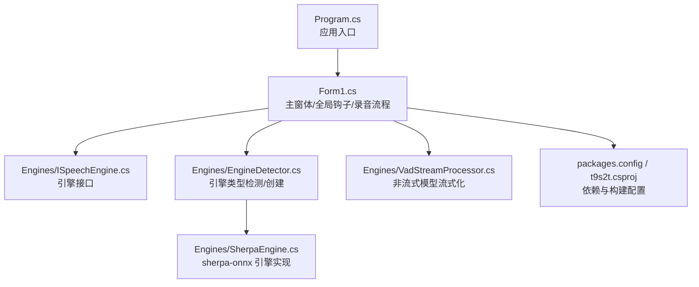
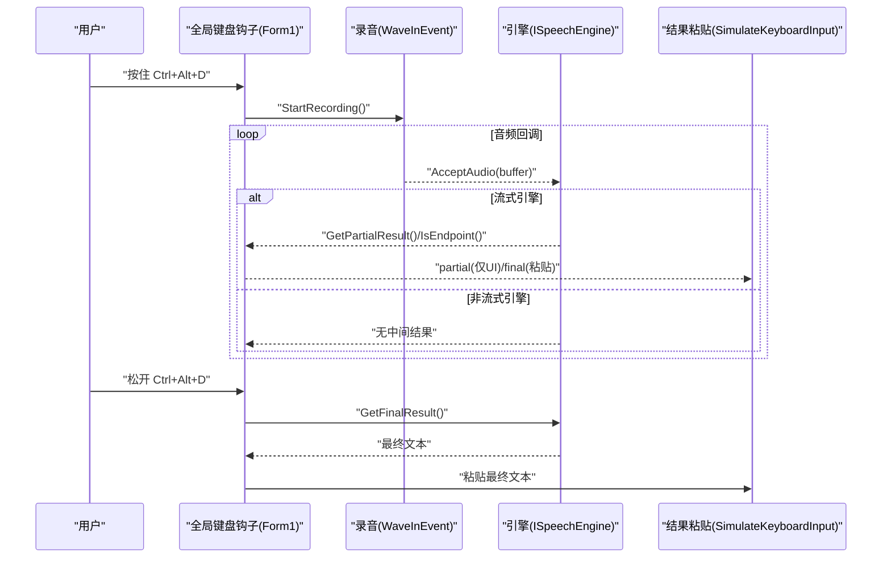
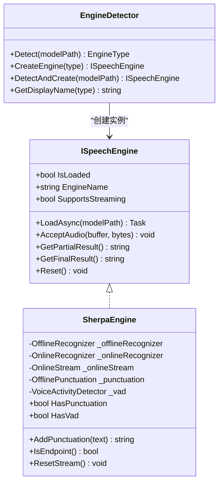
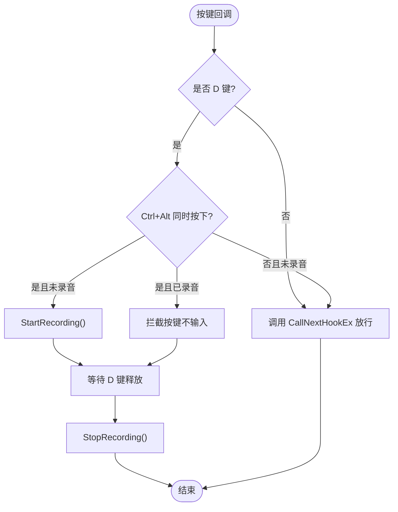
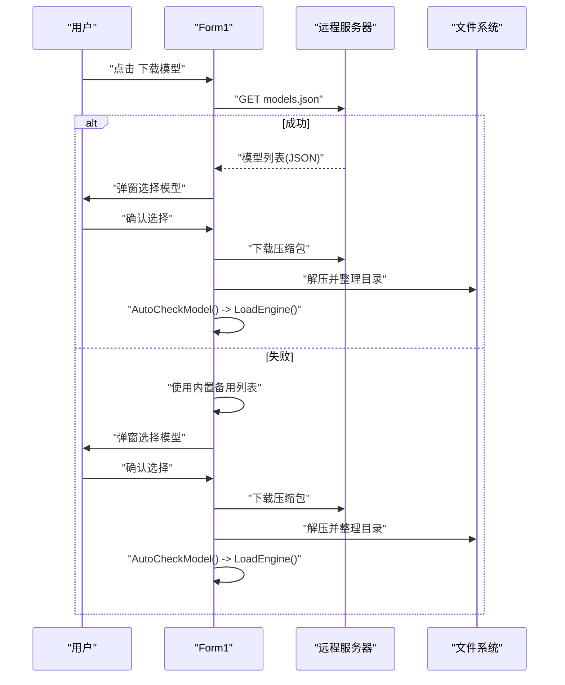
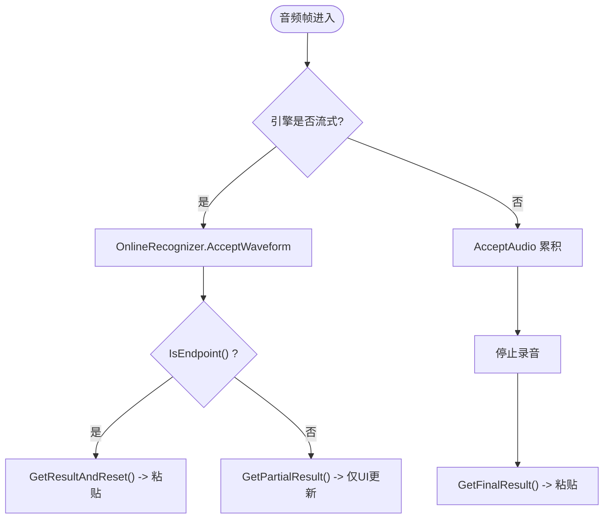
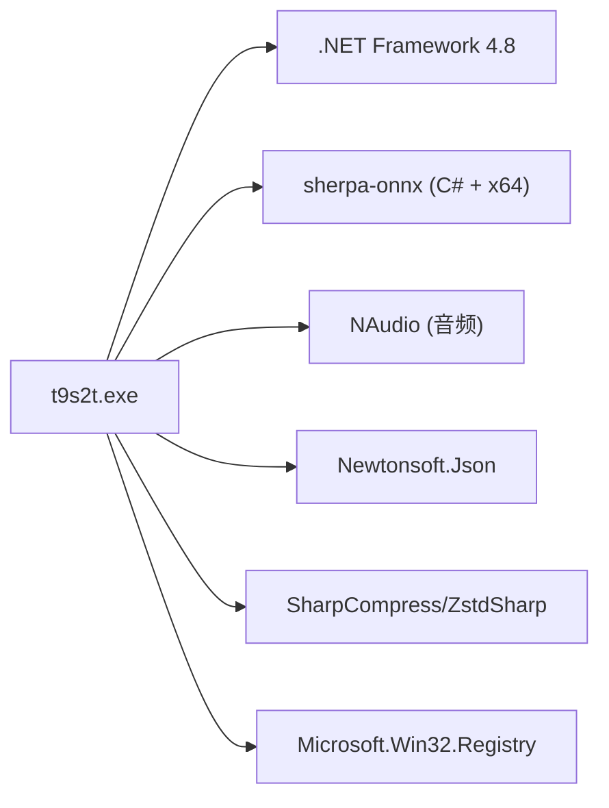

# 项目概述

<cite>
**本文引用的文件列表**
- [Program.cs](file://t9s2t/Program.cs)
- [Form1.cs](file://t9s2t/Form1.cs)
- [ISpeechEngine.cs](file://t9s2t/Engines/ISpeechEngine.cs)
- [SherpaEngine.cs](file://t9s2t/Engines/SherpaEngine.cs)
- [EngineDetector.cs](file://t9s2t/Engines/EngineDetector.cs)
- [VadStreamProcessor.cs](file://t9s2t/Engines/VadStreamProcessor.cs)
- [packages.config](file://t9s2t/packages.config)
- [t9s2t.csproj](file://t9s2t/t9s2t.csproj)
</cite>

## 目录
1. [简介](#简介)
2. [项目结构](#项目结构)
3. [核心组件](#核心组件)
4. [架构总览](#架构总览)
5. [详细组件分析](#详细组件分析)
6. [依赖关系分析](#依赖关系分析)
7. [性能与体验优化](#性能与体验优化)
8. [快速开始指南](#快速开始指南)
9. [故障排查](#故障排查)
10. [结论](#结论)

## 简介
t9s2t 是一款基于 C# WinForms 的 Windows 桌面应用程序，专注于“按住即说、松开出字”的实时语音识别输入体验。其核心价值在于：
- 低门槛、零配置：一键下载引擎与模型，自动检测并加载
- 多引擎支持：SenseVoice、Paraformer（含流式与非流式）等离线识别方案
- 智能模型管理：远程获取最新模型列表，在线下载、解压、安装、切换
- 系统集成能力：全局快捷键 Ctrl+Alt+D 触发录音，结果直接粘贴到当前活动窗口
- 后台运行：托盘常驻，最小化后仍可工作，提供状态提示

技术栈概览：
- .NET Framework 4.8 + WinForms
- sherpa-onnx 语音识别引擎（C# 封装）
- NAudio 音频采集与处理
- Newtonsoft.Json 用于 JSON 解析
- SharpCompress/ZstdSharp 用于 tar.bz2 解压
- Microsoft.Win32.Registry 实现开机自启

## 项目结构
整体采用“界面层 + 引擎抽象层 + 具体引擎实现 + 工具类”的分层组织方式：
- 界面与交互：Program.cs、Form1.cs
- 引擎抽象：ISpeechEngine.cs
- 引擎实现：SherpaEngine.cs
- 引擎检测与工厂：EngineDetector.cs
- 流式模拟处理器：VadStreamProcessor.cs
- 包与构建：packages.config、t9s2t.csproj

图表来源
- [Program.cs:1-27](file://t9s2t/Program.cs#L1-L27)
- [Form1.cs:1-200](file://t9s2t/Form1.cs#L1-L200)
- [ISpeechEngine.cs:1-35](file://t9s2t/Engines/ISpeechEngine.cs#L1-L35)
- [EngineDetector.cs:1-122](file://t9s2t/Engines/EngineDetector.cs#L1-L122)
- [SherpaEngine.cs:1-120](file://t9s2t/Engines/SherpaEngine.cs#L1-L120)
- [VadStreamProcessor.cs:1-60](file://t9s2t/Engines/VadStreamProcessor.cs#L1-L60)
- [packages.config:1-20](file://t9s2t/packages.config#L1-L20)
- [t9s2t.csproj:1-60](file://t9s2t/t9s2t.csproj#L1-L60)

章节来源
- [Program.cs:1-27](file://t9s2t/Program.cs#L1-L27)
- [Form1.cs:1-200](file://t9s2t/Form1.cs#L1-L200)
- [t9s2t.csproj:1-60](file://t9s2t/t9s2t.csproj#L1-L60)

## 核心组件
- 应用入口 Program.cs：设置 TLS 协议、初始化 WinForms 消息循环并启动主窗体
- 主窗体 Form1.cs：全局键盘钩子、录音控制、模型/引擎下载与加载、结果粘贴、托盘 UI、开机自启
- 引擎接口 ISpeechEngine.cs：统一暴露加载、接受音频、部分/最终结果、重置等方法
- 引擎实现 SherpaEngine.cs：基于 sherpa-onnx 的 SenseVoice/Paraformer（流式/非流式）识别，支持标点恢复与 VAD
- 引擎检测 EngineDetector.cs：根据模型目录结构判断引擎类型并创建对应实例
- 流式处理器 VadStreamProcessor.cs：将非流式模型通过静音分段模拟为“边说边出字”

章节来源
- [Program.cs:1-27](file://t9s2t/Program.cs#L1-L27)
- [Form1.cs:1-200](file://t9s2t/Form1.cs#L1-L200)
- [ISpeechEngine.cs:1-35](file://t9s2t/Engines/ISpeechEngine.cs#L1-L35)
- [SherpaEngine.cs:1-120](file://t9s2t/Engines/SherpaEngine.cs#L1-L120)
- [EngineDetector.cs:1-122](file://t9s2t/Engines/EngineDetector.cs#L1-L122)
- [VadStreamProcessor.cs:1-60](file://t9s2t/Engines/VadStreamProcessor.cs#L1-L60)

## 架构总览
系统以“事件驱动 + 异步 I/O”为核心，关键流程如下：
- 启动时检查并下载引擎 DLL，检测本地模型，自动加载引擎
- 注册全局键盘钩子，监听 Ctrl+Alt+D 组合键
- 按下时开始录音，按引擎模式分流：
  - 流式 Paraformer：逐帧送入 OnlineRecognizer，端点检测分句，实时输出
  - 非流式模型（SenseVoice/Paraformer-large）：使用 VAD 分段或累积整段，松开后识别
- 识别结果通过剪贴板 + 快捷键粘贴至前台窗口，避免焦点抢夺

图表来源
- [Form1.cs:415-460](file://t9s2t/Form1.cs#L415-L460)
- [Form1.cs:1057-1111](file://t9s2t/Form1.cs#L1057-L1111)
- [Form1.cs:1146-1273](file://t9s2t/Form1.cs#L1146-L1273)
- [Form1.cs:993-1051](file://t9s2t/Form1.cs#L993-L1051)
- [SherpaEngine.cs:351-479](file://t9s2t/Engines/SherpaEngine.cs#L351-L479)

## 详细组件分析

### 引擎抽象与实现
- ISpeechEngine 定义了统一的加载、音频输入、部分/最终结果、重置等能力
- SherpaEngine 内部维护 Offline/Online 两种识别器，并根据模型文件自动选择加载路径；同时可选加载标点恢复与 VAD 模型
- EngineDetector 通过模型目录中的特定文件组合判定引擎类型，并返回对应的 ISpeechEngine 实例

图表来源
- [ISpeechEngine.cs:1-35](file://t9s2t/Engines/ISpeechEngine.cs#L1-L35)
- [SherpaEngine.cs:1-120](file://t9s2t/Engines/SherpaEngine.cs#L1-L120)
- [EngineDetector.cs:1-122](file://t9s2t/Engines/EngineDetector.cs#L1-L122)

章节来源
- [ISpeechEngine.cs:1-35](file://t9s2t/Engines/ISpeechEngine.cs#L1-L35)
- [SherpaEngine.cs:1-120](file://t9s2t/Engines/SherpaEngine.cs#L1-L120)
- [EngineDetector.cs:1-122](file://t9s2t/Engines/EngineDetector.cs#L1-L122)

### 全局快捷键与录音流程
- 使用 SetWindowsHookEx 注册 WH_KEYBOARD_LL 全局钩子，拦截 D 键并结合 GetAsyncKeyState 判断 Ctrl/Alt 是否同时按下
- 按下时 StartRecording，松开时 StopRecording；期间通过 WaveInEvent 回调持续推送音频数据
- 流式模式下，依据 IsEndpoint 进行分句；非流式模式下，使用 VAD 分段或直接累积整段

图表来源
- [Form1.cs:415-460](file://t9s2t/Form1.cs#L415-L460)
- [Form1.cs:1146-1273](file://t9s2t/Form1.cs#L1146-L1273)

章节来源
- [Form1.cs:415-460](file://t9s2t/Form1.cs#L415-L460)
- [Form1.cs:1146-1273](file://t9s2t/Form1.cs#L1146-L1273)

### 模型与引擎的动态管理
- 首次启动若缺少引擎 DLL，则从远程配置拉取 onnxruntime.dll 与 sherpa-onnx-c-api.dll 并落盘
- 点击“下载模型”按钮时，先尝试远程获取 models.json，失败则回退内置列表；展示可发布模型供用户选择
- 下载完成后自动解压（支持 zip 与 tar.bz2），智能定位模型目录并重命名为 model，随后自动检测并加载引擎

图表来源
- [Form1.cs:724-851](file://t9s2t/Form1.cs#L724-L851)
- [Form1.cs:853-966](file://t9s2t/Form1.cs#L853-L966)
- [Form1.cs:608-642](file://t9s2t/Form1.cs#L608-L642)
- [Form1.cs:645-721](file://t9s2t/Form1.cs#L645-L721)

章节来源
- [Form1.cs:724-851](file://t9s2t/Form1.cs#L724-L851)
- [Form1.cs:853-966](file://t9s2t/Form1.cs#L853-L966)
- [Form1.cs:608-642](file://t9s2t/Form1.cs#L608-L642)
- [Form1.cs:645-721](file://t9s2t/Form1.cs#L645-L721)

### 流式与非流式识别策略
- 流式 Paraformer：逐帧送入 OnlineRecognizer，结合端点检测在停顿处分句，提升交互流畅度
- 非流式模型：
  - SenseVoice：通过 VadStreamProcessor 计算能量阈值，检测到静音段落后提交整段识别
  - Paraformer-large：累积整段音频，松开后一次性识别，适合长句高质量输出

图表来源
- [Form1.cs:1057-1111](file://t9s2t/Form1.cs#L1057-L1111)
- [SherpaEngine.cs:351-479](file://t9s2t/Engines/SherpaEngine.cs#L351-L479)
- [VadStreamProcessor.cs:38-136](file://t9s2t/Engines/VadStreamProcessor.cs#L38-L136)

章节来源
- [Form1.cs:1057-1111](file://t9s2t/Form1.cs#L1057-L1111)
- [SherpaEngine.cs:351-479](file://t9s2t/Engines/SherpaEngine.cs#L351-L479)
- [VadStreamProcessor.cs:38-136](file://t9s2t/Engines/VadStreamProcessor.cs#L38-L136)

## 依赖关系分析
- 运行时依赖
  - .NET Framework 4.8（WinForms）
  - sherpa-onnx（C# 封装 + x64 运行时）
  - NAudio（音频采集）
  - Newtonsoft.Json（JSON 解析）
  - SharpCompress/ZstdSharp（tar.bz2 解压）
  - Microsoft.Win32.Registry（开机自启）
- 构建与打包
  - 项目目标框架 v4.8，支持 Debug/Release 与 x64 平台
  - NuGet 包清单由 packages.config 管理

图表来源
- [t9s2t.csproj:1-60](file://t9s2t/t9s2t.csproj#L1-L60)
- [packages.config:1-20](file://t9s2t/packages.config#L1-L20)

章节来源
- [t9s2t.csproj:1-60](file://t9s2t/t9s2t.csproj#L1-L60)
- [packages.config:1-20](file://t9s2t/packages.config#L1-L20)

## 性能与体验优化
- 流式识别优先：对 Paraformer 流式模型启用端点检测，减少延迟，提升“边说边出字”体验
- 节流与去重：partial 结果仅在文本变化且超过 200ms 间隔时更新 UI，避免频繁刷新造成闪烁
- 防焦点抢夺：录音提示窗使用非激活窗体，粘贴前临时释放 Alt 键，避免误触系统菜单
- 内存与资源：引擎对象与流式 stream 在结束时正确释放，降低长期驻留的内存占用
- 网络容错：远程模型/引擎配置失败时使用内置备用列表，保证可用性

[本节为通用指导，无需源码引用]

## 快速开始指南
- 系统要求
  - Windows 10/11（x64）
  - 可用麦克风设备
  - 网络连接（首次下载引擎与模型需要）
- 安装步骤
  - 运行程序，若提示缺少引擎组件，点击“下载引擎组件”，等待 onnxruntime.dll 与 sherpa-onnx-c-api.dll 下载完成
  - 点击“下载模型”，选择推荐模型（如 Paraformer-large-zh），等待下载与解压完成
  - 程序会自动检测并加载引擎，状态栏显示就绪
- 基本使用
  - 将光标置于任意输入框
  - 按住 Ctrl+Alt+D 说话，松开后自动粘贴识别结果
  - 可在托盘右键“显示主界面”查看状态或退出程序
  - 勾选“开机自动启动”以便下次登录自动运行

[本节为操作说明，无需源码引用]

## 故障排查
- 未检测到麦克风
  - 现象：状态栏提示未检测到麦克风
  - 处理：检查系统声音设置，确保默认录制设备可用
- 无法下载引擎或模型
  - 现象：提示网络错误或链接失效
  - 处理：检查网络连通性；程序会回退到内置备用列表；必要时手动放置所需 DLL 与模型目录
- 识别结果未粘贴
  - 现象：松开快捷键后无文字出现
  - 处理：确认前台窗口允许剪贴板写入；避免被安全软件拦截；观察托盘提示是否显示“已输入”
- 流式识别卡顿或吞字
  - 现象：长时间停顿后出字异常
  - 处理：更换为流式 Paraformer 模型；调整端点参数（高级用户）

章节来源
- [Form1.cs:1057-1111](file://t9s2t/Form1.cs#L1057-L1111)
- [Form1.cs:993-1051](file://t9s2t/Form1.cs#L993-L1051)
- [Form1.cs:853-966](file://t9s2t/Form1.cs#L853-L966)

## 结论
t9s2t 通过清晰的模块划分与可扩展的引擎抽象，实现了“开箱即用”的离线语音识别输入体验。借助 sherpa-onnx 的高性能推理与 NAudio 的稳定采集，配合智能模型管理与全局快捷键集成，用户在多种场景下均可获得流畅、稳定的语音转文本效果。未来可在更多语言与领域模型上扩展，进一步提升识别质量与覆盖范围。